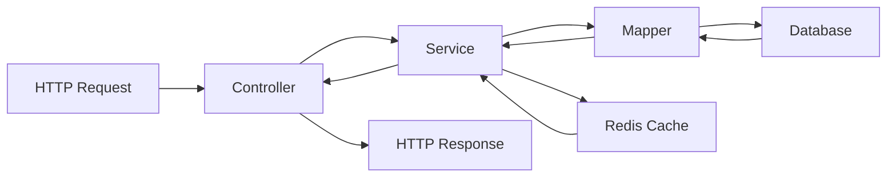
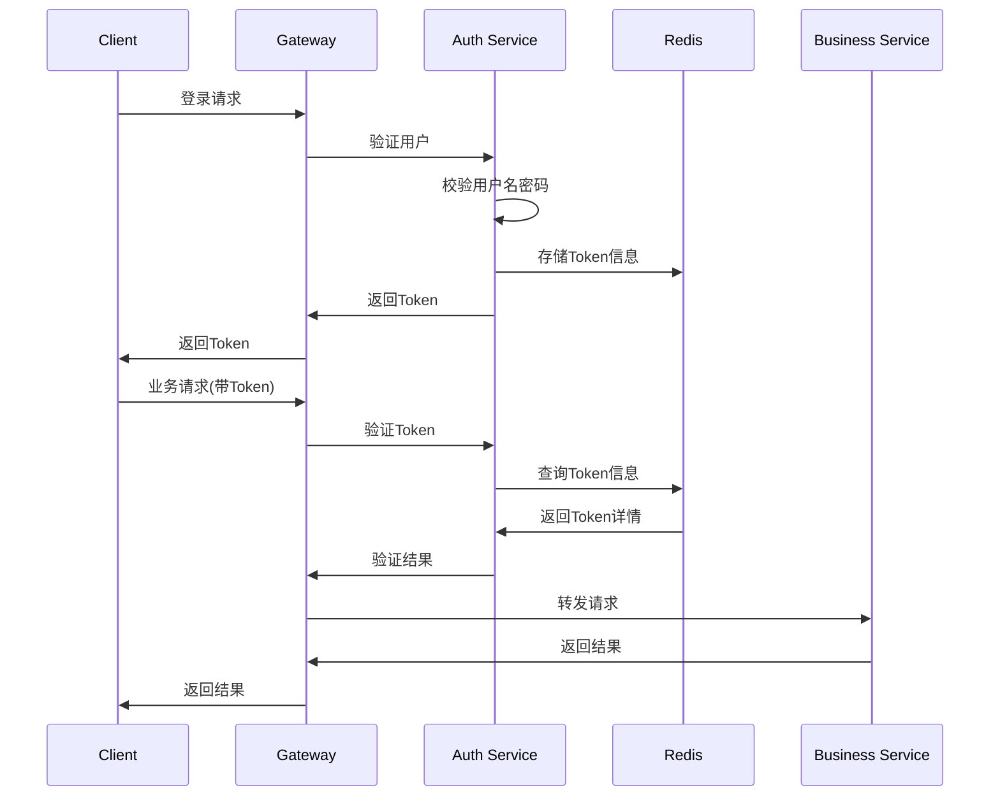

# 后端架构概览

RuoYi-Plus 后端采用 Spring Boot 3 + MyBatis-Plus 架构，提供现代化的企业级应用开发框架。

## 📋 架构特点

### 技术栈

| 技术 | 版本 | 用途 |
|------|------|------|
| **Spring Boot** | 3.2+ | 应用框架 |
| **Spring Security** | 6.0+ | 安全框架 |
| **Sa-Token** | 1.37+ | 权限认证 |
| **MyBatis-Plus** | 3.5+ | ORM框架 |
| **Redis** | 7.0+ | 缓存存储 |
| **MySQL** | 5.7+ | 数据库 |
| **Hutool** | 5.8+ | 工具库 |
| **Jackson** | 2.15+ | JSON处理 |

### 模块结构

```
ruoyi-plus/
├── ruoyi-admin/              # 启动模块
├── ruoyi-common/             # 通用模块
│   ├── ruoyi-common-core/    # 核心工具
│   ├── ruoyi-common-web/     # Web相关
│   ├── ruoyi-common-security/# 安全相关
│   ├── ruoyi-common-mybatis/ # 数据库相关
│   ├── ruoyi-common-redis/   # Redis相关
│   ├── ruoyi-common-log/     # 日志相关
│   ├── ruoyi-common-excel/   # Excel处理
│   ├── ruoyi-common-json/    # JSON处理
│   └── ...                   # 其他工具模块
├── ruoyi-modules/            # 业务模块
│   ├── ruoyi-system/         # 系统管理
│   ├── ruoyi-generator/      # 代码生成
│   └── ruoyi-business/       # 业务模块
└── ruoyi-extend/             # 扩展模块
```

## 🏗️ 分层架构

### 应用分层

```
┌─────────────────────┐
│   Controller 层     │  ← HTTP接口、参数验证、异常处理
├─────────────────────┤
│    Service 层       │  ← 业务逻辑、事务管理、数据组装
├─────────────────────┤
│     Mapper 层       │  ← 数据访问、SQL映射、缓存处理
├─────────────────────┤
│   Database 层       │  ← 数据存储、索引优化、备份恢复
└─────────────────────┘
```

### 数据流转



## 🔧 核心组件

### 1. 认证与授权

```java
// Sa-Token 配置
@Configuration
public class SaTokenConfig {

    @Bean
    public StpInterface stpInterface() {
        return new StpInterfaceImpl();
    }

    @Bean
    public SaServletFilter getSaServletFilter() {
        return new SaServletFilter()
            .addInclude("/**")
            .addExclude("/favicon.ico")
            .setAuth(obj -> {
                // 权限认证逻辑
                SaRouter.match("/**", r -> StpUtil.checkLogin());
            });
    }
}

// 权限验证
@RestController
@RequestMapping("/system/user")
public class UserController {

    @SaCheckPermission("system:user:query")
    @GetMapping("/list")
    public R<PageResult<UserVo>> list(UserBo bo, PageQuery pageQuery) {
        return R.ok(userService.queryPageList(bo, pageQuery));
    }
}
```

### 2. 数据访问层

```java
// MyBatis-Plus 配置
@Configuration
@EnableTransactionManagement
@MapperScan("com.ruoyi.**.mapper")
public class MybatisPlusConfig {

    @Bean
    public MybatisPlusInterceptor mybatisPlusInterceptor() {
        MybatisPlusInterceptor interceptor = new MybatisPlusInterceptor();

        // 分页插件
        interceptor.addInnerInterceptor(new PaginationInnerInterceptor());

        // 多租户插件
        TenantLineInnerInterceptor tenantInterceptor = new TenantLineInnerInterceptor();
        tenantInterceptor.setTenantLineHandler(new PlusTenantLineHandler());
        interceptor.addInnerInterceptor(tenantInterceptor);

        // 乐观锁插件
        interceptor.addInnerInterceptor(new OptimisticLockerInnerInterceptor());

        return interceptor;
    }
}

// 业务实体
@Data
@TableName("sys_user")
public class SysUser extends BaseEntity {

    @TableId(value = "user_id")
    private Long userId;

    @TableField("user_name")
    private String userName;

    @TableField("nick_name")
    private String nickName;

    @TableLogic
    private String delFlag;
}
```

### 3. 缓存管理

```java
// Redis 配置
@Configuration
@EnableCaching
public class RedisConfig {

    @Bean
    public RedisTemplate<String, Object> redisTemplate(RedisConnectionFactory factory) {
        RedisTemplate<String, Object> template = new RedisTemplate<>();
        template.setConnectionFactory(factory);

        // 序列化配置
        Jackson2JsonRedisSerializer<Object> serializer =
            new Jackson2JsonRedisSerializer<>(Object.class);

        template.setKeySerializer(new StringRedisSerializer());
        template.setValueSerializer(serializer);
        template.setHashKeySerializer(new StringRedisSerializer());
        template.setHashValueSerializer(serializer);

        return template;
    }
}

// 缓存使用
@Service
public class UserServiceImpl implements IUserService {

    @Cacheable(value = "user", key = "#userId")
    public UserVo selectUserById(Long userId) {
        return baseMapper.selectVoById(userId);
    }

    @CacheEvict(value = "user", key = "#bo.userId")
    public Boolean updateUser(UserBo bo) {
        return updateById(BeanUtil.toBean(bo, SysUser.class));
    }
}
```

### 4. 异常处理

```java
// 全局异常处理
@RestControllerAdvice
@Slf4j
public class GlobalExceptionHandler {

    /**
     * 业务异常
     */
    @ExceptionHandler(ServiceException.class)
    public R<Void> handleServiceException(ServiceException e) {
        log.error("业务异常: {}", e.getMessage());
        return R.fail(e.getCode(), e.getMessage());
    }

    /**
     * 参数验证异常
     */
    @ExceptionHandler(MethodArgumentNotValidException.class)
    public R<Void> handleValidException(MethodArgumentNotValidException e) {
        String message = e.getBindingResult().getFieldError().getDefaultMessage();
        return R.fail("参数验证失败: " + message);
    }

    /**
     * 系统异常
     */
    @ExceptionHandler(Exception.class)
    public R<Void> handleException(Exception e) {
        log.error("系统异常", e);
        return R.fail("系统繁忙，请稍后重试");
    }
}
```

## 🎯 设计原则

### 1. 单一职责

```java
// ✅ 好的设计 - 职责清晰
@Service
public class UserServiceImpl implements IUserService {

    public PageResult<UserVo> queryPageList(UserBo bo, PageQuery pageQuery) {
        // 只负责用户查询逻辑
        LambdaQueryWrapper<SysUser> lqw = buildQueryWrapper(bo);
        Page<UserVo> result = baseMapper.selectVoPage(pageQuery.build(), lqw);
        return PageResult.build(result);
    }
}

// ❌ 不好的设计 - 职责混乱
@Service
public class BadUserService {
    public String handleUserOperation(String action, Object data) {
        // 违反单一职责原则，一个方法处理多种操作
        if ("add".equals(action)) {
            // 新增逻辑
        } else if ("update".equals(action)) {
            // 更新逻辑
        } else if ("delete".equals(action)) {
            // 删除逻辑
        }
        return "success";
    }
}
```

### 2. 开闭原则

```java
// 抽象接口
public interface IDataExportService {
    void export(List<Object> data, String fileName);
}

// 具体实现 - Excel导出
@Service("excelExportService")
public class ExcelExportServiceImpl implements IDataExportService {
    @Override
    public void export(List<Object> data, String fileName) {
        // Excel导出逻辑
    }
}

// 具体实现 - PDF导出
@Service("pdfExportService")
public class PdfExportServiceImpl implements IDataExportService {
    @Override
    public void export(List<Object> data, String fileName) {
        // PDF导出逻辑
    }
}

// 使用方 - 对扩展开放，对修改关闭
@Service
public class ReportService {

    @Resource
    private Map<String, IDataExportService> exportServices;

    public void exportReport(String type, List<Object> data, String fileName) {
        IDataExportService service = exportServices.get(type + "ExportService");
        service.export(data, fileName);
    }
}
```

### 3. 依赖倒置

```java
// 抽象依赖
public interface IMessageSender {
    void send(String to, String content);
}

// 具体实现
@Service
public class EmailSenderImpl implements IMessageSender {
    @Override
    public void send(String to, String content) {
        // 邮件发送逻辑
    }
}

@Service
public class SmsSenderImpl implements IMessageSender {
    @Override
    public void send(String to, String content) {
        // 短信发送逻辑
    }
}

// 高层模块依赖抽象
@Service
public class NotificationService {

    @Resource
    @Qualifier("emailSenderImpl")
    private IMessageSender messageSender;

    public void sendNotification(String to, String content) {
        messageSender.send(to, content);
    }
}
```

## 🔐 安全架构

### 认证流程



### 权限控制

```java
// 权限注解
@Target({ElementType.METHOD, ElementType.TYPE})
@Retention(RetentionPolicy.RUNTIME)
public @interface SaCheckPermission {
    String[] value() default {};
    SaMode mode() default SaMode.AND;
}

// 权限实现
@Component
public class StpInterfaceImpl implements StpInterface {

    @Override
    public List<String> getPermissionList(Object loginId, String loginType) {
        LoginUser loginUser = LoginHelper.getLoginUser();
        return new ArrayList<>(loginUser.getMenuPermission());
    }

    @Override
    public List<String> getRoleList(Object loginId, String loginType) {
        LoginUser loginUser = LoginHelper.getLoginUser();
        return loginUser.getRolePermission();
    }
}
```

## 📊 性能优化

### 1. 缓存策略

```java
// 多级缓存
@Service
public class DictServiceImpl implements IDictService {

    // L1: 本地缓存
    @Cacheable(value = "dict:local", key = "#dictType")
    public List<SysDictData> selectDictDataByType(String dictType) {
        // L2: Redis缓存
        String cacheKey = "dict:" + dictType;
        List<SysDictData> data = RedisUtils.getCacheObject(cacheKey);
        if (CollUtil.isEmpty(data)) {
            // L3: 数据库查询
            data = baseMapper.selectDictDataByType(dictType);
            RedisUtils.setCacheObject(cacheKey, data, Duration.ofMinutes(30));
        }
        return data;
    }
}
```

### 2. 分页优化

```java
// 分页插件配置
@Bean
public PaginationInnerInterceptor paginationInterceptor() {
    PaginationInnerInterceptor interceptor = new PaginationInnerInterceptor();

    // 设置最大单页限制数量
    interceptor.setMaxLimit(500L);

    // 当超过最大页数时的处理方式
    interceptor.setOverflow(true);

    // 优化COUNT SQL
    interceptor.setOptimizeJoin(true);

    return interceptor;
}

// 分页查询
public PageResult<UserVo> queryPageList(UserBo bo, PageQuery pageQuery) {
    LambdaQueryWrapper<SysUser> lqw = new LambdaQueryWrapper<SysUser>()
        .like(StringUtils.isNotBlank(bo.getUserName()), SysUser::getUserName, bo.getUserName())
        .eq(StringUtils.isNotBlank(bo.getStatus()), SysUser::getStatus, bo.getStatus())
        .orderByDesc(SysUser::getCreateTime);

    Page<UserVo> result = baseMapper.selectVoPage(pageQuery.build(), lqw);
    return PageResult.build(result);
}
```

### 3. 异步处理

```java
// 异步配置
@Configuration
@EnableAsync
public class AsyncConfig {

    @Bean("taskExecutor")
    public ThreadPoolTaskExecutor taskExecutor() {
        ThreadPoolTaskExecutor executor = new ThreadPoolTaskExecutor();
        executor.setCorePoolSize(10);
        executor.setMaxPoolSize(20);
        executor.setQueueCapacity(200);
        executor.setKeepAliveSeconds(60);
        executor.setThreadNamePrefix("async-");
        executor.setRejectedExecutionHandler(new ThreadPoolExecutor.CallerRunsPolicy());
        return executor;
    }
}

// 异步方法
@Service
public class EmailService {

    @Async("taskExecutor")
    public CompletableFuture<Void> sendEmailAsync(String to, String subject, String content) {
        // 异步发送邮件
        try {
            // 邮件发送逻辑
            Thread.sleep(2000); // 模拟耗时操作
            log.info("邮件发送成功: {}", to);
        } catch (Exception e) {
            log.error("邮件发送失败", e);
        }
        return CompletableFuture.completedFuture(null);
    }
}
```

## 🔍 监控与运维

### 1. 健康检查

```java
// 自定义健康检查
@Component
public class DatabaseHealthIndicator implements HealthIndicator {

    @Resource
    private DataSource dataSource;

    @Override
    public Health health() {
        try (Connection connection = dataSource.getConnection()) {
            if (connection.isValid(1)) {
                return Health.up()
                    .withDetail("database", "Available")
                    .withDetail("validationQuery", "SELECT 1")
                    .build();
            }
        } catch (Exception e) {
            return Health.down(e)
                .withDetail("database", "Unavailable")
                .build();
        }
        return Health.down()
            .withDetail("database", "Unavailable")
            .build();
    }
}
```

### 2. 指标监控

```java
// 自定义指标
@Component
public class BusinessMetrics {

    private final MeterRegistry meterRegistry;
    private final Counter userLoginCounter;
    private final Timer requestTimer;

    public BusinessMetrics(MeterRegistry meterRegistry) {
        this.meterRegistry = meterRegistry;
        this.userLoginCounter = Counter.builder("user.login.count")
            .description("用户登录次数")
            .register(meterRegistry);
        this.requestTimer = Timer.builder("api.request.duration")
            .description("API请求耗时")
            .register(meterRegistry);
    }

    public void recordLogin() {
        userLoginCounter.increment();
    }

    public Timer.Sample startTimer() {
        return Timer.start(meterRegistry);
    }
}
```

## 🚀 部署架构

### 1. 单体部署

```yaml
# application.yml
server:
  port: 8080
  servlet:
    context-path: /

spring:
  profiles:
    active: prod
  datasource:
    driver-class-name: com.mysql.cj.jdbc.Driver
    url: jdbc:mysql://localhost:3306/ry_plus?useUnicode=true&characterEncoding=utf8&zeroDateTimeBehavior=convertToNull&useSSL=true&serverTimezone=GMT%2B8
    username: root
    password: password

  redis:
    host: localhost
    port: 6379
    password:
    database: 0
```

### 2. 微服务部署

```yaml
# Spring Cloud Gateway
spring:
  cloud:
    gateway:
      routes:
        - id: ruoyi-system
          uri: lb://ruoyi-system
          predicates:
            - Path=/system/**
        - id: ruoyi-business
          uri: lb://ruoyi-business
          predicates:
            - Path=/business/**
      discovery:
        locator:
          enabled: true
          lower-case-service-id: true

# Nacos 配置
spring:
  cloud:
    nacos:
      discovery:
        server-addr: localhost:8848
      config:
        server-addr: localhost:8848
        file-extension: yml
```

RuoYi-Plus 后端架构通过合理的分层设计、模块化组织和现代化技术栈，为企业级应用开发提供了稳定、高效、可扩展的基础框架。