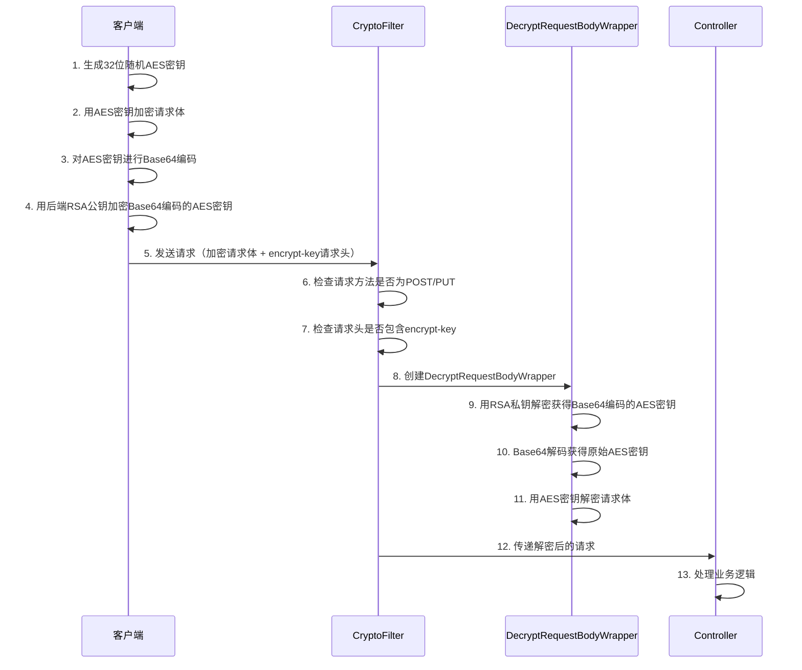
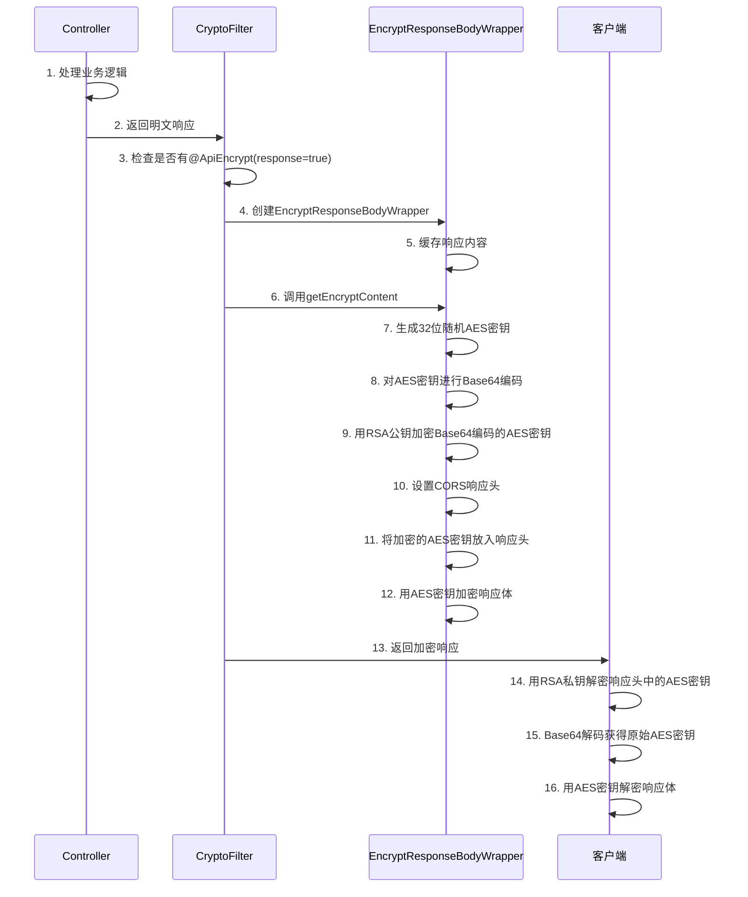

# API接口加密

## 介绍

API接口加密功能通过Servlet过滤器实现，支持前后端数据传输的全链路加密。系统采用RSA+AES混合加密方案，既保证了安全性又兼顾了性能，是企业级应用中保护敏感数据传输的核心安全组件。

**核心特性:**

- **混合加密** - 采用RSA+AES混合加密，结合非对称加密的安全性和对称加密的高效性
- **自动解密** - 请求体自动解密，无需业务代码干预
- **可选加密** - 响应加密通过注解按需开启，灵活控制
- **双密钥对** - 请求和响应使用独立的密钥对，提高安全性
- **高优先级** - 过滤器以最高优先级运行，确保在其他处理之前完成解密
- **CORS支持** - 自动设置跨域响应头，支持前端跨域请求

## 模块架构

### 整体架构

```text
┌─────────────────────────────────────────────────────────────┐
│                         客户端                               │
│  ┌─────────────────────────────────────────────────────────┐│
│  │  1. 生成AES密钥                                          ││
│  │  2. RSA公钥加密AES密钥                                   ││
│  │  3. AES密钥加密请求体                                    ││
│  └─────────────────────────────────────────────────────────┘│
└────────────────────────────┬────────────────────────────────┘
                             │ 加密的请求
                             ▼
┌─────────────────────────────────────────────────────────────┐
│                    CryptoFilter (最高优先级)                  │
│  ┌─────────────────────────────────────────────────────────┐│
│  │  DecryptRequestBodyWrapper                              ││
│  │  • RSA私钥解密请求头中的AES密钥                          ││
│  │  • AES密钥解密请求体                                     ││
│  └─────────────────────────────────────────────────────────┘│
└────────────────────────────┬────────────────────────────────┘
                             │ 明文请求
                             ▼
┌─────────────────────────────────────────────────────────────┐
│                    Controller (@ApiEncrypt)                  │
│  ┌─────────────────────────────────────────────────────────┐│
│  │  业务逻辑处理                                            ││
│  │  返回明文响应                                            ││
│  └─────────────────────────────────────────────────────────┘│
└────────────────────────────┬────────────────────────────────┘
                             │ 明文响应
                             ▼
┌─────────────────────────────────────────────────────────────┐
│                    CryptoFilter (响应处理)                   │
│  ┌─────────────────────────────────────────────────────────┐│
│  │  EncryptResponseBodyWrapper                             ││
│  │  • 生成新的AES密钥                                       ││
│  │  • AES密钥加密响应体                                     ││
│  │  • RSA公钥加密AES密钥放入响应头                          ││
│  └─────────────────────────────────────────────────────────┘│
└────────────────────────────┬────────────────────────────────┘
                             │ 加密的响应
                             ▼
┌─────────────────────────────────────────────────────────────┐
│                         客户端                               │
│  ┌─────────────────────────────────────────────────────────┐│
│  │  1. RSA私钥解密响应头中的AES密钥                         ││
│  │  2. AES密钥解密响应体                                    ││
│  └─────────────────────────────────────────────────────────┘│
└─────────────────────────────────────────────────────────────┘
```

### 核心类结构

```text
plus.ruoyi.common.encrypt
├── annotation/
│   └── ApiEncrypt.java                    # API加密注解
├── config/
│   └── ApiDecryptAutoConfiguration.java   # 自动配置类
├── filter/
│   ├── CryptoFilter.java                  # 加解密过滤器
│   ├── DecryptRequestBodyWrapper.java     # 请求体解密包装器
│   └── EncryptResponseBodyWrapper.java    # 响应体加密包装器
├── properties/
│   └── ApiDecryptProperties.java          # 配置属性类
└── utils/
    └── EncryptUtils.java                  # 加解密工具类
```

## 配置说明

### 基础配置

在 `application.yml` 中配置API加密参数：

```yaml
api-decrypt:
  # 功能开关
  enabled: true

  # 请求头中加密密钥的标识字段
  header-flag: "encrypt-key"

  # RSA公钥（用于加密响应中的AES密钥）
  public-key: "MIIBIjANBgkqhkiG9w0BAQEFAAOCAQ8AMIIBCgKCAQEA..."

  # RSA私钥（用于解密请求中的AES密钥）
  private-key: "MIIEvQIBADANBgkqhkiG9w0BAQEFAASCBKcwggSjAgEAAoIBAQC..."
```

### 配置项说明

| 配置项 | 类型 | 说明 | 默认值 |
|--------|------|------|--------|
| `enabled` | Boolean | 是否启用API加密功能 | false |
| `header-flag` | String | 请求/响应头中存放加密密钥的字段名 | encrypt-key |
| `public-key` | String | RSA公钥，用于加密响应中的AES密钥 | - |
| `private-key` | String | RSA私钥，用于解密请求中的AES密钥 | - |

### 生成密钥对

使用 `EncryptUtils` 工具类生成RSA密钥对：

```java
import plus.ruoyi.common.encrypt.utils.EncryptUtils;

public class KeyGenerator {
    public static void main(String[] args) {
        // 生成请求加密密钥对（前端公钥 + 后端私钥）
        Map<String, String> requestKeyPair = EncryptUtils.generateRsaKey();
        System.out.println("=== 请求加密密钥对 ===");
        System.out.println("前端公钥: " + requestKeyPair.get("publicKey"));
        System.out.println("后端私钥: " + requestKeyPair.get("privateKey"));

        // 生成响应加密密钥对（后端公钥 + 前端私钥）
        Map<String, String> responseKeyPair = EncryptUtils.generateRsaKey();
        System.out.println("\n=== 响应加密密钥对 ===");
        System.out.println("后端公钥: " + responseKeyPair.get("publicKey"));
        System.out.println("前端私钥: " + responseKeyPair.get("privateKey"));
    }
}
```

## @ApiEncrypt 注解

### 注解定义

```java
@Documented
@Target({ElementType.METHOD})
@Retention(RetentionPolicy.RUNTIME)
public @interface ApiEncrypt {
    /**
     * 是否对响应进行加密
     *
     * true: 对响应结果进行AES+RSA混合加密
     * false: 不加密响应（默认）
     *
     * @return 是否加密响应
     */
    boolean response() default false;
}
```

### 注解参数

| 参数 | 类型 | 默认值 | 说明 |
|------|------|--------|------|
| `response` | boolean | false | 是否对响应进行加密 |

### 使用方式

#### 基础用法

```java
@RestController
@RequestMapping("/api/user")
public class UserController {

    @Autowired
    private UserService userService;

    // 普通接口（不加密）
    @GetMapping("/info")
    public Result<UserInfo> getUserInfo() {
        return Result.success(userService.getCurrentUser());
    }

    // 对响应进行加密
    @PostMapping("/login")
    @ApiEncrypt(response = true)
    public Result<LoginResponse> login(@RequestBody LoginRequest request) {
        // 请求自动解密，响应自动加密
        LoginResponse response = userService.login(request);
        return Result.success(response);
    }

    // 敏感数据接口
    @GetMapping("/profile")
    @ApiEncrypt(response = true)
    public Result<UserProfile> getUserProfile() {
        // 返回的用户详细信息会被加密
        UserProfile profile = userService.getUserProfile();
        return Result.success(profile);
    }
}
```

#### 敏感操作加密

```java
@RestController
@RequestMapping("/api/account")
public class AccountController {

    // 修改密码 - 请求和响应都加密
    @PostMapping("/password/change")
    @ApiEncrypt(response = true)
    public Result<Void> changePassword(@RequestBody ChangePasswordRequest request) {
        // 请求中的旧密码和新密码已自动解密
        accountService.changePassword(request);
        return Result.success();
    }

    // 绑定银行卡 - 高敏感操作
    @PostMapping("/bindCard")
    @ApiEncrypt(response = true)
    public Result<BindCardResponse> bindBankCard(@RequestBody BindCardRequest request) {
        // 银行卡号、CVV等敏感信息已解密
        BindCardResponse response = accountService.bindCard(request);
        return Result.success(response);
    }

    // 查询余额 - 仅响应加密
    @GetMapping("/balance")
    @ApiEncrypt(response = true)
    public Result<BalanceInfo> getBalance() {
        return Result.success(accountService.getBalance());
    }
}
```

### 工作机制

**请求解密:**
- 自动检测请求头中是否包含加密标识（`header-flag`）
- 只处理 POST 和 PUT 请求
- 如果有加密标识，自动解密请求体
- 如果没有加密标识但接口标注了 `@ApiEncrypt`，返回403错误

**响应加密:**
- 只有显式设置 `response = true` 才会加密响应
- 每次响应生成新的AES密钥
- 加密后的AES密钥放入响应头

## 加密流程详解

### 请求加密流程



### 响应加密流程



## 核心实现

### CryptoFilter 过滤器

过滤器是整个加密功能的核心，负责拦截请求和响应进行加解密处理：

```java
public class CryptoFilter implements Filter {
    private final ApiDecryptProperties properties;

    @Override
    public void doFilter(ServletRequest request, ServletResponse response, FilterChain chain)
            throws IOException, ServletException {
        HttpServletRequest servletRequest = (HttpServletRequest) request;
        HttpServletResponse servletResponse = (HttpServletResponse) response;

        // 获取@ApiEncrypt注解
        ApiEncrypt apiEncrypt = this.getApiEncryptAnnotation(servletRequest);
        boolean responseFlag = apiEncrypt != null && apiEncrypt.response();

        ServletRequest requestWrapper = null;
        EncryptResponseBodyWrapper responseBodyWrapper = null;

        // 只处理POST和PUT请求
        if (HttpMethod.PUT.matches(servletRequest.getMethod()) ||
            HttpMethod.POST.matches(servletRequest.getMethod())) {

            // 检查是否存在加密标头
            String headerValue = servletRequest.getHeader(properties.getHeaderFlag());
            if (StringUtils.isNotBlank(headerValue)) {
                // 请求解密
                requestWrapper = new DecryptRequestBodyWrapper(
                    servletRequest,
                    properties.getPrivateKey(),
                    properties.getHeaderFlag()
                );
            } else if (apiEncrypt != null) {
                // 有注解但无加密标头，返回403
                throw ServiceException.of("没有访问权限，请联系管理员授权", HttpStatus.FORBIDDEN);
            }
        }

        // 响应加密包装
        if (responseFlag) {
            responseBodyWrapper = new EncryptResponseBodyWrapper(servletResponse);
        }

        // 执行过滤器链
        chain.doFilter(
            ObjectUtil.defaultIfNull(requestWrapper, request),
            ObjectUtil.defaultIfNull(responseBodyWrapper, response)
        );

        // 响应加密处理
        if (responseFlag) {
            servletResponse.reset();
            String encryptContent = responseBodyWrapper.getEncryptContent(
                servletResponse,
                properties.getPublicKey(),
                properties.getHeaderFlag()
            );
            servletResponse.getWriter().write(encryptContent);
        }
    }
}
```

### DecryptRequestBodyWrapper 解密包装器

请求体解密包装器通过继承 `HttpServletRequestWrapper` 实现自动解密：

```java
public class DecryptRequestBodyWrapper extends HttpServletRequestWrapper {
    private final byte[] body;

    public DecryptRequestBodyWrapper(HttpServletRequest request, String privateKey, String headerFlag)
        throws IOException {
        super(request);

        // 1. 从请求头获取RSA加密的AES密钥
        String headerRsa = request.getHeader(headerFlag);

        // 2. 用RSA私钥解密获得Base64编码的AES密钥
        String decryptAes = EncryptUtils.decryptByRsa(headerRsa, privateKey);

        // 3. 对AES密钥进行Base64解码
        String aesPassword = EncryptUtils.decryptByBase64(decryptAes);

        // 4. 读取原始请求体
        byte[] readBytes = IoUtil.readBytes(request.getInputStream(), false);
        String requestBody = new String(readBytes, StandardCharsets.UTF_8);

        // 5. 用AES密钥解密请求体
        String decryptBody = EncryptUtils.decryptByAes(requestBody, aesPassword);
        body = decryptBody.getBytes(StandardCharsets.UTF_8);
    }

    @Override
    public ServletInputStream getInputStream() {
        final ByteArrayInputStream bais = new ByteArrayInputStream(body);
        return new ServletInputStream() {
            @Override
            public int read() {
                return bais.read();
            }
            // ... 其他方法实现
        };
    }
}
```

### EncryptResponseBodyWrapper 加密包装器

响应体加密包装器缓存响应内容并提供加密方法：

```java
public class EncryptResponseBodyWrapper extends HttpServletResponseWrapper {
    private final ByteArrayOutputStream byteArrayOutputStream;

    public String getEncryptContent(HttpServletResponse servletResponse,
                                   String publicKey, String headerFlag)
            throws IOException {

        // 1. 生成32位随机AES密钥
        String aesPassword = RandomUtil.randomString(32);

        // 2. 对AES密钥进行Base64编码
        String encryptAes = EncryptUtils.encryptByBase64(aesPassword);

        // 3. 用RSA公钥加密Base64编码后的AES密钥
        String encryptPassword = EncryptUtils.encryptByRsa(encryptAes, publicKey);

        // 4. 设置CORS相关响应头和加密密钥头
        servletResponse.addHeader("Access-Control-Expose-Headers", headerFlag);
        servletResponse.setHeader("Access-Control-Allow-Origin", "*");
        servletResponse.setHeader("Access-Control-Allow-Methods", "*");
        servletResponse.setHeader(headerFlag, encryptPassword);

        // 5. 获取原始响应内容
        String originalBody = this.getContent();

        // 6. 用AES密钥加密响应内容
        return EncryptUtils.encryptByAes(originalBody, aesPassword);
    }
}
```

## 前端对接实现

### 环境变量配置

在前端项目的 `.env` 文件中配置加密相关参数：

```bash
# 接口加密功能开关（如需关闭，后端也必须对应关闭）
VITE_APP_API_ENCRYPT = 'true'

# 接口加密传输 RSA 公钥（与后端解密私钥对应）
VITE_APP_RSA_PUBLIC_KEY = 'MFwwDQYJKoZIhvcNAQEBBQADSwAwSAJBAK9s1Pbnn5W+l1hx3ukHLtevayF...'

# 接口响应解密 RSA 私钥（与后端加密公钥对应）
VITE_APP_RSA_PRIVATE_KEY = 'MIIBOwIBAAJBAIrZxEhzVAHKJm7BJpXIHWGU3sHJYgRiOOTw3Auj...'
```

**<Warn/> 安全提醒：**
- 以上为示例密钥，生产环境请使用您自己生成的密钥对
- 密钥应存储在安全的配置中心，不要直接写在代码中
- 定期轮换密钥以确保安全性

### 系统配置

在 `SystemConfig` 中配置安全选项：

```typescript
export const SystemConfig = {
  security: {
    // 是否启用API加密（从环境变量读取）
    apiEncrypt: import.meta.env.VITE_APP_API_ENCRYPT === 'true',
    // 请求加密公钥
    rsaPublicKey: import.meta.env.VITE_APP_RSA_PUBLIC_KEY,
    // 响应解密私钥
    rsaPrivateKey: import.meta.env.VITE_APP_RSA_PRIVATE_KEY,
  },
  // 其他配置...
}
```

### 加密工具函数

```typescript
import CryptoJS from 'crypto-js'
import { JSEncrypt } from 'jsencrypt'

// 加密请求头标识
const ENCRYPT_HEADER = 'encrypt-key'

/**
 * 生成32位随机AES密钥
 */
function generateAesKey(): string {
  const chars = 'ABCDEFGHIJKLMNOPQRSTUVWXYZabcdefghijklmnopqrstuvwxyz0123456789'
  let key = ''
  for (let i = 0; i < 32; i++) {
    key += chars.charAt(Math.floor(Math.random() * chars.length))
  }
  return key
}

/**
 * Base64编码
 */
function encodeBase64(str: string): string {
  return btoa(str)
}

/**
 * Base64解码
 */
function decodeBase64(str: string): string {
  return atob(str)
}

/**
 * AES加密
 */
function encryptWithAes(data: string, key: string): string {
  const encrypted = CryptoJS.AES.encrypt(data, CryptoJS.enc.Utf8.parse(key), {
    mode: CryptoJS.mode.ECB,
    padding: CryptoJS.pad.Pkcs7
  })
  return encrypted.toString()
}

/**
 * AES解密
 */
function decryptWithAes(data: string, key: string): string {
  const decrypted = CryptoJS.AES.decrypt(data, CryptoJS.enc.Utf8.parse(key), {
    mode: CryptoJS.mode.ECB,
    padding: CryptoJS.pad.Pkcs7
  })
  return decrypted.toString(CryptoJS.enc.Utf8)
}

/**
 * RSA公钥加密
 */
function rsaEncrypt(data: string): string {
  const encrypt = new JSEncrypt()
  encrypt.setPublicKey(SystemConfig.security.rsaPublicKey)
  return encrypt.encrypt(data) || ''
}

/**
 * RSA私钥解密
 */
function rsaDecrypt(data: string): string {
  const decrypt = new JSEncrypt()
  decrypt.setPrivateKey(SystemConfig.security.rsaPrivateKey)
  return decrypt.decrypt(data) || ''
}
```

### 请求加密处理

```typescript
/**
 * 加密请求数据
 */
export function encryptRequestData(data: any, header: Record<string, any>): any {
  if (!SystemConfig.security?.apiEncrypt || !data) {
    return data
  }

  // 1. 生成32位AES密钥
  const aesKey = generateAesKey()

  // 2. 对AES密钥进行Base64编码
  const base64Key = encodeBase64(aesKey)

  // 3. 用后端RSA公钥加密Base64编码的AES密钥并放入请求头
  header[ENCRYPT_HEADER] = rsaEncrypt(base64Key)

  // 4. 用AES密钥加密请求数据
  const jsonData = typeof data === 'object' ? JSON.stringify(data) : data
  return encryptWithAes(jsonData, aesKey)
}
```

### 响应解密处理

```typescript
/**
 * 解密响应数据
 */
export function decryptResponseData(data: any, header: Record<string, any>): any {
  if (!SystemConfig.security?.apiEncrypt) {
    return data
  }

  // 1. 从响应头获取加密的AES密钥
  const encryptKey = header[ENCRYPT_HEADER] || header[ENCRYPT_HEADER.toLowerCase()]
  if (!encryptKey) {
    return data
  }

  try {
    // 2. 用前端RSA私钥解密AES密钥
    const base64Key = rsaDecrypt(encryptKey)

    // 3. Base64解码获得原始AES密钥
    const aesKey = decodeBase64(base64Key)

    // 4. 用AES密钥解密响应数据
    const decryptedData = decryptWithAes(data, aesKey)

    // 5. 解析JSON数据
    return JSON.parse(decryptedData)
  } catch (error) {
    console.error('[响应解密失败]', error)
    throw new Error('响应数据解密失败')
  }
}
```

### 使用示例

#### 发送加密请求

```typescript
import { http } from '@/composables/useHttp'

// 发送加密的登录请求
const login = async (loginData: LoginRequest) => {
  const [err, result] = await http.post<LoginResponse>('/api/auth/login', loginData, {
    header: {
      isEncrypt: true  // 开启请求加密
    }
  })

  if (!err) {
    console.log('登录成功', result)
  } else {
    console.error('登录失败', err.message)
  }
}

// 发送加密的用户信息更新请求
const updateProfile = async (profileData: UserProfile) => {
  const [err] = await http.put<void>('/api/user/profile', profileData, {
    header: {
      isEncrypt: true  // 开启请求加密
    }
  })

  if (!err) {
    console.log('更新成功')
  }
}
```

#### 接收加密响应

```typescript
// 响应加密由后端 @ApiEncrypt(response = true) 注解控制
// 前端会自动检测响应头中的加密标识并解密

const getUserInfo = async () => {
  // 后端接口标注了 @ApiEncrypt(response = true)，响应会被自动解密
  const [err, userInfo] = await http.get<UserInfo>('/api/user/info')

  if (!err) {
    console.log('用户信息', userInfo) // 已自动解密的数据
  }
}
```

## 密钥配置说明

### 密钥对应关系

系统使用**两对独立的RSA密钥**，分别用于请求加密和响应加密：

```text
请求加密流程（密钥对A）：
┌──────────────┐                      ┌──────────────┐
│   前端       │                      │   后端       │
│  公钥A加密   │  ──── 请求 ────▶   │  私钥A解密   │
└──────────────┘                      └──────────────┘

响应加密流程（密钥对B）：
┌──────────────┐                      ┌──────────────┐
│   前端       │                      │   后端       │
│  私钥B解密   │  ◀──── 响应 ────   │  公钥B加密   │
└──────────────┘                      └──────────────┘
```

### 配置对应关系

```yaml
# 后端配置（application.yml）
api-decrypt:
  # 响应加密公钥 - 用于加密响应中的AES密钥
  # 对应前端解密私钥（密钥对B的公钥）
  public-key: "后端响应加密公钥"

  # 请求解密私钥 - 用于解密请求中的AES密钥
  # 对应前端加密公钥（密钥对A的私钥）
  private-key: "后端请求解密私钥"
```

```bash
# 前端配置（.env）
# 请求加密公钥 - 用于加密请求中的AES密钥
# 对应后端解密私钥（密钥对A的公钥）
VITE_APP_RSA_PUBLIC_KEY = "前端请求加密公钥"

# 响应解密私钥 - 用于解密响应中的AES密钥
# 对应后端加密公钥（密钥对B的私钥）
VITE_APP_RSA_PRIVATE_KEY = "前端响应解密私钥"
```

### 密钥生成脚本

```java
public class GenerateKeyPairs {
    public static void main(String[] args) {
        // 生成密钥对A（请求加密）
        Map<String, String> keyPairA = EncryptUtils.generateRsaKey();
        System.out.println("=== 密钥对A（请求加密）===");
        System.out.println("前端公钥 (VITE_APP_RSA_PUBLIC_KEY): " + keyPairA.get("publicKey"));
        System.out.println("后端私钥 (api-decrypt.private-key): " + keyPairA.get("privateKey"));

        System.out.println();

        // 生成密钥对B（响应加密）
        Map<String, String> keyPairB = EncryptUtils.generateRsaKey();
        System.out.println("=== 密钥对B（响应加密）===");
        System.out.println("后端公钥 (api-decrypt.public-key): " + keyPairB.get("publicKey"));
        System.out.println("前端私钥 (VITE_APP_RSA_PRIVATE_KEY): " + keyPairB.get("privateKey"));
    }
}
```

## EncryptUtils 工具类

### 核心方法

| 方法 | 说明 | 参数 | 返回值 |
|------|------|------|--------|
| `encryptByBase64(data)` | Base64编码 | 待编码字符串 | 编码后字符串 |
| `decryptByBase64(data)` | Base64解码 | 待解码字符串 | 解码后字符串 |
| `encryptByAes(data, password)` | AES加密 | 数据, 密钥(16/24/32位) | Base64编码的密文 |
| `decryptByAes(data, password)` | AES解密 | 密文, 密钥 | 明文 |
| `encryptByRsa(data, publicKey)` | RSA公钥加密 | 数据, 公钥 | Base64编码的密文 |
| `decryptByRsa(data, privateKey)` | RSA私钥解密 | 密文, 私钥 | 明文 |
| `generateRsaKey()` | 生成RSA密钥对 | 无 | Map(publicKey, privateKey) |

### 使用示例

```java
import plus.ruoyi.common.encrypt.utils.EncryptUtils;

public class EncryptDemo {

    public void demo() {
        // AES加密（密钥必须是16/24/32位）
        String aesKey = "12345678901234567890123456789012"; // 32位
        String encrypted = EncryptUtils.encryptByAes("Hello World", aesKey);
        String decrypted = EncryptUtils.decryptByAes(encrypted, aesKey);

        // RSA加密
        Map<String, String> keyPair = EncryptUtils.generateRsaKey();
        String publicKey = keyPair.get("publicKey");
        String privateKey = keyPair.get("privateKey");

        String rsaEncrypted = EncryptUtils.encryptByRsa("Hello RSA", publicKey);
        String rsaDecrypted = EncryptUtils.decryptByRsa(rsaEncrypted, privateKey);

        // Base64编码
        String base64 = EncryptUtils.encryptByBase64("Hello");
        String original = EncryptUtils.decryptByBase64(base64);
    }
}
```

## 安全最佳实践

### 1. 密钥管理

```java
// 不要在代码中硬编码密钥
// ❌ 错误做法
private static final String PRIVATE_KEY = "MIIEvQIBADANBgkqhkiG9w0...";

// ✅ 正确做法：使用环境变量或配置中心
@Value("${api-decrypt.private-key}")
private String privateKey;
```

### 2. 密钥轮换

```yaml
# 支持多环境配置
spring:
  profiles:
    active: ${SPRING_PROFILES_ACTIVE:dev}

---
spring:
  config:
    activate:
      on-profile: dev
api-decrypt:
  public-key: ${DEV_RSA_PUBLIC_KEY}
  private-key: ${DEV_RSA_PRIVATE_KEY}

---
spring:
  config:
    activate:
      on-profile: prod
api-decrypt:
  public-key: ${PROD_RSA_PUBLIC_KEY}
  private-key: ${PROD_RSA_PRIVATE_KEY}
```

### 3. 敏感接口标识

```java
// 对所有涉及敏感数据的接口启用加密
@RestController
@RequestMapping("/api/finance")
public class FinanceController {

    @PostMapping("/transfer")
    @ApiEncrypt(response = true)  // 转账必须加密
    public Result<TransferResult> transfer(@RequestBody TransferRequest request) {
        return Result.success(financeService.transfer(request));
    }

    @GetMapping("/transactions")
    @ApiEncrypt(response = true)  // 交易记录必须加密
    public Result<List<Transaction>> getTransactions() {
        return Result.success(financeService.getTransactions());
    }
}
```

### 4. 日志脱敏

```java
@Slf4j
@Component
public class EncryptLoggingAspect {

    @Around("@annotation(apiEncrypt)")
    public Object around(ProceedingJoinPoint point, ApiEncrypt apiEncrypt) throws Throwable {
        // 不要记录加密前的敏感数据
        log.info("调用加密接口: {}", point.getSignature().getName());

        Object result = point.proceed();

        // 不要记录解密后的响应内容
        log.info("加密接口响应成功");
        return result;
    }
}
```

### 5. 异常处理

```java
@ControllerAdvice
public class EncryptExceptionHandler {

    @ExceptionHandler(Exception.class)
    public ResponseEntity<Result<Void>> handleException(Exception e) {
        if (e.getMessage().contains("解密")) {
            // 加密相关错误，返回通用错误信息
            return ResponseEntity.status(HttpStatus.BAD_REQUEST)
                .body(Result.fail("请求数据格式错误"));
        }
        // 其他异常处理...
        return ResponseEntity.status(HttpStatus.INTERNAL_SERVER_ERROR)
            .body(Result.fail("服务器内部错误"));
    }
}
```

## 常见问题

### 1. 请求解密失败

**问题描述**: 服务端无法解密客户端发送的请求。

**可能原因:**
- 前端公钥与后端私钥不匹配
- AES密钥长度不正确
- 请求头中未包含加密标识
- Base64编码/解码异常

**解决方案:**

```java
// 1. 验证密钥对是否匹配
Map<String, String> keyPair = EncryptUtils.generateRsaKey();
String testData = "test";
String encrypted = EncryptUtils.encryptByRsa(testData, keyPair.get("publicKey"));
String decrypted = EncryptUtils.decryptByRsa(encrypted, keyPair.get("privateKey"));
assert testData.equals(decrypted);

// 2. 检查AES密钥长度
String aesKey = "12345678901234567890123456789012"; // 必须是32位
assert aesKey.length() == 32;

// 3. 检查请求头
System.out.println("Header: " + request.getHeader("encrypt-key"));
```

### 2. 响应解密失败

**问题描述**: 前端无法解密后端返回的响应。

**可能原因:**
- 后端公钥与前端私钥不匹配
- 响应头未正确设置
- CORS配置问题

**解决方案:**

```typescript
// 检查响应头是否正确暴露
console.log('Response Headers:', response.headers)
console.log('Encrypt Key:', response.headers['encrypt-key'])

// 验证密钥配置
console.log('Private Key:', SystemConfig.security.rsaPrivateKey?.substring(0, 50))
```

### 3. CORS跨域问题

**问题描述**: 前端无法读取加密响应头。

**解决方案:**

后端已自动设置CORS响应头：

```java
servletResponse.addHeader("Access-Control-Expose-Headers", headerFlag);
servletResponse.setHeader("Access-Control-Allow-Origin", "*");
servletResponse.setHeader("Access-Control-Allow-Methods", "*");
```

如果仍有问题，检查Nginx配置：

```nginx
location /api {
    # 允许暴露自定义响应头
    add_header Access-Control-Expose-Headers 'encrypt-key';
    add_header Access-Control-Allow-Origin '*';

    proxy_pass http://backend;
}
```

### 4. 性能优化

**问题描述**: 加密解密对性能有影响。

**优化建议:**

```java
// 1. 只对敏感接口启用加密
@GetMapping("/public/info")  // 公开信息不加密
public Result<PublicInfo> getPublicInfo() {
    return Result.success(service.getPublicInfo());
}

@GetMapping("/private/info")
@ApiEncrypt(response = true)  // 敏感信息才加密
public Result<PrivateInfo> getPrivateInfo() {
    return Result.success(service.getPrivateInfo());
}

// 2. 考虑使用SM4国密算法（性能更好）
// 见数据库加密文档
```

### 5. 调试技巧

```java
// 开发环境临时关闭加密
@Profile("dev")
@Configuration
public class DevConfig {
    @Bean
    @Primary
    public ApiDecryptProperties devApiDecryptProperties() {
        ApiDecryptProperties props = new ApiDecryptProperties();
        props.setEnabled(false);  // 开发环境关闭加密
        return props;
    }
}
```

## 类型定义

### 完整类型定义

```java
/**
 * API加密注解
 */
@Documented
@Target({ElementType.METHOD})
@Retention(RetentionPolicy.RUNTIME)
public @interface ApiEncrypt {
    boolean response() default false;
}

/**
 * API解密配置属性
 */
@Data
@ConfigurationProperties(prefix = "api-decrypt")
public class ApiDecryptProperties {
    private Boolean enabled;
    private String headerFlag;
    private String publicKey;
    private String privateKey;
}

/**
 * 加密工具类（部分方法）
 */
public class EncryptUtils {
    public static String encryptByBase64(String data);
    public static String decryptByBase64(String data);
    public static String encryptByAes(String data, String password);
    public static String decryptByAes(String data, String password);
    public static String encryptByRsa(String data, String publicKey);
    public static String decryptByRsa(String data, String privateKey);
    public static Map<String, String> generateRsaKey();
}
```

## 总结

API接口加密是保护敏感数据传输的重要安全措施。系统采用RSA+AES混合加密方案，通过Servlet过滤器实现自动加解密，开发者只需使用 `@ApiEncrypt` 注解即可轻松启用加密功能。

**关键要点:**

1. **双密钥对设计** - 请求和响应使用独立的密钥对，提高安全性
2. **自动化处理** - 过滤器自动完成加解密，业务代码无需改动
3. **按需加密** - 通过注解灵活控制哪些接口需要加密
4. **性能平衡** - AES对称加密保证数据加密效率，RSA仅加密密钥
5. **CORS支持** - 自动处理跨域响应头，支持前端跨域请求

通过合理使用API加密功能，可以有效保护敏感数据在网络传输过程中的安全。
