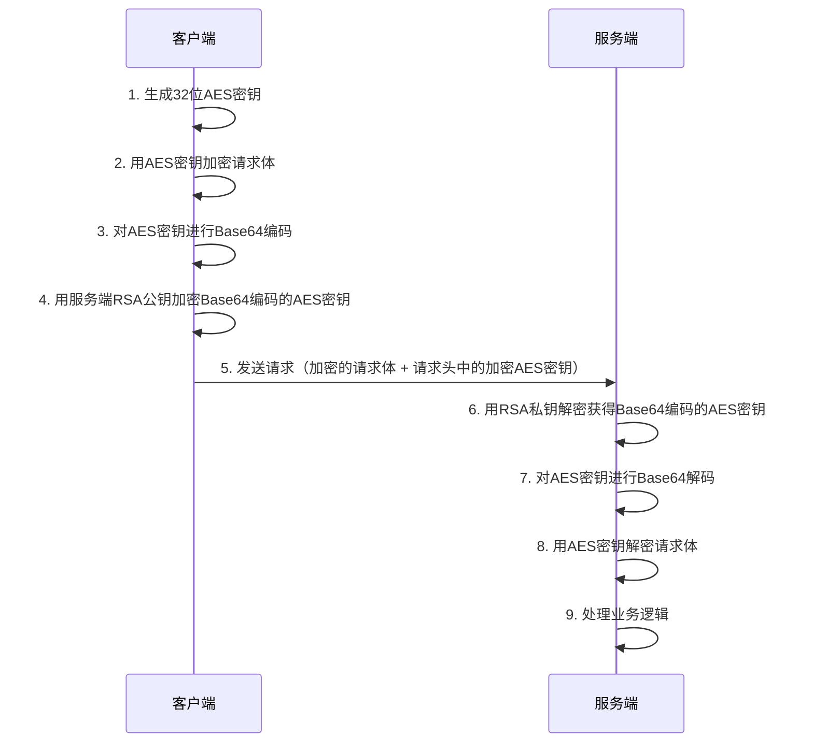
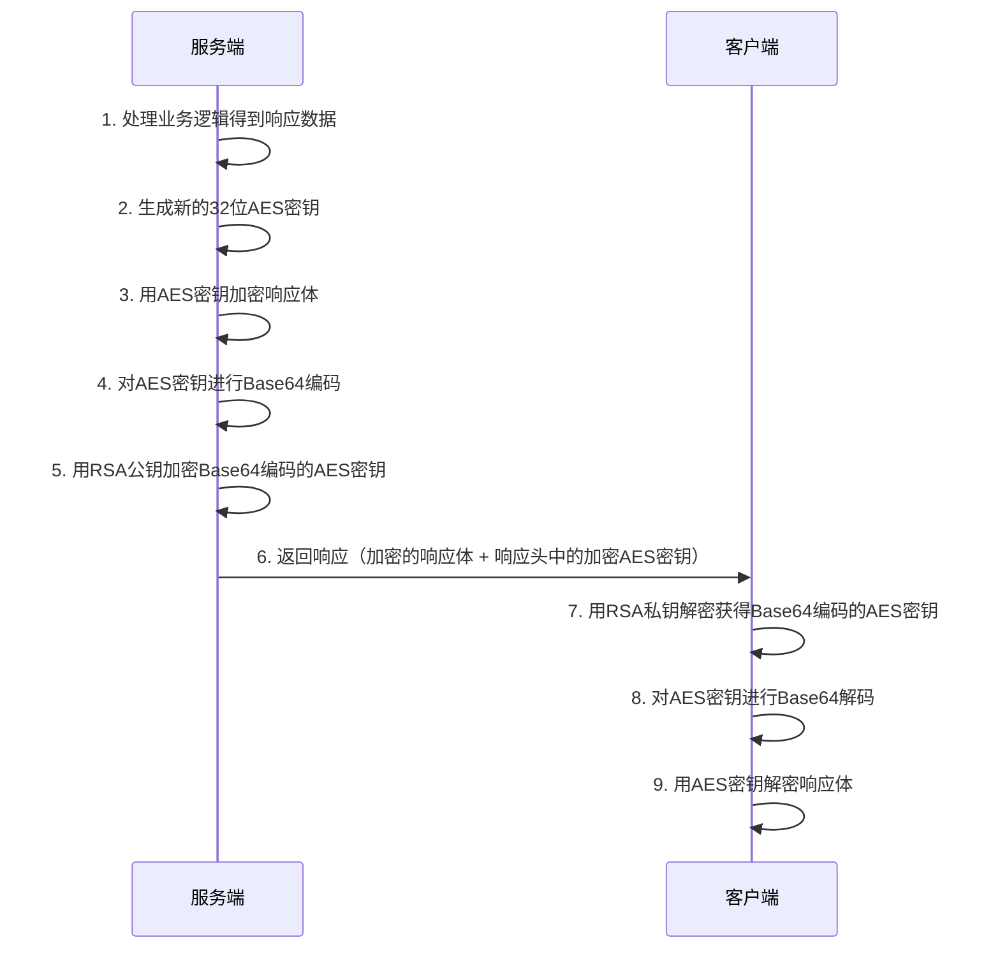
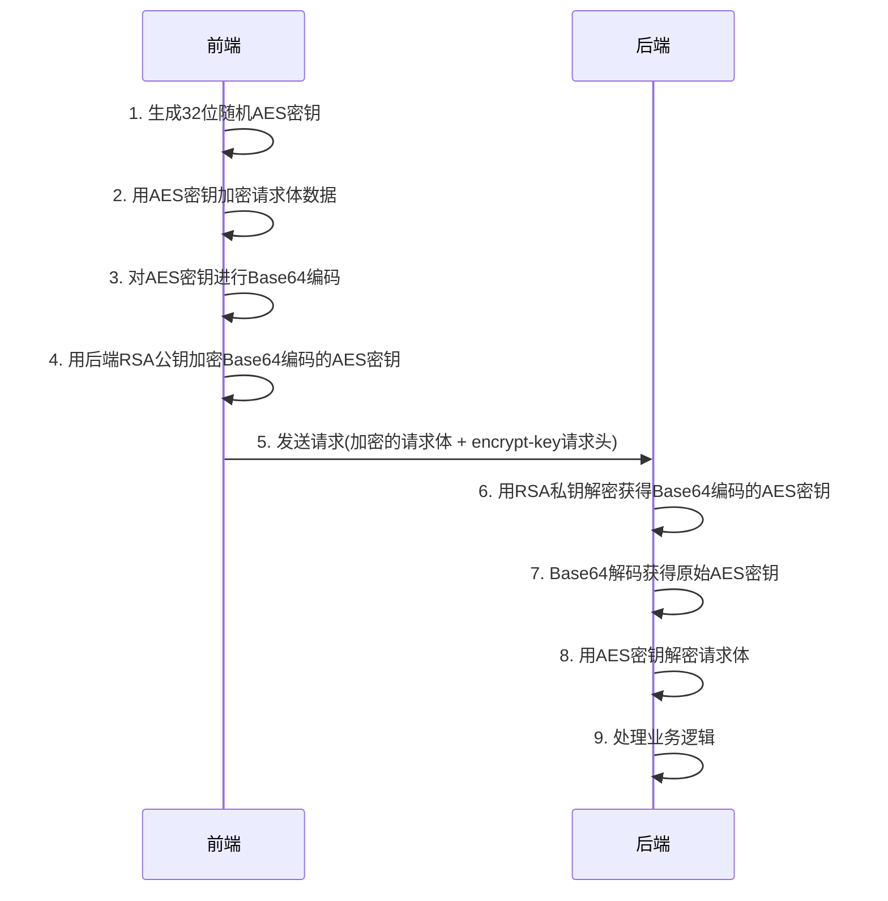
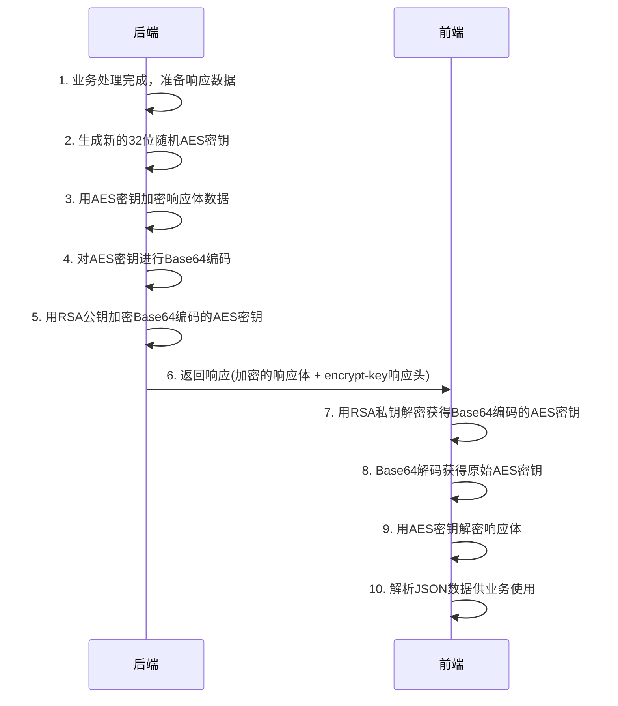

# API接口加密 (API Encryption)

API接口加密功能通过Servlet过滤器实现，支持前后端数据传输的全链路加密，采用RSA+AES混合加密方案，既保证了安全性又兼顾了性能。

## 配置说明

### 基础配置

在 `application.yml` 中配置API加密参数：

```yaml
api-decrypt:
  # 功能开关
  enabled: true
  
  # 请求头中加密密钥的标识字段
  header-flag: "encrypt-key"
  
  # RSA公钥（用于加密响应中的AES密钥）
  public-key: "MIIBIjANBgkqhkiG9w0BAQEFAAOCAQ8AMIIBCgKCAQEA..."
  
  # RSA私钥（用于解密请求中的AES密钥）
  private-key: "MIIEvQIBADANBgkqhkiG9w0BAQEFAASCBKcwggSjAgEAAoIBAQC..."
```

### 配置项说明

| 配置项 | 说明 | 默认值 |
|--------|------|--------|
| `enabled` | 是否启用API加密功能 | false |
| `header-flag` | 请求头中存放加密密钥的字段名 | encrypt-key |
| `public-key` | RSA公钥，用于加密响应中的AES密钥 | - |
| `private-key` | RSA私钥，用于解密请求中的AES密钥 | - |

## @ApiEncrypt 注解使用

### 基础用法

```java
@RestController
@RequestMapping("/api/user")
public class UserController {
    
    // 普通接口（不加密）
    @GetMapping("/info")
    public Result<UserInfo> getUserInfo() {
        return Result.success(userService.getCurrentUser());
    }
    
    // 对响应进行加密
    @PostMapping("/login")
    @ApiEncrypt(response = true)
    public Result<LoginResponse> login(@RequestBody LoginRequest request) {
        // 请求自动解密，响应自动加密
        LoginResponse response = userService.login(request);
        return Result.success(response);
    }
    
    // 敏感数据接口
    @GetMapping("/profile")
    @ApiEncrypt(response = true)
    public Result<UserProfile> getUserProfile() {
        // 返回的用户详细信息会被加密
        UserProfile profile = userService.getUserProfile();
        return Result.success(profile);
    }
}
```

### 注解参数

| 参数 | 类型 | 默认值 | 说明 |
|------|------|--------|------|
| `response` | boolean | false | 是否对响应进行加密 |

**注意**：
- 请求解密是自动的，只要请求头包含加密标识就会解密
- 响应加密需要显式设置 `response = true`

## 加密流程详解

### 请求加密流程



### 响应加密流程



## 前端对接实现

### 环境变量配置

在前端项目的 `.env` 文件中配置加密相关参数：

```bash
# 接口加密功能开关(如需关闭 后端也必须对应关闭)
VITE_APP_API_ENCRYPT = 'true'

# 接口加密传输 RSA 公钥与后端解密私钥对应 如更换需前后端一同更换
VITE_APP_RSA_PUBLIC_KEY = 'MFwwDQYJKoZIhvcNAQEBBQADSwAwSAJBAK9s1Pbnn5W+l1hx3ukHLtevayF...'

# 接口响应解密 RSA 私钥与后端加密公钥对应 如更换需前后端一同更换
VITE_APP_RSA_PRIVATE_KEY = 'MIIBOwIBAAJBAIrZxEhzVAHKJm7BJpXIHWGU3sHJYgRiOOTw3Auj...'
```

**⚠️ 安全提醒：**
- 以上为示例密钥，生产环境请使用您自己生成的密钥对
- 密钥应存储在安全的配置中心，不要直接写在代码中
- 定期轮换密钥以确保安全性

### 系统配置

在 `SystemConfig` 中配置安全选项：

```typescript
export const SystemConfig = {
  security: {
    // 是否启用API加密（从环境变量读取）
    apiEncrypt: process.env.VITE_APP_API_ENCRYPT === 'true',
  },
  // 其他配置...
}
```

### 使用示例

#### 1. 加密请求示例

```typescript
import { http } from '@/composables/useHttp'

// 发送加密的登录请求
const login = async (loginData: LoginRequest) => {
  const [err, result] = await http.post<LoginResponse>('/api/auth/login', loginData, {
    header: { 
      isEncrypt: true  // 开启请求加密
    }
  })
  
  if (!err) {
    console.log('登录成功', result)
  } else {
    console.error('登录失败', err.message)
  }
}

// 发送加密的用户信息更新请求
const updateProfile = async (profileData: UserProfile) => {
  const [err] = await http.put<void>('/api/user/profile', profileData, {
    header: { 
      isEncrypt: true  // 开启请求加密
    }
  })
  
  if (!err) {
    console.log('更新成功')
  }
}
```

#### 2. 接收加密响应

```typescript
// 响应加密由后端 @ApiEncrypt(response = true) 注解控制
// 前端会自动检测响应头中的加密标识并解密

const getUserInfo = async () => {
  // 后端接口标注了 @ApiEncrypt(response = true)，响应会被自动解密
  const [err, userInfo] = await http.get<UserInfo>('/api/user/info')
  
  if (!err) {
    console.log('用户信息', userInfo) // 已自动解密的数据
  }
}
```

### 核心实现原理

#### 1. 请求加密处理

```typescript
/**
 * 加密请求数据
 */
const encryptRequestData = (data: any, header: Record<string, any>) => {
  if (!SystemConfig.security?.apiEncrypt || !data) return data

  // 1. 生成32位AES密钥
  const aesKey = generateAesKey()
  
  // 2. 用后端RSA公钥加密AES密钥并放入请求头
  header[ENCRYPT_HEADER] = rsaEncrypt(encodeBase64(aesKey))

  // 3. 用AES密钥加密请求数据
  return typeof data === 'object'
    ? encryptWithAes(JSON.stringify(data), aesKey)
    : encryptWithAes(data, aesKey)
}
```

#### 2. 响应解密处理

```typescript
/**
 * 解密响应数据
 */
const decryptResponseData = (data: any, header: Record<string, any>): any => {
  if (!SystemConfig.security?.apiEncrypt) return data

  // 1. 从响应头获取加密的AES密钥
  const encryptKey = header[ENCRYPT_HEADER] || header[ENCRYPT_HEADER.toLowerCase()]
  if (!encryptKey) return data

  try {
    // 2. 用前端RSA私钥解密AES密钥
    const base64Str = rsaDecrypt(encryptKey)
    const aesKey = decodeBase64(base64Str)
    
    // 3. 用AES密钥解密响应数据
    const decryptedData = decryptWithAes(data, aesKey)
    return JSON.parse(decryptedData)
  } catch (error) {
    console.error('[响应解密失败]', error)
    throw new Error('响应数据解密失败')
  }
}
```

### 加密流程详解

#### 请求加密流程



#### 响应加密流程



### 密钥配置说明

#### 前后端密钥对应关系

```bash
# 后端配置（application.yml）
api-decrypt:
  # 响应加密公钥 - 用于加密响应中的AES密钥
  # 对应前端解密私钥
  public-key: "后端响应加密公钥"
  
  # 请求解密私钥 - 用于解密请求中的AES密钥  
  # 对应前端加密公钥
  private-key: "后端请求解密私钥"

# 前端配置（.env）
# 请求加密公钥 - 用于加密请求中的AES密钥
# 对应后端解密私钥
VITE_APP_RSA_PUBLIC_KEY = "前端请求加密公钥"

# 响应解密私钥 - 用于解密响应中的AES密钥
# 对应后端加密公钥  
VITE_APP_RSA_PRIVATE_KEY = "前端响应解密私钥"
```

#### 密钥对应关系图

```
请求加密流程：
前端请求加密公钥 ←→ 后端请求解密私钥 (密钥对A)

响应加密流程：
后端响应加密公钥 ←→ 前端响应解密私钥 (密钥对B)
```

**关键要点**：
- 后端配置中的 `publicKey` 和 `privateKey` **不是一对密钥**
- 需要生成**两对独立的RSA密钥**：
  - **密钥对A**：用于请求加密（前端公钥A + 后端私钥A）
  - **密钥对B**：用于响应加密（后端公钥B + 前端私钥B）
- 前端用公钥A加密请求，后端用私钥A解密请求
- 后端用公钥B加密响应，前端用私钥B解密响应
