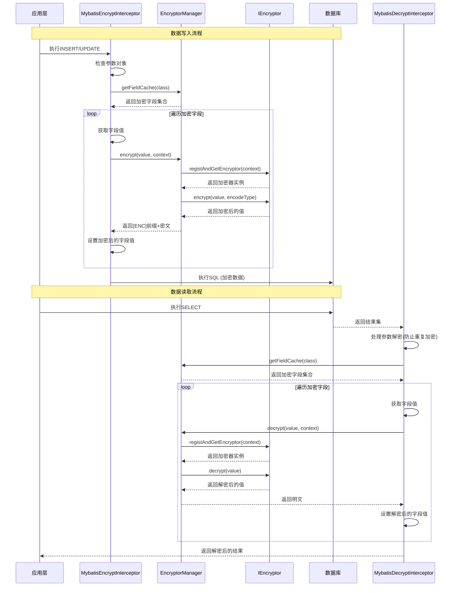

# 数据库字段加密 (Database Field Encryption)

数据库字段加密功能基于MyBatis拦截器实现，通过 `@EncryptField` 注解标记需要加密的字段，在数据入库前自动加密，查询时自动解密，对业务代码完全透明。

## 模块架构

### 整体架构

```
┌─────────────────────────────────────────────────────────────────────┐
│                         数据库字段加密模块                            │
├─────────────────────────────────────────────────────────────────────┤
│  ┌─────────────────────────────────────────────────────────────┐   │
│  │                     注解层 (Annotation)                      │   │
│  │  ┌─────────────┐                                            │   │
│  │  │@EncryptField│ 标记需要加密的字段                          │   │
│  │  └─────────────┘                                            │   │
│  └─────────────────────────────────────────────────────────────┘   │
│  ┌─────────────────────────────────────────────────────────────┐   │
│  │                    拦截层 (Interceptor)                      │   │
│  │  ┌───────────────────────┐   ┌───────────────────────────┐  │   │
│  │  │MybatisEncryptInterceptor│  │MybatisDecryptInterceptor│  │   │
│  │  │    入参加密拦截器       │   │    出参解密拦截器        │  │   │
│  │  └───────────────────────┘   └───────────────────────────┘  │   │
│  └─────────────────────────────────────────────────────────────┘   │
│  ┌─────────────────────────────────────────────────────────────┐   │
│  │                     核心层 (Core)                            │   │
│  │  ┌───────────────┐  ┌──────────────┐  ┌───────────────┐     │   │
│  │  │EncryptorManager│  │EncryptContext│  │  IEncryptor   │     │   │
│  │  │  加密器管理器   │  │  加密上下文  │  │  加密器接口   │     │   │
│  │  └───────────────┘  └──────────────┘  └───────────────┘     │   │
│  └─────────────────────────────────────────────────────────────┘   │
│  ┌─────────────────────────────────────────────────────────────┐   │
│  │                    加密器层 (Encryptor)                      │   │
│  │  ┌───────┐ ┌───────┐ ┌───────┐ ┌───────┐ ┌───────┐         │   │
│  │  │Base64 │ │  AES  │ │  RSA  │ │  SM2  │ │  SM4  │         │   │
│  │  │Encryptor│Encryptor│Encryptor│Encryptor│Encryptor        │   │
│  │  └───────┘ └───────┘ └───────┘ └───────┘ └───────┘         │   │
│  └─────────────────────────────────────────────────────────────┘   │
│  ┌─────────────────────────────────────────────────────────────┐   │
│  │                     工具层 (Utils)                           │   │
│  │  ┌──────────────────────────────────────────────────────┐   │   │
│  │  │                   EncryptUtils                        │   │   │
│  │  │ Base64/AES/RSA/SM2/SM4 加密解密 + 密钥生成工具        │   │   │
│  │  └──────────────────────────────────────────────────────┘   │   │
│  └─────────────────────────────────────────────────────────────┘   │
└─────────────────────────────────────────────────────────────────────┘
```

### 核心类结构

| 类名 | 包路径 | 说明 |
|------|--------|------|
| `@EncryptField` | `annotation` | 字段加密注解 |
| `MybatisEncryptInterceptor` | `interceptor` | 入参加密拦截器 |
| `MybatisDecryptInterceptor` | `interceptor` | 出参解密拦截器 |
| `EncryptorManager` | `core` | 加密器管理器 |
| `EncryptContext` | `core` | 加密上下文 |
| `IEncryptor` | `core` | 加密器接口 |
| `AbstractEncryptor` | `core.encryptor` | 抽象加密器基类 |
| `Base64Encryptor` | `core.encryptor` | Base64编码器 |
| `AesEncryptor` | `core.encryptor` | AES加密器 |
| `RsaEncryptor` | `core.encryptor` | RSA加密器 |
| `Sm2Encryptor` | `core.encryptor` | SM2加密器 |
| `Sm4Encryptor` | `core.encryptor` | SM4加密器 |
| `EncryptorProperties` | `properties` | 配置属性类 |
| `EncryptorAutoConfiguration` | `config` | 自动配置类 |

### 加解密流程



## 配置说明

### 全局配置

在 `application.yml` 中配置默认的加密参数：

```yaml
mybatis-encryptor:
  # 功能开关 - 控制是否启用字段加密功能
  enable: true

  # 默认加密算法（当注解中algorithm为DEFAULT时使用）
  # 可选值: BASE64, AES, RSA, SM2, SM4
  algorithm: AES

  # 默认编码方式
  # 可选值: BASE64, HEX
  encode: BASE64

  # 对称加密密钥（AES/SM4使用）
  # AES要求: 16位、24位或32位
  # SM4要求: 16位
  password: "1234567890123456"

  # 非对称加密公钥（RSA/SM2使用）
  # RSA密钥: 通常为Base64编码的1024/2048/4096位密钥
  # SM2密钥: 国密标准格式
  public-key: "MIIBIjANBgkqhkiG9w0BAQEFAAOCAQ8AMIIBCgKCAQEA..."

  # 非对称加密私钥（RSA/SM2使用）
  private-key: "MIIEvQIBADANBgkqhkiG9w0BAQEFAASCBKcwggSjAgEAAoIBAQC..."
```

### 配置属性详解

```java
@Data
@ConfigurationProperties(prefix = "mybatis-encryptor")
public class EncryptorProperties {

    /**
     * 加密功能总开关
     * true: 启用MyBatis字段加解密
     * false: 禁用加解密功能
     */
    private Boolean enable;

    /**
     * 默认加密算法
     * 当@EncryptField注解中algorithm为DEFAULT时使用此配置
     */
    private AlgorithmType algorithm;

    /**
     * 默认对称加密密钥
     * AES要求：16、24或32位
     * SM4要求：16位
     */
    private String password;

    /**
     * 默认非对称加密公钥
     * RSA/SM2算法使用，用于加密操作
     */
    private String publicKey;

    /**
     * 默认非对称加密私钥
     * RSA/SM2算法使用，用于解密操作
     */
    private String privateKey;

    /**
     * 默认编码方式
     * BASE64: Base64编码（推荐）
     * HEX: 十六进制编码
     */
    private EncodeType encode;
}
```

### MyBatis-Plus集成配置

确保MyBatis-Plus的实体扫描包配置正确：

```yaml
mybatis-plus:
  # 实体类扫描包（加密器会扫描这些包下的@EncryptField注解）
  # 支持多个包，用逗号分隔
  type-aliases-package: plus.ruoyi.**.domain.entity

  # Mapper扫描包
  mapper-package: plus.ruoyi.**.mapper
```

### 自动配置原理

系统通过 `EncryptorAutoConfiguration` 自动配置类注册相关Bean：

```java
@AutoConfiguration(after = MybatisPlusAutoConfiguration.class)
@EnableConfigurationProperties(EncryptorProperties.class)
@ConditionalOnProperty(value = "mybatis-encryptor.enable", havingValue = "true")
public class EncryptorAutoConfiguration {

    @Autowired
    private EncryptorProperties properties;

    /**
     * 创建加密器管理器
     * 扫描指定包下的实体类，缓存包含@EncryptField注解的字段
     */
    @Bean
    public EncryptorManager encryptorManager(MybatisPlusProperties mybatisPlusProperties) {
        return new EncryptorManager(mybatisPlusProperties.getTypeAliasesPackage());
    }

    /**
     * 创建MyBatis加密拦截器
     * 拦截ParameterHandler.setParameters方法
     */
    @Bean
    public MybatisEncryptInterceptor mybatisEncryptInterceptor(EncryptorManager encryptorManager) {
        return new MybatisEncryptInterceptor(encryptorManager, properties);
    }

    /**
     * 创建MyBatis解密拦截器
     * 拦截ResultSetHandler.handleResultSets方法
     */
    @Bean
    public MybatisDecryptInterceptor mybatisDecryptInterceptor(EncryptorManager encryptorManager) {
        return new MybatisDecryptInterceptor(encryptorManager, properties);
    }
}
```

**自动配置条件**：
- 必须在 `MybatisPlusAutoConfiguration` 之后加载
- 必须配置 `mybatis-encryptor.enable=true`

## @EncryptField 注解详解

### 注解定义

```java
@Documented
@Inherited
@Target({ElementType.FIELD})
@Retention(RetentionPolicy.RUNTIME)
public @interface EncryptField {

    /**
     * 加密算法类型
     * @return 算法类型，默认使用配置文件中的算法
     */
    AlgorithmType algorithm() default AlgorithmType.DEFAULT;

    /**
     * 对称加密密钥（AES、SM4算法使用）
     * AES要求：16位、24位或32位
     * SM4要求：16位
     * @return 密钥字符串，为空时使用配置文件中的密钥
     */
    String password() default "";

    /**
     * 非对称加密公钥（RSA、SM2算法使用）
     * 用于加密操作
     * @return 公钥字符串，为空时使用配置文件中的公钥
     */
    String publicKey() default "";

    /**
     * 非对称加密私钥（RSA、SM2算法使用）
     * 用于解密操作
     * @return 私钥字符串，为空时使用配置文件中的私钥
     */
    String privateKey() default "";

    /**
     * 加密结果的编码方式
     * 支持BASE64和HEX两种编码
     * 注意：对BASE64算法本身不起作用
     * @return 编码类型，默认使用配置文件中的编码方式
     */
    EncodeType encode() default EncodeType.DEFAULT;
}
```

### 基础用法

```java
@Data
@TableName("sys_user")
public class SysUser {

    @TableId
    private Long userId;

    private String userName;

    // 使用默认配置加密（采用全局配置的算法和密钥）
    @EncryptField
    private String phone;

    // 指定加密算法
    @EncryptField(algorithm = AlgorithmType.SM4)
    private String email;

    // 使用自定义密钥
    @EncryptField(
        algorithm = AlgorithmType.AES,
        password = "customkey123456789",
        encode = EncodeType.HEX
    )
    private String idCard;
}
```

### 注解参数说明

| 参数 | 类型 | 默认值 | 说明 |
|------|------|--------|------|
| `algorithm` | `AlgorithmType` | `DEFAULT` | 加密算法类型 |
| `password` | `String` | `""` | 对称加密密钥（AES/SM4使用） |
| `publicKey` | `String` | `""` | 非对称加密公钥（RSA/SM2使用） |
| `privateKey` | `String` | `""` | 非对称加密私钥（RSA/SM2使用） |
| `encode` | `EncodeType` | `DEFAULT` | 编码方式（BASE64/HEX） |

**参数优先级**：注解参数 > 全局配置

## 加密算法详解

### 算法类型枚举

```java
@Getter
@AllArgsConstructor
public enum AlgorithmType {

    /**
     * 默认走yml配置
     */
    DEFAULT(null),

    /**
     * Base64编码（不是真正的加密，仅做数据混淆）
     */
    BASE64(Base64Encryptor.class),

    /**
     * AES对称加密（推荐）
     */
    AES(AesEncryptor.class),

    /**
     * RSA非对称加密
     */
    RSA(RsaEncryptor.class),

    /**
     * SM2国密非对称加密
     */
    SM2(Sm2Encryptor.class),

    /**
     * SM4国密对称加密
     */
    SM4(Sm4Encryptor.class);

    private final Class<? extends AbstractEncryptor> clazz;
}
```

### 编码类型枚举

```java
public enum EncodeType {

    /**
     * 默认使用yml配置
     */
    DEFAULT,

    /**
     * Base64编码（推荐，结果更短）
     */
    BASE64,

    /**
     * 16进制编码（结果较长，但更直观）
     */
    HEX;
}
```

### 1. BASE64 编码

Base64不是加密算法，仅对数据进行编码混淆，**安全性最低**，适合不敏感但需要隐藏的数据。

```java
public class User {
    // BASE64不需要密钥，主要用于数据混淆
    @EncryptField(algorithm = AlgorithmType.BASE64)
    private String remark;
}
```

**Base64Encryptor 实现**：

```java
public class Base64Encryptor extends AbstractEncryptor {

    public Base64Encryptor(EncryptContext context) {
        super(context);
    }

    @Override
    public AlgorithmType algorithm() {
        return AlgorithmType.BASE64;
    }

    @Override
    public String encrypt(String value, EncodeType encodeType) {
        // encodeType参数对Base64不起作用
        return EncryptUtils.encryptByBase64(value);
    }

    @Override
    public String decrypt(String value) {
        return EncryptUtils.decryptByBase64(value);
    }
}
```

**适用场景**：
- 临时数据混淆
- 非敏感信息隐藏
- 日志脱敏

### 2. AES 对称加密

AES是目前最广泛使用的对称加密算法，**安全性高、性能好**，是推荐的默认选择。

```java
public class User {
    // 使用全局配置的AES密钥
    @EncryptField(algorithm = AlgorithmType.AES)
    private String phone;

    // 使用自定义AES密钥（16位）
    @EncryptField(
        algorithm = AlgorithmType.AES,
        password = "mykey1234567890"
    )
    private String email;

    // AES + HEX编码
    @EncryptField(
        algorithm = AlgorithmType.AES,
        password = "mykey1234567890",
        encode = EncodeType.HEX
    )
    private String idCard;
}
```

**AesEncryptor 实现**：

```java
public class AesEncryptor extends AbstractEncryptor {

    private final EncryptContext context;

    public AesEncryptor(EncryptContext context) {
        super(context);
        this.context = context;
    }

    @Override
    public AlgorithmType algorithm() {
        return AlgorithmType.AES;
    }

    @Override
    public String encrypt(String value, EncodeType encodeType) {
        if (encodeType == EncodeType.HEX) {
            return EncryptUtils.encryptByAesHex(value, context.getPassword());
        } else {
            return EncryptUtils.encryptByAes(value, context.getPassword());
        }
    }

    @Override
    public String decrypt(String value) {
        return EncryptUtils.decryptByAes(value, context.getPassword());
    }
}
```

**AES密钥要求**：

| 密钥长度 | 安全级别 | 说明 |
|----------|----------|------|
| 16位 | AES-128 | 基础安全级别 |
| 24位 | AES-192 | 中等安全级别 |
| 32位 | AES-256 | 最高安全级别（推荐） |

**适用场景**：
- 手机号、邮箱等常规敏感信息
- 需要高性能加解密的场景
- 大量数据批量处理

### 3. RSA 非对称加密

RSA使用公钥加密、私钥解密，**安全性最高**，但性能较低，适合少量高敏感数据。

```java
public class User {
    @EncryptField(
        algorithm = AlgorithmType.RSA,
        publicKey = "MIIBIjANBgkqhkiG9w0BAQEFAAOCAQ8AMIIBCgKCAQEA...",
        privateKey = "MIIEvQIBADANBgkqhkiG9w0BAQEFAASCBKcwggSjAgEAAoIBAQC..."
    )
    private String bankCard;
}
```

**RsaEncryptor 实现**：

```java
public class RsaEncryptor extends AbstractEncryptor {

    private final EncryptContext context;

    public RsaEncryptor(EncryptContext context) {
        super(context);
        String privateKey = context.getPrivateKey();
        String publicKey = context.getPublicKey();
        if (StringUtils.isAnyEmpty(privateKey, publicKey)) {
            throw new IllegalArgumentException("RSA公私钥均需要提供，公钥加密，私钥解密。");
        }
        this.context = context;
    }

    @Override
    public AlgorithmType algorithm() {
        return AlgorithmType.RSA;
    }

    @Override
    public String encrypt(String value, EncodeType encodeType) {
        if (encodeType == EncodeType.HEX) {
            return EncryptUtils.encryptByRsaHex(value, context.getPublicKey());
        } else {
            return EncryptUtils.encryptByRsa(value, context.getPublicKey());
        }
    }

    @Override
    public String decrypt(String value) {
        return EncryptUtils.decryptByRsa(value, context.getPrivateKey());
    }
}
```

**RSA密钥生成**：

```java
// 使用工具类生成RSA密钥对
Map<String, String> keyMap = EncryptUtils.generateRsaKey();
String publicKey = keyMap.get(EncryptUtils.PUBLIC_KEY);
String privateKey = keyMap.get(EncryptUtils.PRIVATE_KEY);
```

**密钥长度说明**：

| 密钥长度 | 安全级别 | 性能 |
|----------|----------|------|
| 1024位 | 较低（不推荐） | 快 |
| 2048位 | 中等（推荐） | 适中 |
| 4096位 | 高 | 较慢 |

**适用场景**：
- 银行卡号、密码等高敏感信息
- 少量数据的加密存储
- 需要密钥分离管理的场景

### 4. SM2 国密非对称加密

SM2是中国国家密码管理局发布的国产非对称加密算法，**符合国密标准**，适合政务和金融系统。

```java
public class User {
    @EncryptField(
        algorithm = AlgorithmType.SM2,
        publicKey = "你的SM2公钥",
        privateKey = "你的SM2私钥"
    )
    private String socialSecurityNumber;
}
```

**Sm2Encryptor 实现**：

```java
public class Sm2Encryptor extends AbstractEncryptor {

    private final EncryptContext context;

    public Sm2Encryptor(EncryptContext context) {
        super(context);
        String privateKey = context.getPrivateKey();
        String publicKey = context.getPublicKey();
        if (StringUtils.isAnyEmpty(privateKey, publicKey)) {
            throw new IllegalArgumentException("SM2公私钥均需要提供，公钥加密，私钥解密。");
        }
        this.context = context;
    }

    @Override
    public AlgorithmType algorithm() {
        return AlgorithmType.SM2;
    }

    @Override
    public String encrypt(String value, EncodeType encodeType) {
        if (encodeType == EncodeType.HEX) {
            return EncryptUtils.encryptBySm2Hex(value, context.getPublicKey());
        } else {
            return EncryptUtils.encryptBySm2(value, context.getPublicKey());
        }
    }

    @Override
    public String decrypt(String value) {
        return EncryptUtils.decryptBySm2(value, context.getPrivateKey());
    }
}
```

**SM2密钥生成**：

```java
// 使用工具类生成SM2密钥对
Map<String, String> keyMap = EncryptUtils.generateSm2Key();
String publicKey = keyMap.get(EncryptUtils.PUBLIC_KEY);
String privateKey = keyMap.get(EncryptUtils.PRIVATE_KEY);
```

**适用场景**：
- 政务系统
- 金融系统
- 需要符合国密标准的项目

### 5. SM4 国密对称加密

SM4是中国国家密码管理局发布的国产对称加密算法，**符合国密标准**，性能接近AES。

```java
public class User {
    // SM4密钥必须是16位
    @EncryptField(
        algorithm = AlgorithmType.SM4,
        password = "sm4key1234567890"
    )
    private String passport;
}
```

**Sm4Encryptor 实现**：

```java
public class Sm4Encryptor extends AbstractEncryptor {

    private final EncryptContext context;

    public Sm4Encryptor(EncryptContext context) {
        super(context);
        this.context = context;
    }

    @Override
    public AlgorithmType algorithm() {
        return AlgorithmType.SM4;
    }

    @Override
    public String encrypt(String value, EncodeType encodeType) {
        if (encodeType == EncodeType.HEX) {
            return EncryptUtils.encryptBySm4Hex(value, context.getPassword());
        } else {
            return EncryptUtils.encryptBySm4(value, context.getPassword());
        }
    }

    @Override
    public String decrypt(String value) {
        return EncryptUtils.decryptBySm4(value, context.getPassword());
    }
}
```

**SM4密钥要求**：
- 密钥长度必须是16位
- 采用128位分组加密

**适用场景**：
- 国产化替代AES
- 政务和金融系统
- 需要高性能的国密加密场景

### 算法对比

| 算法 | 类型 | 安全性 | 性能 | 密钥要求 | 适用场景 |
|------|------|--------|------|----------|----------|
| BASE64 | 编码 | 低 | 最快 | 无 | 数据混淆 |
| AES | 对称 | 高 | 快 | 16/24/32位 | 常规敏感数据 |
| RSA | 非对称 | 最高 | 慢 | 公私钥对 | 高敏感数据 |
| SM2 | 非对称 | 最高 | 较慢 | 公私钥对 | 国密合规 |
| SM4 | 对称 | 高 | 快 | 16位 | 国密合规 |

## 核心实现原理

### EncryptorManager 加密器管理器

`EncryptorManager` 是加密模块的核心，负责字段缓存和加密器实例管理：

```java
@Slf4j
@NoArgsConstructor
public class EncryptorManager {

    /**
     * 加密器实例缓存
     * Key: EncryptContext的hashCode，确保相同配置复用实例
     * Value: 对应的加密器实例
     */
    Map<Integer, IEncryptor> encryptorMap = new ConcurrentHashMap<>();

    /**
     * 类的加密字段缓存
     * Key: 实体类的Class对象
     * Value: 该类中标注了@EncryptField注解的字段集合
     */
    Map<Class<?>, Set<Field>> fieldCache = new ConcurrentHashMap<>();

    /**
     * 构造方法，初始化时扫描实体类
     */
    public EncryptorManager(String typeAliasesPackage) {
        scanEncryptClasses(typeAliasesPackage);
    }

    /**
     * 统一加密接口
     * 加密后的值会自动添加[ENC]前缀用于标识
     */
    public String encrypt(String value, EncryptContext encryptContext) {
        // 已加密的数据直接返回（通过前缀判断）
        if (StringUtils.startsWith(value, Constants.ENCRYPT_HEADER)) {
            return value;
        }
        IEncryptor encryptor = this.registAndGetEncryptor(encryptContext);
        String encrypt = encryptor.encrypt(value, encryptContext.getEncode());
        return Constants.ENCRYPT_HEADER + encrypt;
    }

    /**
     * 统一解密接口
     * 只有带[ENC]前缀的数据才会被解密
     */
    public String decrypt(String value, EncryptContext encryptContext) {
        // 没有加密标识的数据直接返回
        if (!StringUtils.startsWith(value, Constants.ENCRYPT_HEADER)) {
            return value;
        }
        IEncryptor encryptor = this.registAndGetEncryptor(encryptContext);
        String str = StringUtils.removeStart(value, Constants.ENCRYPT_HEADER);
        return encryptor.decrypt(str);
    }

    /**
     * 注册并获取加密器实例（使用缓存机制）
     */
    public IEncryptor registAndGetEncryptor(EncryptContext encryptContext) {
        int key = encryptContext.hashCode();
        if (encryptorMap.containsKey(key)) {
            return encryptorMap.get(key);
        }
        // 使用反射创建加密器实例
        IEncryptor encryptor = ReflectUtil.newInstance(
            encryptContext.getAlgorithm().getClazz(),
            encryptContext
        );
        encryptorMap.put(key, encryptor);
        return encryptor;
    }
}
```

**加密标识机制**：

系统使用 `[ENC]` 前缀标识已加密的数据：
- 加密时自动添加前缀
- 解密时先检查前缀，没有前缀则直接返回原值
- 防止数据被重复加密

### MybatisEncryptInterceptor 加密拦截器

入参加密拦截器拦截 `ParameterHandler.setParameters` 方法：

```java
@Intercepts({@Signature(
    type = ParameterHandler.class,
    method = "setParameters",
    args = {PreparedStatement.class})
})
@AllArgsConstructor
public class MybatisEncryptInterceptor implements Interceptor {

    private final EncryptorManager encryptorManager;
    private final EncryptorProperties defaultProperties;

    @Override
    public Object intercept(Invocation invocation) throws Throwable {
        return invocation;
    }

    /**
     * 插件包装方法
     * 在ParameterHandler被调用前，先对参数进行加密处理
     */
    @Override
    public Object plugin(Object target) {
        if (target instanceof ParameterHandler parameterHandler) {
            Object parameterObject = parameterHandler.getParameterObject();
            if (ObjectUtil.isNotNull(parameterObject) && !(parameterObject instanceof String)) {
                this.encryptHandler(parameterObject);
            }
        }
        return target;
    }

    /**
     * 递归处理参数对象中的加密字段
     * 支持Map、List、普通对象等多种参数类型
     */
    private void encryptHandler(Object sourceObject) {
        if (ObjectUtil.isNull(sourceObject)) {
            return;
        }

        // 处理Map类型参数
        if (sourceObject instanceof Map<?, ?> map) {
            new HashSet<>(map.values()).forEach(this::encryptHandler);
            return;
        }

        // 处理List类型参数（带性能优化）
        if (sourceObject instanceof List<?> list) {
            if (CollUtil.isEmpty(list)) {
                return;
            }
            Object firstItem = list.get(0);
            if (ObjectUtil.isNull(firstItem) ||
                CollUtil.isEmpty(encryptorManager.getFieldCache(firstItem.getClass()))) {
                return; // 第一个元素没有加密字段，整个List跳过
            }
            list.forEach(this::encryptHandler);
            return;
        }

        // 处理普通对象
        Set<Field> fields = encryptorManager.getFieldCache(sourceObject.getClass());
        if (ObjectUtil.isNull(fields)) {
            return;
        }

        for (Field field : fields) {
            Object fieldValue = field.get(sourceObject);
            String encryptedValue = this.encryptField(Convert.toStr(fieldValue), field);
            field.set(sourceObject, encryptedValue);
        }
    }

    /**
     * 对单个字段进行加密
     * 优先级：字段注解配置 > 全局默认配置
     */
    private String encryptField(String value, Field field) {
        if (ObjectUtil.isNull(value)) {
            return null;
        }

        EncryptField encryptField = field.getAnnotation(EncryptField.class);
        EncryptContext encryptContext = new EncryptContext();

        // 构建加密上下文，优先使用注解配置
        encryptContext.setAlgorithm(
            encryptField.algorithm() == AlgorithmType.DEFAULT ?
                defaultProperties.getAlgorithm() : encryptField.algorithm()
        );
        encryptContext.setEncode(
            encryptField.encode() == EncodeType.DEFAULT ?
                defaultProperties.getEncode() : encryptField.encode()
        );
        encryptContext.setPassword(
            StringUtils.isBlank(encryptField.password()) ?
                defaultProperties.getPassword() : encryptField.password()
        );
        encryptContext.setPrivateKey(
            StringUtils.isBlank(encryptField.privateKey()) ?
                defaultProperties.getPrivateKey() : encryptField.privateKey()
        );
        encryptContext.setPublicKey(
            StringUtils.isBlank(encryptField.publicKey()) ?
                defaultProperties.getPublicKey() : encryptField.publicKey()
        );

        return this.encryptorManager.encrypt(value, encryptContext);
    }
}
```

### MybatisDecryptInterceptor 解密拦截器

出参解密拦截器拦截 `ResultSetHandler.handleResultSets` 方法：

```java
@Intercepts({@Signature(
    type = ResultSetHandler.class,
    method = "handleResultSets",
    args = {Statement.class})
})
@AllArgsConstructor
public class MybatisDecryptInterceptor implements Interceptor {

    private final EncryptorManager encryptorManager;
    private final EncryptorProperties defaultProperties;

    @Override
    public Object intercept(Invocation invocation) throws Throwable {
        // 步骤1：处理查询参数解密，防止重复加密
        handleParameterDecryption(invocation);

        // 步骤2：执行原始的结果集处理
        Object result = invocation.proceed();
        if (result == null) {
            return null;
        }

        // 步骤3：对查询结果进行解密处理
        decryptHandler(result);
        return result;
    }

    /**
     * 处理查询参数解密
     * 主要解决以下问题：
     * 1. 防止业务层已加密的参数被再次加密
     * 2. 确保查询条件与数据库存储的加密格式一致
     */
    private void handleParameterDecryption(Invocation invocation) {
        try {
            ResultSetHandler resultSetHandler = (ResultSetHandler) invocation.getTarget();

            // 通过反射获取ParameterHandler
            Field parameterHandlerField = resultSetHandler.getClass()
                .getDeclaredField("parameterHandler");
            parameterHandlerField.setAccessible(true);
            Object target = parameterHandlerField.get(resultSetHandler);

            if (target instanceof ParameterHandler parameterHandler) {
                Object parameterObject = parameterHandler.getParameterObject();
                if (ObjectUtil.isNotNull(parameterObject) &&
                    !(parameterObject instanceof String)) {
                    decryptHandler(parameterObject);
                }
            }
        } catch (Exception e) {
            log.error("处理查询参数解密时出错", e);
        }
    }

    /**
     * 递归处理对象中的解密字段
     */
    private void decryptHandler(Object sourceObject) {
        if (ObjectUtil.isNull(sourceObject)) {
            return;
        }

        // 处理Map类型数据
        if (sourceObject instanceof Map<?, ?> map) {
            new HashSet<>(map.values()).forEach(this::decryptHandler);
            return;
        }

        // 处理List类型数据
        if (sourceObject instanceof List<?> list) {
            if (CollUtil.isEmpty(list)) {
                return;
            }
            Object firstItem = list.get(0);
            if (ObjectUtil.isNull(firstItem) ||
                CollUtil.isEmpty(encryptorManager.getFieldCache(firstItem.getClass()))) {
                return;
            }
            list.forEach(this::decryptHandler);
            return;
        }

        // 处理普通对象
        processObjectFields(sourceObject);
    }

    @Override
    public Object plugin(Object target) {
        return Plugin.wrap(target, this);
    }
}
```

## 支持的数据类型

### 1. 普通对象

```java
// 直接查询实体
SysUser user = userMapper.selectById(1L);
// phone字段自动解密
System.out.println(user.getPhone()); // 13800138000
```

### 2. List 集合

```java
// 批量查询
List<SysUser> users = userMapper.selectList(null);
// 每个user对象的phone字段都会自动解密
for (SysUser user : users) {
    System.out.println(user.getPhone());
}
```

### 3. 分页查询

```java
// MyBatis-Plus分页
Page<SysUser> page = new Page<>(1, 10);
Page<SysUser> result = userMapper.selectPage(page, null);
// 分页结果中的记录会自动解密
List<SysUser> records = result.getRecords();
```

### 4. Map 结果

```java
// 自定义SQL返回Map
List<Map<String, Object>> maps = userMapper.selectMaps(null);
// Map中的加密字段值会自动解密
for (Map<String, Object> map : maps) {
    System.out.println(map.get("phone"));
}
```

### 5. 嵌套对象

```java
@Data
public class Order {
    private Long orderId;

    // 嵌套对象中的加密字段也会被处理
    private SysUser user;
}
```

## 性能优化

### 1. 字段缓存机制

```java
// 字段缓存：避免重复反射
Map<Class<?>, Set<Field>> fieldCache;

// 系统启动时扫描并缓存所有加密字段
private void scanEncryptClasses(String typeAliasesPackage) {
    // 扫描指定包下的所有类
    for (Resource resource : resources) {
        Class<?> clazz = loadClass(resource);
        Set<Field> encryptFieldSet = getEncryptFieldSetFromClazz(clazz);
        if (CollUtil.isNotEmpty(encryptFieldSet)) {
            fieldCache.put(clazz, encryptFieldSet);
        }
    }
}
```

### 2. 加密器缓存机制

```java
// 加密器缓存：避免重复创建实例
Map<Integer, IEncryptor> encryptorMap;

// 使用EncryptContext的hashCode作为缓存键
public IEncryptor registAndGetEncryptor(EncryptContext encryptContext) {
    int key = encryptContext.hashCode();
    if (encryptorMap.containsKey(key)) {
        return encryptorMap.get(key);  // 命中缓存直接返回
    }
    // 创建新实例并缓存
    IEncryptor encryptor = ReflectUtil.newInstance(
        encryptContext.getAlgorithm().getClazz(), encryptContext
    );
    encryptorMap.put(key, encryptor);
    return encryptor;
}
```

### 3. 智能跳过优化

```java
// 如果类中没有加密字段，直接跳过处理
Set<Field> fields = encryptorManager.getFieldCache(sourceObject.getClass());
if (ObjectUtil.isNull(fields)) {
    return; // 直接返回，不做任何处理
}
```

### 4. 批量处理优化

```java
// 对于List类型，检查第一个元素是否有加密字段
if (sourceObject instanceof List<?> list) {
    if (CollUtil.isEmpty(list)) {
        return;
    }
    Object firstItem = list.get(0);
    if (ObjectUtil.isNull(firstItem) ||
        CollUtil.isEmpty(encryptorManager.getFieldCache(firstItem.getClass()))) {
        return; // 如果第一个元素没有加密字段，整个List都跳过
    }
    list.forEach(this::decryptHandler);
}
```

### 5. 性能测试数据

| 场景 | 无加密 | 启用加密 | 性能损耗 |
|------|--------|----------|----------|
| 单条插入 | 5ms | 6ms | ~20% |
| 批量插入(1000条) | 200ms | 280ms | ~40% |
| 单条查询 | 3ms | 4ms | ~33% |
| 批量查询(1000条) | 100ms | 140ms | ~40% |

## 最佳实践

### 1. 字段选择原则

**适合加密的字段**：
- 用户隐私信息（手机号、邮箱、身份证）
- 敏感业务数据（银行卡号、密码）
- 法规要求保护的数据（如GDPR、等保要求）

**不适合加密的字段**：
- 需要进行范围查询的字段（如金额、日期）
- 需要排序的字段
- 外键关联字段
- 频繁查询的索引字段

```java
// ❌ 不推荐：对所有字符串字段都加密
@EncryptField private String name;        // 姓名通常不需要加密
@EncryptField private String address;     // 地址可能需要模糊查询
@EncryptField private String department;  // 部门名称不需要加密

// ✅ 推荐：只对真正敏感的字段加密
@EncryptField private String phone;       // 手机号需要保护
@EncryptField private String idCard;      // 身份证号需要保护
@EncryptField private String bankCard;    // 银行卡号需要保护
```

### 2. 算法选择策略

```java
// 根据敏感级别选择算法
public class User {
    // 低敏感：BASE64混淆（仅隐藏，非真正加密）
    @EncryptField(algorithm = AlgorithmType.BASE64)
    private String nickname;

    // 中敏感：AES加密（推荐，性能好）
    @EncryptField(algorithm = AlgorithmType.AES)
    private String phone;

    // 高敏感：RSA加密（安全性最高）
    @EncryptField(algorithm = AlgorithmType.RSA)
    private String idCard;

    // 国产化项目：使用国密算法
    @EncryptField(algorithm = AlgorithmType.SM2)
    private String bankCard;
}
```

### 3. 密钥管理建议

```java
// ❌ 不推荐：密钥硬编码在代码中
@EncryptField(
    algorithm = AlgorithmType.AES,
    password = "hardcodedkey12345"  // 不安全！
)
private String phone;

// ✅ 推荐：使用配置文件管理密钥
@EncryptField(algorithm = AlgorithmType.AES)  // 使用全局配置的密钥
private String phone;

// ✅ 推荐：使用环境变量
# application.yml
mybatis-encryptor:
  password: ${ENCRYPT_PASSWORD:defaultPassword}
```

### 4. 查询注意事项

```java
// ❌ 加密字段不支持直接条件查询
LambdaQueryWrapper<SysUser> wrapper = new LambdaQueryWrapper<>();
wrapper.eq(SysUser::getPhone, "13800138000"); // 查询不到结果！

// ✅ 如果需要按加密字段查询，需要手动加密查询条件
@Autowired
private EncryptorManager encryptorManager;

public SysUser findByPhone(String phone) {
    // 构建加密上下文
    EncryptContext context = new EncryptContext();
    context.setAlgorithm(AlgorithmType.AES);
    context.setPassword("your-password");
    context.setEncode(EncodeType.BASE64);

    // 加密查询条件
    String encryptedPhone = encryptorManager.encrypt(phone, context);

    LambdaQueryWrapper<SysUser> wrapper = new LambdaQueryWrapper<>();
    wrapper.eq(SysUser::getPhone, encryptedPhone);
    return userMapper.selectOne(wrapper);
}
```

### 5. 数据库设计建议

```sql
-- ❌ 不推荐：加密字段设置索引
CREATE INDEX idx_phone ON sys_user(phone);  -- 索引无效

-- ✅ 推荐：对于需要查询的加密字段，考虑存储加密后的哈希值
CREATE TABLE sys_user (
    user_id BIGINT PRIMARY KEY,
    phone VARCHAR(255),       -- 加密存储的手机号
    phone_hash VARCHAR(64),   -- 手机号的哈希值（用于查询）
    email VARCHAR(255),
    id_card VARCHAR(255)
);
CREATE INDEX idx_phone_hash ON sys_user(phone_hash);

-- 查询时使用哈希值
SELECT * FROM sys_user WHERE phone_hash = SHA2('13800138000', 256);
```

### 6. 多租户场景

```java
// 不同租户使用不同的加密密钥
@Data
public class TenantUser {
    private Long tenantId;

    // 使用租户特定的密钥（通过配置或数据库获取）
    @EncryptField(
        algorithm = AlgorithmType.AES,
        password = "${tenant.encrypt.password}"  // 动态配置
    )
    private String phone;
}
```

## 故障排查

### 常见问题

#### 1. 字段值为null

**问题现象**：加密后的数据为null

**可能原因**：
- 字段本身被赋值为null
- 字段类型不是String

**解决方案**：
```java
// 检查字段赋值
if (user.getPhone() != null) {
    userMapper.insert(user);
}

// 确保字段类型为String
@EncryptField
private String phone;  // ✅ 正确

@EncryptField
private Long phoneNumber;  // ❌ 不支持非String类型
```

#### 2. 加密配置不生效

**问题现象**：数据未被加密存储

**排查步骤**：
1. 检查 `mybatis-encryptor.enable` 是否为 `true`
2. 检查实体类是否在扫描包路径内
3. 检查字段是否为 `String` 类型
4. 检查注解是否正确添加

```yaml
# 确保配置正确
mybatis-encryptor:
  enable: true  # 必须为true

mybatis-plus:
  type-aliases-package: plus.ruoyi.**.domain.entity  # 确保包路径正确
```

#### 3. 密钥长度错误

**问题现象**：启动报错或加解密失败

**解决方案**：
```java
// AES：密钥必须是16/24/32位
mybatis-encryptor:
  password: "1234567890123456"  # 16位 ✅
  password: "12345678901234567890"  # 20位 ❌

// SM4：密钥必须是16位
mybatis-encryptor:
  password: "1234567890123456"  # 16位 ✅
```

#### 4. 查询结果乱码

**问题现象**：解密后的数据显示乱码

**可能原因**：
- 数据库字符集设置不正确
- encode配置与加密时不一致

**解决方案**：
```yaml
# 检查数据库字符集
spring:
  datasource:
    url: jdbc:mysql://localhost:3306/db?characterEncoding=utf8mb4

# 确保encode配置一致
mybatis-encryptor:
  encode: BASE64  # 加密和解密必须使用相同的编码
```

#### 5. 重复加密问题

**问题现象**：数据被多次加密

**解决方案**：
系统已内置防重复加密机制（通过 `[ENC]` 前缀判断）：
```java
public String encrypt(String value, EncryptContext encryptContext) {
    // 已加密的数据直接返回
    if (StringUtils.startsWith(value, Constants.ENCRYPT_HEADER)) {
        return value;
    }
    // ... 执行加密
}
```

### 调试建议

```yaml
# 开启MyBatis SQL日志
logging:
  level:
    plus.ruoyi.common.encrypt: DEBUG
    org.apache.ibatis: DEBUG
```

通过日志可以查看：
- 加密字段扫描结果
- 加密解密的执行过程
- 异常堆栈信息

### 数据迁移

对于已有的明文数据，需要进行加密迁移：

```java
@Service
public class DataMigrationService {

    @Autowired
    private EncryptorManager encryptorManager;

    public void migrateUserData() {
        // 1. 查询所有未加密的数据
        List<SysUser> users = userMapper.selectList(
            new LambdaQueryWrapper<SysUser>()
                .notLike(SysUser::getPhone, "[ENC]")
        );

        // 2. 构建加密上下文
        EncryptContext context = new EncryptContext();
        context.setAlgorithm(AlgorithmType.AES);
        context.setPassword("your-password");
        context.setEncode(EncodeType.BASE64);

        // 3. 逐条加密并更新
        for (SysUser user : users) {
            String encryptedPhone = encryptorManager.encrypt(user.getPhone(), context);
            user.setPhone(encryptedPhone);
            userMapper.updateById(user);
        }
    }
}
```
