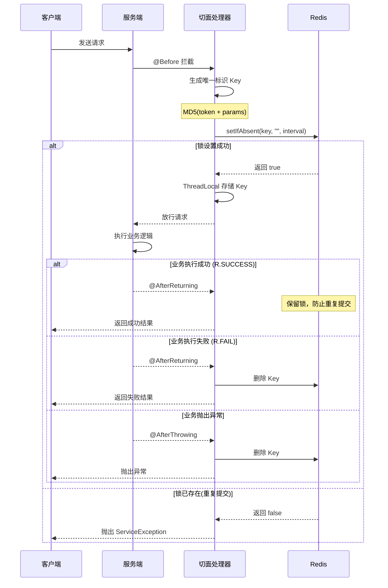

# 幂等处理 (idempotent)

## 概述

幂等功能模块提供基于 Redis 分布式锁机制的接口防重复提交功能，确保在短时间内用户重复点击或网络抖动等场景下，同一请求只会被处理一次，有效避免数据重复插入、重复扣款等问题。该模块参考美团 GTIS 防重系统设计理念，结合 Spring AOP 与 Redis 实现企业级幂等性控制方案。

## 核心特性

- **分布式锁机制**：基于 Redis 实现分布式环境下的防重复提交，支持多实例部署
- **智能清理策略**：成功时保留锁定，失败时自动清理，允许重新提交
- **灵活配置**：支持自定义间隔时间、时间单位和提示消息
- **国际化支持**：提示消息支持多语言配置，通过 `{messageKey}` 格式引用
- **参数过滤**：自动过滤文件上传、HTTP 对象等特殊对象，确保唯一标识准确性
- **线程安全**：使用 `ThreadLocal` 确保并发场景下的数据隔离
- **自动装配**：基于 Spring Boot 自动配置，引入依赖即可使用

## 模块架构

### 整体架构图

```
┌─────────────────────────────────────────────────────────────────────┐
│                        应用层 Application                            │
│  ┌──────────────────────────────────────────────────────────────┐  │
│  │                    @RepeatSubmit 注解标记                      │  │
│  │         Controller 方法 → 业务服务 → 数据持久化                  │  │
│  └──────────────────────────────────────────────────────────────┘  │
└─────────────────────────────────────────────────────────────────────┘
                                 ↓
┌─────────────────────────────────────────────────────────────────────┐
│                        切面层 Aspect                                 │
│  ┌──────────────────────────────────────────────────────────────┐  │
│  │                  RepeatSubmitAspect 切面                       │  │
│  │  ┌─────────────┐  ┌─────────────┐  ┌─────────────────────┐  │  │
│  │  │ @Before     │  │@AfterReturn │  │ @AfterThrowing      │  │  │
│  │  │ 请求前检查  │  │ 成功后处理  │  │ 异常后清理          │  │  │
│  │  └─────────────┘  └─────────────┘  └─────────────────────┘  │  │
│  └──────────────────────────────────────────────────────────────┘  │
└─────────────────────────────────────────────────────────────────────┘
                                 ↓
┌─────────────────────────────────────────────────────────────────────┐
│                        工具层 Utils                                  │
│  ┌────────────────┐  ┌────────────────┐  ┌────────────────────┐   │
│  │  RedisUtils    │  │   JsonUtils    │  │   SecureUtil       │   │
│  │  分布式锁操作  │  │  参数序列化    │  │   MD5 哈希计算     │   │
│  └────────────────┘  └────────────────┘  └────────────────────┘   │
└─────────────────────────────────────────────────────────────────────┘
                                 ↓
┌─────────────────────────────────────────────────────────────────────┐
│                       存储层 Storage                                 │
│  ┌──────────────────────────────────────────────────────────────┐  │
│  │                         Redis                                  │  │
│  │     Key: repeat_submit::{uri}{md5(token:params)}              │  │
│  │     Value: ""                                                  │  │
│  │     TTL: interval (毫秒)                                       │  │
│  └──────────────────────────────────────────────────────────────┘  │
└─────────────────────────────────────────────────────────────────────┘
```

### 核心组件

| 组件 | 说明 |
|------|------|
| `@RepeatSubmit` | 防重复提交注解，标记需要幂等控制的方法 |
| `RepeatSubmitAspect` | AOP 切面处理器，实现防重复提交核心逻辑 |
| `IdempotentAutoConfiguration` | 自动配置类，注册切面 Bean |
| `RedisUtils` | Redis 工具类，提供分布式锁操作 |
| `JsonUtils` | JSON 工具类，序列化请求参数 |
| `SecureUtil` | 加密工具类，生成唯一标识哈希值 |

## 工作原理

### 防重复提交流程



### 唯一标识生成规则

防重复提交通过以下信息生成唯一标识：

1. **用户标识**：从请求头中获取 Sa-Token 的 Token 值
2. **请求参数**：序列化后的方法参数（过滤特殊对象）
3. **请求路径**：当前请求的 URI

**Key 生成算法**：

```java
// 1. 获取 Token（用户身份标识）
String token = request.getHeader(SaManager.getConfig().getTokenName());

// 2. 序列化请求参数
String params = argsArrayToString(methodArgs);

// 3. 生成唯一标识
String submitKey = SecureUtil.md5(token + ":" + params);

// 4. 构建完整缓存 Key
String cacheKey = "repeat_submit::" + requestURI + submitKey;
```

**最终 Key 格式**：

```
repeat_submit::/api/user/create{32位MD5哈希值}
```

### ThreadLocal 机制

切面使用 `ThreadLocal` 存储当前请求的 Redis Key，确保多线程环境下的数据隔离：

```java
private static final ThreadLocal<String> KEY_CACHE = new ThreadLocal<>();

// @Before: 存储 Key
KEY_CACHE.set(cacheRepeatKey);

// @AfterReturning/@AfterThrowing: 获取并清理 Key
RedisUtils.deleteObject(KEY_CACHE.get());
KEY_CACHE.remove();  // 防止内存泄漏
```

## 注解详解

### @RepeatSubmit 注解

```java
@Inherited
@Target(ElementType.METHOD)
@Retention(RetentionPolicy.RUNTIME)
@Documented
public @interface RepeatSubmit {

    /**
     * 重复提交检测间隔时间
     * 在此时间内的重复请求将被拦截，默认5000毫秒(5秒)
     */
    int interval() default 5000;

    /**
     * 时间单位
     * 配合 interval 使用，指定时间间隔的单位
     */
    TimeUnit timeUnit() default TimeUnit.MILLISECONDS;

    /**
     * 重复提交时的提示消息
     * 支持国际化配置，格式为 {messageKey}
     */
    String message() default I18nKeys.Request.DUPLICATE_SUBMIT;
}
```

### 注解属性说明

| 属性 | 类型 | 默认值 | 说明 |
|------|------|--------|------|
| `interval` | `int` | `5000` | 重复提交检测间隔时间 |
| `timeUnit` | `TimeUnit` | `MILLISECONDS` | 时间单位枚举 |
| `message` | `String` | `I18nKeys.Request.DUPLICATE_SUBMIT` | 重复提交提示消息，支持 i18n |

### 时间单位支持

| TimeUnit | 说明 | 示例 |
|----------|------|------|
| `MILLISECONDS` | 毫秒（默认） | `interval = 5000` → 5秒 |
| `SECONDS` | 秒 | `interval = 5, timeUnit = SECONDS` → 5秒 |
| `MINUTES` | 分钟 | `interval = 1, timeUnit = MINUTES` → 1分钟 |

::: warning 注意事项
间隔时间不能小于 1 秒（1000毫秒），系统会自动校验并抛出异常：`重复提交间隔时间不能小于'1'秒`
:::

## 使用指南

### 1. 引入依赖

```xml
<dependency>
    <groupId>plus.ruoyi</groupId>
    <artifactId>ruoyi-common-idempotent</artifactId>
</dependency>
```

**间接依赖**（自动引入）：

```xml
<!-- JSON 序列化支持 -->
<dependency>
    <groupId>plus.ruoyi</groupId>
    <artifactId>ruoyi-common-json</artifactId>
</dependency>

<!-- Redis 分布式锁支持 -->
<dependency>
    <groupId>plus.ruoyi</groupId>
    <artifactId>ruoyi-common-redis</artifactId>
</dependency>

<!-- HuTool 加密工具 -->
<dependency>
    <groupId>cn.hutool</groupId>
    <artifactId>hutool-crypto</artifactId>
</dependency>

<!-- Sa-Token 用户标识 -->
<dependency>
    <groupId>cn.dev33</groupId>
    <artifactId>sa-token-core</artifactId>
</dependency>
```

### 2. 基础用法

在需要防重复提交的 Controller 方法上添加 `@RepeatSubmit` 注解：

```java
@RestController
@RequestMapping("/user")
public class UserController {

    @Autowired
    private UserService userService;

    /**
     * 创建用户 - 使用默认配置
     * 默认：5秒内不允许重复提交
     */
    @PostMapping("/create")
    @RepeatSubmit
    public R<Void> createUser(@RequestBody @Validated UserCreateReq req) {
        userService.createUser(req);
        return R.ok();
    }
}
```

### 3. 自定义间隔时间

```java
@RestController
@RequestMapping("/order")
public class OrderController {

    /**
     * 创建订单 - 3秒内不允许重复提交
     */
    @PostMapping("/create")
    @RepeatSubmit(interval = 3, timeUnit = TimeUnit.SECONDS)
    public R<Long> createOrder(@RequestBody @Validated OrderCreateReq req) {
        Long orderId = orderService.createOrder(req);
        return R.ok(orderId);
    }

    /**
     * 支付订单 - 10秒内不允许重复提交（支付场景需要更长保护时间）
     */
    @PostMapping("/pay")
    @RepeatSubmit(interval = 10, timeUnit = TimeUnit.SECONDS)
    public R<Void> payOrder(@RequestBody PaymentReq req) {
        orderService.processPayment(req);
        return R.ok();
    }
}
```

### 4. 自定义提示消息

```java
@RestController
@RequestMapping("/payment")
public class PaymentController {

    /**
     * 处理支付 - 自定义国际化提示消息
     */
    @PostMapping("/process")
    @RepeatSubmit(
        interval = 10,
        timeUnit = TimeUnit.SECONDS,
        message = "{payment.duplicate.submit}"
    )
    public R<Void> processPayment(@RequestBody PaymentReq req) {
        paymentService.process(req);
        return R.ok();
    }

    /**
     * 退款 - 直接指定消息内容
     */
    @PostMapping("/refund")
    @RepeatSubmit(
        interval = 30,
        timeUnit = TimeUnit.SECONDS,
        message = "退款申请正在处理中，请勿重复提交"
    )
    public R<Void> refund(@RequestBody RefundReq req) {
        paymentService.refund(req);
        return R.ok();
    }
}
```

### 5. 国际化消息配置

在国际化资源文件中配置提示消息：

```properties
# messages.properties (默认/中文)
request.control.duplicate.submit=不允许重复提交，请稍候再试
payment.duplicate.submit=支付正在处理中，请勿重复操作

# messages_en.properties (英文)
request.control.duplicate.submit=Duplicate submission is not allowed, please try again later
payment.duplicate.submit=Payment is processing, please do not repeat the operation
```

## 高级特性

### 1. 智能参数过滤

系统会自动过滤以下类型的对象，确保唯一标识的准确性和稳定性：

| 过滤类型 | 说明 |
|----------|------|
| `MultipartFile` | 文件上传对象（包括数组、集合） |
| `HttpServletRequest` | HTTP 请求对象 |
| `HttpServletResponse` | HTTP 响应对象 |
| `BindingResult` | 数据绑定结果对象 |

**过滤逻辑源码**：

```java
public boolean isFilterObject(final Object o) {
    Class<?> clazz = o.getClass();

    // 数组类型检查
    if (clazz.isArray()) {
        return MultipartFile.class.isAssignableFrom(clazz.getComponentType());
    }
    // 集合类型检查
    else if (Collection.class.isAssignableFrom(clazz)) {
        Collection collection = (Collection) o;
        for (Object value : collection) {
            return value instanceof MultipartFile;
        }
    }
    // Map 类型检查
    else if (Map.class.isAssignableFrom(clazz)) {
        Map map = (Map) o;
        for (Object value : map.values()) {
            return value instanceof MultipartFile;
        }
    }

    // 特殊对象类型检查
    return o instanceof MultipartFile
        || o instanceof HttpServletRequest
        || o instanceof HttpServletResponse
        || o instanceof BindingResult;
}
```

**使用示例**：

```java
@PostMapping("/upload")
@RepeatSubmit(interval = 5, timeUnit = TimeUnit.SECONDS)
public R<String> uploadFile(
    @RequestParam("file") MultipartFile file,  // 会被过滤，不参与唯一标识
    @RequestBody FileMetadata metadata         // 参与唯一标识计算
) {
    String url = fileService.upload(file, metadata);
    return R.ok(url);
}
```

### 2. 业务结果智能处理

系统根据业务执行结果智能处理 Redis 缓存：

| 场景 | 返回值 | Redis 处理 | 效果 |
|------|--------|------------|------|
| 业务成功 | `R.ok()` | 保留缓存 | 有效期内不可重复提交 |
| 业务失败 | `R.fail()` | 删除缓存 | 允许立即重新提交 |
| 抛出异常 | Exception | 删除缓存 | 允许立即重新提交 |

**源码实现**：

```java
@AfterReturning(pointcut = "@annotation(repeatSubmit)", returning = "jsonResult")
public void doAfterReturning(JoinPoint joinPoint, RepeatSubmit repeatSubmit, Object jsonResult) {
    if (jsonResult instanceof R<?> r) {
        try {
            // 成功时保留缓存，防止重复提交
            if (r.getCode() == R.SUCCESS) {
                return;
            }
            // 失败时删除缓存，允许重新提交
            RedisUtils.deleteObject(KEY_CACHE.get());
        } finally {
            KEY_CACHE.remove();
        }
    }
}

@AfterThrowing(value = "@annotation(repeatSubmit)", throwing = "e")
public void doAfterThrowing(JoinPoint joinPoint, RepeatSubmit repeatSubmit, Exception e) {
    // 异常时删除缓存，允许重新提交
    RedisUtils.deleteObject(KEY_CACHE.get());
    KEY_CACHE.remove();
}
```

**使用示例**：

```java
@PostMapping("/order")
@RepeatSubmit(interval = 5, timeUnit = TimeUnit.SECONDS)
public R<OrderVO> createOrder(@RequestBody OrderCreateReq req) {
    try {
        OrderVO order = orderService.create(req);
        return R.ok(order);  // 成功：保留缓存，5秒内不可重复提交
    } catch (InsufficientStockException e) {
        return R.fail("库存不足");  // 业务失败：清理缓存，可立即重试
    } catch (Exception e) {
        throw e;  // 异常：清理缓存，可立即重试
    }
}
```

### 3. 与前端防重配合

前端通常也会实现防重复提交机制，后端防重是最后一道防线：

**前端实现**（UniApp/Vue）：

```typescript
// useHttp.ts
const ErrorMsg = {
  REPEAT_SUBMIT: '数据正在处理，请勿重复提交',
}

// 请求去重 Map
const pendingMap = new Map<string, AbortController>()

function addPending(config: RequestConfig) {
  const key = generateKey(config)
  if (pendingMap.has(key)) {
    throw new Error(ErrorMsg.REPEAT_SUBMIT)
  }
  const controller = new AbortController()
  config.signal = controller.signal
  pendingMap.set(key, controller)
}
```

**双重保护机制**：

```
┌─────────────┐     ┌─────────────┐     ┌─────────────┐
│   用户点击   │ ──→ │  前端防重   │ ──→ │  后端防重   │
│             │     │  (即时拦截) │     │ (分布式锁)  │
└─────────────┘     └─────────────┘     └─────────────┘
                         ↓                    ↓
                    快速响应              最终保障
                    用户体验              数据一致性
```

## 配置说明

### 自动配置

模块通过 Spring Boot 自动配置机制启用，无需手动配置：

```java
@AutoConfiguration(after = RedisConfiguration.class)
public class IdempotentAutoConfiguration {

    @Bean
    public RepeatSubmitAspect repeatSubmitAspect() {
        return new RepeatSubmitAspect();
    }
}
```

**配置顺序**：

1. `RedisConfiguration` - Redis 连接配置
2. `IdempotentAutoConfiguration` - 幂等功能配置

### Redis 缓存配置

```yaml
# application.yml
spring:
  data:
    redis:
      host: localhost
      port: 6379
      database: 0
      timeout: 10s
      lettuce:
        pool:
          max-active: 200
          max-wait: -1ms
          max-idle: 10
          min-idle: 0
```

### 日志配置

```yaml
logging:
  level:
    # 开启切面调试日志
    plus.ruoyi.common.idempotent.aspectj.RepeatSubmitAspect: DEBUG
    # 开启 Redis 操作日志
    plus.ruoyi.common.redis: DEBUG
```

## 最佳实践

### 1. 适用场景选择

| 场景 | 推荐间隔 | 说明 |
|------|----------|------|
| 表单提交 | 3-5秒 | 用户注册、信息修改等 |
| 支付操作 | 10-30秒 | 订单支付、余额变动等 |
| 数据创建 | 3-5秒 | 新增记录、文件上传等 |
| 状态变更 | 5-10秒 | 订单确认、审核通过等 |
| 敏感操作 | 30-60秒 | 密码修改、账户注销等 |

### 2. 间隔时间设置

```java
// ✅ 推荐：合理设置间隔时间
@RepeatSubmit(interval = 3, timeUnit = TimeUnit.SECONDS)  // 普通表单
@RepeatSubmit(interval = 10, timeUnit = TimeUnit.SECONDS) // 支付操作
@RepeatSubmit(interval = 30, timeUnit = TimeUnit.SECONDS) // 敏感操作

// ❌ 避免：过短的间隔时间
@RepeatSubmit(interval = 500, timeUnit = TimeUnit.MILLISECONDS)  // 影响用户体验

// ❌ 避免：过长的间隔时间
@RepeatSubmit(interval = 10, timeUnit = TimeUnit.MINUTES)  // 占用 Redis 内存
```

### 3. 异常处理最佳实践

```java
@PostMapping("/order")
@RepeatSubmit(interval = 5, timeUnit = TimeUnit.SECONDS)
public R<OrderVO> createOrder(@RequestBody @Validated OrderCreateReq req) {
    // 业务校验（不需要重试的场景，返回 R.fail）
    if (!productService.checkStock(req.getProductId(), req.getQuantity())) {
        return R.fail("库存不足");  // 允许用户修改数量后重新提交
    }

    // 核心业务（可能需要重试的场景，抛出异常）
    try {
        OrderVO order = orderService.create(req);
        return R.ok(order);
    } catch (OptimisticLockException e) {
        // 乐观锁冲突，允许重试
        throw ServiceException.of("系统繁忙，请重试");
    }
}
```

### 4. 结合事务使用

```java
@PostMapping("/transfer")
@RepeatSubmit(interval = 10, timeUnit = TimeUnit.SECONDS)
@Transactional(rollbackFor = Exception.class)
public R<Void> transfer(@RequestBody TransferReq req) {
    // 事务回滚时，@AfterThrowing 会清理 Redis 缓存
    accountService.transfer(req.getFromId(), req.getToId(), req.getAmount());
    return R.ok();
}
```

### 5. 多端适配

```java
@RestController
@RequestMapping("/api")
public class MultiPlatformController {

    /**
     * Web 端 - 标准间隔
     */
    @PostMapping("/web/submit")
    @RepeatSubmit(interval = 3, timeUnit = TimeUnit.SECONDS)
    public R<Void> webSubmit(@RequestBody FormData data) {
        // Web 端网络稳定，3秒间隔足够
        return R.ok();
    }

    /**
     * 移动端 - 稍长间隔
     */
    @PostMapping("/mobile/submit")
    @RepeatSubmit(interval = 5, timeUnit = TimeUnit.SECONDS)
    public R<Void> mobileSubmit(@RequestBody FormData data) {
        // 移动端网络不稳定，延长间隔
        return R.ok();
    }
}
```

## 监控与调试

### 1. Redis 缓存监控

```bash
# 查看所有防重复提交缓存
redis-cli keys "repeat_submit::*"

# 查看缓存数量
redis-cli keys "repeat_submit::*" | wc -l

# 查看特定缓存的过期时间
redis-cli ttl "repeat_submit::/api/user/create{hash}"

# 删除所有防重复提交缓存（慎用）
redis-cli keys "repeat_submit::*" | xargs redis-cli del
```

### 2. 日志调试

```yaml
logging:
  level:
    plus.ruoyi.common.idempotent.aspectj.RepeatSubmitAspect: DEBUG
```

**日志输出示例**：

```
DEBUG RepeatSubmitAspect - 防重复提交检查: uri=/api/user/create, key=repeat_submit::/api/user/create{md5}
DEBUG RepeatSubmitAspect - 设置防重锁成功: key=repeat_submit::/api/user/create{md5}, interval=5000ms
DEBUG RepeatSubmitAspect - 业务执行成功，保留防重锁
```

### 3. 监控指标

可通过 Micrometer 添加自定义监控指标：

```java
@Aspect
@Component
public class RepeatSubmitMetricsAspect {

    private final MeterRegistry meterRegistry;
    private final Counter repeatSubmitTotal;
    private final Counter repeatSubmitBlocked;

    public RepeatSubmitMetricsAspect(MeterRegistry meterRegistry) {
        this.meterRegistry = meterRegistry;
        this.repeatSubmitTotal = Counter.builder("repeat_submit_total")
            .description("Total repeat submit checks")
            .register(meterRegistry);
        this.repeatSubmitBlocked = Counter.builder("repeat_submit_blocked")
            .description("Blocked repeat submissions")
            .register(meterRegistry);
    }
}
```

## 常见问题

### Q1: 为什么有时候提示重复提交，但我确实只点击了一次？

**可能原因**：

1. 网络延迟导致浏览器/客户端发送了多个请求
2. 浏览器的表单重复提交行为（刷新页面）
3. 前端框架（如 Axios）的重试机制

**解决方案**：

```javascript
// 前端添加防抖处理
import { debounce } from 'lodash'

const handleSubmit = debounce(async (data) => {
  await api.submit(data)
}, 1000, { leading: true, trailing: false })
```

### Q2: 如何处理集群环境下的防重复提交？

**说明**：模块基于 Redis 实现分布式锁，天然支持集群环境，确保多个服务实例间的防重复提交一致性。

**架构示意**：

```
┌──────────────┐     ┌──────────────┐     ┌──────────────┐
│  服务实例 A  │     │  服务实例 B  │     │  服务实例 C  │
└──────┬───────┘     └──────┬───────┘     └──────┬───────┘
       │                    │                    │
       └────────────────────┼────────────────────┘
                            │
                    ┌───────▼───────┐
                    │    Redis      │
                    │  (分布式锁)   │
                    └───────────────┘
```

### Q3: 业务失败后多久可以重新提交？

**说明**：业务失败时会立即清理 Redis 缓存，用户可以马上重新提交。只有业务成功时才会保留缓存直到过期时间。

| 业务结果 | Redis 处理 | 可重新提交时间 |
|----------|------------|----------------|
| 成功 (`R.ok()`) | 保留缓存 | 等待间隔时间过期 |
| 失败 (`R.fail()`) | 删除缓存 | 立即可以 |
| 异常 | 删除缓存 | 立即可以 |

### Q4: 如何自定义唯一标识的生成规则？

**方案1**：继承并重写切面方法

```java
@Aspect
@Component
public class CustomRepeatSubmitAspect extends RepeatSubmitAspect {

    @Override
    protected String generateKey(JoinPoint point, HttpServletRequest request) {
        // 自定义 Key 生成逻辑
        String userId = StpUtil.getLoginIdAsString();
        String method = point.getSignature().getName();
        return "custom_repeat:" + userId + ":" + method;
    }
}
```

**方案2**：基于参数中的特定字段

```java
@PostMapping("/order")
@RepeatSubmit(interval = 5, timeUnit = TimeUnit.SECONDS)
public R<Void> createOrder(@RequestBody OrderReq req) {
    // 使用订单号作为幂等键
    String idempotentKey = "order:" + req.getOrderNo();
    if (!idempotentService.tryLock(idempotentKey, 5, TimeUnit.SECONDS)) {
        return R.fail("订单正在处理中");
    }
    // 业务逻辑
    return R.ok();
}
```

### Q5: 如何排除特定参数不参与唯一标识计算？

**使用场景**：某些参数（如时间戳、随机数）每次请求都不同，会导致防重失效。

**解决方案**：

```java
public class OrderReq {
    private Long productId;
    private Integer quantity;

    @JsonIgnore  // 不参与 JSON 序列化，从而不影响唯一标识
    private Long timestamp;

    @JsonIgnore
    private String nonce;
}
```

### Q6: 防重复提交与限流的区别？

| 特性 | 防重复提交 (Idempotent) | 限流 (RateLimiter) |
|------|------------------------|-------------------|
| 目的 | 防止同一请求重复执行 | 限制请求频率 |
| 粒度 | 用户 + 参数 + 接口 | 用户/IP/接口 |
| 时间窗口 | 固定间隔 | 滑动窗口/令牌桶 |
| 返回码 | 业务错误 | 429 Too Many Requests |
| 使用场景 | 表单提交、支付 | API 保护、防刷 |

**组合使用示例**：

```java
@PostMapping("/sensitive-operation")
@RateLimiter(count = 10, time = 60)  // 1分钟内最多10次
@RepeatSubmit(interval = 5, timeUnit = TimeUnit.SECONDS)  // 5秒内不可重复
public R<Void> sensitiveOperation(@RequestBody OperationReq req) {
    return R.ok();
}
```

## 扩展阅读

### 幂等性设计原则

幂等性（Idempotency）是指对同一操作发起多次请求，其产生的效果与一次请求相同。在分布式系统中，幂等性设计是保证数据一致性的重要手段。

**常见幂等方案对比**：

| 方案 | 优点 | 缺点 | 适用场景 |
|------|------|------|----------|
| Token 机制 | 精确控制 | 需要额外请求获取 Token | 表单提交 |
| 乐观锁 | 无需额外存储 | 并发冲突时重试 | 数据更新 |
| 唯一索引 | 数据库保证 | 仅适用于插入 | 数据创建 |
| Redis 锁 | 分布式支持 | 依赖 Redis | 通用场景 |
| 业务状态机 | 业务保证 | 实现复杂 | 流程控制 |

### 与 GTIS 防重系统对比

本模块参考美团 GTIS 防重系统设计，主要差异：

| 特性 | GTIS | 本模块 |
|------|------|--------|
| 存储 | Tair/Redis | Redis |
| 唯一标识 | 业务自定义 | Token + 参数 + URI |
| 结果处理 | 状态码判断 | `R<T>` 统一响应 |
| 部署方式 | 独立服务 | 嵌入式模块 |
