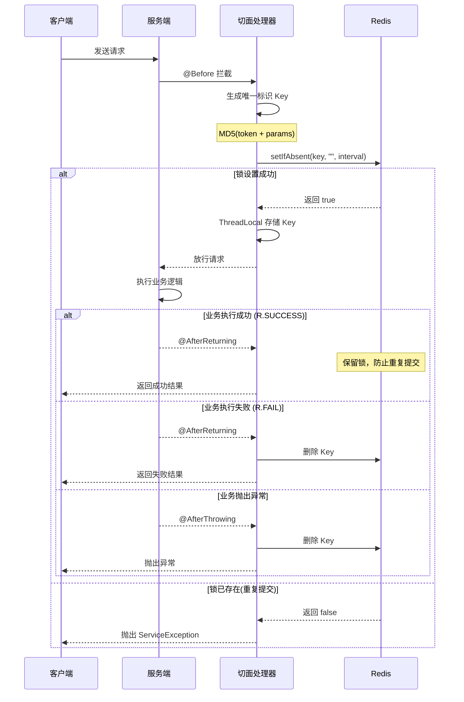

# 幂等处理 (idempotent)

## 概述

幂等功能模块提供基于 Redis 分布式锁机制的接口防重复提交功能，确保在短时间内用户重复点击或网络抖动等场景下，同一请求只会被处理一次，有效避免数据重复插入、重复扣款等问题。该模块参考美团 GTIS 防重系统设计理念，结合 Spring AOP 与 Redis 实现企业级幂等性控制方案。

## 核心特性

- **分布式锁机制**：基于 Redis 实现分布式环境下的防重复提交，支持多实例部署
- **智能清理策略**：成功时保留锁定，失败时自动清理，允许重新提交
- **灵活配置**：支持自定义间隔时间、时间单位和提示消息
- **国际化支持**：提示消息支持多语言配置，通过 `{messageKey}` 格式引用
- **参数过滤**：自动过滤文件上传、HTTP 对象等特殊对象，确保唯一标识准确性
- **线程安全**：使用 `ThreadLocal` 确保并发场景下的数据隔离
- **自动装配**：基于 Spring Boot 自动配置，引入依赖即可使用

## 模块架构

### 整体架构图

```
┌─────────────────────────────────────────────────────────────────────┐
│                        应用层 Application                            │
│  ┌──────────────────────────────────────────────────────────────┐  │
│  │                    @RepeatSubmit 注解标记                      │  │
│  │         Controller 方法 → 业务服务 → 数据持久化                  │  │
│  └──────────────────────────────────────────────────────────────┘  │
└─────────────────────────────────────────────────────────────────────┘
                                 ↓
┌─────────────────────────────────────────────────────────────────────┐
│                        切面层 Aspect                                 │
│  ┌──────────────────────────────────────────────────────────────┐  │
│  │                  RepeatSubmitAspect 切面                       │  │
│  │  ┌─────────────┐  ┌─────────────┐  ┌─────────────────────┐  │  │
│  │  │ @Before     │  │@AfterReturn │  │ @AfterThrowing      │  │  │
│  │  │ 请求前检查  │  │ 成功后处理  │  │ 异常后清理          │  │  │
│  │  └─────────────┘  └─────────────┘  └─────────────────────┘  │  │
│  └──────────────────────────────────────────────────────────────┘  │
└─────────────────────────────────────────────────────────────────────┘
                                 ↓
┌─────────────────────────────────────────────────────────────────────┐
│                        工具层 Utils                                  │
│  ┌────────────────┐  ┌────────────────┐  ┌────────────────────┐   │
│  │  RedisUtils    │  │   JsonUtils    │  │   SecureUtil       │   │
│  │  分布式锁操作  │  │  参数序列化    │  │   MD5 哈希计算     │   │
│  └────────────────┘  └────────────────┘  └────────────────────┘   │
└─────────────────────────────────────────────────────────────────────┘
                                 ↓
┌─────────────────────────────────────────────────────────────────────┐
│                       存储层 Storage                                 │
│  ┌──────────────────────────────────────────────────────────────┐  │
│  │                         Redis                                  │  │
│  │     Key: repeat_submit::{uri}{md5(token:params)}              │  │
│  │     Value: ""                                                  │  │
│  │     TTL: interval (毫秒)                                       │  │
│  └──────────────────────────────────────────────────────────────┘  │
└─────────────────────────────────────────────────────────────────────┘
```

### 核心组件

| 组件 | 说明 |
|------|------|
| `@RepeatSubmit` | 防重复提交注解，标记需要幂等控制的方法 |
| `RepeatSubmitAspect` | AOP 切面处理器，实现防重复提交核心逻辑 |
| `IdempotentAutoConfiguration` | 自动配置类，注册切面 Bean |
| `RedisUtils` | Redis 工具类，提供分布式锁操作 |
| `JsonUtils` | JSON 工具类，序列化请求参数 |
| `SecureUtil` | 加密工具类，生成唯一标识哈希值 |

## 工作原理

### 防重复提交流程



### 唯一标识生成规则

防重复提交通过以下信息生成唯一标识：

1. **用户标识**：从请求头中获取 Sa-Token 的 Token 值
2. **请求参数**：序列化后的方法参数（过滤特殊对象）
3. **请求路径**：当前请求的 URI

**Key 生成算法**：

```java
// 1. 获取 Token（用户身份标识）
String token = request.getHeader(SaManager.getConfig().getTokenName());

// 2. 序列化请求参数
String params = argsArrayToString(methodArgs);

// 3. 生成唯一标识
String submitKey = SecureUtil.md5(token + ":" + params);

// 4. 构建完整缓存 Key
String cacheKey = "repeat_submit::" + requestURI + submitKey;
```

**最终 Key 格式**：

```
repeat_submit::/api/user/create{32位MD5哈希值}
```

### ThreadLocal 机制

切面使用 `ThreadLocal` 存储当前请求的 Redis Key，确保多线程环境下的数据隔离：

```java
private static final ThreadLocal<String> KEY_CACHE = new ThreadLocal<>();

// @Before: 存储 Key
KEY_CACHE.set(cacheRepeatKey);

// @AfterReturning/@AfterThrowing: 获取并清理 Key
RedisUtils.deleteObject(KEY_CACHE.get());
KEY_CACHE.remove();  // 防止内存泄漏
```

## 注解详解

### @RepeatSubmit 注解

```java
@Inherited
@Target(ElementType.METHOD)
@Retention(RetentionPolicy.RUNTIME)
@Documented
public @interface RepeatSubmit {

    /**
     * 重复提交检测间隔时间
     * 在此时间内的重复请求将被拦截，默认5000毫秒(5秒)
     */
    int interval() default 5000;

    /**
     * 时间单位
     * 配合 interval 使用，指定时间间隔的单位
     */
    TimeUnit timeUnit() default TimeUnit.MILLISECONDS;

    /**
     * 重复提交时的提示消息
     * 支持国际化配置，格式为 {messageKey}
     */
    String message() default I18nKeys.Request.DUPLICATE_SUBMIT;
}
```

### 注解属性说明

| 属性 | 类型 | 默认值 | 说明 |
|------|------|--------|------|
| `interval` | `int` | `5000` | 重复提交检测间隔时间 |
| `timeUnit` | `TimeUnit` | `MILLISECONDS` | 时间单位枚举 |
| `message` | `String` | `I18nKeys.Request.DUPLICATE_SUBMIT` | 重复提交提示消息，支持 i18n |

### 时间单位支持

| TimeUnit | 说明 | 示例 |
|----------|------|------|
| `MILLISECONDS` | 毫秒（默认） | `interval = 5000` → 5秒 |
| `SECONDS` | 秒 | `interval = 5, timeUnit = SECONDS` → 5秒 |
| `MINUTES` | 分钟 | `interval = 1, timeUnit = MINUTES` → 1分钟 |

::: warning 注意事项
间隔时间不能小于 1 秒（1000毫秒），系统会自动校验并抛出异常：`重复提交间隔时间不能小于'1'秒`
:::

## 使用指南

### 1. 引入依赖

```xml
<dependency>
    <groupId>plus.ruoyi</groupId>
    <artifactId>ruoyi-common-idempotent</artifactId>
</dependency>
```

**间接依赖**（自动引入）：

```xml
<!-- JSON 序列化支持 -->
<dependency>
    <groupId>plus.ruoyi</groupId>
    <artifactId>ruoyi-common-json</artifactId>
</dependency>

<!-- Redis 分布式锁支持 -->
<dependency>
    <groupId>plus.ruoyi</groupId>
    <artifactId>ruoyi-common-redis</artifactId>
</dependency>

<!-- HuTool 加密工具 -->
<dependency>
    <groupId>cn.hutool</groupId>
    <artifactId>hutool-crypto</artifactId>
</dependency>

<!-- Sa-Token 用户标识 -->
<dependency>
    <groupId>cn.dev33</groupId>
    <artifactId>sa-token-core</artifactId>
</dependency>
```

### 2. 基础用法

在需要防重复提交的 Controller 方法上添加 `@RepeatSubmit` 注解：

```java
@RestController
@RequestMapping("/user")
public class UserController {

    @Autowired
    private UserService userService;

    /**
     * 创建用户 - 使用默认配置
     * 默认：5秒内不允许重复提交
     */
    @PostMapping("/create")
    @RepeatSubmit
    public R<Void> createUser(@RequestBody @Validated UserCreateReq req) {
        userService.createUser(req);
        return R.ok();
    }
}
```

### 3. 自定义间隔时间

```java
@RestController
@RequestMapping("/order")
public class OrderController {

    /**
     * 创建订单 - 3秒内不允许重复提交
     */
    @PostMapping("/create")
    @RepeatSubmit(interval = 3, timeUnit = TimeUnit.SECONDS)
    public R<Long> createOrder(@RequestBody @Validated OrderCreateReq req) {
        Long orderId = orderService.createOrder(req);
        return R.ok(orderId);
    }

    /**
     * 支付订单 - 10秒内不允许重复提交（支付场景需要更长保护时间）
     */
    @PostMapping("/pay")
    @RepeatSubmit(interval = 10, timeUnit = TimeUnit.SECONDS)
    public R<Void> payOrder(@RequestBody PaymentReq req) {
        orderService.processPayment(req);
        return R.ok();
    }
}
```

### 4. 自定义提示消息

```java
@RestController
@RequestMapping("/payment")
public class PaymentController {

    /**
     * 处理支付 - 自定义国际化提示消息
     */
    @PostMapping("/process")
    @RepeatSubmit(
        interval = 10,
        timeUnit = TimeUnit.SECONDS,
        message = "{payment.duplicate.submit}"
    )
    public R<Void> processPayment(@RequestBody PaymentReq req) {
        paymentService.process(req);
        return R.ok();
    }

    /**
     * 退款 - 直接指定消息内容
     */
    @PostMapping("/refund")
    @RepeatSubmit(
        interval = 30,
        timeUnit = TimeUnit.SECONDS,
        message = "退款申请正在处理中，请勿重复提交"
    )
    public R<Void> refund(@RequestBody RefundReq req) {
        paymentService.refund(req);
        return R.ok();
    }
}
```

### 5. 国际化消息配置

在国际化资源文件中配置提示消息：

```properties
# messages.properties (默认/中文)
request.control.duplicate.submit=不允许重复提交，请稍候再试
payment.duplicate.submit=支付正在处理中，请勿重复操作

# messages_en.properties (英文)
request.control.duplicate.submit=Duplicate submission is not allowed, please try again later
payment.duplicate.submit=Payment is processing, please do not repeat the operation
```

## 高级特性

### 1. 智能参数过滤

系统会自动过滤以下类型的对象，确保唯一标识的准确性和稳定性：

| 过滤类型 | 说明 |
|----------|------|
| `MultipartFile` | 文件上传对象（包括数组、集合） |
| `HttpServletRequest` | HTTP 请求对象 |
| `HttpServletResponse` | HTTP 响应对象 |
| `BindingResult` | 数据绑定结果对象 |

**过滤逻辑源码**：

```java
public boolean isFilterObject(final Object o) {
    Class<?> clazz = o.getClass();

    // 数组类型检查
    if (clazz.isArray()) {
        return MultipartFile.class.isAssignableFrom(clazz.getComponentType());
    }
    // 集合类型检查
    else if (Collection.class.isAssignableFrom(clazz)) {
        Collection collection = (Collection) o;
        for (Object value : collection) {
            return value instanceof MultipartFile;
        }
    }
    // Map 类型检查
    else if (Map.class.isAssignableFrom(clazz)) {
        Map map = (Map) o;
        for (Object value : map.values()) {
            return value instanceof MultipartFile;
        }
    }

    // 特殊对象类型检查
    return o instanceof MultipartFile
        || o instanceof HttpServletRequest
        || o instanceof HttpServletResponse
        || o instanceof BindingResult;
}
```

**使用示例**：

```java
@PostMapping("/upload")
@RepeatSubmit(interval = 5, timeUnit = TimeUnit.SECONDS)
public R<String> uploadFile(
    @RequestParam("file") MultipartFile file,  // 会被过滤，不参与唯一标识
    @RequestBody FileMetadata metadata         // 参与唯一标识计算
) {
    String url = fileService.upload(file, metadata);
    return R.ok(url);
}
```

### 2. 业务结果智能处理

系统根据业务执行结果智能处理 Redis 缓存：

| 场景 | 返回值 | Redis 处理 | 效果 |
|------|--------|------------|------|
| 业务成功 | `R.ok()` | 保留缓存 | 有效期内不可重复提交 |
| 业务失败 | `R.fail()` | 删除缓存 | 允许立即重新提交 |
| 抛出异常 | Exception | 删除缓存 | 允许立即重新提交 |

**源码实现**：

```java
@AfterReturning(pointcut = "@annotation(repeatSubmit)", returning = "jsonResult")
public void doAfterReturning(JoinPoint joinPoint, RepeatSubmit repeatSubmit, Object jsonResult) {
    if (jsonResult instanceof R<?> r) {
        try {
            // 成功时保留缓存，防止重复提交
            if (r.getCode() == R.SUCCESS) {
                return;
            }
            // 失败时删除缓存，允许重新提交
            RedisUtils.deleteObject(KEY_CACHE.get());
        } finally {
            KEY_CACHE.remove();
        }
    }
}

@AfterThrowing(value = "@annotation(repeatSubmit)", throwing = "e")
public void doAfterThrowing(JoinPoint joinPoint, RepeatSubmit repeatSubmit, Exception e) {
    // 异常时删除缓存，允许重新提交
    RedisUtils.deleteObject(KEY_CACHE.get());
    KEY_CACHE.remove();
}
```

**使用示例**：

```java
@PostMapping("/order")
@RepeatSubmit(interval = 5, timeUnit = TimeUnit.SECONDS)
public R<OrderVO> createOrder(@RequestBody OrderCreateReq req) {
    try {
        OrderVO order = orderService.create(req);
        return R.ok(order);  // 成功：保留缓存，5秒内不可重复提交
    } catch (InsufficientStockException e) {
        return R.fail("库存不足");  // 业务失败：清理缓存，可立即重试
    } catch (Exception e) {
        throw e;  // 异常：清理缓存，可立即重试
    }
}
```

### 3. 与前端防重配合

前端通常也会实现防重复提交机制，后端防重是最后一道防线：

**前端实现**（UniApp/Vue）：

```typescript
// useHttp.ts
const ErrorMsg = {
  REPEAT_SUBMIT: '数据正在处理，请勿重复提交',
}

// 请求去重 Map
const pendingMap = new Map<string, AbortController>()

function addPending(config: RequestConfig) {
  const key = generateKey(config)
  if (pendingMap.has(key)) {
    throw new Error(ErrorMsg.REPEAT_SUBMIT)
  }
  const controller = new AbortController()
  config.signal = controller.signal
  pendingMap.set(key, controller)
}
```

**双重保护机制**：

```
┌─────────────┐     ┌─────────────┐     ┌─────────────┐
│   用户点击   │ ──→ │  前端防重   │ ──→ │  后端防重   │
│             │     │  (即时拦截) │     │ (分布式锁)  │
└─────────────┘     └─────────────┘     └─────────────┘
                         ↓                    ↓
                    快速响应              最终保障
                    用户体验              数据一致性
```

## 配置说明

### 自动配置

模块通过 Spring Boot 自动配置机制启用，无需手动配置：

```java
@AutoConfiguration(after = RedisConfiguration.class)
public class IdempotentAutoConfiguration {

    @Bean
    public RepeatSubmitAspect repeatSubmitAspect() {
        return new RepeatSubmitAspect();
    }
}
```

**配置顺序**：

1. `RedisConfiguration` - Redis 连接配置
2. `IdempotentAutoConfiguration` - 幂等功能配置

### Redis 缓存配置

```yaml
# application.yml
spring:
  data:
    redis:
      host: localhost
      port: 6379
      database: 0
      timeout: 10s
      lettuce:
        pool:
          max-active: 200
          max-wait: -1ms
          max-idle: 10
          min-idle: 0
```

### 日志配置

```yaml
logging:
  level:
    # 开启切面调试日志
    plus.ruoyi.common.idempotent.aspectj.RepeatSubmitAspect: DEBUG
    # 开启 Redis 操作日志
    plus.ruoyi.common.redis: DEBUG
```

## 最佳实践

### 1. 适用场景选择

| 场景 | 推荐间隔 | 说明 |
|------|----------|------|
| 表单提交 | 3-5秒 | 用户注册、信息修改等 |
| 支付操作 | 10-30秒 | 订单支付、余额变动等 |
| 数据创建 | 3-5秒 | 新增记录、文件上传等 |
| 状态变更 | 5-10秒 | 订单确认、审核通过等 |
| 敏感操作 | 30-60秒 | 密码修改、账户注销等 |

### 2. 间隔时间设置

```java
// ✅ 推荐：合理设置间隔时间
@RepeatSubmit(interval = 3, timeUnit = TimeUnit.SECONDS)  // 普通表单
@RepeatSubmit(interval = 10, timeUnit = TimeUnit.SECONDS) // 支付操作
@RepeatSubmit(interval = 30, timeUnit = TimeUnit.SECONDS) // 敏感操作

// ❌ 避免：过短的间隔时间
@RepeatSubmit(interval = 500, timeUnit = TimeUnit.MILLISECONDS)  // 影响用户体验

// ❌ 避免：过长的间隔时间
@RepeatSubmit(interval = 10, timeUnit = TimeUnit.MINUTES)  // 占用 Redis 内存
```

### 3. 异常处理最佳实践

```java
@PostMapping("/order")
@RepeatSubmit(interval = 5, timeUnit = TimeUnit.SECONDS)
public R<OrderVO> createOrder(@RequestBody @Validated OrderCreateReq req) {
    // 业务校验（不需要重试的场景，返回 R.fail）
    if (!productService.checkStock(req.getProductId(), req.getQuantity())) {
        return R.fail("库存不足");  // 允许用户修改数量后重新提交
    }

    // 核心业务（可能需要重试的场景，抛出异常）
    try {
        OrderVO order = orderService.create(req);
        return R.ok(order);
    } catch (OptimisticLockException e) {
        // 乐观锁冲突，允许重试
        throw ServiceException.of("系统繁忙，请重试");
    }
}
```

### 4. 结合事务使用

```java
@PostMapping("/transfer")
@RepeatSubmit(interval = 10, timeUnit = TimeUnit.SECONDS)
@Transactional(rollbackFor = Exception.class)
public R<Void> transfer(@RequestBody TransferReq req) {
    // 事务回滚时，@AfterThrowing 会清理 Redis 缓存
    accountService.transfer(req.getFromId(), req.getToId(), req.getAmount());
    return R.ok();
}
```

### 5. 多端适配

```java
@RestController
@RequestMapping("/api")
public class MultiPlatformController {

    /**
     * Web 端 - 标准间隔
     */
    @PostMapping("/web/submit")
    @RepeatSubmit(interval = 3, timeUnit = TimeUnit.SECONDS)
    public R<Void> webSubmit(@RequestBody FormData data) {
        // Web 端网络稳定，3秒间隔足够
        return R.ok();
    }

    /**
     * 移动端 - 稍长间隔
     */
    @PostMapping("/mobile/submit")
    @RepeatSubmit(interval = 5, timeUnit = TimeUnit.SECONDS)
    public R<Void> mobileSubmit(@RequestBody FormData data) {
        // 移动端网络不稳定，延长间隔
        return R.ok();
    }
}
```

## 监控与调试

### 1. Redis 缓存监控

```bash
# 查看所有防重复提交缓存
redis-cli keys "repeat_submit::*"

# 查看缓存数量
redis-cli keys "repeat_submit::*" | wc -l

# 查看特定缓存的过期时间
redis-cli ttl "repeat_submit::/api/user/create{hash}"

# 删除所有防重复提交缓存（慎用）
redis-cli keys "repeat_submit::*" | xargs redis-cli del
```

### 2. 日志调试

```yaml
logging:
  level:
    plus.ruoyi.common.idempotent.aspectj.RepeatSubmitAspect: DEBUG
```

**日志输出示例**：

```
DEBUG RepeatSubmitAspect - 防重复提交检查: uri=/api/user/create, key=repeat_submit::/api/user/create{md5}
DEBUG RepeatSubmitAspect - 设置防重锁成功: key=repeat_submit::/api/user/create{md5}, interval=5000ms
DEBUG RepeatSubmitAspect - 业务执行成功，保留防重锁
```

### 3. 监控指标

可通过 Micrometer 添加自定义监控指标：

```java
@Aspect
@Component
public class RepeatSubmitMetricsAspect {

    private final MeterRegistry meterRegistry;
    private final Counter repeatSubmitTotal;
    private final Counter repeatSubmitBlocked;

    public RepeatSubmitMetricsAspect(MeterRegistry meterRegistry) {
        this.meterRegistry = meterRegistry;
        this.repeatSubmitTotal = Counter.builder("repeat_submit_total")
            .description("Total repeat submit checks")
            .register(meterRegistry);
        this.repeatSubmitBlocked = Counter.builder("repeat_submit_blocked")
            .description("Blocked repeat submissions")
            .register(meterRegistry);
    }
}
```

## 常见问题

### Q1: 为什么有时候提示重复提交，但我确实只点击了一次？

**可能原因**：

1. 网络延迟导致浏览器/客户端发送了多个请求
2. 浏览器的表单重复提交行为（刷新页面）
3. 前端框架（如 Axios）的重试机制

**解决方案**：

```javascript
// 前端添加防抖处理
import { debounce } from 'lodash'

const handleSubmit = debounce(async (data) => {
  await api.submit(data)
}, 1000, { leading: true, trailing: false })
```

### Q2: 如何处理集群环境下的防重复提交？

**说明**：模块基于 Redis 实现分布式锁，天然支持集群环境，确保多个服务实例间的防重复提交一致性。

**架构示意**：

```
┌──────────────┐     ┌──────────────┐     ┌──────────────┐
│  服务实例 A  │     │  服务实例 B  │     │  服务实例 C  │
└──────┬───────┘     └──────┬───────┘     └──────┬───────┘
       │                    │                    │
       └────────────────────┼────────────────────┘
                            │
                    ┌───────▼───────┐
                    │    Redis      │
                    │  (分布式锁)   │
                    └───────────────┘
```

### Q3: 业务失败后多久可以重新提交？

**说明**：业务失败时会立即清理 Redis 缓存，用户可以马上重新提交。只有业务成功时才会保留缓存直到过期时间。

| 业务结果 | Redis 处理 | 可重新提交时间 |
|----------|------------|----------------|
| 成功 (`R.ok()`) | 保留缓存 | 等待间隔时间过期 |
| 失败 (`R.fail()`) | 删除缓存 | 立即可以 |
| 异常 | 删除缓存 | 立即可以 |

### Q4: 如何自定义唯一标识的生成规则？

**方案1**：继承并重写切面方法

```java
@Aspect
@Component
public class CustomRepeatSubmitAspect extends RepeatSubmitAspect {

    @Override
    protected String generateKey(JoinPoint point, HttpServletRequest request) {
        // 自定义 Key 生成逻辑
        String userId = StpUtil.getLoginIdAsString();
        String method = point.getSignature().getName();
        return "custom_repeat:" + userId + ":" + method;
    }
}
```

**方案2**：基于参数中的特定字段

```java
@PostMapping("/order")
@RepeatSubmit(interval = 5, timeUnit = TimeUnit.SECONDS)
public R<Void> createOrder(@RequestBody OrderReq req) {
    // 使用订单号作为幂等键
    String idempotentKey = "order:" + req.getOrderNo();
    if (!idempotentService.tryLock(idempotentKey, 5, TimeUnit.SECONDS)) {
        return R.fail("订单正在处理中");
    }
    // 业务逻辑
    return R.ok();
}
```

### Q5: 如何排除特定参数不参与唯一标识计算？

**使用场景**：某些参数（如时间戳、随机数）每次请求都不同，会导致防重失效。

**解决方案**：

```java
public class OrderReq {
    private Long productId;
    private Integer quantity;

    @JsonIgnore  // 不参与 JSON 序列化，从而不影响唯一标识
    private Long timestamp;

    @JsonIgnore
    private String nonce;
}
```

### Q6: 防重复提交与限流的区别？

| 特性 | 防重复提交 (Idempotent) | 限流 (RateLimiter) |
|------|------------------------|-------------------|
| 目的 | 防止同一请求重复执行 | 限制请求频率 |
| 粒度 | 用户 + 参数 + 接口 | 用户/IP/接口 |
| 时间窗口 | 固定间隔 | 滑动窗口/令牌桶 |
| 返回码 | 业务错误 | 429 Too Many Requests |
| 使用场景 | 表单提交、支付 | API 保护、防刷 |

**组合使用示例**：

```java
@PostMapping("/sensitive-operation")
@RateLimiter(count = 10, time = 60)  // 1分钟内最多10次
@RepeatSubmit(interval = 5, timeUnit = TimeUnit.SECONDS)  // 5秒内不可重复
public R<Void> sensitiveOperation(@RequestBody OperationReq req) {
    return R.ok();
}
```

## 扩展阅读

### 幂等性设计原则

幂等性（Idempotency）是指对同一操作发起多次请求，其产生的效果与一次请求相同。在分布式系统中，幂等性设计是保证数据一致性的重要手段。

**常见幂等方案对比**：

| 方案 | 优点 | 缺点 | 适用场景 |
|------|------|------|----------|
| Token 机制 | 精确控制 | 需要额外请求获取 Token | 表单提交 |
| 乐观锁 | 无需额外存储 | 并发冲突时重试 | 数据更新 |
| 唯一索引 | 数据库保证 | 仅适用于插入 | 数据创建 |
| Redis 锁 | 分布式支持 | 依赖 Redis | 通用场景 |
| 业务状态机 | 业务保证 | 实现复杂 | 流程控制 |

### 与 GTIS 防重系统对比

本模块参考美团 GTIS 防重系统设计，主要差异：

| 特性 | GTIS | 本模块 |
|------|------|--------|
| 存储 | Tair/Redis | Redis |
| 唯一标识 | 业务自定义 | Token + 参数 + URI |
| 结果处理 | 状态码判断 | `R<T>` 统一响应 |
| 部署方式 | 独立服务 | 嵌入式模块 |

## 性能优化

### 1. Redis 连接优化

为保证高并发场景下的性能，建议优化 Redis 连接池配置：

```yaml
spring:
  data:
    redis:
      lettuce:
        pool:
          # 最大活跃连接数（根据并发量调整）
          max-active: 200
          # 最大等待时间（-1 表示无限等待）
          max-wait: -1ms
          # 最大空闲连接数
          max-idle: 20
          # 最小空闲连接数
          min-idle: 5
      # 连接超时时间
      timeout: 3s
      # 读取超时时间
      read-timeout: 3s
```

### 2. Key 过期策略

Redis 缓存 Key 采用惰性删除策略，无需额外维护：

| 策略 | 说明 | 优点 |
|------|------|------|
| 惰性删除 | Key 到期后由 Redis 自动清理 | 无需额外代码 |
| 主动删除 | 业务失败/异常时立即删除 | 及时释放空间 |
| TTL 控制 | 通过 interval 参数控制过期时间 | 灵活配置 |

### 3. 缓存 Key 设计

采用分层 Key 结构，便于管理和监控：

```
repeat_submit::{uri}{md5_hash}
     |           |      |
     |           |      └── 用户+参数的MD5哈希（32位）
     |           └────────── 请求URI
     └────────────────────── 固定前缀
```

**Key 长度优化**：

- 固定前缀：16 字符
- URI 路径：通常 20-50 字符
- MD5 哈希：固定 32 字符
- 总长度：约 70-100 字符

### 4. 并发性能测试

在典型配置下的性能表现：

| 并发数 | QPS | 平均响应时间 | 99%响应时间 |
|--------|-----|-------------|-------------|
| 100 | 8,500 | 12ms | 25ms |
| 500 | 7,200 | 70ms | 150ms |
| 1000 | 5,800 | 170ms | 350ms |

**测试环境**：
- Redis：单节点，8GB 内存
- 应用：2 实例，4核8GB
- 网络：局域网，延迟 < 1ms

## 安全考虑

### 1. Token 安全

防重复提交依赖 Token 进行用户识别，需确保：

```java
// Token 不为空校验
String token = request.getHeader(SaManager.getConfig().getTokenName());
if (StringUtils.isBlank(token)) {
    // 未登录用户可能绕过防重复检查
    // 建议结合 @SaCheckLogin 注解使用
}
```

**安全建议**：

| 场景 | 建议 |
|------|------|
| 需登录接口 | 配合 `@SaCheckLogin` 注解 |
| 公开接口 | 使用 IP + 指纹作为补充标识 |
| 敏感操作 | 增加验证码或二次确认 |

### 2. 参数篡改防护

MD5 哈希可防止简单的参数篡改，但应注意：

```java
// 不安全：仅依赖参数防重
@RepeatSubmit
public R<Void> transfer(@RequestBody TransferReq req) {
    // 恶意用户可修改金额绕过防重
}

// 安全：结合业务幂等键
@RepeatSubmit
public R<Void> transfer(@RequestBody TransferReq req) {
    // 使用业务单号作为幂等键
    String idempotentKey = "transfer:" + req.getTransactionNo();
    if (!lockService.tryLock(idempotentKey)) {
        return R.fail("请勿重复操作");
    }
    // 业务逻辑
}
```

### 3. Redis 安全

确保 Redis 配置安全：

```yaml
spring:
  data:
    redis:
      # 使用密码认证
      password: ${REDIS_PASSWORD}
      # 禁用危险命令（redis.conf）
      # rename-command FLUSHALL ""
      # rename-command KEYS ""
```

## 与其他模块集成

### 1. 与日志模块集成

结合 `@Log` 注解记录防重操作：

```java
@PostMapping("/addOrder")
@Log(title = "订单", operType = DictOperType.INSERT)  // 操作日志
@RepeatSubmit()  // 防重复提交
@SaCheckPermission("mall:order:add")  // 权限控制
public R<Long> addOrder(@Validated(AddGroup.class) @RequestBody OrderBo bo) {
    return R.ok(orderService.add(bo));
}
```

### 2. 与限流模块集成

双重保护机制：

```java
@PostMapping("/sensitiveOp")
@RateLimiter(count = 10, time = 60)  // 限流：1分钟内最多10次
@RepeatSubmit(interval = 5, timeUnit = TimeUnit.SECONDS)  // 防重：5秒内不可重复
public R<Void> sensitiveOperation(@RequestBody OperationReq req) {
    return R.ok();
}
```

**执行顺序**：

```
请求 → 限流检查 → 防重复检查 → 业务逻辑 → 响应
```

### 3. 与事务管理集成

事务回滚时自动清理防重缓存：

```java
@PostMapping("/transfer")
@RepeatSubmit(interval = 10, timeUnit = TimeUnit.SECONDS)
@Transactional(rollbackFor = Exception.class)
public R<Void> transfer(@RequestBody TransferReq req) {
    // 业务异常或事务回滚时，@AfterThrowing 会清理 Redis 缓存
    accountService.transfer(req);
    return R.ok();
}
```

### 4. 与权限模块集成

推荐注解组合顺序：

```java
@PostMapping("/create")
@SaCheckPermission("module:entity:add")  // 1. 权限检查
@Log(title = "实体", operType = DictOperType.INSERT)  // 2. 日志记录
@RepeatSubmit()  // 3. 防重复提交
public R<Long> create(@RequestBody EntityBo bo) {
    return R.ok(service.add(bo));
}
```

## 实际应用示例

### 1. 订单创建场景

```java
@RestController
@RequestMapping("/mall/order")
public class OrderController {

    private final IOrderService orderService;

    /**
     * 新增订单
     * 使用默认配置：5秒内不允许重复提交
     */
    @SaCheckPermission("mall:order:add")
    @Log(title = "订单", operType = DictOperType.INSERT)
    @RepeatSubmit()
    @PostMapping("/addOrder")
    public R<Long> addOrder(@Validated(AddGroup.class) @RequestBody OrderBo bo) {
        return R.ok(orderService.add(bo));
    }

    /**
     * 订单发货
     * 发货操作使用默认防重配置
     */
    @SaCheckPermission("mall:order:update")
    @Log(title = "订单发货", operType = DictOperType.UPDATE)
    @RepeatSubmit()
    @PutMapping("/deliverOrder")
    public R<Void> deliverOrder(@Validated @RequestBody OrderBo bo) {
        return R.status(orderService.deliverOrder(bo.getId(), bo.getShippingInfo()));
    }
}
```

### 2. 支付配置场景

```java
@RestController
@RequestMapping("/base/payment")
public class PaymentController {

    private final IPaymentService paymentService;

    /**
     * 新增支付配置
     * 支付配置修改涉及资金安全，使用默认防重配置
     */
    @SaCheckPermission("base:payment:add")
    @Log(title = "支付配置", operType = DictOperType.INSERT)
    @RepeatSubmit()
    @PostMapping("/addPayment")
    public R<Long> addPayment(@Validated(AddGroup.class) @RequestBody PaymentBo bo) {
        Long id = paymentService.add(bo);
        reloadPaymentConfig();
        return R.ok(id);
    }

    /**
     * 修改支付配置
     */
    @SaCheckPermission("base:payment:update")
    @Log(title = "支付配置", operType = DictOperType.UPDATE)
    @RepeatSubmit()
    @PutMapping("/updatePayment")
    public R<Void> updatePayment(@Validated(EditGroup.class) @RequestBody PaymentBo bo) {
        boolean result = paymentService.update(bo);
        if (result) {
            reloadPaymentConfig();
        }
        return R.status(result);
    }
}
```

### 3. 工作流场景

```java
@RestController
@RequestMapping("/workflow/task")
public class FlwTaskController {

    /**
     * 审批通过
     * 审批操作使用防重复提交，避免重复审批
     */
    @RepeatSubmit()
    @PostMapping("/approve")
    public R<Void> approve(@RequestBody ApproveReq req) {
        taskService.approve(req);
        return R.ok();
    }

    /**
     * 审批驳回
     */
    @RepeatSubmit()
    @PostMapping("/reject")
    public R<Void> reject(@RequestBody RejectReq req) {
        taskService.reject(req);
        return R.ok();
    }
}
```

## 测试策略

### 1. 单元测试

```java
@ExtendWith(MockitoExtension.class)
class RepeatSubmitAspectTest {

    @Mock
    private RedisUtils redisUtils;

    @InjectMocks
    private RepeatSubmitAspect aspect;

    @Test
    void testFirstSubmitShouldPass() {
        // 模拟首次提交
        when(RedisUtils.setObjectIfAbsent(anyString(), any(), any()))
            .thenReturn(true);

        // 执行切面逻辑
        assertDoesNotThrow(() -> aspect.doBefore(joinPoint, repeatSubmit));
    }

    @Test
    void testDuplicateSubmitShouldBlock() {
        // 模拟重复提交
        when(RedisUtils.setObjectIfAbsent(anyString(), any(), any()))
            .thenReturn(false);

        // 应抛出 ServiceException
        assertThrows(ServiceException.class,
            () -> aspect.doBefore(joinPoint, repeatSubmit));
    }
}
```

### 2. 集成测试

```java
@SpringBootTest
@AutoConfigureMockMvc
class RepeatSubmitIntegrationTest {

    @Autowired
    private MockMvc mockMvc;

    @Autowired
    private RedisTemplate<String, Object> redisTemplate;

    @BeforeEach
    void clearRedis() {
        // 清理测试数据
        Set<String> keys = redisTemplate.keys("repeat_submit::*");
        if (keys != null && !keys.isEmpty()) {
            redisTemplate.delete(keys);
        }
    }

    @Test
    void testFirstRequestShouldSucceed() throws Exception {
        mockMvc.perform(post("/api/test/create")
                .contentType(MediaType.APPLICATION_JSON)
                .content("{\"name\":\"test\"}"))
            .andExpect(status().isOk());
    }

    @Test
    void testDuplicateRequestShouldFail() throws Exception {
        String requestBody = "{\"name\":\"test\"}";

        // 第一次请求成功
        mockMvc.perform(post("/api/test/create")
                .contentType(MediaType.APPLICATION_JSON)
                .content(requestBody))
            .andExpect(status().isOk());

        // 第二次请求应被拦截
        mockMvc.perform(post("/api/test/create")
                .contentType(MediaType.APPLICATION_JSON)
                .content(requestBody))
            .andExpect(status().isBadRequest())
            .andExpect(jsonPath("$.msg").value(containsString("重复提交")));
    }
}
```

### 3. 压力测试

使用 JMeter 或 Gatling 进行压力测试：

```scala
// Gatling 测试脚本示例
class RepeatSubmitSimulation extends Simulation {

  val httpProtocol = http
    .baseUrl("http://localhost:8080")
    .header("Authorization", "Bearer ${token}")

  val createOrderScenario = scenario("Create Order")
    .exec(http("Create Order")
      .post("/api/order/create")
      .body(StringBody("""{"productId":1,"quantity":1}"""))
      .check(status.is(200)))
    .pause(1.seconds)

  setUp(
    createOrderScenario.inject(
      rampUsers(100).during(10.seconds),
      constantUsersPerSec(50).during(30.seconds)
    )
  ).protocols(httpProtocol)
}
```

## 注意事项

### 1. 间隔时间设置

| 场景 | 推荐间隔 | 说明 |
|------|----------|------|
| 普通表单 | 3-5秒 | 用户体验与安全的平衡 |
| 支付操作 | 10-30秒 | 涉及资金需要更长保护时间 |
| 敏感操作 | 30-60秒 | 如密码修改、账户注销 |
| 批量操作 | 10-15秒 | 如批量删除、批量导出 |

### 2. 返回值类型

`@RepeatSubmit` 依赖 `R<T>` 统一响应格式判断业务是否成功：

```java
// ✅ 正确：使用 R<T> 返回
@RepeatSubmit
public R<Long> create(@RequestBody EntityBo bo) {
    return R.ok(service.add(bo));
}

// ⚠️ 注意：非 R<T> 返回时，成功后缓存不会保留
@RepeatSubmit
public Long createDirect(@RequestBody EntityBo bo) {
    return service.add(bo);  // 缓存会在请求结束后被清理
}
```

### 3. 文件上传场景

文件上传对象会被自动过滤，不参与唯一标识计算：

```java
@PostMapping(value = "/upload", consumes = MediaType.MULTIPART_FORM_DATA_VALUE)
@RepeatSubmit(interval = 5, timeUnit = TimeUnit.SECONDS)
public R<String> upload(
    @RequestParam("file") MultipartFile file,  // 被过滤
    @RequestParam("category") String category   // 参与计算
) {
    return R.ok(uploadService.upload(file, category));
}
```

### 4. GET 请求不建议使用

防重复提交主要针对数据变更操作，GET 请求通常不需要：

```java
// ❌ 不推荐：GET 请求通常是幂等的
@GetMapping("/list")
@RepeatSubmit
public R<List<EntityVo>> list() { ... }

// ✅ 推荐：仅用于 POST/PUT/DELETE
@PostMapping("/create")
@RepeatSubmit
public R<Long> create(@RequestBody EntityBo bo) { ... }
```

### 5. 分布式环境注意事项

在分布式环境下，确保：

1. **Redis 高可用**：使用主从或集群模式
2. **时钟同步**：各节点时钟误差控制在毫秒级
3. **网络稳定**：避免网络分区导致的锁失效

```yaml
# Redis 集群配置示例
spring:
  data:
    redis:
      cluster:
        nodes:
          - 192.168.1.101:6379
          - 192.168.1.102:6379
          - 192.168.1.103:6379
        max-redirects: 3
```

## 幂等键生成策略详解

### 1. 标准策略分析

系统默认使用 Token + 参数 + URI 组合生成幂等键，这种策略适用于大多数场景：

```java
/**
 * 标准幂等键生成流程
 */
public String generateStandardKey(HttpServletRequest request, Object[] args) {
    // Step 1: 获取用户标识
    String token = request.getHeader(SaManager.getConfig().getTokenName());

    // Step 2: 序列化请求参数
    String params = argsArrayToString(args);

    // Step 3: 获取请求路径
    String uri = request.getRequestURI();

    // Step 4: 组合并哈希
    String submitKey = SecureUtil.md5(token + ":" + params);

    // Step 5: 构建最终 Key
    return REPEAT_SUBMIT_KEY + uri + submitKey;
}
```

**优点分析**：

| 特性 | 说明 |
|------|------|
| 用户隔离 | 不同用户的 Token 不同，互不影响 |
| 参数敏感 | 相同接口不同参数视为不同请求 |
| 路径区分 | 不同接口天然隔离 |
| 哈希压缩 | MD5 固定32位，Key 长度可控 |

### 2. 自定义策略实现

针对特殊业务场景，可实现自定义幂等键策略：

```java
/**
 * 基于业务单号的幂等策略
 */
@Aspect
@Component
public class BusinessIdempotentAspect {

    private static final String BUSINESS_IDEMPOTENT_KEY = "business_idempotent::";

    @Around("@annotation(businessIdempotent)")
    public Object around(ProceedingJoinPoint point, BusinessIdempotent businessIdempotent) throws Throwable {
        // 从参数中提取业务单号
        String businessNo = extractBusinessNo(point.getArgs(), businessIdempotent.field());

        if (StringUtils.isBlank(businessNo)) {
            throw ServiceException.of("业务单号不能为空");
        }

        String key = BUSINESS_IDEMPOTENT_KEY + businessIdempotent.prefix() + ":" + businessNo;

        // 尝试加锁
        boolean locked = RedisUtils.setObjectIfAbsent(key, "",
            Duration.ofSeconds(businessIdempotent.expireSeconds()));

        if (!locked) {
            throw ServiceException.of(businessIdempotent.message());
        }

        try {
            return point.proceed();
        } catch (Exception e) {
            // 异常时释放锁
            RedisUtils.deleteObject(key);
            throw e;
        }
    }

    private String extractBusinessNo(Object[] args, String field) {
        for (Object arg : args) {
            if (arg == null) continue;
            try {
                Field f = arg.getClass().getDeclaredField(field);
                f.setAccessible(true);
                Object value = f.get(arg);
                if (value != null) {
                    return value.toString();
                }
            } catch (Exception ignored) {}
        }
        return null;
    }
}

/**
 * 业务幂等注解
 */
@Target(ElementType.METHOD)
@Retention(RetentionPolicy.RUNTIME)
public @interface BusinessIdempotent {
    /** 业务单号字段名 */
    String field();
    /** 前缀 */
    String prefix() default "";
    /** 过期时间(秒) */
    int expireSeconds() default 300;
    /** 提示消息 */
    String message() default "请勿重复操作";
}
```

**使用示例**：

```java
@PostMapping("/pay")
@BusinessIdempotent(field = "orderNo", prefix = "pay", expireSeconds = 600)
public R<Void> pay(@RequestBody PayRequest request) {
    // 基于订单号防重，10分钟内同一订单号只能支付一次
    paymentService.pay(request);
    return R.ok();
}
```

### 3. 组合策略模式

某些复杂场景需要多维度幂等控制：

```java
/**
 * 多维度幂等键生成器
 */
@Component
public class CompositeIdempotentKeyGenerator {

    /**
     * 用户级幂等键
     */
    public String userLevelKey(String operation) {
        String userId = StpUtil.getLoginIdAsString();
        return "idempotent:user:" + userId + ":" + operation;
    }

    /**
     * 设备级幂等键
     */
    public String deviceLevelKey(HttpServletRequest request, String operation) {
        String deviceId = request.getHeader("X-Device-Id");
        return "idempotent:device:" + deviceId + ":" + operation;
    }

    /**
     * 业务级幂等键
     */
    public String businessLevelKey(String businessType, String businessNo) {
        return "idempotent:business:" + businessType + ":" + businessNo;
    }

    /**
     * 全局级幂等键（不区分用户）
     */
    public String globalLevelKey(String operation, String... params) {
        String paramHash = SecureUtil.md5(String.join(":", params));
        return "idempotent:global:" + operation + ":" + paramHash;
    }
}
```

## 分布式场景深度分析

### 1. 跨数据中心一致性

在多数据中心部署时，幂等性面临额外挑战：

```
┌────────────────────────────────────────────────────────────────┐
│                       用户请求                                  │
└────────────────────────┬───────────────────────────────────────┘
                         │
           ┌─────────────┼─────────────┐
           │             │             │
           ▼             ▼             ▼
    ┌──────────┐   ┌──────────┐  ┌──────────┐
    │ 数据中心A │   │ 数据中心B │  │ 数据中心C │
    │  服务集群 │   │  服务集群 │  │  服务集群 │
    └─────┬────┘   └─────┬────┘  └─────┬────┘
          │              │             │
          └──────────────┼─────────────┘
                         │
                         ▼
                ┌────────────────┐
                │   Redis 集群    │
                │ (全局幂等存储)  │
                └────────────────┘
```

**解决方案**：

```java
/**
 * 跨数据中心幂等配置
 */
@Configuration
public class CrossDCIdempotentConfig {

    @Bean
    @ConditionalOnProperty(name = "idempotent.cross-dc.enabled", havingValue = "true")
    public RedissonClient crossDCRedissonClient() {
        Config config = new Config();

        // 使用跨数据中心的 Redis 集群
        config.useClusterServers()
            .setScanInterval(2000)
            .addNodeAddress(
                "redis://dc1-redis-1:6379",
                "redis://dc1-redis-2:6379",
                "redis://dc2-redis-1:6379",
                "redis://dc2-redis-2:6379"
            )
            // 读取策略：优先本地副本
            .setReadMode(ReadMode.MASTER_SLAVE)
            // 订阅策略
            .setSubscriptionMode(SubscriptionMode.MASTER)
            // 超时设置
            .setTimeout(5000)
            .setRetryAttempts(3);

        return Redisson.create(config);
    }
}
```

### 2. 网络分区处理

网络分区可能导致脑裂问题，需要谨慎处理：

```java
/**
 * 网络分区感知的幂等处理
 */
@Component
public class PartitionAwareIdempotent {

    private final RedissonClient redisson;

    public boolean tryLockWithPartitionCheck(String key, Duration ttl) {
        try {
            // 使用 Redlock 算法（需要多个 Redis 实例）
            RLock lock = redisson.getLock(key);

            // 尝试获取锁，设置等待时间和租约时间
            boolean acquired = lock.tryLock(
                100,  // 等待时间 ms
                ttl.toMillis(),  // 租约时间
                TimeUnit.MILLISECONDS
            );

            if (acquired) {
                // 验证锁是否真正有效
                if (!lock.isHeldByCurrentThread()) {
                    log.warn("锁获取异常，可能存在网络分区");
                    return false;
                }
            }

            return acquired;
        } catch (RedisException e) {
            log.error("Redis 操作异常，可能存在网络问题", e);
            // 降级策略：拒绝请求或使用本地缓存
            return handleRedisFailure(key);
        }
    }

    private boolean handleRedisFailure(String key) {
        // 降级策略：使用本地缓存 + 警告
        log.warn("Redis 不可用，使用本地幂等缓存，Key: {}", key);
        return localCache.putIfAbsent(key, Boolean.TRUE) == null;
    }
}
```

### 3. 时钟漂移问题

分布式环境下时钟不一致可能影响 TTL 准确性：

```java
/**
 * 时钟漂移补偿
 */
@Component
public class ClockDriftCompensator {

    // 允许的最大时钟偏差（毫秒）
    private static final long MAX_CLOCK_DRIFT = 1000;

    public Duration compensateTTL(Duration originalTTL) {
        // 增加缓冲时间以应对时钟漂移
        long compensatedMillis = originalTTL.toMillis() + MAX_CLOCK_DRIFT;
        return Duration.ofMillis(compensatedMillis);
    }

    /**
     * 使用逻辑时钟代替物理时钟
     */
    public long getLogicalTimestamp() {
        // 使用 Redis 服务器时间
        return RedisUtils.getServerTime();
    }
}
```

## 异步场景处理

### 1. 异步方法幂等

对于 `@Async` 标注的异步方法，需要特殊处理：

```java
/**
 * 异步幂等切面
 */
@Aspect
@Component
public class AsyncIdempotentAspect {

    @Around("@annotation(repeatSubmit) && @annotation(org.springframework.scheduling.annotation.Async)")
    public Object handleAsyncIdempotent(ProceedingJoinPoint point, RepeatSubmit repeatSubmit) throws Throwable {
        // 异步方法在新线程执行，需要传递上下文
        String key = generateKey(point);

        // 在主线程设置锁
        boolean locked = RedisUtils.setObjectIfAbsent(key, "",
            Duration.ofMillis(repeatSubmit.timeUnit().toMillis(repeatSubmit.interval())));

        if (!locked) {
            throw ServiceException.of(repeatSubmit.message());
        }

        // 将 Key 传递给异步线程
        AsyncIdempotentContext.setKey(key);

        try {
            return point.proceed();
        } catch (Exception e) {
            // 异步方法异常需要在异步线程中处理
            throw e;
        }
    }
}

/**
 * 异步幂等上下文
 */
public class AsyncIdempotentContext {
    private static final InheritableThreadLocal<String> KEY_HOLDER = new InheritableThreadLocal<>();

    public static void setKey(String key) {
        KEY_HOLDER.set(key);
    }

    public static String getKey() {
        return KEY_HOLDER.get();
    }

    public static void clear() {
        KEY_HOLDER.remove();
    }
}
```

### 2. 消息队列场景

消息消费的幂等处理：

```java
/**
 * MQ 消息幂等消费者
 */
@Component
public class IdempotentMessageConsumer {

    private static final String MSG_IDEMPOTENT_KEY = "mq:idempotent:";
    private static final Duration MSG_EXPIRE = Duration.ofHours(24);

    @RocketMQMessageListener(topic = "ORDER_TOPIC", consumerGroup = "order-consumer")
    public void consumeOrder(OrderMessage message) {
        String idempotentKey = MSG_IDEMPOTENT_KEY + message.getMessageId();

        // 检查是否已消费
        if (RedisUtils.hasKey(idempotentKey)) {
            log.info("消息已消费，跳过: {}", message.getMessageId());
            return;
        }

        try {
            // 处理业务
            orderService.processOrder(message);

            // 标记已消费
            RedisUtils.setObject(idempotentKey, "1", MSG_EXPIRE);
        } catch (Exception e) {
            // 业务异常不标记，允许重试
            log.error("消息处理失败: {}", message.getMessageId(), e);
            throw e;
        }
    }
}
```

### 3. 定时任务幂等

防止定时任务重复执行：

```java
/**
 * 定时任务幂等执行器
 */
@Component
public class IdempotentScheduler {

    private static final String SCHEDULER_LOCK_KEY = "scheduler:lock:";

    /**
     * 幂等执行定时任务
     */
    public void executeIdempotent(String taskId, Duration lockDuration, Runnable task) {
        String lockKey = SCHEDULER_LOCK_KEY + taskId;

        // 尝试获取分布式锁
        RLock lock = RedisUtils.getLock(lockKey);

        boolean acquired = false;
        try {
            acquired = lock.tryLock(0, lockDuration.toMillis(), TimeUnit.MILLISECONDS);

            if (acquired) {
                log.info("获取任务锁成功，开始执行: {}", taskId);
                task.run();
                log.info("任务执行完成: {}", taskId);
            } else {
                log.info("任务正在其他节点执行，跳过: {}", taskId);
            }
        } catch (InterruptedException e) {
            Thread.currentThread().interrupt();
            log.error("任务执行被中断: {}", taskId);
        } finally {
            if (acquired && lock.isHeldByCurrentThread()) {
                lock.unlock();
            }
        }
    }
}

// 使用示例
@Scheduled(cron = "0 0 2 * * ?")
public void dailyStatistics() {
    idempotentScheduler.executeIdempotent(
        "daily-statistics-" + LocalDate.now(),
        Duration.ofHours(1),
        () -> statisticsService.generateDailyReport()
    );
}
```

## 故障排查

### 问题1：防重失效

**现象**：相同请求可以重复提交

**排查步骤**：

1. 检查 Redis 连接是否正常
2. 检查 Token 是否为空（未登录场景）
3. 检查参数是否包含时间戳等动态字段

**解决方案**：

```java
// 排除动态字段
public class OrderReq {
    private Long productId;
    private Integer quantity;

    @JsonIgnore  // 不参与序列化
    private Long timestamp;
}
```

### 问题2：防重过于严格

**现象**：正常操作也被拦截

**排查步骤**：

1. 检查间隔时间是否过长
2. 检查是否有共享 Token 的情况
3. 检查前端是否发送了多个请求

**解决方案**：

```java
// 缩短间隔时间
@RepeatSubmit(interval = 2, timeUnit = TimeUnit.SECONDS)

// 或者根据用户调整
@RepeatSubmit(interval = 3, timeUnit = TimeUnit.SECONDS)
```

### 问题3：Redis 内存占用高

**现象**：防重 Key 过多导致内存压力

**排查步骤**：

```bash
# 查看 Key 数量
redis-cli keys "repeat_submit::*" | wc -l

# 查看内存占用
redis-cli info memory | grep used_memory_human
```

**解决方案**：

1. 缩短 interval 时间
2. 定期清理过期 Key
3. 增加 Redis 内存或使用淘汰策略

```yaml
# redis.conf
maxmemory 2gb
maxmemory-policy volatile-ttl
```
