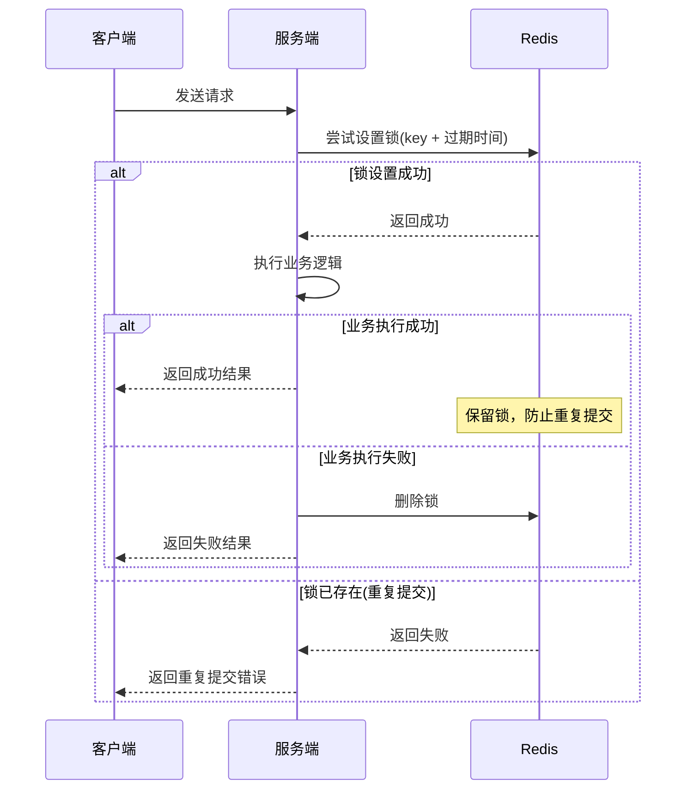

# 幂等处理 (idempotent)

## 概述

幂等功能模块提供基于 Redis 分布式锁机制的接口防重复提交功能，确保在短时间内用户重复点击或网络抖动等场景下，同一请求只会被处理一次，有效避免数据重复插入、重复扣款等问题。

## 核心特性

- **分布式锁机制**：基于 Redis 实现分布式环境下的防重复提交
- **智能清理策略**：成功时保留锁定，失败时自动清理，允许重新提交
- **灵活配置**：支持自定义间隔时间、时间单位和提示消息
- **国际化支持**：提示消息支持多语言配置
- **参数过滤**：自动过滤文件上传等特殊对象，确保唯一标识准确性

## 工作原理

### 防重复提交流程



### 唯一标识生成规则

防重复提交通过以下信息生成唯一标识：

1. **用户标识**：从请求头中获取 Token
2. **请求参数**：序列化后的方法参数（过滤特殊对象）
3. **请求路径**：当前请求的 URI

最终的缓存 Key 格式：`repeat_submit::{requestURI}{md5(token:params)}`

## 使用指南

### 1. 基础用法

在需要防重复提交的方法上添加 `@RepeatSubmit` 注解：

```java
@RestController
@RequestMapping("/user")
public class UserController {

    @PostMapping("/create")
    @RepeatSubmit
    public R<Void> createUser(@RequestBody UserCreateReq req) {
        // 业务逻辑
        return R.ok();
    }
}
```

### 2. 自定义配置

```java
@PostMapping("/payment")
@RepeatSubmit(
    interval = 10,                              // 间隔时间
    timeUnit = TimeUnit.SECONDS,                // 时间单位
    message = "{payment.duplicate.submit}"      // 自定义提示消息
)
public R<Void> processPayment(@RequestBody PaymentReq req) {
    // 支付逻辑
    return R.ok();
}
```

### 3. 配置参数说明

| 参数 | 类型 | 默认值 | 说明 |
|------|------|--------|------|
| `interval` | int | 5000 | 重复提交检测间隔时间 |
| `timeUnit` | TimeUnit | MILLISECONDS | 时间单位 |
| `message` | String | I18nKeys.Request.DUPLICATE_SUBMIT | 重复提交提示消息 |

::: warning 注意事项
间隔时间不能小于 1 秒，系统会自动校验并抛出异常。
:::

## 高级特性

### 1. 智能参数过滤

系统会自动过滤以下类型的对象，确保唯一标识的准确性：

- **文件上传对象**：`MultipartFile` 及其数组、集合
- **HTTP 对象**：`HttpServletRequest`、`HttpServletResponse`
- **数据绑定结果**：`BindingResult`

```java
@PostMapping("/upload")
@RepeatSubmit
public R<Void> uploadFile(
    @RequestParam("file") MultipartFile file,  // 会被过滤
    @RequestBody FileMetadata metadata         // 参与唯一标识计算
) {
    // 文件上传逻辑
    return R.ok();
}
```

### 2. 国际化消息配置

在国际化资源文件中配置提示消息：

```properties
# messages.properties
request.control.duplicate.submit=请勿重复提交

# messages_en.properties  
request.control.duplicate.submit=Please do not submit repeatedly
```

### 3. 业务结果智能处理

系统根据业务执行结果智能处理缓存：

```java
// 成功场景：保留缓存，防止重复提交
return R.ok("操作成功");

// 失败场景：清理缓存，允许重新提交  
return R.fail("业务处理失败");
```

## 配置说明

### 1. 自动配置

模块通过 Spring Boot 自动配置机制启用，无需手动配置：

```java
@AutoConfiguration(after = RedisConfiguration.class)
public class IdempotentConfig {
    
    @Bean
    public RepeatSubmitAspect repeatSubmitAspect() {
        return new RepeatSubmitAspect();
    }
}
```

### 2. 依赖要求

确保项目中已引入相关依赖：

```xml
<!-- 核心依赖 -->
<dependency>
    <groupId>plus.ruoyi</groupId>
    <artifactId>ruoyi-common-idempotent</artifactId>
</dependency>

<!-- 间接依赖（自动引入） -->
<!-- Redis 支持 -->
<!-- JSON 序列化 -->  
<!-- Sa-Token 身份验证 -->
<!-- HuTool 加密工具 -->
```

## 最佳实践

### 1. 适用场景

- **表单提交**：用户注册、信息修改等
- **支付操作**：订单支付、余额变动等
- **数据创建**：新增记录、文件上传等
- **状态变更**：订单确认、审核通过等

### 2. 性能考虑

```java
// 推荐：合理设置间隔时间
@RepeatSubmit(interval = 3, timeUnit = TimeUnit.SECONDS)

// 避免：过短的间隔时间影响用户体验
@RepeatSubmit(interval = 500, timeUnit = TimeUnit.MILLISECONDS)

// 避免：过长的间隔时间占用 Redis 内存
@RepeatSubmit(interval = 10, timeUnit = TimeUnit.MINUTES)
```

### 3. 错误处理

```java
@PostMapping("/order")
@RepeatSubmit(message = "{order.duplicate.submit}")
public R<OrderVO> createOrder(@RequestBody OrderCreateReq req) {
    try {
        // 业务逻辑
        OrderVO order = orderService.create(req);
        return R.ok(order);
    } catch (BusinessException e) {
        // 业务异常会自动清理缓存，允许重新提交
        return R.fail(e.getMessage());
    }
}
```

## 监控与调试

### 1. Redis 缓存监控

可通过 Redis 客户端查看防重复提交的缓存状态：

```bash
# 查看所有防重复提交缓存
redis-cli keys "repeat_submit::*"

# 查看特定缓存的过期时间
redis-cli ttl "repeat_submit::/api/user/create{hash}"
```

### 2. 日志调试

通过调整日志级别查看详细信息：

```yaml
logging:
  level:
    plus.ruoyi.common.idempotent.aspectj.RepeatSubmitAspect: DEBUG
```

## 常见问题

### Q: 为什么有时候提示重复提交，但我确实只点击了一次？

A: 可能的原因：
- 网络延迟导致前端发送了多个请求
- 浏览器的重复提交行为
- 建议前端添加防抖处理，与后端防重复提交形成双重保护

### Q: 如何处理集群环境下的防重复提交？

A: 模块基于 Redis 实现分布式锁，天然支持集群环境，确保多个服务实例间的防重复提交一致性。

### Q: 业务失败后多久可以重新提交？

A: 业务失败时会立即清理 Redis 缓存，用户可以马上重新提交。只有业务成功时才会保留缓存直到过期时间。

### Q: 如何自定义唯一标识的生成规则？

A: 当前版本基于 Token + 参数 + URI 生成唯一标识。如需自定义，可以继承 `RepeatSubmitAspect` 并重写相关方法。
