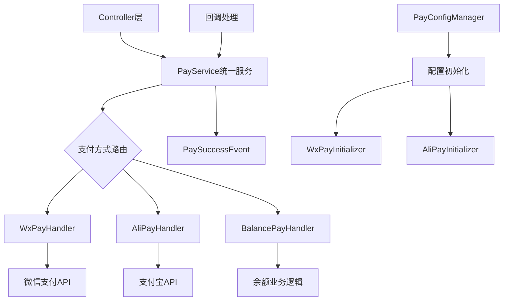

# 支付模块 (pay)

## 概述

RuoYi-Plus 支付模块 (`ruoyi-common-pay`) 是一个统一的支付服务解决方案，提供了完整的支付、退款、回调处理功能。模块采用策略模式设计，支持多种支付方式的无缝集成。

### 核心特性

- 🚀 **统一接口**: 提供统一的支付、退款、查询接口
- 💳 **多支付方式**: 支持微信支付、支付宝、余额支付等
- 🏢 **多租户支持**: 完整的多租户配置管理
- 🔒 **安全可靠**: 完整的签名验证和回调处理
- 📊 **配置管理**: 智能化的配置初始化和管理
- 🎯 **事件驱动**: 支付成功事件发布机制

### 支持的支付方式

| 支付方式 | 支持类型 | Handler类 |
|---------|---------|-----------|
| 微信支付 | JSAPI、NATIVE、APP、H5 | `WxPayHandler` |
| 支付宝 | WAP、PAGE、APP | `AliPayHandler` |
| 余额支付 | 账户余额 | `BalancePayHandler` |

## 快速开始

### 1. 添加依赖

```xml
<dependency>
    <groupId>plus.ruoyi</groupId>
    <artifactId>ruoyi-common-pay</artifactId>
</dependency>
```

### 2. 基础使用

```java
@Autowired
private PayService payService;

// 发起支付
PayRequest request = PayRequest.createWxJsapiRequest(
    appId, mchId, "商品描述", outTradeNo, 
    new BigDecimal("0.01"), openId, clientIp
);
PayResponse response = payService.pay(DictPaymentMethod.WECHAT, request);

// 申请退款
RefundRequest refundRequest = RefundRequest.createWxRefundRequest(
    appId, mchId, outTradeNo, outRefundNo, 
    totalFee, refundFee, "退款原因"
);
RefundResponse refundResponse = payService.refund(DictPaymentMethod.WECHAT, refundRequest);
```

## 架构设计

### 整体架构



### 核心组件

#### PayService - 统一服务入口
负责路由不同支付方式到对应的处理器，提供统一的调用接口。

```java
@Service
public class PayService {
    // 根据支付方式自动路由到对应处理器
    public PayResponse pay(DictPaymentMethod paymentMethod, PayRequest request);
    public RefundResponse refund(DictPaymentMethod paymentMethod, RefundRequest request);
    public NotifyResponse handleNotify(DictPaymentMethod paymentMethod, NotifyRequest request);
}
```

#### PayHandler - 支付处理器接口
定义了支付处理器的标准接口，所有支付方式都需要实现此接口。

```java
public interface PayHandler {
    DictPaymentMethod getPaymentMethod();
    PayResponse pay(PayRequest request);
    RefundResponse refund(RefundRequest request);
    PayResponse queryPayment(String outTradeNo, String appid);
    RefundResponse queryRefund(String outRefundNo, String appid);
    NotifyResponse handleNotify(NotifyRequest request);
}
```

#### PayConfigManager - 配置管理器
管理所有支付配置，支持多租户场景下的配置隔离。

```java
@Service
public class PayConfigManager {
    // 配置格式: {tenantId}:{paymentMethod}:{appid}
    public PayConfig getConfig(String tenantId, String paymentMethod, String appid);
    public void registerConfig(PayConfig config);
    public List<PayConfig> getConfigsByTenant(String tenantId);
}
```

## 支付方式详解

### 微信支付

#### 支持类型
- **JSAPI**: 微信小程序/公众号支付
- **NATIVE**: 扫码支付
- **APP**: APP支付
- **H5**: 手机网页支付

#### API版本自动识别

系统会根据配置自动选择使用微信支付 **v2** 或 **v3** API：

- **v2 API**: 仅配置 `mchKey`（商户密钥）时自动使用 v2
- **v3 API**: 配置了 `apiV3Key`、`certSerialNo` 和证书时自动使用 v3

#### 配置要求

**v2 API 配置（传统模式）**
```java
// 必需配置
String appId = "wx1234567890123456";
String mchId = "1234567890";
String mchKey = "your_wx_api_key";  // v2 商户密钥

// 可选配置 - 退款需要
String certPath = "cert/apiclient_cert.p12";
```

**v3 API 配置（平台证书模式）⭐ 推荐**
```java
// 必需配置
String appId = "wx1234567890123456";
String mchId = "1234567890";
String apiV3Key = "your_api_v3_key";          // v3 密钥
String certSerialNo = "your_cert_serial_no";  // 证书序列号

// 证书配置（支持多种方式）
String certPath = "cert/apiclient_cert.pem";  // 商户证书
String keyPath = "cert/apiclient_key.pem";    // 商户私钥

// 平台证书路径（用于验证回调签名）
String platformCertPath = "cert/wechatpay_platform.pem";
```

**v3 API 配置（公钥模式）⭐ 新功能**
```java
// 必需配置
String appId = "wx1234567890123456";
String mchId = "1234567890";
String apiV3Key = "your_api_v3_key";
String certSerialNo = "your_cert_serial_no";

// 证书配置
String certPath = "cert/apiclient_cert.pem";
String keyPath = "cert/apiclient_key.pem";

// 使用公钥文件（系统会自动识别）
String platformCertPath = "cert/wechatpay_public_key.pem";
// 或直接配置公钥内容
String platformCertPath = "-----BEGIN PUBLIC KEY-----\nMIIBIj...\n-----END PUBLIC KEY-----";
```

#### 证书配置灵活性 🔧

系统支持多种证书配置方式：

**1. 文件路径模式**
```java
// Classpath 资源路径
String certPath = "classpath:cert/apiclient_cert.pem";

// 文件系统绝对路径
String certPath = "/data/cert/apiclient_cert.pem";
```

**2. PEM 内容直接配置** ⭐ 推荐
```java
// 直接配置 PEM 格式证书内容（无需文件）
String certPath = """
-----BEGIN CERTIFICATE-----
MIIFazCCBFOgAwIBAgISBKSq...
-----END CERTIFICATE-----
""";
```

**3. 开发/生产环境分离**
```java
// 开发环境证书
String devCertPath = "cert/dev/apiclient_cert.pem";
String devKeyPath = "cert/dev/apiclient_key.pem";
String devPlatformCertPath = "cert/dev/wechatpay_platform.pem";

// 生产环境证书
String certPath = "cert/prod/apiclient_cert.pem";
String keyPath = "cert/prod/apiclient_key.pem";
String platformCertPath = "cert/prod/wechatpay_platform.pem";

// 系统会根据 spring.profiles.active 自动选择
```

#### 公钥模式智能识别

系统会自动识别是使用**平台证书**还是**公钥模式**：

**识别依据：**
1. **文件名检测**：包含 `public`、`pubkey`、`pub_key`、`publickey` 关键词
2. **内容检测**：文件内容以 `-----BEGIN PUBLIC KEY-----` 开头

**使用场景：**
- ✅ 轻量级部署：公钥文件体积更小
- ✅ 证书更新简化：公钥相对稳定，无需频繁更新
- ✅ 安全性要求：满足基本的签名验证需求

::: warning 注意
公钥模式仅用于回调验证，不影响支付、退款等业务功能。如有条件，建议使用完整的平台证书模式。
:::

#### 使用示例

**JSAPI支付 (小程序/公众号)**
```java
PayRequest request = PayRequest.createWxJsapiRequest(
    appId, mchId, "商品描述", outTradeNo, 
    new BigDecimal("0.01"), openId, clientIp
);
PayResponse response = payService.pay(DictPaymentMethod.WECHAT, request);

// 返回的payInfo可直接用于前端调起支付
Map<String, String> payInfo = response.getPayInfo();
```

**NATIVE支付 (扫码)**
```java
PayRequest request = PayRequest.createWxNativeRequest(
    appId, mchId, "商品描述", outTradeNo, 
    new BigDecimal("0.01"), clientIp
);
PayResponse response = payService.pay(DictPaymentMethod.WECHAT, request);

// 获取二维码
String qrCodeBase64 = response.getQrCodeBase64();
String codeUrl = response.getCodeUrl();
```

**H5支付 (手机网页)**
```java
PayRequest request = PayRequest.createWxH5Request(
    appId, mchId, "商品描述", outTradeNo, 
    new BigDecimal("0.01"), clientIp, sceneInfo
);
PayResponse response = payService.pay(DictPaymentMethod.WECHAT, request);

// 跳转到支付页面
String payUrl = response.getPayUrl();
```

### 支付宝

#### 支持类型
- **WAP**: 手机网站支付
- **PAGE**: 电脑网站支付
- **APP**: APP支付

#### 配置要求
```java
// 必需配置
String appId = "2021000000000000";
String privateKey = "your_private_key";
String alipayPublicKey = "alipay_public_key";

// 证书模式 (推荐)
String certPath = "cert/appCertPublicKey.crt";
String keyPath = "cert/alipayCertPublicKey_RSA2.crt";
```

#### 使用示例

**WAP支付 (手机网站)**
```java
PayRequest request = PayRequest.createAlipayWapRequest(
    appId, "商品描述", outTradeNo, 
    new BigDecimal("0.01"), returnUrl
);
PayResponse response = payService.pay(DictPaymentMethod.ALIPAY, request);

// 返回支付表单，直接输出到页面即可
String payForm = response.getPayForm();
```

**PAGE支付 (电脑网站)**
```java
PayRequest request = PayRequest.createAlipayPageRequest(
    appId, "商品描述", outTradeNo, 
    new BigDecimal("0.01"), returnUrl
);
PayResponse response = payService.pay(DictPaymentMethod.ALIPAY, request);

String payForm = response.getPayForm();
```

**APP支付**
```java
PayRequest request = PayRequest.createAlipayAppRequest(
    appId, "商品描述", outTradeNo, new BigDecimal("0.01")
);
PayResponse response = payService.pay(DictPaymentMethod.ALIPAY, request);

// 返回APP调起参数
String payInfo = response.getPayUrl();
```

### 余额支付

余额支付是系统内置的支付方式，无需第三方接口，适合积分、储值卡等场景。

```java
PayRequest request = PayRequest.createBalanceRequest(
    outTradeNo, new BigDecimal("10.00"), "余额支付", clientIp
);
PayResponse response = payService.pay(DictPaymentMethod.BALANCE, request);
```

## 退款处理

### 微信退款
```java
RefundRequest request = RefundRequest.createWxRefundRequest(
    appId, mchId, outTradeNo, outRefundNo, 
    totalFee, refundFee, "用户申请退款"
);
RefundResponse response = payService.refund(DictPaymentMethod.WECHAT, request);
```

### 支付宝退款
```java
RefundRequest request = RefundRequest.createAlipayRefundRequest(
    appId, outTradeNo, outRefundNo, refundFee, "退款原因"
);
RefundResponse response = payService.refund(DictPaymentMethod.ALIPAY, request);
```

### 余额退款
```java
RefundRequest request = RefundRequest.createBalanceRefundRequest(
    outTradeNo, outRefundNo, refundFee, "余额退款"
);
RefundResponse response = payService.refund(DictPaymentMethod.BALANCE, request);
```

## 回调处理

### 回调地址规则

系统自动生成回调地址，格式为：
```
{baseApi}/payment/notify/{paymentMethod}/{merchantId}
```

例如：
- 微信支付: `https://api.example.com/payment/notify/wechat/1234567890`
- 支付宝: `https://api.example.com/payment/notify/alipay/2021000000000000`

### 回调验证流程

1. **数据完整性检查**: 验证必需参数
2. **签名验证**: 使用对应平台的公钥/密钥验证签名
3. **业务状态检查**: 确认支付状态为成功
4. **事件发布**: 发布 `PaySuccessEvent` 事件
5. **响应返回**: 返回平台要求的格式

### 监听支付成功事件

```java
@Component
@Slf4j
public class PaymentEventListener {
    
    @EventListener
    public void handlePaymentSuccess(PaySuccessEvent event) {
        String outTradeNo = event.getOutTradeNo();
        String totalFee = event.getTotalFee();
        String paymentMethod = event.getPaymentMethod();
        
        // 处理业务逻辑
        // 1. 更新订单状态
        // 2. 发货处理
        // 3. 积分发放
        // 4. 发送通知
        
        log.info("支付成功: 订单={}, 金额={}, 方式={}", 
            outTradeNo, event.getTotalAmountYuan(), paymentMethod);
    }
}
```

## 配置管理

### 配置初始化

系统启动时会自动初始化所有租户的支付配置：

1. **扫描租户**: 从平台配置和支付配置中获取所有租户ID
2. **构建配置**: 为每个租户构建 `PayConfig` 对象
3. **分组初始化**: 按支付方式分组，调用对应的初始化器
4. **注册配置**: 将配置注册到 `PayConfigManager`

### 配置结构

```java
@Data
public class PayConfig {
    private String configId;           // 格式: {tenantId}:{paymentMethod}:{appid}
    private String tenantId;           // 租户ID
    private DictPaymentMethod paymentMethod; // 支付方式
    private String appid;              // 应用ID
    private String mchId;              // 商户号
    private String mchKey;             // 商户密钥
    private String certPath;           // 证书路径
    // ... 其他配置项
}
```

### 多租户配置隔离

每个租户的配置完全隔离，通过配置ID进行区分：

```java
// 获取指定租户的支付配置
PayConfig config = configManager.getConfig(tenantId, "wechat", appId);

// 获取租户的所有配置
List<PayConfig> configs = configManager.getConfigsByTenant(tenantId);
```

## 状态查询

### 支付状态查询

```java
// 查询微信支付状态
PayResponse response = payService.queryPayment(
    DictPaymentMethod.WECHAT, outTradeNo, appId
);

if (response.isSuccess()) {
    String tradeState = response.getTradeState();
    Date payTime = response.getPayTime();
    // 处理查询结果
}
```

### 退款状态查询

```java
// 查询退款状态
RefundResponse response = payService.queryRefund(
    DictPaymentMethod.WECHAT, outRefundNo, appId
);

if (response.isSuccess()) {
    String refundStatus = response.getRefundStatus();
    // 处理查询结果
}
```

## 工具类

### PayUtils - 支付工具类

```java
// 生成订单号
String outTradeNo = PayUtils.generateOutTradeNo();
String outTradeNo = PayUtils.generateOutTradeNo("ORDER");

// 生成退款单号
String outRefundNo = PayUtils.generateOutRefundNo();

// 金额转换
String fenStr = PayUtils.yuanToFen("10.50");  // 1050
String yuanStr = PayUtils.fenToYuan("1050");  // 10.50

// 敏感信息掩码
String maskedMchId = PayUtils.maskMchId("1234567890");  // 123****890
String maskedAppId = PayUtils.maskAppId("wx1234567890123456");  // wx12****3456
```

### PayNotifyUrlBuilder - 回调地址构建

```java
// 构建回调地址
String notifyUrl = PayNotifyUrlBuilder.buildNotifyUrl(
    DictPaymentMethod.WECHAT, mchId
);

// 解析回调地址
String[] parsed = PayNotifyUrlBuilder.parseNotifyUrl(notifyUrl);
String paymentType = parsed[0];
String merchantId = parsed[1];
```

## 最佳实践

### 1. 订单号生成

```java
// 推荐使用系统提供的订单号生成方法
String outTradeNo = PayUtils.generateOutTradeNo("PAY");  // PAY20241212143025123456
String outRefundNo = PayUtils.generateOutRefundNo("REF"); // REF20241212143025123456
```

### 2. 异常处理

```java
try {
    PayResponse response = payService.pay(DictPaymentMethod.WECHAT, request);
    if (!response.isSuccess()) {
        log.error("支付失败: {}", response.getMessage());
        // 处理支付失败
    }
} catch (ServiceException e) {
    log.error("支付异常: {}", e.getMessage(), e);
    // 处理异常情况
}
```

### 3. 回调幂等性

支付回调可能会重复推送，业务处理时需要保证幂等性：

```java
@EventListener
@Transactional
public void handlePaymentSuccess(PaySuccessEvent event) {
    String outTradeNo = event.getOutTradeNo();
    
    // 检查订单是否已处理（幂等性保证）
    if (orderService.isPaid(outTradeNo)) {
        log.info("订单已处理，跳过: {}", outTradeNo);
        return;
    }
    
    // 更新订单状态
    orderService.updateOrderStatus(outTradeNo, "PAID");
    
    // 其他业务处理...
}
```

### 4. 金额处理

```java
// 统一使用 BigDecimal 处理金额，避免精度丢失
BigDecimal amount = new BigDecimal("10.50");

// 避免使用 double 类型
// ❌ double amount = 10.50;
// ✅ BigDecimal amount = new BigDecimal("10.50");
```

### 5. 配置安全

生产环境中，敏感配置信息应该加密存储：

```java
// 敏感信息脱敏日志输出
log.info("初始化微信支付: appId={}, mchId={}", 
    PayUtils.maskAppId(appId), 
    PayUtils.maskMchId(mchId)
);
```

## 常见问题

### Q: 支付回调收不到？

A: 检查以下几点：
1. 确保回调地址可以从外网访问
2. 检查 `app.base-api` 配置是否正确
3. 确认防火墙没有拦截回调请求
4. 查看回调日志，确认签名验证是否通过

### Q: 微信支付提示签名错误？

A: 检查以下配置：
1. `mchKey` (API密钥) 是否正确
2. 参数是否按照微信要求进行签名
3. 字符编码是否为 UTF-8

### Q: 支付宝支付失败？

A: 检查以下配置：
1. `appId` 格式是否正确（16位数字）
2. 应用私钥是否正确
3. 支付宝公钥是否配置
4. 是否开通了对应的支付产品

### Q: 多租户环境下配置混乱？

A: 确保：
1. 每个租户的配置ID唯一
2. 配置初始化时按租户隔离
3. 使用时传入正确的 `appId` 参数

### Q: 如何扩展新的支付方式？

A: 按照以下步骤：
1. 实现 `PayHandler` 接口
2. 创建对应的 `PayInitializer`
3. 在 `DictPaymentMethod` 中添加新的支付方式枚举
4. 添加相关配置支持
