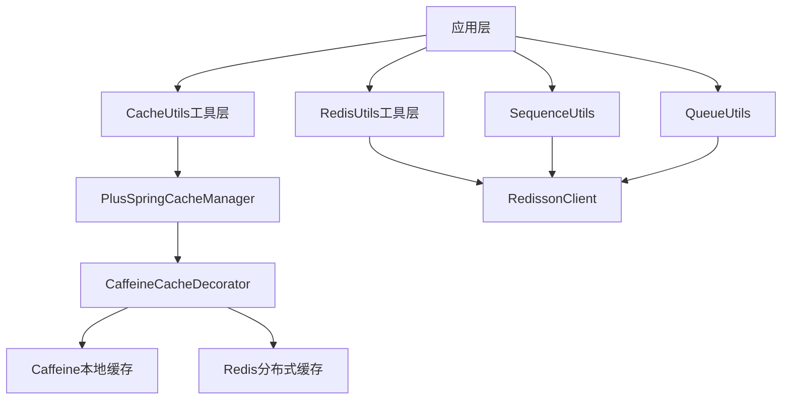

# Redis缓存 (redis)

## 概述

`ruoyi-common-redis` 是一个基于 **Redisson** 实现的综合性Redis缓存模块，提供了完整的缓存解决方案，包括基础缓存操作、分布式锁、队列管理、ID生成器等功能。该模块采用二级缓存架构，结合Redis分布式缓存和Caffeine本地缓存，为应用提供高性能的缓存服务。

## 核心特性

- **<Icon icon="lucide:rocket" /> 高性能二级缓存**：Redis + Caffeine 双重缓存架构
- **<Icon icon="lucide:lock" /> 分布式锁**：基于 Redisson 的分布式锁机制
- **<Icon icon="lucide:chart-column" /> 分布式ID生成**：支持多种格式的唯一ID生成
- **<Icon icon="lucide:target" /> 队列管理**：普通队列、延迟队列、优先队列等
- **<Icon icon="lucide:zap" /> 限流控制**：基于令牌桶的限流机制
- **<Icon icon="lucide:radio-tower" /> 发布订阅**：Redis消息发布订阅功能
- **<Icon icon="lucide:wrench" /> 灵活配置**：支持单机和集群模式
- **<Icon icon="lucide:lightbulb" /> 智能序列化**：JSON序列化，支持Java8时间类型

## 架构设计



## 快速开始

### 1. 添加依赖

```xml
<dependency>
    <groupId>plus.ruoyi</groupId>
    <artifactId>ruoyi-common-redis</artifactId>
</dependency>
```

### 2. 配置文件

**开发环境配置示例**

```yaml
################## Redis缓存配置 ##################
--- # redis 单机配置(单机与集群只能开启一个另一个需要注释掉)
spring.data:
  redis:
    # 地址
    host: localhost
    # 端口，默认为6379
    port: 6379
    # 数据库索引
    database: 0
    # redis 密码必须配置
#   password: ruoyi123
    # 连接超时时间
    timeout: 10s
    # 是否开启ssl
    ssl.enabled: false

# redisson 配置
redisson:
  # redis key前缀（使用应用ID作为前缀）
  keyPrefix: ${app.id}
  # 线程池数量（开发环境适中配置）
  threads: 4
  # Netty线程池数量
  nettyThreads: 8
  # 单节点配置
  singleServerConfig:
    # 客户端名称（使用应用ID）
    clientName: ${app.id}
    # 最小空闲连接数（开发环境较小值）
    connectionMinimumIdleSize: 8
    # 连接池大小（开发环境适中配置）
    connectionPoolSize: 32
    # 连接空闲超时，单位：毫秒
    idleConnectionTimeout: 10000
    # 命令等待超时，单位：毫秒
    timeout: 3000
    # 发布和订阅连接池大小
    subscriptionConnectionPoolSize: 50
```

**生产环境配置建议**

```yaml
spring.data:
  redis:
    host: your-redis-host
    port: 6379
    database: 0
    password: your-secure-password
    timeout: 10s
    ssl.enabled: true  # 生产环境建议开启SSL

redisson:
  keyPrefix: ${app.id}
  threads: 16        # 生产环境可适当增加
  nettyThreads: 32   # 生产环境可适当增加
  singleServerConfig:
    clientName: ${app.id}
    connectionMinimumIdleSize: 16  # 生产环境增加连接数
    connectionPoolSize: 64         # 生产环境增加连接池大小
    idleConnectionTimeout: 10000
    timeout: 3000
    subscriptionConnectionPoolSize: 50
```

## 配置说明

### 核心配置参数

#### Spring Data Redis 配置
- `spring.data.redis.host`: Redis服务器地址（开发环境通常为localhost）
- `spring.data.redis.port`: Redis端口（默认6379）
- `spring.data.redis.database`: 数据库索引（0-15，默认为0）
- `spring.data.redis.password`: 连接密码（开发环境可选，生产环境必须）
- `spring.data.redis.timeout`: 连接超时时间
- `spring.data.redis.ssl.enabled`: 是否启用SSL（生产环境建议开启）

#### Redisson 配置
- `redisson.keyPrefix`: Redis key前缀，支持使用`${app.id}`占位符
- `redisson.threads`: 用于执行各种Redis操作的线程池大小
- `redisson.nettyThreads`: Netty框架使用的线程池大小

#### 单机服务器配置
- `clientName`: 客户端连接名称，便于监控识别
- `connectionMinimumIdleSize`: 最小空闲连接数，保持一定的连接预热
- `connectionPoolSize`: 连接池最大连接数
- `idleConnectionTimeout`: 连接空闲超时时间（毫秒）
- `timeout`: 单个Redis操作的超时时间（毫秒）
- `subscriptionConnectionPoolSize`: 发布订阅专用连接池大小

### 环境差异配置

#### 开发环境特点
- 较小的连接池配置，节省资源
- 可以不设置密码，简化开发
- 关闭SSL，减少配置复杂度
- 使用localhost本地Redis

#### 生产环境建议
- 增加连接池大小，提高并发能力
- 必须设置强密码
- 开启SSL加密传输
- 使用独立的Redis服务器或集群

### 1. CacheUtils - 通用缓存工具

提供基于Spring Cache抽象的统一缓存操作接口。

#### 基本用法

```java
// 存储缓存
CacheUtils.put("userCache", "user:123", userObj);

// 获取缓存
User user = CacheUtils.get("userCache", "user:123");

// 删除缓存
CacheUtils.evict("userCache", "user:123");

// 清空缓存组
CacheUtils.clear("userCache");
```

### 2. RedisUtils - Redis操作工具

基于Redisson实现的完整Redis操作工具类。

#### 基础缓存操作

```java
// 设置缓存（永不过期）
RedisUtils.setCacheObject("user:123", user);

// 设置缓存并指定过期时间
RedisUtils.setCacheObject("user:123", user, Duration.ofHours(1));

// 获取缓存
User user = RedisUtils.getCacheObject("user:123");

// 删除缓存
RedisUtils.deleteObject("user:123");

// 检查是否存在
boolean exists = RedisUtils.isExistsObject("user:123");

// 设置过期时间
RedisUtils.expire("user:123", Duration.ofMinutes(30));
```

#### 条件设置操作

```java
// 仅当key不存在时设置
boolean success = RedisUtils.setObjectIfAbsent("user:123", user, Duration.ofHours(1));

// 仅当key存在时设置
boolean success = RedisUtils.setObjectIfExists("user:123", user, Duration.ofHours(1));
```

#### 集合操作

**List操作**

```java
// 缓存List数据
List<String> dataList = Arrays.asList("item1", "item2", "item3");
RedisUtils.setCacheList("myList", dataList);

// 追加单个数据
RedisUtils.addCacheList("myList", "item4");

// 获取完整List
List<String> list = RedisUtils.getCacheList("myList");

// 获取指定范围
List<String> range = RedisUtils.getCacheListRange("myList", 0, 10);
```

**Set操作**

```java
// 缓存Set数据
Set<String> dataSet = Sets.newHashSet("item1", "item2");
RedisUtils.setCacheSet("mySet", dataSet);

// 添加元素
RedisUtils.addCacheSet("mySet", "item3");

// 获取Set数据
Set<String> set = RedisUtils.getCacheSet("mySet");
```

**Map操作**

```java
// 缓存Map数据
Map<String, Object> dataMap = new HashMap<>();
dataMap.put("name", "张三");
dataMap.put("age", 25);
RedisUtils.setCacheMap("userInfo", dataMap);

// 设置Map中的单个值
RedisUtils.setCacheMapValue("userInfo", "city", "北京");

// 获取Map中的单个值
String name = RedisUtils.getCacheMapValue("userInfo", "name");

// 获取完整Map
Map<String, Object> map = RedisUtils.getCacheMap("userInfo");

// 删除Map中的值
RedisUtils.delCacheMapValue("userInfo", "age");
```

#### 发布订阅

```java
// 发布消息
RedisUtils.publish("news", "重要通知内容");

// 订阅消息
RedisUtils.subscribe("news", String.class, message -> {
    System.out.println("收到消息: " + message);
    // 处理消息逻辑
});
```

#### 限流控制

```java
// 限流：每秒最多10个请求
long remaining = RedisUtils.rateLimiter("api:login", 
    RateType.OVERALL, 10, 1);

if (remaining == -1) {
    throw new RuntimeException("请求过于频繁，请稍后再试");
}
```

#### 原子操作

```java
// 设置原子值
RedisUtils.setAtomicValue("counter", 100L);

// 原子递增
long newValue = RedisUtils.incrAtomicValue("counter");

// 原子递减
long newValue = RedisUtils.decrAtomicValue("counter");

// 获取当前值
long currentValue = RedisUtils.getAtomicValue("counter");
```

### 3. SequenceUtils - 分布式ID生成器

基于Redisson的分布式ID生成工具，支持多种ID格式。

#### 基础ID生成

```java
// 生成基础ID（使用默认初始值1和步长1）
long id = SequenceUtils.nextId("order", Duration.ofDays(1));

// 生成ID字符串
String idStr = SequenceUtils.nextIdStr("order", Duration.ofDays(1));

// 自定义初始值和步长
long customId = SequenceUtils.nextId("custom", Duration.ofHours(1), 1000L, 2L);
```

#### 补零格式化

```java
// 生成6位补零的序列号：000001, 000002...
String seqNo = SequenceUtils.nextPaddedIdStr("seq", Duration.ofHours(1), 6);
```

#### 带日期前缀的ID

```java
// 生成带当前日期的ID：20241210001
String dateId = SequenceUtils.nextIdDate();

// 生成带业务前缀和日期的ID：ORD20241210001
String orderId = SequenceUtils.nextIdDate("ORD");
```

#### 带日期时间前缀的ID

```java
// 生成带当前日期时间的ID：20241210103001
String datetimeId = SequenceUtils.nextIdDateTime();

// 生成带业务前缀和日期时间的ID：SN20241210103001
String serialNo = SequenceUtils.nextIdDateTime("SN");
```

### 4. QueueUtils - 分布式队列管理

支持多种类型的分布式队列操作。

#### 普通阻塞队列

```java
// 添加数据到队列
QueueUtils.addQueueObject("taskQueue", taskData);

// 从队列获取数据（非阻塞）
TaskData task = QueueUtils.getQueueObject("taskQueue");

// 删除指定数据
QueueUtils.removeQueueObject("taskQueue", taskData);

// 销毁队列
QueueUtils.destroyQueue("taskQueue");
```

#### 延迟队列

```java
// 添加延迟任务（5分钟后执行）
QueueUtils.addDelayedQueueObject("delayQueue", task, 5, TimeUnit.MINUTES);

// 默认毫秒单位
QueueUtils.addDelayedQueueObject("delayQueue", task, 300000);

// 获取已到期的任务
TaskData task = QueueUtils.getDelayedQueueObject("delayQueue");

// 删除延迟任务
QueueUtils.removeDelayedQueueObject("delayQueue", task);
```

#### 优先队列

```java
// 任务需要实现Comparable接口
public class PriorityTask implements Comparable<PriorityTask> {
    private int priority;
    private String content;
    
    @Override
    public int compareTo(PriorityTask other) {
        return Integer.compare(other.priority, this.priority); // 高优先级在前
    }
}

// 添加优先级任务
PriorityTask highPriorityTask = new PriorityTask(10, "重要任务");
QueueUtils.addPriorityQueueObject("priorityQueue", highPriorityTask);

// 获取最高优先级任务
PriorityTask task = QueueUtils.getPriorityQueueObject("priorityQueue");
```

#### 有界队列

```java
// 设置队列容量
QueueUtils.trySetBoundedQueueCapacity("boundedQueue", 100);

// 添加数据（队列满时返回false）
boolean success = QueueUtils.addBoundedQueueObject("boundedQueue", data);

// 获取数据
Object data = QueueUtils.getBoundedQueueObject("boundedQueue");
```

#### 队列订阅

```java
// 订阅普通队列
QueueUtils.subscribeBlockingQueue("taskQueue", 
    message -> {
        // 异步处理消息
        return CompletableFuture.runAsync(() -> {
            System.out.println("处理任务: " + message);
        });
    }, false);

// 订阅延迟队列
QueueUtils.subscribeBlockingQueue("delayQueue", 
    message -> {
        return CompletableFuture.runAsync(() -> {
            System.out.println("处理延迟任务: " + message);
        });
    }, true);
```

## 二级缓存架构

### 缓存层级

1. **一级缓存（Caffeine）**：JVM本地缓存，访问速度最快
2. **二级缓存（Redis）**：分布式缓存，支持集群共享

### 缓存策略

#### 读取策略
```java
@Cacheable(value = "userCache", key = "#userId")
public User getUserById(Long userId) {
    // 1. 先查Caffeine本地缓存
    // 2. 未命中则查Redis
    // 3. Redis命中则回写Caffeine
    // 4. 都未命中则执行方法并缓存结果
    return userService.findById(userId);
}
```

#### 更新策略
```java
@CachePut(value = "userCache", key = "#user.id")
public User updateUser(User user) {
    // 1. 执行更新操作
    // 2. 清除Caffeine中的旧数据
    // 3. 更新Redis缓存
    return userService.update(user);
}
```

#### 删除策略
```java
@CacheEvict(value = "userCache", key = "#userId")
public void deleteUser(Long userId) {
    // 1. 执行删除操作
    // 2. 同时清除两级缓存
    userService.delete(userId);
}
```

### 动态缓存配置

支持在缓存名称中动态配置参数：

```java
// 格式：cacheName#ttl#maxIdleTime#maxSize#local
@Cacheable("userCache#30s#10s#1000#1")
public User getUser(Long id) {
    return userService.findById(id);
}
```

参数说明：
- `ttl`: 存活时间
- `maxIdleTime`: 最大空闲时间
- `maxSize`: 最大缓存条目数
- `local`: 是否启用本地缓存（1=启用，0=禁用）

## 分布式锁

### Lock4j注解方式

```java
@Component
public class OrderService {
    
    // 基础锁
    @Lock4j(keys = "#orderId")
    public void processOrder(String orderId) {
        // 业务逻辑
    }
    
    // 自定义锁名称和超时时间
    @Lock4j(keys = "'order:' + #orderId", expire = 30000)
    public void processOrderWithCustom(String orderId) {
        // 业务逻辑
    }
    
    // 多参数锁
    @Lock4j(keys = {"#userId", "#orderId"})
    public void processUserOrder(String userId, String orderId) {
        // 业务逻辑
    }
}
```

### 编程方式

```java
public void manualLock() {
    RLock lock = RedisUtils.getLock("manual:lock:key");
    try {
        // 尝试获取锁，最多等待10秒，锁定30秒后自动释放
        boolean acquired = lock.tryLock(10, 30, TimeUnit.SECONDS);
        if (acquired) {
            // 执行需要同步的业务逻辑
            doSomething();
        }
    } catch (InterruptedException e) {
        Thread.currentThread().interrupt();
    } finally {
        if (lock.isHeldByCurrentThread()) {
            lock.unlock();
        }
    }
}
```

## 监听机制

### 缓存对象监听

```java
// 监听对象变化
RedisUtils.addObjectListener("user:123", new ObjectListener() {
    @Override
    public void onUpdated(String name, Object object) {
        System.out.println("对象已更新: " + name);
    }
    
    @Override
    public void onDeleted(String name, Object object) {
        System.out.println("对象已删除: " + name);
    }
    
    @Override
    public void onExpired(String name, Object object) {
        System.out.println("对象已过期: " + name);
    }
});
```

### 集合监听

```java
// 监听List变化
RedisUtils.addListListener("myList", new ObjectListener() {
    @Override
    public void onUpdated(String name, Object object) {
        System.out.println("列表已更新: " + name);
    }
});

// 监听Set变化
RedisUtils.addSetListener("mySet", new ObjectListener() {
    @Override
    public void onUpdated(String name, Object object) {
        System.out.println("集合已更新: " + name);
    }
});

// 监听Map变化
RedisUtils.addMapListener("myMap", new ObjectListener() {
    @Override
    public void onUpdated(String name, Object object) {
        System.out.println("映射已更新: " + name);
    }
});
```

## 集群配置

### Redis集群配置

**注意：单机与集群配置只能启用其中一种，需要注释掉另一种配置**

```yaml
# Redis集群配置示例（注释掉单机配置后使用）
spring.data:
  redis:
    cluster:
      nodes:
        - 192.168.1.100:6379
        - 192.168.1.101:6379
        - 192.168.1.102:6379
        - 192.168.1.103:6379
        - 192.168.1.104:6379
        - 192.168.1.105:6379
      max-redirects: 3
    password: your-cluster-password
    timeout: 10s

redisson:
  keyPrefix: ${app.id}
  threads: 16
  nettyThreads: 32
  # 集群配置（替换singleServerConfig）
  clusterServersConfig:
    clientName: ${app.id}
    masterConnectionMinimumIdleSize: 16
    masterConnectionPoolSize: 32
    slaveConnectionMinimumIdleSize: 16
    slaveConnectionPoolSize: 32
    idleConnectionTimeout: 10000
    timeout: 3000
    subscriptionConnectionPoolSize: 50
    readMode: "SLAVE"           # 读取模式：SLAVE、MASTER、MASTER_SLAVE
    subscriptionMode: "MASTER"  # 订阅模式：SLAVE、MASTER
```

## 核心组件

## 最佳实践

### 1. 缓存设计原则

**选择合适的过期时间**
```java
// 用户信息：1小时过期
RedisUtils.setCacheObject("user:" + userId, user, Duration.ofHours(1));

// 配置信息：1天过期
RedisUtils.setCacheObject("config:" + key, config, Duration.ofDays(1));

// 临时token：15分钟过期
RedisUtils.setCacheObject("token:" + token, userInfo, Duration.ofMinutes(15));
```

**使用合理的Key命名**
```java
// 推荐的命名规范
String userKey = "user:profile:" + userId;
String orderKey = "order:detail:" + orderId;
String configKey = "system:config:" + configName;

// 避免的命名方式
String badKey1 = userId; // 太简单，容易冲突
String badKey2 = "user_profile_" + userId; // 分隔符不统一
```

### 2. 性能优化

**批量操作**
```java
// 批量删除
Collection<String> keys = Arrays.asList("key1", "key2", "key3");
RedisUtils.deleteObject(keys);

// 批量获取Map值
Set<String> hKeys = Sets.newHashSet("field1", "field2", "field3");
Map<String, Object> values = RedisUtils.getMultiCacheMapValue("myMap", hKeys);
```

**合理使用二级缓存**
```java
// 对于频繁访问的热点数据，启用本地缓存
@Cacheable("hotData#1h#30m#1000#1")  // 启用本地缓存
public HotData getHotData(String key) {
    return dataService.findByKey(key);
}

// 对于更新频繁的数据，禁用本地缓存
@Cacheable("frequentData#30m#10m#500#0")  // 禁用本地缓存
public FrequentData getFrequentData(String key) {
    return dataService.findByKey(key);
}
```

### 3. 错误处理

**Redis连接异常处理**
```java
try {
    User user = RedisUtils.getCacheObject("user:" + userId);
    if (user == null) {
        // 缓存未命中，查询数据库
        user = userService.findById(userId);
        if (user != null) {
            RedisUtils.setCacheObject("user:" + userId, user, Duration.ofHours(1));
        }
    }
    return user;
} catch (Exception e) {
    log.warn("Redis操作异常，降级到数据库查询", e);
    return userService.findById(userId);
}
```

**分布式锁异常处理**
```java
@Lock4j(keys = "#orderId", acquireTimeout = 5000, expire = 30000)
public void processOrder(String orderId) {
    try {
        // 业务逻辑
        orderService.process(orderId);
    } catch (LockFailureException e) {
        log.warn("获取订单锁失败: {}", orderId);
        throw new BusinessException("订单正在处理中，请稍后再试");
    } catch (Exception e) {
        log.error("处理订单异常: {}", orderId, e);
        throw new BusinessException("订单处理失败");
    }
}
```

### 4. 监控与运维

**关键指标监控**
```java
// 自定义监控指标
@Component
public class RedisMonitor {
    
    @EventListener
    public void onCacheHit(CacheHitEvent event) {
        // 记录缓存命中率
        meterRegistry.counter("cache.hit", "cache", event.getCacheName()).increment();
    }
    
    @EventListener
    public void onCacheMiss(CacheMissEvent event) {
        // 记录缓存未命中
        meterRegistry.counter("cache.miss", "cache", event.getCacheName()).increment();
    }
    
    @Scheduled(fixedRate = 60000) // 每分钟检查一次
    public void checkRedisHealth() {
        try {
            RedisUtils.setCacheObject("health:check", System.currentTimeMillis());
            log.debug("Redis健康检查正常");
        } catch (Exception e) {
            log.error("Redis健康检查失败", e);
            // 发送告警
            alertService.sendAlert("Redis连接异常");
        }
    }
}
```

## 常见问题

### 1. 序列化问题

**问题**：存储自定义对象时出现序列化异常

**解决方案**：
```java
// 确保对象实现Serializable接口
public class User implements Serializable {
    private static final long serialVersionUID = 1L;
    // ... 字段定义
}

// 或者使用JSON序列化友好的对象
@JsonIgnoreProperties(ignoreUnknown = true)
public class User {
    // 使用Jackson注解处理序列化
    @JsonFormat(pattern = "yyyy-MM-dd HH:mm:ss")
    private LocalDateTime createTime;
    // ... 其他字段
}
```

### 2. 缓存穿透

**问题**：大量请求查询不存在的数据，导致缓存无法生效

**解决方案**：
```java
public User getUserById(Long userId) {
    // 先查缓存
    User user = RedisUtils.getCacheObject("user:" + userId);
    if (user != null) {
        return user;
    }
    
    // 查数据库
    user = userService.findById(userId);
    
    // 即使查询结果为空也要缓存，设置较短过期时间
    if (user == null) {
        RedisUtils.setCacheObject("user:" + userId, "NULL", Duration.ofMinutes(5));
        return null;
    }
    
    // 缓存正常数据
    RedisUtils.setCacheObject("user:" + userId, user, Duration.ofHours(1));
    return user;
}
```

### 3. 缓存雪崩

**问题**：大量缓存在同一时间失效，导致数据库压力激增

**解决方案**：
```java
public User getUserById(Long userId) {
    // 添加随机过期时间，避免同时失效
    long baseExpireTime = Duration.ofHours(1).toMillis();
    long randomExpireTime = baseExpireTime + (long)(Math.random() * 600000); // 加随机10分钟
    
    User user = userService.findById(userId);
    RedisUtils.setCacheObject("user:" + userId, user, Duration.ofMillis(randomExpireTime));
    return user;
}
```

### 4. 内存优化

**问题**：Caffeine本地缓存占用过多内存

**解决方案**：
```java
// 调整Caffeine配置
@Bean
public Cache<Object, Object> caffeine() {
    return Caffeine.newBuilder()
        .maximumSize(500)  // 减少最大缓存数量
        .expireAfterWrite(15, TimeUnit.SECONDS)  // 缩短过期时间
        .expireAfterAccess(5, TimeUnit.SECONDS)  // 增加访问过期时间
        .build();
}

// 或者针对特定业务禁用本地缓存
@Cacheable("largeData#1h#30m#100#0")  // 最后一位设为0禁用本地缓存
public LargeData getLargeData(String key) {
    return dataService.findByKey(key);
}
```

## Session管理

### Redis Session存储

使用Redis存储用户Session，支持分布式环境下的Session共享。

```java
@Service
public class SessionService {

    private static final String SESSION_PREFIX = "session:";
    private static final Duration SESSION_TIMEOUT = Duration.ofMinutes(30);

    /**
     * 创建Session
     */
    public String createSession(Long userId, LoginUser loginUser) {
        String sessionId = IdUtil.fastSimpleUUID();
        String key = SESSION_PREFIX + sessionId;

        RedisUtils.setCacheObject(key, loginUser, SESSION_TIMEOUT);

        return sessionId;
    }

    /**
     * 获取Session
     */
    public LoginUser getSession(String sessionId) {
        String key = SESSION_PREFIX + sessionId;
        return RedisUtils.getCacheObject(key);
    }

    /**
     * 刷新Session过期时间
     */
    public void refreshSession(String sessionId) {
        String key = SESSION_PREFIX + sessionId;
        RedisUtils.expire(key, SESSION_TIMEOUT);
    }

    /**
     * 销毁Session
     */
    public void destroySession(String sessionId) {
        String key = SESSION_PREFIX + sessionId;
        RedisUtils.deleteObject(key);
    }

    /**
     * 踢出用户所有Session
     */
    public void kickoutUser(Long userId) {
        // 使用模式匹配删除
        Collection<String> keys = RedisUtils.keys(SESSION_PREFIX + "*");
        for (String key : keys) {
            LoginUser loginUser = RedisUtils.getCacheObject(key);
            if (loginUser != null && userId.equals(loginUser.getUserId())) {
                RedisUtils.deleteObject(key);
            }
        }
    }
}
```

### 在线用户管理

```java
@Service
public class OnlineUserService {

    private static final String ONLINE_PREFIX = "online:user:";

    /**
     * 记录用户上线
     */
    public void userOnline(Long userId, String sessionId, String ipAddress) {
        OnlineUser onlineUser = new OnlineUser();
        onlineUser.setUserId(userId);
        onlineUser.setSessionId(sessionId);
        onlineUser.setIpAddress(ipAddress);
        onlineUser.setLoginTime(LocalDateTime.now());

        String key = ONLINE_PREFIX + userId;
        RedisUtils.setCacheObject(key, onlineUser, Duration.ofHours(24));
    }

    /**
     * 获取在线用户列表
     */
    public List<OnlineUser> getOnlineUsers() {
        Collection<String> keys = RedisUtils.keys(ONLINE_PREFIX + "*");
        List<OnlineUser> onlineUsers = new ArrayList<>();

        for (String key : keys) {
            OnlineUser user = RedisUtils.getCacheObject(key);
            if (user != null) {
                onlineUsers.add(user);
            }
        }

        return onlineUsers;
    }

    /**
     * 统计在线人数
     */
    public long countOnlineUsers() {
        Collection<String> keys = RedisUtils.keys(ONLINE_PREFIX + "*");
        return keys.size();
    }
}
```

## 限流详解

### 限流类型

| 类型 | 说明 | 适用场景 |
|------|------|----------|
| `RateType.OVERALL` | 全局限流 | 接口总QPS限制 |
| `RateType.PER_CLIENT` | 按客户端限流 | 单用户请求限制 |

### 限流工具类

```java
@Component
public class RateLimitUtils {

    /**
     * 全局限流检查
     * @param key 限流键
     * @param rate 每个时间窗口允许的请求数
     * @param rateInterval 时间窗口（秒）
     * @return 剩余可用请求数，-1表示已限流
     */
    public static long checkLimit(String key, int rate, int rateInterval) {
        return RedisUtils.rateLimiter(key, RateType.OVERALL, rate, rateInterval);
    }

    /**
     * 按用户限流检查
     */
    public static long checkUserLimit(String key, Long userId, int rate, int rateInterval) {
        String userKey = key + ":" + userId;
        return RedisUtils.rateLimiter(userKey, RateType.PER_CLIENT, rate, rateInterval);
    }

    /**
     * 带异常抛出的限流检查
     */
    public static void requireLimit(String key, int rate, int rateInterval, String message) {
        long remaining = checkLimit(key, rate, rateInterval);
        if (remaining == -1) {
            throw ServiceException.of(message);
        }
    }
}
```

### 接口限流示例

```java
@RestController
@RequestMapping("/api")
public class ApiController {

    /**
     * 登录接口限流：每分钟最多10次
     */
    @PostMapping("/login")
    public R<TokenVO> login(@RequestBody LoginReq req) {
        // 按IP限流
        String ip = ServletUtils.getClientIP();
        long remaining = RateLimitUtils.checkLimit("login:" + ip, 10, 60);

        if (remaining == -1) {
            return R.fail("登录请求过于频繁，请1分钟后再试");
        }

        return authService.login(req);
    }

    /**
     * 短信发送限流：每个手机号每天最多5次
     */
    @PostMapping("/sms/send")
    public R<Void> sendSms(@RequestBody SmsReq req) {
        String phone = req.getPhone();

        // 短期限流：60秒内最多1次
        RateLimitUtils.requireLimit(
            "sms:short:" + phone, 1, 60,
            "短信发送过于频繁，请稍后再试"
        );

        // 长期限流：24小时内最多5次
        RateLimitUtils.requireLimit(
            "sms:daily:" + phone, 5, 86400,
            "今日短信发送次数已达上限"
        );

        return smsService.send(req);
    }
}
```

### 滑动窗口限流

```java
@Component
public class SlidingWindowRateLimiter {

    private static final String WINDOW_PREFIX = "ratelimit:window:";

    /**
     * 滑动窗口限流
     * @param key 限流键
     * @param limit 窗口内最大请求数
     * @param windowSeconds 窗口大小（秒）
     * @return true-允许访问，false-被限流
     */
    public boolean tryAcquire(String key, int limit, int windowSeconds) {
        String windowKey = WINDOW_PREFIX + key;
        long now = System.currentTimeMillis();
        long windowStart = now - windowSeconds * 1000L;

        // 使用ZSet，score为时间戳
        RLock lock = RedisUtils.getLock(windowKey + ":lock");
        try {
            lock.lock(5, TimeUnit.SECONDS);

            // 移除窗口外的数据
            RScoredSortedSet<Long> zset = RedisUtils.getClient()
                .getScoredSortedSet(windowKey);
            zset.removeRangeByScore(0, true, windowStart, false);

            // 检查当前窗口请求数
            int count = zset.size();
            if (count >= limit) {
                return false;
            }

            // 添加当前请求
            zset.add(now, now);
            zset.expire(Duration.ofSeconds(windowSeconds + 1));

            return true;
        } finally {
            if (lock.isHeldByCurrentThread()) {
                lock.unlock();
            }
        }
    }
}
```

## 安全配置

### 连接安全

```yaml
spring.data:
  redis:
    # 密码认证（必须）
    password: ${REDIS_PASSWORD:your-strong-password}

    # SSL/TLS加密（生产环境推荐）
    ssl:
      enabled: true
      bundle: redis-ssl

    # 连接超时设置
    timeout: 10s
    connect-timeout: 5s

# SSL证书配置
spring.ssl.bundle:
  pem:
    redis-ssl:
      keystore:
        certificate: classpath:redis/client.crt
        private-key: classpath:redis/client.key
      truststore:
        certificate: classpath:redis/ca.crt
```

### Key安全规范

```java
public class RedisKeyConstants {

    // 使用模块前缀避免冲突
    public static final String PREFIX = "ruoyi:";

    // 敏感数据Key使用额外标识
    public static final String SENSITIVE_PREFIX = PREFIX + "sec:";

    // 临时数据Key
    public static final String TEMP_PREFIX = PREFIX + "tmp:";

    /**
     * 构建安全的缓存Key
     */
    public static String buildKey(String module, String... parts) {
        StringBuilder sb = new StringBuilder(PREFIX);
        sb.append(module).append(":");
        for (String part : parts) {
            // 过滤特殊字符，防止Key注入
            String safePart = part.replaceAll("[^a-zA-Z0-9_-]", "");
            sb.append(safePart).append(":");
        }
        // 移除最后一个冒号
        return sb.substring(0, sb.length() - 1);
    }
}
```

### 敏感数据处理

```java
@Service
public class SecureRedisService {

    @Autowired
    private StringEncryptor encryptor;

    /**
     * 存储加密数据
     */
    public void setEncrypted(String key, String sensitiveData, Duration ttl) {
        String encrypted = encryptor.encrypt(sensitiveData);
        RedisUtils.setCacheObject(key, encrypted, ttl);
    }

    /**
     * 获取解密数据
     */
    public String getDecrypted(String key) {
        String encrypted = RedisUtils.getCacheObject(key);
        if (encrypted == null) {
            return null;
        }
        return encryptor.decrypt(encrypted);
    }

    /**
     * 存储Token（自动加密）
     */
    public void storeToken(String tokenKey, String token, Duration ttl) {
        // Token哈希存储，防止泄露
        String hashedToken = DigestUtils.sha256Hex(token);
        RedisUtils.setCacheObject(tokenKey, hashedToken, ttl);
    }

    /**
     * 验证Token
     */
    public boolean verifyToken(String tokenKey, String token) {
        String storedHash = RedisUtils.getCacheObject(tokenKey);
        if (storedHash == null) {
            return false;
        }
        String tokenHash = DigestUtils.sha256Hex(token);
        return storedHash.equals(tokenHash);
    }
}
```

## 性能调优

### Redisson连接池调优

```yaml
redisson:
  # 线程池配置
  threads: 16              # 处理Redis响应的线程数
  nettyThreads: 32         # Netty事件循环线程数

  singleServerConfig:
    # 连接池大小
    connectionMinimumIdleSize: 24    # 最小空闲连接
    connectionPoolSize: 64            # 最大连接数

    # 超时设置
    timeout: 3000                     # 命令超时（毫秒）
    connectTimeout: 10000             # 连接超时（毫秒）
    idleConnectionTimeout: 10000      # 空闲连接超时

    # 重试设置
    retryAttempts: 3                  # 命令重试次数
    retryInterval: 1500               # 重试间隔（毫秒）

    # DNS监控
    dnsMonitoringInterval: 5000       # DNS监控间隔
```

### 本地缓存优化

```java
@Configuration
public class CacheConfig {

    @Bean
    public CacheManager cacheManager(RedissonClient redissonClient) {
        Map<String, CacheConfig> config = new HashMap<>();

        // 热点数据：大容量本地缓存
        config.put("hotData", new CacheConfig(
            Duration.ofHours(1).toMillis(),   // TTL
            Duration.ofMinutes(30).toMillis(), // 最大空闲时间
            10000,  // 最大条目数
            true    // 启用本地缓存
        ));

        // 用户信息：中等配置
        config.put("userCache", new CacheConfig(
            Duration.ofMinutes(30).toMillis(),
            Duration.ofMinutes(10).toMillis(),
            5000,
            true
        ));

        // 频繁变更数据：禁用本地缓存
        config.put("realtimeData", new CacheConfig(
            Duration.ofMinutes(5).toMillis(),
            Duration.ofMinutes(1).toMillis(),
            1000,
            false   // 禁用本地缓存
        ));

        return new RedissonSpringCacheManager(redissonClient, config);
    }
}
```

### 批量操作优化

```java
@Service
public class BatchRedisService {

    /**
     * 批量设置缓存（使用Pipeline）
     */
    public void batchSet(Map<String, Object> dataMap, Duration ttl) {
        RBatch batch = RedisUtils.getClient().createBatch();

        dataMap.forEach((key, value) -> {
            batch.getBucket(key).setAsync(value, ttl.toMillis(), TimeUnit.MILLISECONDS);
        });

        batch.execute();
    }

    /**
     * 批量获取缓存
     */
    public Map<String, Object> batchGet(Collection<String> keys) {
        RBatch batch = RedisUtils.getClient().createBatch();

        Map<String, RFuture<Object>> futures = new HashMap<>();
        for (String key : keys) {
            futures.put(key, batch.getBucket(key).getAsync());
        }

        batch.execute();

        Map<String, Object> result = new HashMap<>();
        futures.forEach((key, future) -> {
            try {
                Object value = future.get();
                if (value != null) {
                    result.put(key, value);
                }
            } catch (Exception e) {
                log.warn("批量获取缓存失败: {}", key, e);
            }
        });

        return result;
    }

    /**
     * 批量删除缓存
     */
    public void batchDelete(Collection<String> keys) {
        RBatch batch = RedisUtils.getClient().createBatch();

        for (String key : keys) {
            batch.getBucket(key).deleteAsync();
        }

        batch.execute();
    }
}
```

## 总结

Redis模块提供了完整的缓存解决方案，通过二级缓存架构、分布式锁、队列管理等功能，为应用提供高性能、高可用的缓存服务。在使用过程中要注意合理设置过期时间、选择合适的数据结构、处理异常情况，并进行必要的监控，以确保系统的稳定性和性能。

**核心要点：**

1. **缓存设计**：合理的Key命名、过期策略、数据结构选择
2. **分布式锁**：注解方式与编程方式结合，注意锁粒度和超时设置
3. **限流控制**：根据业务场景选择全局限流或按客户端限流
4. **安全配置**：启用密码认证、SSL加密，注意敏感数据处理
5. **性能优化**：合理配置连接池、使用批量操作、优化本地缓存
