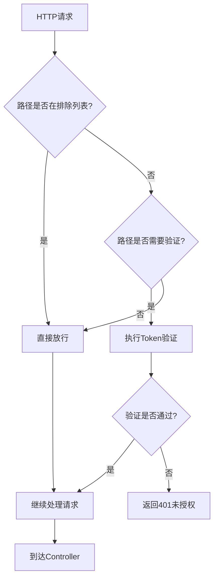
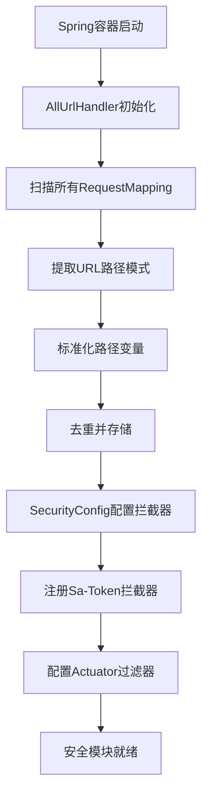

# 安全防护 (security) 

## 模块概述

`ruoyi-common-security` 是RuoYi-PLus-Uniapp框架的核心安全模块，提供应用安全防护与权限管理功能。该模块基于Sa-Token框架实现，具有高度的灵活性和可配置性。

### 主要功能

- **动态URL路径收集**：自动扫描所有Controller映射路径
- **灵活的权限控制**：支持白名单机制和路径排除规则
- **登录验证拦截**：全局Token验证，保护敏感资源
- **监控端点保护**：为Actuator提供HTTP Basic认证
- **SSE服务支持**：特殊处理Server-Sent Events路径

## 模块依赖

```xml
<dependency>
    <groupId>plus.ruoyi</groupId>
    <artifactId>ruoyi-common-satoken</artifactId>
</dependency>
```

## 核心组件

### 1. AllUrlHandler - URL路径收集器

#### 功能描述

`AllUrlHandler` 负责自动收集Spring MVC中所有Controller的URL映射路径，为安全拦截器提供完整的路径信息。

#### 工作原理

1. **自动扫描**：在Spring容器初始化完成后，扫描所有`RequestMapping`
2. **路径标准化**：将路径变量占位符（如`{id}`）替换为通配符`*`
3. **去重处理**：使用Set确保URL路径的唯一性
4. **结果存储**：提供标准化的URL列表供安全组件使用

#### 路径转换示例

| 原始路径 | 处理后路径 |
|---------|-----------|
| `/api/user/{id}` | `/api/user/*` |
| `/system/role/{roleId}/users` | `/system/role/*/users` |
| `/order/{orderId}/items/{itemId}` | `/order/*/items/*` |

#### 应用场景

- 安全拦截器路径匹配
- 动态权限控制
- 避免硬编码URL路径
- 与白名单配置协同工作

### 2. SecurityConfig - 安全配置类

#### 配置功能

`SecurityConfig` 是整个安全模块的核心配置类，基于Sa-Token框架提供以下功能：

##### 2.1 登录验证拦截器

```java
// 拦截器配置
registry.addInterceptor(new SaInterceptor(handler -> {
    AllUrlHandler allUrlHandler = SpringUtils.getBean(AllUrlHandler.class);
    
    SaRouter
        .match(allUrlHandler.getUrls())  // 匹配所有需要验证的路径
        .check(StpUtil::checkLogin);     // 执行登录检查
}))
.addPathPatterns("/**")                  // 拦截所有路径
.excludePathPatterns(securityProperties.getExcludes())  // 排除白名单
.excludePathPatterns(ssePath);           // 排除SSE路径
```

##### 2.2 Actuator监控保护

```java
@Bean
public SaServletFilter getSaServletFilter() {
    return new SaServletFilter()
        .addInclude("/actuator", "/actuator/**")
        .setAuth(obj -> {
            SaHttpBasicUtil.check(username + ":" + password);
        })
        .setError(e -> SaResult.error(e.getMessage()).setCode(HttpStatus.UNAUTHORIZED));
}
```

### 3. SecurityProperties - 配置属性

#### 配置格式

```yaml
security:
  excludes:
    - /login
    - /register
    - /captcha
    - /api/public/**
    - /v3/api-docs/**
    - /static/**
    - /actuator/health
    - /actuator/info
```

#### 路径匹配规则

支持Ant风格的路径匹配模式：

- `?` 匹配一个字符
- `*` 匹配零个或多个字符
- `**` 匹配零个或多个目录

#### 常见排除路径分类

| 分类 | 路径示例 | 说明 |
|-----|---------|------|
| 静态资源 | `/resources/**`, `/*.html`, `/**/*.css`, `/**/*.js` | 前端静态文件和资源 |
| 网站图标 | `/favicon.ico` | 浏览器标签页图标 |
| 错误页面 | `/error` | Spring Boot默认错误页面 |
| API文档 | `/*/api-docs`, `/*/api-docs/**` | OpenAPI文档接口 |
| HTML页面 | `/**/*.html` | 各级目录下的HTML页面 |

#### 路径配置说明

根据实际配置，当前安全模块主要排除以下类型的路径：

1. **静态资源保护**：
   - `/resources/**` - Spring Boot默认静态资源路径
   - `/**/*.css` - 所有CSS样式文件
   - `/**/*.js` - 所有JavaScript脚本文件

2. **页面文件访问**：
   - `/*.html` - 根目录下的HTML文件
   - `/**/*.html` - 各级目录下的HTML页面

3. **系统相关**：
   - `/favicon.ico` - 网站图标文件
   - `/error` - Spring Boot错误处理页面

4. **文档接口**：
   - `/*/api-docs` - API文档根路径（如 `/v3/api-docs`）
   - `/*/api-docs/**` - API文档详细路径

## 自动配置

模块通过Spring Boot的自动配置机制加载：

```
# META-INF/spring/org.springframework.boot.autoconfigure.AutoConfiguration.imports
plus.ruoyi.common.security.handler.AllUrlHandler
plus.ruoyi.common.security.config.SecurityConfig
```

## 配置示例

### 完整配置示例

```yaml
# 安全配置
security:
  # 排除路径
  excludes:
    # 本地文件路径/resources/**
    - /resources/**
    - /*.html
    - /**/*.html
    - /**/*.css
    - /**/*.js
    - /favicon.ico
    - /error
    - /*/api-docs
    - /*/api-docs/**

```

## 使用指南

### 1. 添加模块依赖

在需要使用安全功能的模块中添加依赖：

```xml
<dependency>
    <groupId>plus.ruoyi</groupId>
    <artifactId>ruoyi-common-security</artifactId>
</dependency>
```

### 2. 配置排除路径

根据应用需求配置不需要认证的路径：

```yaml
security:
  excludes:
    - /resources/**    # 静态资源
    - /*.html         # 根目录HTML文件
    - /error          # 错误页面
```

### 3. 自定义认证逻辑

如需扩展认证逻辑，可以继承或替换相关组件：

```java
@Component
public class CustomSecurityConfig extends SecurityConfig {
    
    @Override
    public void addInterceptors(InterceptorRegistry registry) {
        // 自定义拦截器逻辑
        registry.addInterceptor(new SaInterceptor(handler -> {
            SaRouter.match("/**").check(() -> {
                // 自定义验证逻辑
                if (!StpUtil.isLogin()) {
                    // 处理未登录情况
                    throw new NotLoginException("用户未登录");
                }
                // 其他验证逻辑...
            });
        }));
    }
}
```

## 工作流程

### 请求处理流程



### 初始化流程



## 最佳实践

### 1. 路径配置建议

- **精确匹配优先**：能用精确路径就不用通配符
- **最小权限原则**：只排除必要的路径
- **分类管理**：按功能分类配置排除路径
- **定期审查**：定期检查配置的合理性

### 2. 性能优化

- **缓存URL列表**：AllUrlHandler在启动时一次性收集
- **高效匹配**：使用Set存储确保查找效率
- **合理配置**：避免过度复杂的路径匹配规则

### 3. 安全考虑

- **白名单管控**：严格控制排除路径的范围
- **监控保护**：为Actuator端点配置强密码
- **日志记录**：记录安全相关的操作日志
- **定期更新**：及时更新Sa-Token版本

## 故障排查

### 常见问题

#### 1. 路径无法访问（401错误）

**问题原因**：路径未在排除列表中，但应用期望无需认证

**解决方案**：
- 检查`security.excludes`配置
- 确认路径匹配规则是否正确
- 验证用户是否已正确登录

#### 2. AllUrlHandler收集不到路径

**问题原因**：Controller未正确注册或扫描路径错误

**解决方案**：
- 确认Controller类有`@Controller`或`@RestController`注解
- 检查Spring的组件扫描配置
- 验证RequestMapping注解配置

#### 3. Actuator认证失败

**问题原因**：HTTP Basic认证配置错误

**解决方案**：
- 检查`spring.boot.admin.client`配置
- 确认用户名密码正确性
- 验证请求头格式

### 调试方法

#### 启用调试日志

```yaml
logging:
  level:
    plus.ruoyi.common.security: DEBUG
    cn.dev33.satoken: DEBUG
```

#### 查看收集的URL

```java
@Autowired
private AllUrlHandler allUrlHandler;

@PostConstruct
public void printUrls() {
    log.info("收集到的URL路径: {}", allUrlHandler.getUrls());
}
```

## 相关链接

- [Sa-Token官方文档](https://sa-token.cc/)
