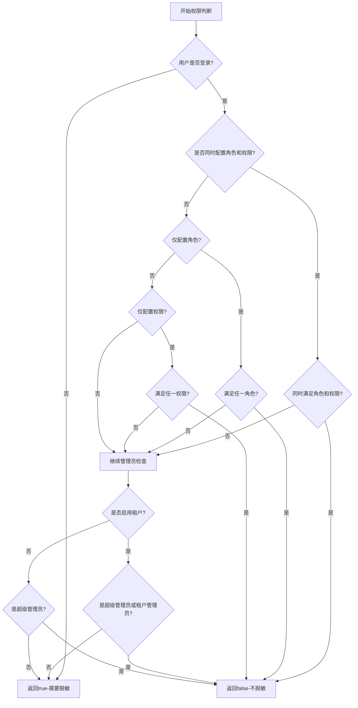

# 脱敏处理 (sensitive) 

## 模块概述

`ruoyi-common-sensitive` 是RuoYi-Plus-Uniapp框架的数据脱敏模块，提供数据脱敏与隐私保护功能。该模块基于Jackson序列化机制，通过注解驱动的方式自动处理敏感数据，支持多种脱敏策略和权限控制。

### 主要功能

- **注解驱动脱敏**：通过`@Sensitive`注解标记敏感字段
- **多种脱敏策略**：内置15+种常见敏感数据脱敏算法
- **权限控制**：基于角色和权限的灵活访问控制
- **自动化处理**：集成Jackson序列化，JSON输出时自动脱敏
- **容错机制**：异常情况下保证数据正常输出
- **扩展性强**：支持自定义脱敏策略和权限判断逻辑

## 模块依赖

```xml
<dependency>
    <groupId>plus.ruoyi</groupId>
    <artifactId>ruoyi-common-json</artifactId>
</dependency>
```

## 核心组件

### 1. @Sensitive 注解

#### 注解属性

| 属性 | 类型 | 描述 | 默认值 |
|------|------|------|--------|
| `strategy` | `SensitiveStrategy` | 脱敏策略 | 必填 |
| `roleKey` | `String[]` | 允许查看原数据的角色标识 | `{}` |
| `perms` | `String[]` | 允许查看原数据的权限标识 | `{}` |

#### 权限判断逻辑

RuoYi-Plus-Uniapp框架采用了精确的权限判断逻辑：

- **未登录用户**：一律进行脱敏处理
- **角色和权限并存**：同时配置时需要同时满足才不脱敏（AND关系）
- **仅配置角色**：拥有任一角色即不脱敏（OR关系）
- **仅配置权限**：拥有任一权限即不脱敏（OR关系）
- **管理员特权**：
    - 租户环境：超级管理员和租户管理员都不脱敏
    - 非租户环境：仅超级管理员不脱敏

#### 使用示例

```java
public class UserInfo {
    // 手机号脱敏，admin角色可查看原数据
    @Sensitive(strategy = SensitiveStrategy.PHONE, roleKey = {"admin"})
    private String phone;

    // 身份证脱敏，需要用户查询权限
    @Sensitive(strategy = SensitiveStrategy.ID_CARD, perms = {"user:query"})
    private String idCard;

    // 邮箱脱敏，满足任一角色或权限即可查看
    @Sensitive(strategy = SensitiveStrategy.EMAIL, 
               roleKey = {"admin", "manager"}, 
               perms = {"user:detail", "user:export"})
    private String email;

    // 地址脱敏，仅超级管理员可查看
    @Sensitive(strategy = SensitiveStrategy.ADDRESS, roleKey = {"superadmin"})
    private String address;
}
```

### 2. SensitiveStrategy 脱敏策略枚举

#### 内置脱敏策略

| 策略名称 | 适用场景 | 脱敏效果示例 | 说明 |
|---------|----------|-------------|------|
| `ID_CARD` | 身份证号 | `110***********1234` | 保留前3位和后4位 |
| `PHONE` | 手机号码 | `138****8888` | 保留前3位和后4位 |
| `ADDRESS` | 地址信息 | `北京市朝阳区****` | 保留前8个字符 |
| `EMAIL` | 邮箱地址 | `t**@example.com` | 保留用户名首尾字符和完整域名 |
| `BANK_CARD` | 银行卡号 | `6222***********1234` | 保留前4位和后4位 |
| `CHINESE_NAME` | 中文姓名 | `张*` | 保留姓氏，名字用*代替 |
| `FIXED_PHONE` | 固定电话 | `010-****8888` | 保留区号和后4位 |
| `USER_ID` | 用户ID | `随机数字` | 生成随机数字替代 |
| `PASSWORD` | 密码 | `******` | 全部用*代替 |
| `IPV4` | IPv4地址 | `192.168.***.***` | 保留网络段，隐藏主机段 |
| `IPV6` | IPv6地址 | `2001:db8::****` | 保留前缀，隐藏接口标识 |
| `CAR_LICENSE` | 车牌号 | `京A****8` | 支持普通和新能源车辆 |
| `FIRST_MASK` | 首字符保留 | `张***` | 只显示第一个字符 |
| `CLEAR` | 清空数据 | `""` | 返回空字符串 |
| `CLEAR_TO_NULL` | 置空数据 | `null` | 返回null值 |

#### 脱敏效果对比

```java
String phone = "13812345678";
String idCard = "11010119900101123X";
String email = "test@example.com";
String address = "北京市朝阳区建国路88号";

// 脱敏后效果：
// PHONE: 138****5678
// ID_CARD: 110***********123X
// EMAIL: t**t@example.com
// ADDRESS: 北京市朝阳区****
```

### 3. SensitiveService 权限判断接口

#### 接口定义

```java
public interface SensitiveService {
    /**
     * 判断是否需要进行数据脱敏
     *
     * @param roleKey 允许查看原始数据的角色标识数组
     * @param perms 允许查看原始数据的权限标识数组
     * @return true表示需要脱敏，false表示不需要脱敏
     */
    boolean isSensitive(String[] roleKey, String[] perms);
}
```

#### 框架默认实现

RuoYi-Plus-Uniapp提供了完整的权限判断实现：

```java
@Service
public class SysSensitiveServiceImpl implements SensitiveService {

    @Override
    public boolean isSensitive(String[] roleKey, String[] perms) {
        // 未登录用户一律脱敏
        if (!LoginHelper.isLogin()) {
            return true;
        }

        boolean roleExist = ArrayUtil.isNotEmpty(roleKey);
        boolean permsExist = ArrayUtil.isNotEmpty(perms);

        // 权限检查逻辑
        if (roleExist && permsExist) {
            // 同时配置角色和权限：需要同时满足才不脱敏
            if (StpUtil.hasRoleOr(roleKey) && StpUtil.hasPermissionOr(perms)) {
                return false;
            }
        } else if (roleExist && StpUtil.hasRoleOr(roleKey)) {
            // 仅配置角色：拥有任一角色即不脱敏
            return false;
        } else if (permsExist && StpUtil.hasPermissionOr(perms)) {
            // 仅配置权限：拥有任一权限即不脱敏
            return false;
        }

        // 管理员特权检查
        if (TenantHelper.isEnable()) {
            // 租户环境：超级管理员和租户管理员都不脱敏
            return !LoginHelper.isSuperAdmin() && !LoginHelper.isTenantAdmin();
        }

        // 非租户环境：仅超级管理员不脱敏
        return !LoginHelper.isSuperAdmin();
    }
}
```

#### 权限判断流程



### 4. SensitiveHandler JSON序列化处理器

#### 工作流程

```mermaid
graph TD
    A[JSON序列化开始] --> B{字段是否有@Sensitive注解?}
    B -->|否| C[使用默认序列化]
    B -->|是| D{字段类型是否为String?}
    D -->|否| C
    D -->|是| E[解析注解配置]
    E --> F[获取SensitiveService]
    F --> G{Service是否存在?}
    G -->|否| H[输出原始数据]
    G -->|是| I[调用权限判断]
    I --> J{是否需要脱敏?}
    J -->|否| H
    J -->|是| K[应用脱敏策略]
    K --> L[输出脱敏数据]
    H --> M[序列化完成]
    L --> M
    C --> M
```

#### 容错机制

1. **Service缺失处理**：当`SensitiveService`实现不存在时，默认输出原始数据
2. **异常捕获**：权限判断异常时记录日志并返回原始数据
3. **类型检查**：仅对String类型字段进行脱敏处理
4. **注解校验**：确保注解正确配置后才进行处理

## 使用指南

### 1. 添加模块依赖

```xml
<dependency>
    <groupId>plus.ruoyi</groupId>
    <artifactId>ruoyi-common-sensitive</artifactId>
</dependency>
```

### 2. 使用框架默认实现

RuoYi-Plus-Uniapp已经提供了完整的`SysSensitiveServiceImpl`实现，通常无需自定义。如需扩展，可以继承或替换：

```java
// 扩展默认实现
@Service
@Primary
public class CustomSensitiveService extends SysSensitiveServiceImpl {
    
    @Override
    public boolean isSensitive(String[] roleKey, String[] perms) {
        // 可以添加自定义逻辑
        if (isSpecialCondition()) {
            return false; // 特殊情况不脱敏
        }
        
        // 调用父类默认实现
        return super.isSensitive(roleKey, perms);
    }
    
    private boolean isSpecialCondition() {
        // 自定义判断逻辑，如特定时间段、特殊用户等
        return false;
    }
}
```

### 3. 实体类添加脱敏注解

```java
@Data
public class Customer {
    
    private Long id;
    
    @Sensitive(strategy = SensitiveStrategy.CHINESE_NAME, roleKey = {"admin"})
    private String realName;
    
    @Sensitive(strategy = SensitiveStrategy.PHONE, perms = {"customer:detail"})
    private String mobile;
    
    @Sensitive(strategy = SensitiveStrategy.ID_CARD, 
               roleKey = {"admin", "manager"}, 
               perms = {"customer:sensitive"})
    private String idNumber;
    
    @Sensitive(strategy = SensitiveStrategy.EMAIL)
    private String email;
    
    @Sensitive(strategy = SensitiveStrategy.ADDRESS, roleKey = {"admin"})
    private String address;
    
    // 非敏感字段正常处理
    private String remark;
    private Date createTime;
}
```

### 4. Controller接口返回

```java
@RestController
public class CustomerController {
    
    @GetMapping("/customer/{id}")
    public R<Customer> getCustomer(@PathVariable Long id) {
        Customer customer = customerService.getById(id);
        // 返回时自动根据当前用户权限进行脱敏处理
        return R.ok(customer);
    }
    
    @GetMapping("/customers")
    public R<List<Customer>> getCustomers() {
        List<Customer> customers = customerService.list();
        // 列表数据也会自动脱敏
        return R.ok(customers);
    }
}
```

## 高级用法

### 1. 自定义脱敏策略

```java
public enum CustomSensitiveStrategy {
    
    // 自定义策略：工号脱敏（保留前2位和后2位）
    EMPLOYEE_NO(s -> {
        if (s.length() <= 4) return "****";
        return s.substring(0, 2) + "****" + s.substring(s.length() - 2);
    }),
    
    // 自定义策略：金额脱敏（只显示千位以上）
    AMOUNT(s -> {
        try {
            double amount = Double.parseDouble(s);
            if (amount >= 10000) {
                return String.format("%.1f万+", amount / 10000);
            } else if (amount >= 1000) {
                return String.format("%.1f千+", amount / 1000);
            }
            return "***";
        } catch (NumberFormatException e) {
            return "***";
        }
    });

    private final Function<String, String> desensitizer;

    CustomSensitiveStrategy(Function<String, String> desensitizer) {
        this.desensitizer = desensitizer;
    }

    public Function<String, String> desensitizer() {
        return desensitizer;
    }
}
```

### 2. 条件脱敏

```java
@Component
@Primary
public class ConditionalSensitiveService extends SysSensitiveServiceImpl {
    
    @Override
    public boolean isSensitive(String[] roleKey, String[] perms) {
        // 根据不同条件判断
        if (isWorkingHours()) {
            // 工作时间内权限宽松
            return super.isSensitive(roleKey, perms);
        } else {
            // 非工作时间权限严格，需要更高权限
            return !LoginHelper.isSuperAdmin();
        }
    }
    
    private boolean isWorkingHours() {
        LocalTime now = LocalTime.now();
        return now.isAfter(LocalTime.of(9, 0)) && 
               now.isBefore(LocalTime.of(18, 0));
    }
}
```

### 3. 动态脱敏配置

```java
@Component
@Primary
public class DynamicSensitiveService extends SysSensitiveServiceImpl {
    
    @Autowired
    private SensitiveConfigService configService;
    
    @Override
    public boolean isSensitive(String[] roleKey, String[] perms) {
        // 从配置中心或数据库读取脱敏规则
        SensitiveConfig config = configService.getCurrentConfig();
        
        if (!config.isEnabled()) {
            return false; // 脱敏功能关闭
        }
        
        // 如果配置了特殊规则，优先使用
        if (config.hasCustomRules()) {
            return config.shouldDesensitize(roleKey, perms);
        }
        
        // 否则使用框架默认逻辑
        return super.isSensitive(roleKey, perms);
    }
}
```

## 配置示例

### application.yml配置

```yaml
# 脱敏相关配置
sensitive:
  # 是否启用脱敏功能
  enabled: true
  # 默认脱敏策略
  default-strategy: FIRST_MASK

# 租户配置
tenant:
  # 是否启用多租户
  enable: true

# Jackson配置
spring:
  jackson:
    # 启用脱敏序列化器
    serialization:
      write-null-map-values: false
```

## 测试用例

### 单元测试示例

```java
@SpringBootTest
class SensitiveTest {
    
    @Autowired
    private ObjectMapper objectMapper;
    
    @Test
    void testPhoneDesensitization() throws Exception {
        TestUser user = new TestUser();
        user.setPhone("13812345678");
        
        // 模拟普通用户（需要脱敏）
        mockUser("user", new String[0]);
        String json = objectMapper.writeValueAsString(user);
        assertThat(json).contains("138****5678");
        
        // 模拟管理员（不脱敏）
        mockUser("admin", new String[]{"admin"});
        json = objectMapper.writeValueAsString(user);
        assertThat(json).contains("13812345678");
    }
    
    @Test
    void testMultipleFields() throws Exception {
        Customer customer = new Customer();
        customer.setRealName("张三");
        customer.setMobile("13812345678");
        customer.setIdNumber("110101199001011234");
        customer.setEmail("test@example.com");
        
        mockUser("user", new String[0]);
        String json = objectMapper.writeValueAsString(customer);
        
        assertThat(json).contains("张*");
        assertThat(json).contains("138****5678");
        assertThat(json).contains("110***********1234");
        assertThat(json).contains("t**t@example.com");
    }
    
    private void mockUser(String role, String[] roles) {
        // 模拟用户登录状态和角色
        // 具体实现根据项目的用户管理方式调整
    }
}
```

## 性能考虑

### 1. 序列化性能

- **缓存策略**：序列化器实例会被Jackson缓存，避免重复创建
- **类型检查**：仅对String类型字段进行处理，其他类型直接跳过
- **权限判断**：建议在权限判断中使用缓存，避免频繁查询

### 2. 内存优化

```java
@Service
@Primary
public class CachedSensitiveService extends SysSensitiveServiceImpl {
    
    private final Cache<String, Boolean> permissionCache = 
        Caffeine.newBuilder()
            .maximumSize(1000)
            .expireAfterWrite(5, TimeUnit.MINUTES)
            .build();
    
    @Override
    public boolean isSensitive(String[] roleKey, String[] perms) {
        // 对于登录用户使用缓存
        if (LoginHelper.isLogin()) {
            String cacheKey = buildCacheKey(LoginHelper.getUserId(), roleKey, perms);
            return permissionCache.get(cacheKey, k -> super.isSensitive(roleKey, perms));
        }
        
        // 未登录用户直接返回
        return true;
    }
    
    private String buildCacheKey(Long userId, String[] roleKey, String[] perms) {
        return userId + ":" + Arrays.toString(roleKey) + ":" + Arrays.toString(perms);
    }
}
```

## 最佳实践

### 1. 注解使用建议

- **精确控制**：根据实际业务需求配置角色和权限
- **分层设计**：不同敏感级别使用不同的权限要求
- **文档说明**：为每个脱敏字段添加清晰的注释说明

### 2. 权限设计

- **最小权限**：默认进行脱敏，只对特定角色开放原始数据
- **审计日志**：记录敏感数据的访问日志
- **定期审查**：定期检查权限配置的合理性

### 3. 错误处理

- **容错机制**：确保脱敏失败时不影响业务正常运行
- **日志监控**：记录脱敏相关的错误和异常
- **降级策略**：在系统异常时采用更严格的脱敏策略

## 故障排查

### 常见问题

#### 1. 脱敏不生效

**可能原因**：
- 框架的SysSensitiveServiceImpl未正确加载
- 注解配置错误
- 字段类型不是String

**解决方案**：
- 确认框架的system模块已正确引入
- 验证`@Sensitive`注解配置
- 确认字段类型为String类型

#### 2. 权限判断异常

**可能原因**：
- 用户未登录
- 权限标识不正确
- 角色配置与系统不一致
- 租户配置问题

**解决方案**：
- 检查用户登录状态
- 验证权限标识的正确性
- 确认角色配置与系统一致
- 检查租户环境配置

#### 3. 租户环境脱敏异常

**可能原因**：
- 租户配置未启用
- 租户管理员权限配置错误

**解决方案**：
- 检查`tenant.enable`配置
- 验证租户管理员角色配置

#### 3. 序列化异常

**可能原因**：
- Jackson配置冲突
- 自定义序列化器冲突

**解决方案**：
- 检查Jackson相关配置
- 避免在同一字段使用多个序列化注解

### 调试方法

#### 启用调试日志

```yaml
logging:
  level:
    plus.ruoyi.common.sensitive: DEBUG
    com.fasterxml.jackson: DEBUG
```

#### 测试脱敏效果

```java
@RestController
public class TestController {
    
    @GetMapping("/test/sensitive")
    public R<TestData> testSensitive() {
        TestData data = new TestData();
        data.setPhone("13812345678");
        data.setIdCard("110101199001011234");
        return R.ok(data);
    }
    
    @GetMapping("/test/sensitive/tenant")
    public R<Map<String, Object>> testTenantSensitive() {
        Map<String, Object> result = new HashMap<>();
        result.put("isTenantEnable", TenantHelper.isEnable());
        result.put("isSuperAdmin", LoginHelper.isSuperAdmin());
        result.put("isTenantAdmin", LoginHelper.isTenantAdmin());
        return R.ok(result);
    }
}
```
