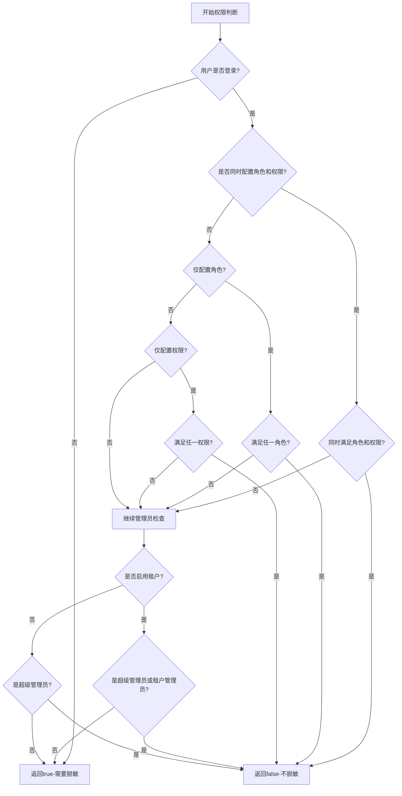

# 脱敏处理 (sensitive) 

## 模块概述

`ruoyi-common-sensitive` 是RuoYi-Plus-Uniapp框架的数据脱敏模块，提供数据脱敏与隐私保护功能。该模块基于Jackson序列化机制，通过注解驱动的方式自动处理敏感数据，支持多种脱敏策略和权限控制。

### 主要功能

- **注解驱动脱敏**：通过`@Sensitive`注解标记敏感字段
- **多种脱敏策略**：内置15+种常见敏感数据脱敏算法
- **权限控制**：基于角色和权限的灵活访问控制
- **自动化处理**：集成Jackson序列化，JSON输出时自动脱敏
- **容错机制**：异常情况下保证数据正常输出
- **扩展性强**：支持自定义脱敏策略和权限判断逻辑

## 模块依赖

```xml
<dependency>
    <groupId>plus.ruoyi</groupId>
    <artifactId>ruoyi-common-json</artifactId>
</dependency>
```

## 核心组件

### 1. @Sensitive 注解

#### 注解属性

| 属性 | 类型 | 描述 | 默认值 |
|------|------|------|--------|
| `strategy` | `SensitiveStrategy` | 脱敏策略 | 必填 |
| `roleKey` | `String[]` | 允许查看原数据的角色标识 | `{}` |
| `perms` | `String[]` | 允许查看原数据的权限标识 | `{}` |

#### 权限判断逻辑

RuoYi-Plus-Uniapp框架采用了精确的权限判断逻辑：

- **未登录用户**：一律进行脱敏处理
- **角色和权限并存**：同时配置时需要同时满足才不脱敏（AND关系）
- **仅配置角色**：拥有任一角色即不脱敏（OR关系）
- **仅配置权限**：拥有任一权限即不脱敏（OR关系）
- **管理员特权**：
    - 租户环境：超级管理员和租户管理员都不脱敏
    - 非租户环境：仅超级管理员不脱敏

#### 使用示例

```java
public class UserInfo {
    // 手机号脱敏，admin角色可查看原数据
    @Sensitive(strategy = SensitiveStrategy.PHONE, roleKey = {"admin"})
    private String phone;

    // 身份证脱敏，需要用户查询权限
    @Sensitive(strategy = SensitiveStrategy.ID_CARD, perms = {"user:query"})
    private String idCard;

    // 邮箱脱敏，满足任一角色或权限即可查看
    @Sensitive(strategy = SensitiveStrategy.EMAIL, 
               roleKey = {"admin", "manager"}, 
               perms = {"user:detail", "user:export"})
    private String email;

    // 地址脱敏，仅超级管理员可查看
    @Sensitive(strategy = SensitiveStrategy.ADDRESS, roleKey = {"superadmin"})
    private String address;
}
```

### 2. SensitiveStrategy 脱敏策略枚举

#### 内置脱敏策略

| 策略名称 | 适用场景 | 脱敏效果示例 | 说明 |
|---------|----------|-------------|------|
| `ID_CARD` | 身份证号 | `110***********1234` | 保留前3位和后4位 |
| `PHONE` | 手机号码 | `138****8888` | 保留前3位和后4位 |
| `ADDRESS` | 地址信息 | `北京市朝阳区****` | 保留前8个字符 |
| `EMAIL` | 邮箱地址 | `t**@example.com` | 保留用户名首尾字符和完整域名 |
| `BANK_CARD` | 银行卡号 | `6222***********1234` | 保留前4位和后4位 |
| `CHINESE_NAME` | 中文姓名 | `张*` | 保留姓氏，名字用*代替 |
| `FIXED_PHONE` | 固定电话 | `010-****8888` | 保留区号和后4位 |
| `USER_ID` | 用户ID | `随机数字` | 生成随机数字替代 |
| `PASSWORD` | 密码 | `******` | 全部用*代替 |
| `IPV4` | IPv4地址 | `192.168.***.***` | 保留网络段，隐藏主机段 |
| `IPV6` | IPv6地址 | `2001:db8::****` | 保留前缀，隐藏接口标识 |
| `CAR_LICENSE` | 车牌号 | `京A****8` | 支持普通和新能源车辆 |
| `FIRST_MASK` | 首字符保留 | `张***` | 只显示第一个字符 |
| `CLEAR` | 清空数据 | `""` | 返回空字符串 |
| `CLEAR_TO_NULL` | 置空数据 | `null` | 返回null值 |

#### 脱敏效果对比

```java
String phone = "13812345678";
String idCard = "11010119900101123X";
String email = "test@example.com";
String address = "北京市朝阳区建国路88号";

// 脱敏后效果：
// PHONE: 138****5678
// ID_CARD: 110***********123X
// EMAIL: t**t@example.com
// ADDRESS: 北京市朝阳区****
```

### 3. SensitiveService 权限判断接口

#### 接口定义

```java
public interface SensitiveService {
    /**
     * 判断是否需要进行数据脱敏
     *
     * @param roleKey 允许查看原始数据的角色标识数组
     * @param perms 允许查看原始数据的权限标识数组
     * @return true表示需要脱敏，false表示不需要脱敏
     */
    boolean isSensitive(String[] roleKey, String[] perms);
}
```

#### 框架默认实现

RuoYi-Plus-Uniapp提供了完整的权限判断实现：

```java
@Service
public class SysSensitiveServiceImpl implements SensitiveService {

    @Override
    public boolean isSensitive(String[] roleKey, String[] perms) {
        // 未登录用户一律脱敏
        if (!LoginHelper.isLogin()) {
            return true;
        }

        boolean roleExist = ArrayUtil.isNotEmpty(roleKey);
        boolean permsExist = ArrayUtil.isNotEmpty(perms);

        // 权限检查逻辑
        if (roleExist && permsExist) {
            // 同时配置角色和权限：需要同时满足才不脱敏
            if (StpUtil.hasRoleOr(roleKey) && StpUtil.hasPermissionOr(perms)) {
                return false;
            }
        } else if (roleExist && StpUtil.hasRoleOr(roleKey)) {
            // 仅配置角色：拥有任一角色即不脱敏
            return false;
        } else if (permsExist && StpUtil.hasPermissionOr(perms)) {
            // 仅配置权限：拥有任一权限即不脱敏
            return false;
        }

        // 管理员特权检查
        if (TenantHelper.isEnable()) {
            // 租户环境：超级管理员和租户管理员都不脱敏
            return !LoginHelper.isSuperAdmin() && !LoginHelper.isTenantAdmin();
        }

        // 非租户环境：仅超级管理员不脱敏
        return !LoginHelper.isSuperAdmin();
    }
}
```

#### 权限判断流程



### 4. SensitiveHandler JSON序列化处理器

#### 工作流程

```mermaid
graph TD
    A[JSON序列化开始] --> B{字段是否有@Sensitive注解?}
    B -->|否| C[使用默认序列化]
    B -->|是| D{字段类型是否为String?}
    D -->|否| C
    D -->|是| E[解析注解配置]
    E --> F[获取SensitiveService]
    F --> G{Service是否存在?}
    G -->|否| H[输出原始数据]
    G -->|是| I[调用权限判断]
    I --> J{是否需要脱敏?}
    J -->|否| H
    J -->|是| K[应用脱敏策略]
    K --> L[输出脱敏数据]
    H --> M[序列化完成]
    L --> M
    C --> M
```

#### 容错机制

1. **Service缺失处理**：当`SensitiveService`实现不存在时，默认输出原始数据
2. **异常捕获**：权限判断异常时记录日志并返回原始数据
3. **类型检查**：仅对String类型字段进行脱敏处理
4. **注解校验**：确保注解正确配置后才进行处理

## 使用指南

### 1. 添加模块依赖

```xml
<dependency>
    <groupId>plus.ruoyi</groupId>
    <artifactId>ruoyi-common-sensitive</artifactId>
</dependency>
```

### 2. 使用框架默认实现

RuoYi-Plus-Uniapp已经提供了完整的`SysSensitiveServiceImpl`实现，通常无需自定义。如需扩展，可以继承或替换：

```java
// 扩展默认实现
@Service
@Primary
public class CustomSensitiveService extends SysSensitiveServiceImpl {
    
    @Override
    public boolean isSensitive(String[] roleKey, String[] perms) {
        // 可以添加自定义逻辑
        if (isSpecialCondition()) {
            return false; // 特殊情况不脱敏
        }
        
        // 调用父类默认实现
        return super.isSensitive(roleKey, perms);
    }
    
    private boolean isSpecialCondition() {
        // 自定义判断逻辑，如特定时间段、特殊用户等
        return false;
    }
}
```

### 3. 实体类添加脱敏注解

```java
@Data
public class Customer {
    
    private Long id;
    
    @Sensitive(strategy = SensitiveStrategy.CHINESE_NAME, roleKey = {"admin"})
    private String realName;
    
    @Sensitive(strategy = SensitiveStrategy.PHONE, perms = {"customer:detail"})
    private String mobile;
    
    @Sensitive(strategy = SensitiveStrategy.ID_CARD, 
               roleKey = {"admin", "manager"}, 
               perms = {"customer:sensitive"})
    private String idNumber;
    
    @Sensitive(strategy = SensitiveStrategy.EMAIL)
    private String email;
    
    @Sensitive(strategy = SensitiveStrategy.ADDRESS, roleKey = {"admin"})
    private String address;
    
    // 非敏感字段正常处理
    private String remark;
    private Date createTime;
}
```

### 4. Controller接口返回

```java
@RestController
public class CustomerController {
    
    @GetMapping("/customer/{id}")
    public R<Customer> getCustomer(@PathVariable Long id) {
        Customer customer = customerService.getById(id);
        // 返回时自动根据当前用户权限进行脱敏处理
        return R.ok(customer);
    }
    
    @GetMapping("/customers")
    public R<List<Customer>> getCustomers() {
        List<Customer> customers = customerService.list();
        // 列表数据也会自动脱敏
        return R.ok(customers);
    }
}
```

## 高级用法

### 1. 自定义脱敏策略

```java
public enum CustomSensitiveStrategy {
    
    // 自定义策略：工号脱敏（保留前2位和后2位）
    EMPLOYEE_NO(s -> {
        if (s.length() <= 4) return "****";
        return s.substring(0, 2) + "****" + s.substring(s.length() - 2);
    }),
    
    // 自定义策略：金额脱敏（只显示千位以上）
    AMOUNT(s -> {
        try {
            double amount = Double.parseDouble(s);
            if (amount >= 10000) {
                return String.format("%.1f万+", amount / 10000);
            } else if (amount >= 1000) {
                return String.format("%.1f千+", amount / 1000);
            }
            return "***";
        } catch (NumberFormatException e) {
            return "***";
        }
    });

    private final Function<String, String> desensitizer;

    CustomSensitiveStrategy(Function<String, String> desensitizer) {
        this.desensitizer = desensitizer;
    }

    public Function<String, String> desensitizer() {
        return desensitizer;
    }
}
```

### 2. 条件脱敏

```java
@Component
@Primary
public class ConditionalSensitiveService extends SysSensitiveServiceImpl {
    
    @Override
    public boolean isSensitive(String[] roleKey, String[] perms) {
        // 根据不同条件判断
        if (isWorkingHours()) {
            // 工作时间内权限宽松
            return super.isSensitive(roleKey, perms);
        } else {
            // 非工作时间权限严格，需要更高权限
            return !LoginHelper.isSuperAdmin();
        }
    }
    
    private boolean isWorkingHours() {
        LocalTime now = LocalTime.now();
        return now.isAfter(LocalTime.of(9, 0)) && 
               now.isBefore(LocalTime.of(18, 0));
    }
}
```

### 3. 动态脱敏配置

```java
@Component
@Primary
public class DynamicSensitiveService extends SysSensitiveServiceImpl {
    
    @Autowired
    private SensitiveConfigService configService;
    
    @Override
    public boolean isSensitive(String[] roleKey, String[] perms) {
        // 从配置中心或数据库读取脱敏规则
        SensitiveConfig config = configService.getCurrentConfig();
        
        if (!config.isEnabled()) {
            return false; // 脱敏功能关闭
        }
        
        // 如果配置了特殊规则，优先使用
        if (config.hasCustomRules()) {
            return config.shouldDesensitize(roleKey, perms);
        }
        
        // 否则使用框架默认逻辑
        return super.isSensitive(roleKey, perms);
    }
}
```

## 配置示例

### application.yml配置

```yaml
# 脱敏相关配置
sensitive:
  # 是否启用脱敏功能
  enabled: true
  # 默认脱敏策略
  default-strategy: FIRST_MASK

# 租户配置
tenant:
  # 是否启用多租户
  enable: true

# Jackson配置
spring:
  jackson:
    # 启用脱敏序列化器
    serialization:
      write-null-map-values: false
```

## 测试用例

### 单元测试示例

```java
@SpringBootTest
class SensitiveTest {
    
    @Autowired
    private ObjectMapper objectMapper;
    
    @Test
    void testPhoneDesensitization() throws Exception {
        TestUser user = new TestUser();
        user.setPhone("13812345678");
        
        // 模拟普通用户（需要脱敏）
        mockUser("user", new String[0]);
        String json = objectMapper.writeValueAsString(user);
        assertThat(json).contains("138****5678");
        
        // 模拟管理员（不脱敏）
        mockUser("admin", new String[]{"admin"});
        json = objectMapper.writeValueAsString(user);
        assertThat(json).contains("13812345678");
    }
    
    @Test
    void testMultipleFields() throws Exception {
        Customer customer = new Customer();
        customer.setRealName("张三");
        customer.setMobile("13812345678");
        customer.setIdNumber("110101199001011234");
        customer.setEmail("test@example.com");
        
        mockUser("user", new String[0]);
        String json = objectMapper.writeValueAsString(customer);
        
        assertThat(json).contains("张*");
        assertThat(json).contains("138****5678");
        assertThat(json).contains("110***********1234");
        assertThat(json).contains("t**t@example.com");
    }
    
    private void mockUser(String role, String[] roles) {
        // 模拟用户登录状态和角色
        // 具体实现根据项目的用户管理方式调整
    }
}
```

## 性能考虑

### 1. 序列化性能

- **缓存策略**：序列化器实例会被Jackson缓存，避免重复创建
- **类型检查**：仅对String类型字段进行处理，其他类型直接跳过
- **权限判断**：建议在权限判断中使用缓存，避免频繁查询

### 2. 内存优化

```java
@Service
@Primary
public class CachedSensitiveService extends SysSensitiveServiceImpl {
    
    private final Cache<String, Boolean> permissionCache = 
        Caffeine.newBuilder()
            .maximumSize(1000)
            .expireAfterWrite(5, TimeUnit.MINUTES)
            .build();
    
    @Override
    public boolean isSensitive(String[] roleKey, String[] perms) {
        // 对于登录用户使用缓存
        if (LoginHelper.isLogin()) {
            String cacheKey = buildCacheKey(LoginHelper.getUserId(), roleKey, perms);
            return permissionCache.get(cacheKey, k -> super.isSensitive(roleKey, perms));
        }
        
        // 未登录用户直接返回
        return true;
    }
    
    private String buildCacheKey(Long userId, String[] roleKey, String[] perms) {
        return userId + ":" + Arrays.toString(roleKey) + ":" + Arrays.toString(perms);
    }
}
```

## 最佳实践

### 1. 注解使用建议

- **精确控制**：根据实际业务需求配置角色和权限
- **分层设计**：不同敏感级别使用不同的权限要求
- **文档说明**：为每个脱敏字段添加清晰的注释说明

### 2. 权限设计

- **最小权限**：默认进行脱敏，只对特定角色开放原始数据
- **审计日志**：记录敏感数据的访问日志
- **定期审查**：定期检查权限配置的合理性

### 3. 错误处理

- **容错机制**：确保脱敏失败时不影响业务正常运行
- **日志监控**：记录脱敏相关的错误和异常
- **降级策略**：在系统异常时采用更严格的脱敏策略

## 故障排查

### 常见问题

#### 1. 脱敏不生效

**可能原因**：
- 框架的SysSensitiveServiceImpl未正确加载
- 注解配置错误
- 字段类型不是String

**解决方案**：
- 确认框架的system模块已正确引入
- 验证`@Sensitive`注解配置
- 确认字段类型为String类型

#### 2. 权限判断异常

**可能原因**：
- 用户未登录
- 权限标识不正确
- 角色配置与系统不一致
- 租户配置问题

**解决方案**：
- 检查用户登录状态
- 验证权限标识的正确性
- 确认角色配置与系统一致
- 检查租户环境配置

#### 3. 租户环境脱敏异常

**可能原因**：
- 租户配置未启用
- 租户管理员权限配置错误

**解决方案**：
- 检查`tenant.enable`配置
- 验证租户管理员角色配置

#### 3. 序列化异常

**可能原因**：
- Jackson配置冲突
- 自定义序列化器冲突

**解决方案**：
- 检查Jackson相关配置
- 避免在同一字段使用多个序列化注解

### 调试方法

#### 启用调试日志

```yaml
logging:
  level:
    plus.ruoyi.common.sensitive: DEBUG
    com.fasterxml.jackson: DEBUG
```

#### 测试脱敏效果

```java
@RestController
public class TestController {

    @GetMapping("/test/sensitive")
    public R<TestData> testSensitive() {
        TestData data = new TestData();
        data.setPhone("13812345678");
        data.setIdCard("110101199001011234");
        return R.ok(data);
    }

    @GetMapping("/test/sensitive/tenant")
    public R<Map<String, Object>> testTenantSensitive() {
        Map<String, Object> result = new HashMap<>();
        result.put("isTenantEnable", TenantHelper.isEnable());
        result.put("isSuperAdmin", LoginHelper.isSuperAdmin());
        result.put("isTenantAdmin", LoginHelper.isTenantAdmin());
        return R.ok(result);
    }
}
```

## 脱敏策略详解

### 身份证号脱敏策略

身份证号脱敏是最常见的脱敏场景之一，需要在保护隐私的同时保留一定的可识别性。

#### 实现原理

```java
/**
 * 身份证号脱敏策略
 * 18位身份证：保留前3位和后4位，中间用*代替
 * 15位身份证：保留前3位和后3位，中间用*代替
 */
public class IdCardDesensitizer implements Function<String, String> {

    @Override
    public String apply(String idCard) {
        if (StringUtils.isBlank(idCard)) {
            return idCard;
        }

        int length = idCard.length();
        if (length == 18) {
            // 18位身份证：110***********1234
            return idCard.substring(0, 3) +
                   StringUtils.repeat("*", 11) +
                   idCard.substring(14);
        } else if (length == 15) {
            // 15位身份证：110********234
            return idCard.substring(0, 3) +
                   StringUtils.repeat("*", 9) +
                   idCard.substring(12);
        }

        // 其他长度：全部脱敏
        return StringUtils.repeat("*", length);
    }
}
```

#### 使用场景

```java
@Data
public class IdCardExample {

    // 基础脱敏：所有用户都只能看到脱敏数据
    @Sensitive(strategy = SensitiveStrategy.ID_CARD)
    private String basicIdCard;

    // 角色控制：admin角色可以查看完整身份证
    @Sensitive(strategy = SensitiveStrategy.ID_CARD, roleKey = {"admin"})
    private String adminViewIdCard;

    // 权限控制：具有user:sensitive权限可查看
    @Sensitive(strategy = SensitiveStrategy.ID_CARD, perms = {"user:sensitive"})
    private String permViewIdCard;

    // 组合控制：需要同时满足角色和权限
    @Sensitive(strategy = SensitiveStrategy.ID_CARD,
               roleKey = {"admin"},
               perms = {"user:sensitive"})
    private String strictIdCard;
}
```

### 手机号脱敏策略

#### 实现原理

```java
/**
 * 手机号脱敏策略
 * 保留前3位和后4位，中间4位用*代替
 * 示例：13812345678 -> 138****5678
 */
public class PhoneDesensitizer implements Function<String, String> {

    @Override
    public String apply(String phone) {
        if (StringUtils.isBlank(phone)) {
            return phone;
        }

        // 移除非数字字符
        String cleanPhone = phone.replaceAll("[^0-9]", "");

        if (cleanPhone.length() == 11) {
            // 标准11位手机号
            return cleanPhone.substring(0, 3) + "****" + cleanPhone.substring(7);
        } else if (cleanPhone.length() > 7) {
            // 非标准长度：保留前3后4
            return cleanPhone.substring(0, 3) +
                   StringUtils.repeat("*", cleanPhone.length() - 7) +
                   cleanPhone.substring(cleanPhone.length() - 4);
        }

        return StringUtils.repeat("*", phone.length());
    }
}
```

#### 国际手机号处理

```java
/**
 * 支持国际手机号的脱敏策略
 */
public class InternationalPhoneDesensitizer implements Function<String, String> {

    @Override
    public String apply(String phone) {
        if (StringUtils.isBlank(phone)) {
            return phone;
        }

        // 检测国际区号
        if (phone.startsWith("+")) {
            // 国际格式：+86 138****5678
            int spaceIndex = phone.indexOf(" ");
            if (spaceIndex > 0) {
                String countryCode = phone.substring(0, spaceIndex);
                String number = phone.substring(spaceIndex + 1);
                return countryCode + " " + desensitizeNumber(number);
            }
        }

        return desensitizeNumber(phone);
    }

    private String desensitizeNumber(String number) {
        String cleanNumber = number.replaceAll("[^0-9]", "");
        if (cleanNumber.length() >= 7) {
            return cleanNumber.substring(0, 3) + "****" +
                   cleanNumber.substring(cleanNumber.length() - 4);
        }
        return StringUtils.repeat("*", number.length());
    }
}
```

### 邮箱地址脱敏策略

#### 实现原理

```java
/**
 * 邮箱脱敏策略
 * 保留用户名首尾字符和完整域名
 * 示例：testuser@example.com -> t******r@example.com
 */
public class EmailDesensitizer implements Function<String, String> {

    @Override
    public String apply(String email) {
        if (StringUtils.isBlank(email)) {
            return email;
        }

        int atIndex = email.indexOf("@");
        if (atIndex <= 0) {
            return StringUtils.repeat("*", email.length());
        }

        String username = email.substring(0, atIndex);
        String domain = email.substring(atIndex);

        if (username.length() <= 2) {
            // 用户名过短：全部脱敏
            return StringUtils.repeat("*", username.length()) + domain;
        }

        // 保留首尾字符
        return username.charAt(0) +
               StringUtils.repeat("*", username.length() - 2) +
               username.charAt(username.length() - 1) +
               domain;
    }
}
```

### 银行卡号脱敏策略

#### 实现原理

```java
/**
 * 银行卡号脱敏策略
 * 保留前4位和后4位，中间用*代替
 * 示例：6222021234567890123 -> 6222***********0123
 */
public class BankCardDesensitizer implements Function<String, String> {

    @Override
    public String apply(String bankCard) {
        if (StringUtils.isBlank(bankCard)) {
            return bankCard;
        }

        // 移除空格和分隔符
        String cleanCard = bankCard.replaceAll("[\\s-]", "");

        if (cleanCard.length() < 8) {
            return StringUtils.repeat("*", bankCard.length());
        }

        // 保留前4后4
        return cleanCard.substring(0, 4) +
               StringUtils.repeat("*", cleanCard.length() - 8) +
               cleanCard.substring(cleanCard.length() - 4);
    }
}
```

#### 格式化输出

```java
/**
 * 带格式的银行卡号脱敏
 * 示例：6222 0212 **** **** 0123
 */
public class FormattedBankCardDesensitizer implements Function<String, String> {

    @Override
    public String apply(String bankCard) {
        String desensitized = new BankCardDesensitizer().apply(bankCard);
        if (desensitized == null) {
            return null;
        }

        // 每4位加空格
        StringBuilder formatted = new StringBuilder();
        for (int i = 0; i < desensitized.length(); i++) {
            if (i > 0 && i % 4 == 0) {
                formatted.append(" ");
            }
            formatted.append(desensitized.charAt(i));
        }

        return formatted.toString();
    }
}
```

### 地址信息脱敏策略

#### 实现原理

```java
/**
 * 地址脱敏策略
 * 保留省市区信息，隐藏详细地址
 * 示例：北京市朝阳区建国路88号院1号楼 -> 北京市朝阳区****
 */
public class AddressDesensitizer implements Function<String, String> {

    // 省市区关键字
    private static final String[] ADMIN_KEYWORDS = {
        "省", "市", "区", "县", "镇", "乡", "街道"
    };

    @Override
    public String apply(String address) {
        if (StringUtils.isBlank(address)) {
            return address;
        }

        // 查找最后一个行政区划关键字
        int lastAdminIndex = -1;
        for (String keyword : ADMIN_KEYWORDS) {
            int index = address.lastIndexOf(keyword);
            if (index > lastAdminIndex) {
                lastAdminIndex = index + keyword.length();
            }
        }

        if (lastAdminIndex > 0 && lastAdminIndex < address.length()) {
            return address.substring(0, lastAdminIndex) + "****";
        }

        // 默认保留前8个字符
        if (address.length() > 8) {
            return address.substring(0, 8) + "****";
        }

        return address;
    }
}
```

### 中文姓名脱敏策略

#### 实现原理

```java
/**
 * 中文姓名脱敏策略
 * 两字姓名：保留姓氏，名用*代替（张* ）
 * 三字及以上：保留姓氏和最后一个字（张*三）
 */
public class ChineseNameDesensitizer implements Function<String, String> {

    // 常见复姓
    private static final Set<String> COMPOUND_SURNAMES = Set.of(
        "欧阳", "司马", "上官", "夏侯", "诸葛", "东方", "皇甫", "尉迟",
        "公孙", "令狐", "宇文", "长孙", "慕容", "司徒", "端木"
    );

    @Override
    public String apply(String name) {
        if (StringUtils.isBlank(name)) {
            return name;
        }

        int length = name.length();

        if (length == 1) {
            return "*";
        }

        // 检查是否是复姓
        String surname = name.substring(0, 2);
        boolean isCompoundSurname = COMPOUND_SURNAMES.contains(surname);

        if (isCompoundSurname) {
            // 复姓处理
            if (length == 3) {
                return surname + "*";
            } else if (length > 3) {
                return surname + StringUtils.repeat("*", length - 3) +
                       name.charAt(length - 1);
            }
            return surname;
        }

        // 单姓处理
        if (length == 2) {
            return name.charAt(0) + "*";
        } else {
            return name.charAt(0) +
                   StringUtils.repeat("*", length - 2) +
                   name.charAt(length - 1);
        }
    }
}
```

### IP地址脱敏策略

#### IPv4脱敏

```java
/**
 * IPv4地址脱敏策略
 * 保留网络段，隐藏主机段
 * 示例：192.168.1.100 -> 192.168.*.*
 */
public class IPv4Desensitizer implements Function<String, String> {

    @Override
    public String apply(String ip) {
        if (StringUtils.isBlank(ip)) {
            return ip;
        }

        String[] parts = ip.split("\\.");
        if (parts.length != 4) {
            return StringUtils.repeat("*", ip.length());
        }

        // 保留前两段，后两段用*代替
        return parts[0] + "." + parts[1] + ".*.*";
    }
}
```

#### IPv6脱敏

```java
/**
 * IPv6地址脱敏策略
 * 保留前缀，隐藏接口标识
 */
public class IPv6Desensitizer implements Function<String, String> {

    @Override
    public String apply(String ip) {
        if (StringUtils.isBlank(ip)) {
            return ip;
        }

        // 简化的IPv6脱敏：保留前32位
        String[] parts = ip.split(":");
        if (parts.length < 2) {
            return ip;
        }

        // 保留前两组
        StringBuilder result = new StringBuilder();
        result.append(parts[0]).append(":").append(parts[1]);
        result.append("::****");

        return result.toString();
    }
}
```

## 多租户脱敏架构

### 租户隔离的脱敏策略

多租户环境下，脱敏策略需要考虑租户隔离和权限分级。

#### 租户感知的脱敏服务

```java
/**
 * 多租户脱敏服务实现
 * 支持租户级别的脱敏规则配置
 */
@Service
@Primary
public class TenantAwareSensitiveService extends SysSensitiveServiceImpl {

    @Autowired
    private TenantSensitiveConfigService configService;

    @Override
    public boolean isSensitive(String[] roleKey, String[] perms) {
        // 获取当前租户ID
        String tenantId = TenantHelper.getTenantId();

        // 查询租户自定义脱敏规则
        TenantSensitiveConfig config = configService.getConfig(tenantId);

        if (config != null && config.isCustomRuleEnabled()) {
            // 使用租户自定义规则
            return evaluateTenantRule(config, roleKey, perms);
        }

        // 使用框架默认规则
        return super.isSensitive(roleKey, perms);
    }

    /**
     * 评估租户自定义脱敏规则
     */
    private boolean evaluateTenantRule(TenantSensitiveConfig config,
                                        String[] roleKey, String[] perms) {
        // 租户是否全局关闭脱敏
        if (!config.isDesensitizeEnabled()) {
            return false;
        }

        // 检查租户白名单角色
        if (ArrayUtil.isNotEmpty(roleKey)) {
            for (String role : roleKey) {
                if (config.getWhitelistRoles().contains(role)) {
                    return false;
                }
            }
        }

        // 检查租户白名单权限
        if (ArrayUtil.isNotEmpty(perms)) {
            for (String perm : perms) {
                if (config.getWhitelistPerms().contains(perm)) {
                    return false;
                }
            }
        }

        return true;
    }
}
```

#### 租户脱敏配置

```java
/**
 * 租户脱敏配置实体
 */
@Data
@TableName("sys_tenant_sensitive_config")
public class TenantSensitiveConfig {

    /** 租户ID */
    private String tenantId;

    /** 是否启用脱敏 */
    private Boolean desensitizeEnabled;

    /** 是否启用自定义规则 */
    private Boolean customRuleEnabled;

    /** 白名单角色（逗号分隔） */
    private String whitelistRoles;

    /** 白名单权限（逗号分隔） */
    private String whitelistPerms;

    /** 脱敏策略配置（JSON格式） */
    private String strategyConfig;

    public Set<String> getWhitelistRoles() {
        return StringUtils.isNotBlank(whitelistRoles)
            ? Set.of(whitelistRoles.split(","))
            : Collections.emptySet();
    }

    public Set<String> getWhitelistPerms() {
        return StringUtils.isNotBlank(whitelistPerms)
            ? Set.of(whitelistPerms.split(","))
            : Collections.emptySet();
    }
}
```

### 租户管理员权限处理

```java
/**
 * 租户管理员脱敏权限判断
 */
public class TenantAdminDesensitizeHandler {

    /**
     * 判断租户管理员的脱敏权限
     *
     * 规则：
     * 1. 超级管理员：不脱敏
     * 2. 租户管理员：对本租户数据不脱敏
     * 3. 普通用户：根据角色和权限判断
     */
    public boolean shouldDesensitize(String[] roleKey, String[] perms) {
        // 超级管理员不脱敏
        if (LoginHelper.isSuperAdmin()) {
            return false;
        }

        // 租户管理员对本租户数据不脱敏
        if (LoginHelper.isTenantAdmin()) {
            // 验证是否为当前租户数据
            String currentTenantId = TenantHelper.getTenantId();
            String dataTenantId = TenantContextHolder.getDataTenantId();

            if (currentTenantId != null && currentTenantId.equals(dataTenantId)) {
                return false;
            }
        }

        // 其他情况按角色和权限判断
        return evaluateRoleAndPerms(roleKey, perms);
    }

    private boolean evaluateRoleAndPerms(String[] roleKey, String[] perms) {
        boolean roleExist = ArrayUtil.isNotEmpty(roleKey);
        boolean permsExist = ArrayUtil.isNotEmpty(perms);

        if (roleExist && permsExist) {
            return !(StpUtil.hasRoleOr(roleKey) && StpUtil.hasPermissionOr(perms));
        } else if (roleExist) {
            return !StpUtil.hasRoleOr(roleKey);
        } else if (permsExist) {
            return !StpUtil.hasPermissionOr(perms);
        }

        return true;
    }
}
```

## 批量数据脱敏

### 大数据量脱敏处理

处理大量数据时，需要考虑性能和内存优化。

#### 流式脱敏处理

```java
/**
 * 流式数据脱敏处理器
 * 适用于大数据量导出场景
 */
@Component
public class StreamDesensitizeProcessor {

    @Autowired
    private SensitiveService sensitiveService;

    /**
     * 流式处理脱敏数据
     *
     * @param dataStream 原始数据流
     * @param batchSize 批次大小
     * @return 脱敏后的数据流
     */
    public <T> Stream<T> processStream(Stream<T> dataStream, int batchSize) {
        return dataStream
            .map(this::desensitizeObject)
            .peek(obj -> {
                // 每处理一定数量清理缓存
                if (shouldClearCache()) {
                    clearDesensitizeCache();
                }
            });
    }

    /**
     * 对单个对象进行脱敏
     */
    @SuppressWarnings("unchecked")
    private <T> T desensitizeObject(T obj) {
        if (obj == null) {
            return null;
        }

        Class<?> clazz = obj.getClass();
        Field[] fields = clazz.getDeclaredFields();

        for (Field field : fields) {
            Sensitive sensitive = field.getAnnotation(Sensitive.class);
            if (sensitive != null && field.getType() == String.class) {
                try {
                    field.setAccessible(true);
                    String value = (String) field.get(obj);

                    if (StringUtils.isNotBlank(value) &&
                        sensitiveService.isSensitive(sensitive.roleKey(), sensitive.perms())) {
                        String desensitized = sensitive.strategy().desensitizer().apply(value);
                        field.set(obj, desensitized);
                    }
                } catch (IllegalAccessException e) {
                    log.error("脱敏处理失败: field={}", field.getName(), e);
                }
            }
        }

        return obj;
    }

    private boolean shouldClearCache() {
        // 根据内存使用情况决定是否清理缓存
        Runtime runtime = Runtime.getRuntime();
        long usedMemory = runtime.totalMemory() - runtime.freeMemory();
        long maxMemory = runtime.maxMemory();
        return (double) usedMemory / maxMemory > 0.8;
    }

    private void clearDesensitizeCache() {
        // 清理脱敏相关缓存
        System.gc();
    }
}
```

#### 分页批量脱敏

```java
/**
 * 分页批量脱敏处理
 */
@Service
public class BatchDesensitizeService {

    private static final int DEFAULT_BATCH_SIZE = 1000;

    @Autowired
    private ObjectMapper objectMapper;

    /**
     * 批量脱敏处理
     *
     * @param dataList 原始数据列表
     * @param batchSize 每批处理数量
     * @return 脱敏后的数据列表
     */
    public <T> List<T> batchDesensitize(List<T> dataList, int batchSize) {
        if (CollUtil.isEmpty(dataList)) {
            return dataList;
        }

        List<T> result = new ArrayList<>(dataList.size());

        // 分批处理
        List<List<T>> batches = Lists.partition(dataList, batchSize);
        for (List<T> batch : batches) {
            List<T> desensitizedBatch = processBatch(batch);
            result.addAll(desensitizedBatch);
        }

        return result;
    }

    /**
     * 处理单批数据
     */
    private <T> List<T> processBatch(List<T> batch) {
        return batch.stream()
            .map(this::desensitizeSingle)
            .collect(Collectors.toList());
    }

    /**
     * 单条数据脱敏（通过序列化/反序列化）
     */
    @SuppressWarnings("unchecked")
    private <T> T desensitizeSingle(T obj) {
        try {
            // 通过JSON序列化触发脱敏
            String json = objectMapper.writeValueAsString(obj);
            return (T) objectMapper.readValue(json, obj.getClass());
        } catch (JsonProcessingException e) {
            log.error("脱敏序列化失败", e);
            return obj;
        }
    }

    /**
     * 带进度回调的批量脱敏
     */
    public <T> List<T> batchDesensitizeWithProgress(
            List<T> dataList,
            int batchSize,
            Consumer<BatchProgress> progressCallback) {

        if (CollUtil.isEmpty(dataList)) {
            return dataList;
        }

        List<T> result = new ArrayList<>(dataList.size());
        List<List<T>> batches = Lists.partition(dataList, batchSize);

        int totalBatches = batches.size();
        int processedBatches = 0;

        for (List<T> batch : batches) {
            List<T> desensitizedBatch = processBatch(batch);
            result.addAll(desensitizedBatch);

            processedBatches++;

            // 回调进度
            if (progressCallback != null) {
                BatchProgress progress = new BatchProgress(
                    processedBatches,
                    totalBatches,
                    result.size(),
                    dataList.size()
                );
                progressCallback.accept(progress);
            }
        }

        return result;
    }

    @Data
    @AllArgsConstructor
    public static class BatchProgress {
        private int processedBatches;
        private int totalBatches;
        private int processedRecords;
        private int totalRecords;

        public double getPercentage() {
            return totalRecords > 0
                ? (double) processedRecords / totalRecords * 100
                : 0;
        }
    }
}
```

## Excel导出脱敏

### 导出场景脱敏处理

```java
/**
 * Excel导出脱敏处理器
 * 集成FastExcel实现导出时自动脱敏
 */
@Component
public class ExcelDesensitizeHandler {

    @Autowired
    private SensitiveService sensitiveService;

    /**
     * 导出脱敏数据
     */
    public <T> void exportWithDesensitize(
            List<T> dataList,
            Class<T> clazz,
            HttpServletResponse response,
            String fileName) throws IOException {

        // 预处理脱敏
        List<T> desensitizedList = dataList.stream()
            .map(this::desensitizeForExport)
            .collect(Collectors.toList());

        // 执行导出
        ExcelUtils.exportExcel(desensitizedList, clazz, response, fileName);
    }

    /**
     * 导出前脱敏处理
     */
    @SuppressWarnings("unchecked")
    private <T> T desensitizeForExport(T obj) {
        if (obj == null) {
            return null;
        }

        try {
            // 深拷贝对象
            T copy = (T) BeanUtil.copyProperties(obj, obj.getClass());

            // 处理脱敏字段
            Field[] fields = copy.getClass().getDeclaredFields();
            for (Field field : fields) {
                processField(copy, field);
            }

            return copy;
        } catch (Exception e) {
            log.error("导出脱敏处理失败", e);
            return obj;
        }
    }

    /**
     * 处理单个字段
     */
    private <T> void processField(T obj, Field field) {
        Sensitive sensitive = field.getAnnotation(Sensitive.class);
        if (sensitive == null || field.getType() != String.class) {
            return;
        }

        try {
            field.setAccessible(true);
            String value = (String) field.get(obj);

            if (StringUtils.isNotBlank(value) &&
                sensitiveService.isSensitive(sensitive.roleKey(), sensitive.perms())) {
                String desensitized = sensitive.strategy().desensitizer().apply(value);
                field.set(obj, desensitized);
            }
        } catch (IllegalAccessException e) {
            log.error("字段脱敏失败: {}", field.getName(), e);
        }
    }
}
```

### 导出权限控制

```java
/**
 * 导出敏感数据权限控制
 */
@Aspect
@Component
public class ExportSensitiveAspect {

    @Autowired
    private SensitiveService sensitiveService;

    /**
     * 拦截导出操作，验证敏感数据导出权限
     */
    @Around("@annotation(exportSensitive)")
    public Object aroundExport(ProceedingJoinPoint point, ExportSensitive exportSensitive)
            throws Throwable {

        // 检查是否有导出敏感数据的权限
        String[] requiredPerms = exportSensitive.requiredPerms();

        if (!hasExportPermission(requiredPerms)) {
            throw new ServiceException("无权导出敏感数据");
        }

        // 记录导出日志
        logSensitiveExport(point, exportSensitive);

        return point.proceed();
    }

    /**
     * 检查导出权限
     */
    private boolean hasExportPermission(String[] requiredPerms) {
        if (LoginHelper.isSuperAdmin()) {
            return true;
        }

        if (ArrayUtil.isEmpty(requiredPerms)) {
            return true;
        }

        return StpUtil.hasPermissionOr(requiredPerms);
    }

    /**
     * 记录敏感数据导出日志
     */
    private void logSensitiveExport(ProceedingJoinPoint point, ExportSensitive annotation) {
        SensitiveExportLog log = new SensitiveExportLog();
        log.setUserId(LoginHelper.getUserId());
        log.setUserName(LoginHelper.getUserName());
        log.setTenantId(TenantHelper.getTenantId());
        log.setExportType(annotation.dataType());
        log.setExportTime(LocalDateTime.now());
        log.setMethodName(point.getSignature().getName());
        log.setClassName(point.getTarget().getClass().getName());

        // 异步保存日志
        AsyncManager.me().execute(() -> sensitiveExportLogService.save(log));
    }
}

/**
 * 导出敏感数据注解
 */
@Target(ElementType.METHOD)
@Retention(RetentionPolicy.RUNTIME)
public @interface ExportSensitive {

    /** 数据类型 */
    String dataType();

    /** 必需的权限 */
    String[] requiredPerms() default {};
}
```

## 日志脱敏

### 日志输出脱敏

```java
/**
 * 日志脱敏工具类
 * 用于在日志输出时自动脱敏敏感信息
 */
public class LogDesensitizer {

    // 敏感字段正则模式
    private static final Map<String, Pattern> SENSITIVE_PATTERNS = new LinkedHashMap<>();

    static {
        // 手机号
        SENSITIVE_PATTERNS.put("phone",
            Pattern.compile("(1[3-9]\\d)(\\d{4})(\\d{4})"));
        // 身份证
        SENSITIVE_PATTERNS.put("idCard",
            Pattern.compile("(\\d{3})\\d{11,12}(\\d{4})"));
        // 银行卡
        SENSITIVE_PATTERNS.put("bankCard",
            Pattern.compile("(\\d{4})\\d{8,12}(\\d{4})"));
        // 邮箱
        SENSITIVE_PATTERNS.put("email",
            Pattern.compile("(\\w)[\\w.]*(@\\w+\\.\\w+)"));
    }

    /**
     * 脱敏日志内容
     */
    public static String desensitize(String logContent) {
        if (StringUtils.isBlank(logContent)) {
            return logContent;
        }

        String result = logContent;

        for (Map.Entry<String, Pattern> entry : SENSITIVE_PATTERNS.entrySet()) {
            result = desensitizePattern(result, entry.getKey(), entry.getValue());
        }

        return result;
    }

    /**
     * 按模式脱敏
     */
    private static String desensitizePattern(String content, String type, Pattern pattern) {
        Matcher matcher = pattern.matcher(content);
        StringBuffer sb = new StringBuffer();

        while (matcher.find()) {
            String replacement = buildReplacement(type, matcher);
            matcher.appendReplacement(sb, replacement);
        }
        matcher.appendTail(sb);

        return sb.toString();
    }

    /**
     * 构建替换字符串
     */
    private static String buildReplacement(String type, Matcher matcher) {
        switch (type) {
            case "phone":
                return matcher.group(1) + "****" + matcher.group(3);
            case "idCard":
                return matcher.group(1) + "***********" + matcher.group(2);
            case "bankCard":
                return matcher.group(1) + "********" + matcher.group(2);
            case "email":
                return matcher.group(1) + "***" + matcher.group(2);
            default:
                return "***";
        }
    }
}
```

### Logback脱敏过滤器

```java
/**
 * Logback日志脱敏转换器
 * 配置后自动对日志内容进行脱敏
 */
public class SensitiveLogConverter extends ClassicConverter {

    @Override
    public String convert(ILoggingEvent event) {
        String message = event.getFormattedMessage();
        return LogDesensitizer.desensitize(message);
    }
}
```

#### Logback配置

```xml
<!-- logback-spring.xml -->
<configuration>

    <!-- 注册脱敏转换器 -->
    <conversionRule conversionWord="desensitize"
                    converterClass="com.example.SensitiveLogConverter"/>

    <!-- 使用脱敏的日志格式 -->
    <appender name="CONSOLE" class="ch.qos.logback.core.ConsoleAppender">
        <encoder>
            <pattern>%d{yyyy-MM-dd HH:mm:ss.SSS} [%thread] %-5level %logger{50} - %desensitize%n</pattern>
        </encoder>
    </appender>

    <root level="INFO">
        <appender-ref ref="CONSOLE"/>
    </root>

</configuration>
```

## 接口安全集成

### 接口响应脱敏

```java
/**
 * 接口响应脱敏拦截器
 * 统一处理接口返回数据的脱敏
 */
@RestControllerAdvice
public class ResponseDesensitizeAdvice implements ResponseBodyAdvice<Object> {

    @Override
    public boolean supports(MethodParameter returnType,
                           Class<? extends HttpMessageConverter<?>> converterType) {
        // 只处理JSON响应
        return MappingJackson2HttpMessageConverter.class.isAssignableFrom(converterType);
    }

    @Override
    public Object beforeBodyWrite(Object body,
                                  MethodParameter returnType,
                                  MediaType selectedContentType,
                                  Class<? extends HttpMessageConverter<?>> selectedConverterType,
                                  ServerHttpRequest request,
                                  ServerHttpResponse response) {
        // Jackson序列化时自动触发@Sensitive注解脱敏
        // 这里可以添加额外的全局脱敏逻辑
        return body;
    }
}
```

### 请求参数脱敏日志

```java
/**
 * 请求参数脱敏日志记录
 * 记录接口请求时对敏感参数进行脱敏
 */
@Aspect
@Component
public class RequestLogDesensitizeAspect {

    private static final Logger log = LoggerFactory.getLogger("SENSITIVE_REQUEST");

    @Pointcut("@within(org.springframework.web.bind.annotation.RestController)")
    public void controllerPointcut() {}

    @Around("controllerPointcut()")
    public Object aroundController(ProceedingJoinPoint point) throws Throwable {
        // 记录脱敏后的请求参数
        String methodName = point.getSignature().getName();
        String params = desensitizeParams(point.getArgs());

        log.info("Request: {} params: {}", methodName, params);

        long startTime = System.currentTimeMillis();
        Object result = point.proceed();
        long endTime = System.currentTimeMillis();

        log.info("Response: {} time: {}ms", methodName, endTime - startTime);

        return result;
    }

    /**
     * 脱敏请求参数
     */
    private String desensitizeParams(Object[] args) {
        if (args == null || args.length == 0) {
            return "[]";
        }

        StringBuilder sb = new StringBuilder("[");
        for (int i = 0; i < args.length; i++) {
            if (i > 0) {
                sb.append(", ");
            }
            sb.append(desensitizeArg(args[i]));
        }
        sb.append("]");

        return sb.toString();
    }

    /**
     * 脱敏单个参数
     */
    private String desensitizeArg(Object arg) {
        if (arg == null) {
            return "null";
        }

        // 对于基本类型直接返回
        if (arg instanceof Number || arg instanceof Boolean) {
            return arg.toString();
        }

        // 对于字符串进行脱敏检查
        if (arg instanceof String) {
            return LogDesensitizer.desensitize((String) arg);
        }

        // 对于复杂对象，转换为JSON后脱敏
        try {
            String json = JsonUtils.toJsonString(arg);
            return LogDesensitizer.desensitize(json);
        } catch (Exception e) {
            return arg.getClass().getSimpleName();
        }
    }
}
```

## 模块集成

### 与JSON模块集成

脱敏模块依赖于JSON模块的Jackson配置，通过自定义序列化器实现字段级别的脱敏。

```java
/**
 * 脱敏序列化器注册
 */
@Configuration
public class SensitiveJsonConfig {

    @Bean
    public Jackson2ObjectMapperBuilderCustomizer sensitiveCustomizer() {
        return builder -> {
            // 注册脱敏注解处理模块
            SimpleModule module = new SimpleModule("SensitiveModule");
            module.setSerializerModifier(new SensitiveSerializerModifier());
            builder.modulesToInstall(module);
        };
    }
}
```

### 与SaToken模块集成

权限判断依赖SaToken模块提供的登录状态和权限验证。

```java
/**
 * 脱敏权限判断与SaToken集成
 */
public class SaTokenSensitiveIntegration {

    /**
     * 检查用户是否有查看原始数据的权限
     */
    public static boolean hasViewPermission(String[] roleKey, String[] perms) {
        // 检查登录状态
        if (!StpUtil.isLogin()) {
            return false;
        }

        // 检查角色
        if (ArrayUtil.isNotEmpty(roleKey) && StpUtil.hasRoleOr(roleKey)) {
            return true;
        }

        // 检查权限
        if (ArrayUtil.isNotEmpty(perms) && StpUtil.hasPermissionOr(perms)) {
            return true;
        }

        return false;
    }
}
```

### 与租户模块集成

多租户环境下的脱敏需要考虑租户隔离。

```java
/**
 * 租户脱敏集成
 */
public class TenantSensitiveIntegration {

    /**
     * 判断当前用户对目标租户数据的查看权限
     */
    public static boolean canViewTenantData(String dataTenantId) {
        // 超级管理员可查看所有租户数据
        if (LoginHelper.isSuperAdmin()) {
            return true;
        }

        // 当前租户ID
        String currentTenantId = TenantHelper.getTenantId();

        // 只能查看本租户数据
        if (currentTenantId != null && currentTenantId.equals(dataTenantId)) {
            // 租户管理员可查看
            return LoginHelper.isTenantAdmin();
        }

        return false;
    }
}
```

## 灵活脱敏工具类

### DesensitizedUtils 扩展工具

框架提供了 DesensitizedUtils 工具类，继承自 Hutool 的 DesensitizedUtil，扩展了灵活配置的脱敏方法。

#### mask 灵活脱敏方法

```java
/**
 * 灵活脱敏方法
 * 支持自定义前后可见长度和中间掩码长度
 *
 * @param value         原始字符串
 * @param prefixVisible 前面可见长度
 * @param suffixVisible 后面可见长度
 * @param maskLength    中间掩码长度（固定显示多少*，如果总长度不足则自动缩减）
 * @return 脱敏后字符串
 */
public static String mask(String value, int prefixVisible, int suffixVisible, int maskLength) {
    if (StrUtil.isBlank(value)) {
        return value;
    }

    int len = value.length();

    // 总长度小于等于前后可见长度 → 全部掩码
    if (len <= prefixVisible + suffixVisible) {
        return StrUtil.repeat('*', len);
    }

    // 可用长度 = 总长度 - 前后可见长度
    int available = len - prefixVisible - suffixVisible;

    // 中间掩码长度不能超过可用长度
    int actualMaskLength = Math.min(maskLength, available);

    // 剩余字符尽量显示在中间掩码旁
    int remaining = available - actualMaskLength;
    String middleChars = remaining > 0 ? value.substring(prefixVisible, prefixVisible + remaining) : "";
    String middleMask = StrUtil.repeat('*', actualMaskLength);

    String prefix = value.substring(0, prefixVisible);
    String suffix = value.substring(len - suffixVisible);

    return prefix + middleChars + middleMask + suffix;
}
```

#### 使用示例

```java
// 标准使用：前4位可见，后4位可见，中间4个*
String result = DesensitizedUtils.mask("1234567890", 4, 4, 4);
// 结果: "1234**7890"

// 短字符串会自动缩减掩码
String result2 = DesensitizedUtils.mask("12345", 2, 2, 4);
// 结果: "12*45"

// 自定义工号脱敏：前2位可见，后2位可见，中间2个*
String result3 = DesensitizedUtils.mask("EMP12345678", 5, 2, 2);
// 结果: "EMP12**78"

// 长字符串：前3位可见，后3位可见，中间6个*
String result4 = DesensitizedUtils.mask("ABCDEFGHIJKLMNOP", 3, 3, 6);
// 结果: "ABCDEFG******NOP"
```

#### STRING_MASK 脱敏策略

SensitiveStrategy 枚举中的 STRING_MASK 策略使用了 DesensitizedUtils.mask 方法：

```java
/**
 * 通用字符串脱敏 - 可配置前后可见长度和中间掩码长度
 * 默认：前4位可见，后4位可见，中间固定4个*
 * 示例：1234567890 → 1234**7890
 */
STRING_MASK(s -> DesensitizedUtils.mask(s, 4, 4, 4));
```

### 自定义脱敏规则

#### 基于 DesensitizedUtils 扩展

```java
/**
 * 自定义脱敏规则工厂
 */
public class CustomDesensitizeRules {

    /**
     * 工号脱敏：保留前缀和后2位
     * 示例：EMP12345678 → EMP1****78
     */
    public static Function<String, String> employeeNo() {
        return s -> {
            if (StrUtil.isBlank(s) || s.length() < 5) {
                return StrUtil.repeat('*', s != null ? s.length() : 0);
            }
            // 查找字母结束位置
            int prefixEnd = 0;
            for (int i = 0; i < s.length(); i++) {
                if (Character.isLetter(s.charAt(i))) {
                    prefixEnd = i + 1;
                } else {
                    break;
                }
            }
            // 保留前缀+1位数字和后2位
            return DesensitizedUtils.mask(s, prefixEnd + 1, 2, 4);
        };
    }

    /**
     * 订单号脱敏：保留前6位和后4位
     * 示例：ORD2024010112345678 → ORD202****5678
     */
    public static Function<String, String> orderNo() {
        return s -> DesensitizedUtils.mask(s, 6, 4, 4);
    }

    /**
     * 合同编号脱敏：保留年份和后4位
     * 示例：HT-2024-001234567 → HT-2024****4567
     */
    public static Function<String, String> contractNo() {
        return s -> DesensitizedUtils.mask(s, 7, 4, 4);
    }

    /**
     * 微信号脱敏：保留首字符和后3位
     */
    public static Function<String, String> wechatId() {
        return s -> DesensitizedUtils.mask(s, 1, 3, 4);
    }
}
```

## 测试策略

### 单元测试模式

框架提供了完整的测试用例，覆盖各种脱敏策略和边界情况。

#### 脱敏策略测试

```java
@Tag("dev")
@DisplayName("SensitiveStrategy 脱敏策略枚举测试")
class SensitiveStrategyTest extends BaseUnitTest {

    @Nested
    @DisplayName("手机号脱敏测试")
    class PhoneTests {

        @Test
        @DisplayName("标准11位手机号脱敏")
        void testPhoneDesensitize() {
            String phone = "13812345678";
            String result = SensitiveStrategy.PHONE.desensitizer().apply(phone);

            assertNotNull(result, "脱敏结果不应为null");
            assertTrue(result.contains("****"), "应包含****");
            assertTrue(result.startsWith("138"), "应保留前3位");
            assertTrue(result.endsWith("5678"), "应保留后4位");
        }

        @Test
        @DisplayName("不同手机号段脱敏")
        void testDifferentPhoneNumbers() {
            String[] phones = {"13912345678", "15012345678", "18612345678", "17012345678"};

            for (String phone : phones) {
                String result = SensitiveStrategy.PHONE.desensitizer().apply(phone);
                assertNotNull(result, phone + " 脱敏结果不应为null");
                assertEquals(11, result.length(), phone + " 脱敏后长度应为11");
            }
        }
    }

    @Nested
    @DisplayName("身份证脱敏测试")
    class IdCardTests {

        @Test
        @DisplayName("18位身份证脱敏")
        void testIdCardDesensitize() {
            String idCard = "110101199001011234";
            String result = SensitiveStrategy.ID_CARD.desensitizer().apply(idCard);

            assertNotNull(result, "脱敏结果不应为null");
            assertTrue(result.startsWith("110"), "应保留前3位");
            assertTrue(result.endsWith("1234"), "应保留后4位");
            assertTrue(result.contains("*"), "中间部分应有*");
        }

        @Test
        @DisplayName("15位老身份证脱敏")
        void testOldIdCardDesensitize() {
            String idCard = "110101900101123";
            String result = SensitiveStrategy.ID_CARD.desensitizer().apply(idCard);

            assertNotNull(result, "脱敏结果不应为null");
            assertTrue(result.startsWith("110"), "应保留前3位");
        }
    }
}
```

#### 序列化处理器测试

```java
@Tag("dev")
@DisplayName("SensitiveHandler 数据脱敏处理器测试")
class SensitiveHandlerTest extends BaseUnitTest {

    private SensitiveHandler sensitiveHandler;

    @Override
    protected void setUp() {
        sensitiveHandler = new SensitiveHandler();
    }

    @Nested
    @DisplayName("序列化处理测试")
    class SerializeTests {

        @Test
        @DisplayName("需要脱敏时 - 应用脱敏策略")
        void testSerializeWithDesensitization() throws IOException {
            try (MockedStatic<SpringUtil> springUtilMock = Mockito.mockStatic(SpringUtil.class)) {
                // Mock SensitiveService
                SensitiveService sensitiveService = mock(SensitiveService.class);
                when(sensitiveService.isSensitive(any(), any())).thenReturn(true);
                springUtilMock.when(() -> SpringUtil.getBean(SensitiveService.class))
                    .thenReturn(sensitiveService);

                // Mock JsonGenerator
                JsonGenerator jsonGenerator = mock(JsonGenerator.class);
                SerializerProvider serializerProvider = mock(SerializerProvider.class);

                // 设置处理器状态
                setHandlerFields(sensitiveHandler, SensitiveStrategy.PHONE,
                    new String[]{"admin"}, new String[]{"user:query"});

                // 执行序列化
                String phone = "13812345678";
                sensitiveHandler.serialize(phone, jsonGenerator, serializerProvider);

                // 验证写入了脱敏后的数据
                verify(jsonGenerator, times(1)).writeString(argThat(
                    (String result) -> result != null && result.contains("****")
                ));
            }
        }

        @Test
        @DisplayName("不需要脱敏时 - 返回原始数据")
        void testSerializeWithoutDesensitization() throws IOException {
            try (MockedStatic<SpringUtil> springUtilMock = Mockito.mockStatic(SpringUtil.class)) {
                // Mock SensitiveService - 返回false表示不需要脱敏
                SensitiveService sensitiveService = mock(SensitiveService.class);
                when(sensitiveService.isSensitive(any(), any())).thenReturn(false);
                springUtilMock.when(() -> SpringUtil.getBean(SensitiveService.class))
                    .thenReturn(sensitiveService);

                // Mock JsonGenerator
                JsonGenerator jsonGenerator = mock(JsonGenerator.class);
                SerializerProvider serializerProvider = mock(SerializerProvider.class);

                // 设置处理器状态
                setHandlerFields(sensitiveHandler, SensitiveStrategy.PHONE,
                    new String[]{"admin"}, new String[]{"user:query"});

                // 执行序列化
                String phone = "13812345678";
                sensitiveHandler.serialize(phone, jsonGenerator, serializerProvider);

                // 验证写入了原始数据
                verify(jsonGenerator, times(1)).writeString(phone);
            }
        }

        @Test
        @DisplayName("SensitiveService不存在时 - 容错处理返回原始数据")
        void testSerializeWhenServiceNotFound() throws IOException {
            try (MockedStatic<SpringUtil> springUtilMock = Mockito.mockStatic(SpringUtil.class)) {
                // Mock SpringUtil抛出BeansException
                springUtilMock.when(() -> SpringUtil.getBean(SensitiveService.class))
                    .thenThrow(new BeansException("No qualifying bean") {});

                // Mock JsonGenerator
                JsonGenerator jsonGenerator = mock(JsonGenerator.class);
                SerializerProvider serializerProvider = mock(SerializerProvider.class);

                // 设置处理器状态
                setHandlerFields(sensitiveHandler, SensitiveStrategy.CHINESE_NAME,
                    new String[]{}, new String[]{});

                // 执行序列化
                String name = "张三";
                sensitiveHandler.serialize(name, jsonGenerator, serializerProvider);

                // 验证写入了原始数据 (容错处理)
                verify(jsonGenerator, times(1)).writeString(name);
            }
        }
    }
}
```

#### 边界条件测试

```java
@Nested
@DisplayName("边界条件测试")
class BoundaryTests {

    @Test
    @DisplayName("空字符串脱敏")
    void testEmptyStringDesensitize() {
        String empty = "";

        // 测试各种策略对空字符串的处理
        for (SensitiveStrategy strategy : SensitiveStrategy.values()) {
            try {
                strategy.desensitizer().apply(empty);
                // 如果没有抛出异常，则测试通过
            } catch (Exception e) {
                // 某些策略可能对空字符串抛出异常，这也是可接受的行为
            }
        }
    }

    @Test
    @DisplayName("null值脱敏 - 应处理或抛出异常")
    void testNullValueDesensitize() {
        // 测试各种策略对null的处理
        for (SensitiveStrategy strategy : SensitiveStrategy.values()) {
            try {
                strategy.desensitizer().apply(null);
                // 如果返回值，则应该是null或处理后的结果
            } catch (NullPointerException e) {
                // 抛出NullPointerException是可接受的行为
            }
        }
    }

    @Test
    @DisplayName("超长字符串脱敏")
    void testVeryLongStringDesensitize() {
        String longString = "A".repeat(10000);

        for (SensitiveStrategy strategy : SensitiveStrategy.values()) {
            try {
                String result = strategy.desensitizer().apply(longString);
                assertNotNull(result, strategy.name() + " 脱敏结果不应为null");
            } catch (Exception e) {
                // 某些策略可能无法处理超长字符串
            }
        }
    }

    @Test
    @DisplayName("特殊字符脱敏")
    void testSpecialCharacterDesensitize() {
        String[] specialStrings = {
            "!@#$%^&*()",
            "中文测试",
            "αβγδε",
            "🎉🎊🎁",
            "\t\n\r"
        };

        for (String special : specialStrings) {
            for (SensitiveStrategy strategy : SensitiveStrategy.values()) {
                try {
                    strategy.desensitizer().apply(special);
                } catch (Exception e) {
                    // 记录但不失败，某些策略对特殊字符可能有不同处理
                }
            }
        }
    }
}
```

### 集成测试模式

```java
@SpringBootTest
@DisplayName("脱敏模块集成测试")
class SensitiveIntegrationTest {

    @Autowired
    private ObjectMapper objectMapper;

    @Autowired
    private SensitiveService sensitiveService;

    @Test
    @DisplayName("完整脱敏流程测试 - 普通用户")
    void testFullDesensitizeFlowForNormalUser() throws Exception {
        // 模拟普通用户登录
        mockLogin("user", new String[]{}, new String[]{});

        Customer customer = createTestCustomer();
        String json = objectMapper.writeValueAsString(customer);

        // 验证脱敏效果
        assertThat(json).contains("138****5678");
        assertThat(json).contains("110***********1234");
        assertThat(json).contains("张*");
        assertThat(json).contains("t**t@example.com");
    }

    @Test
    @DisplayName("完整脱敏流程测试 - 管理员")
    void testFullDesensitizeFlowForAdmin() throws Exception {
        // 模拟管理员登录
        mockLogin("admin", new String[]{"admin"}, new String[]{"*:*:*"});

        Customer customer = createTestCustomer();
        String json = objectMapper.writeValueAsString(customer);

        // 验证不脱敏
        assertThat(json).contains("13812345678");
        assertThat(json).contains("110101199001011234");
        assertThat(json).contains("张三");
        assertThat(json).contains("test@example.com");
    }

    @Test
    @DisplayName("权限判断逻辑测试")
    void testPermissionLogic() {
        // 未登录用户
        mockLogout();
        assertTrue(sensitiveService.isSensitive(
            new String[]{"admin"},
            new String[]{"user:query"}
        ));

        // 有角色的用户
        mockLogin("user", new String[]{"admin"}, new String[]{});
        assertFalse(sensitiveService.isSensitive(
            new String[]{"admin"},
            new String[]{}
        ));

        // 有权限的用户
        mockLogin("user", new String[]{}, new String[]{"user:query"});
        assertFalse(sensitiveService.isSensitive(
            new String[]{},
            new String[]{"user:query"}
        ));
    }

    private Customer createTestCustomer() {
        Customer customer = new Customer();
        customer.setRealName("张三");
        customer.setMobile("13812345678");
        customer.setIdNumber("110101199001011234");
        customer.setEmail("test@example.com");
        return customer;
    }
}
```

## 性能基准测试

### 脱敏性能测试

```java
@Tag("benchmark")
@DisplayName("脱敏性能基准测试")
class SensitiveBenchmarkTest {

    private static final int ITERATIONS = 100000;

    @Test
    @DisplayName("手机号脱敏性能测试")
    void benchmarkPhoneDesensitize() {
        String phone = "13812345678";
        Function<String, String> desensitizer = SensitiveStrategy.PHONE.desensitizer();

        long startTime = System.nanoTime();
        for (int i = 0; i < ITERATIONS; i++) {
            desensitizer.apply(phone);
        }
        long endTime = System.nanoTime();

        long totalTimeMs = (endTime - startTime) / 1_000_000;
        double avgTimeNs = (double) (endTime - startTime) / ITERATIONS;

        System.out.printf("手机号脱敏: 总耗时=%dms, 平均=%,.2fns/次%n", totalTimeMs, avgTimeNs);
        assertTrue(avgTimeNs < 10000, "单次脱敏应小于10微秒");
    }

    @Test
    @DisplayName("身份证脱敏性能测试")
    void benchmarkIdCardDesensitize() {
        String idCard = "110101199001011234";
        Function<String, String> desensitizer = SensitiveStrategy.ID_CARD.desensitizer();

        long startTime = System.nanoTime();
        for (int i = 0; i < ITERATIONS; i++) {
            desensitizer.apply(idCard);
        }
        long endTime = System.nanoTime();

        long totalTimeMs = (endTime - startTime) / 1_000_000;
        double avgTimeNs = (double) (endTime - startTime) / ITERATIONS;

        System.out.printf("身份证脱敏: 总耗时=%dms, 平均=%,.2fns/次%n", totalTimeMs, avgTimeNs);
        assertTrue(avgTimeNs < 10000, "单次脱敏应小于10微秒");
    }

    @Test
    @DisplayName("JSON序列化脱敏性能测试")
    void benchmarkJsonDesensitize() throws Exception {
        ObjectMapper objectMapper = new ObjectMapper();
        Customer customer = createTestCustomer();

        // 预热
        for (int i = 0; i < 1000; i++) {
            objectMapper.writeValueAsString(customer);
        }

        long startTime = System.nanoTime();
        for (int i = 0; i < ITERATIONS / 10; i++) {
            objectMapper.writeValueAsString(customer);
        }
        long endTime = System.nanoTime();

        long totalTimeMs = (endTime - startTime) / 1_000_000;
        double avgTimeNs = (double) (endTime - startTime) / (ITERATIONS / 10);

        System.out.printf("JSON序列化脱敏: 总耗时=%dms, 平均=%,.2fns/次%n", totalTimeMs, avgTimeNs);
    }

    private Customer createTestCustomer() {
        Customer customer = new Customer();
        customer.setRealName("张三");
        customer.setMobile("13812345678");
        customer.setIdNumber("110101199001011234");
        customer.setEmail("test@example.com");
        return customer;
    }
}
```

### 性能优化建议

| 场景 | 问题 | 优化方案 |
|------|------|---------|
| 高频接口 | 每次请求都进行权限判断 | 使用本地缓存缓存权限结果 |
| 大量数据导出 | 逐条脱敏效率低 | 使用批量处理，减少权限判断次数 |
| 复杂脱敏规则 | 正则匹配耗时 | 预编译正则表达式，使用简单字符串操作 |
| 嵌套对象 | 递归序列化开销大 | 扁平化数据结构，减少嵌套层级 |

## 安全考虑

### 脱敏安全准则

#### 1. 脱敏数据不可逆

确保脱敏后的数据无法还原为原始数据：

```java
/**
 * 安全的脱敏策略验证
 */
public class SensitiveSecurityValidator {

    /**
     * 验证脱敏结果是否安全（不可逆）
     */
    public static boolean isSecure(String original, String desensitized) {
        if (original == null || desensitized == null) {
            return true;
        }

        // 脱敏后不应包含完整的敏感信息
        if (desensitized.contains(original)) {
            return false;
        }

        // 脱敏后的可见部分不应超过一定比例
        int visibleCount = countVisibleChars(desensitized);
        int originalLength = original.length();
        double visibleRatio = (double) visibleCount / originalLength;

        // 可见比例不应超过50%
        return visibleRatio <= 0.5;
    }

    private static int countVisibleChars(String str) {
        int count = 0;
        for (char c : str.toCharArray()) {
            if (c != '*') {
                count++;
            }
        }
        return count;
    }
}
```

#### 2. 防止推断攻击

避免通过脱敏数据推断原始信息：

```java
/**
 * 防推断攻击的脱敏策略
 */
public class AntiInferenceDesensitizer {

    /**
     * 随机化掩码长度，防止推断原始数据长度
     */
    public static String randomMaskPhone(String phone) {
        if (StrUtil.isBlank(phone) || phone.length() != 11) {
            return "***********";
        }

        // 随机掩码长度 (4-6位)
        int maskLength = 4 + new Random().nextInt(3);
        String mask = StrUtil.repeat('*', maskLength);

        return phone.substring(0, 3) + mask + phone.substring(7);
    }

    /**
     * 添加噪声字符，混淆脱敏模式
     */
    public static String noiseDesensitize(String value, int prefixLen, int suffixLen) {
        if (StrUtil.isBlank(value)) {
            return value;
        }

        int len = value.length();
        if (len <= prefixLen + suffixLen) {
            return StrUtil.repeat('*', len);
        }

        String prefix = value.substring(0, prefixLen);
        String suffix = value.substring(len - suffixLen);

        // 随机添加噪声字符
        int maskLen = len - prefixLen - suffixLen;
        StringBuilder mask = new StringBuilder();
        Random random = new Random();
        for (int i = 0; i < maskLen; i++) {
            if (random.nextBoolean()) {
                mask.append('*');
            } else {
                mask.append('#');
            }
        }

        return prefix + mask + suffix;
    }
}
```

#### 3. 日志安全

确保日志中不泄露敏感信息：

```java
/**
 * 安全日志记录器
 */
@Slf4j
public class SecureLogger {

    private static final Set<String> SENSITIVE_FIELDS = Set.of(
        "password", "idCard", "bankCard", "phone", "email"
    );

    /**
     * 安全地记录对象信息
     */
    public static void logSecure(String message, Object... args) {
        Object[] safeArgs = new Object[args.length];
        for (int i = 0; i < args.length; i++) {
            safeArgs[i] = sanitize(args[i]);
        }
        log.info(message, safeArgs);
    }

    /**
     * 清理对象中的敏感信息
     */
    private static Object sanitize(Object obj) {
        if (obj == null) {
            return null;
        }

        if (obj instanceof String) {
            return LogDesensitizer.desensitize((String) obj);
        }

        if (obj instanceof Map) {
            return sanitizeMap((Map<?, ?>) obj);
        }

        // 对于复杂对象，转换为JSON后脱敏
        try {
            String json = JsonUtils.toJsonString(obj);
            return LogDesensitizer.desensitize(json);
        } catch (Exception e) {
            return "[OBJECT]";
        }
    }

    private static Map<?, ?> sanitizeMap(Map<?, ?> map) {
        Map<Object, Object> result = new HashMap<>();
        for (Map.Entry<?, ?> entry : map.entrySet()) {
            Object key = entry.getKey();
            Object value = entry.getValue();

            if (key instanceof String && SENSITIVE_FIELDS.contains(((String) key).toLowerCase())) {
                result.put(key, "******");
            } else {
                result.put(key, sanitize(value));
            }
        }
        return result;
    }
}
```

### 审计日志

```java
/**
 * 敏感数据访问审计日志
 */
@Aspect
@Component
public class SensitiveAccessAuditAspect {

    @Autowired
    private AuditLogService auditLogService;

    /**
     * 记录敏感数据访问日志
     */
    @AfterReturning(
        pointcut = "@annotation(sensitiveAccess)",
        returning = "result"
    )
    public void logSensitiveAccess(JoinPoint point, SensitiveAccess sensitiveAccess, Object result) {
        AuditLog log = new AuditLog();
        log.setUserId(LoginHelper.getUserId());
        log.setUserName(LoginHelper.getUserName());
        log.setTenantId(TenantHelper.getTenantId());
        log.setAccessTime(LocalDateTime.now());
        log.setDataType(sensitiveAccess.dataType());
        log.setAction(sensitiveAccess.action());
        log.setMethodName(point.getSignature().getName());
        log.setClassName(point.getTarget().getClass().getName());
        log.setIpAddress(ServletUtils.getClientIP());

        // 异步保存审计日志
        AsyncManager.me().execute(() -> auditLogService.save(log));
    }
}

/**
 * 敏感数据访问注解
 */
@Target(ElementType.METHOD)
@Retention(RetentionPolicy.RUNTIME)
public @interface SensitiveAccess {
    /** 数据类型 */
    String dataType();

    /** 访问动作 */
    String action() default "VIEW";
}
```

## 迁移指南

### 从旧版本迁移

#### 从 v5.3.x 迁移到 v5.4.x

**变更点：**
1. `SensitiveService` 接口参数类型从 `List<String>` 改为 `String[]`
2. 新增 `STRING_MASK` 脱敏策略
3. 新增 `DesensitizedUtils` 工具类

**迁移步骤：**

```java
// 旧版本实现
@Service
public class OldSensitiveServiceImpl implements SensitiveService {
    @Override
    public boolean isSensitive(List<String> roleKey, List<String> perms) {
        // ...
    }
}

// 新版本实现
@Service
public class NewSensitiveServiceImpl implements SensitiveService {
    @Override
    public boolean isSensitive(String[] roleKey, String[] perms) {
        // 使用 ArrayUtil.isNotEmpty 替代 CollUtil.isNotEmpty
        boolean roleExist = ArrayUtil.isNotEmpty(roleKey);
        boolean permsExist = ArrayUtil.isNotEmpty(perms);
        // ...
    }
}
```

#### 从 v5.4.x 迁移到 v5.5.x

**变更点：**
1. 优化了权限判断逻辑，支持租户管理员
2. 新增了 `CLEAR` 和 `CLEAR_TO_NULL` 脱敏策略
3. 增强了错误处理和日志记录

**迁移步骤：**

```java
// 检查自定义实现是否需要更新
@Service
@Primary
public class CustomSensitiveService extends SysSensitiveServiceImpl {

    @Override
    public boolean isSensitive(String[] roleKey, String[] perms) {
        // v5.5.x 新增：租户管理员权限检查
        if (TenantHelper.isEnable()) {
            if (LoginHelper.isSuperAdmin() || LoginHelper.isTenantAdmin()) {
                return false;
            }
        }

        return super.isSensitive(roleKey, perms);
    }
}
```

### 从其他框架迁移

#### 从 Spring Security 脱敏迁移

```java
// Spring Security 方式 (旧)
@JsonSerialize(using = MaskingSerializer.class)
@JsonProperty(access = JsonProperty.Access.READ_ONLY)
private String phone;

// RuoYi-Plus 方式 (新)
@Sensitive(strategy = SensitiveStrategy.PHONE, roleKey = {"admin"})
private String phone;
```

#### 从自定义脱敏方案迁移

```java
// 自定义方案 (旧)
public String getPhone() {
    if (hasPermission()) {
        return this.phone;
    }
    return DesensitizedUtil.mobilePhone(this.phone);
}

// RuoYi-Plus 方式 (新)
@Sensitive(strategy = SensitiveStrategy.PHONE, perms = {"user:sensitive"})
private String phone;

// Getter 保持简单
public String getPhone() {
    return this.phone;
}
```

## 注意事项

### 1. 性能影响

脱敏处理会在JSON序列化时增加额外的处理逻辑，需要注意：

- 大量数据导出时考虑批量处理
- 权限判断建议使用缓存
- 避免在高频接口使用复杂脱敏策略
- 对于超大数据集，考虑使用流式处理

### 2. 数据一致性

- 脱敏只作用于输出层，不影响原始数据
- 数据库中存储的仍是原始数据
- 日志记录时需要额外处理
- 缓存数据需要注意权限隔离

### 3. 权限配置

- 角色和权限标识需要与系统一致
- 建议使用最小权限原则
- 定期审查权限配置
- 避免硬编码权限标识

### 4. 多租户场景

- 租户间数据严格隔离
- 租户管理员权限需要正确配置
- 跨租户数据访问需要额外授权
- 注意租户上下文传递

### 5. 测试覆盖

- 为每种脱敏策略编写单元测试
- 测试边界条件（空值、特殊字符、超长字符串）
- 进行权限判断逻辑测试
- 定期执行性能基准测试

### 6. 日志安全

- 确保敏感数据不会出现在日志中
- 使用专门的日志脱敏工具
- 配置日志级别，避免DEBUG级别泄露敏感信息
- 定期审查日志内容

### 7. 接口安全

- 敏感数据字段必须标注脱敏注解
- 导出功能需要额外的权限控制
- 记录敏感数据访问的审计日志
- 定期进行安全审计

### 8. 扩展开发

- 自定义脱敏策略需要遵循接口规范
- 避免在脱敏函数中引入副作用
- 注意线程安全问题
- 提供完整的文档和测试用例
