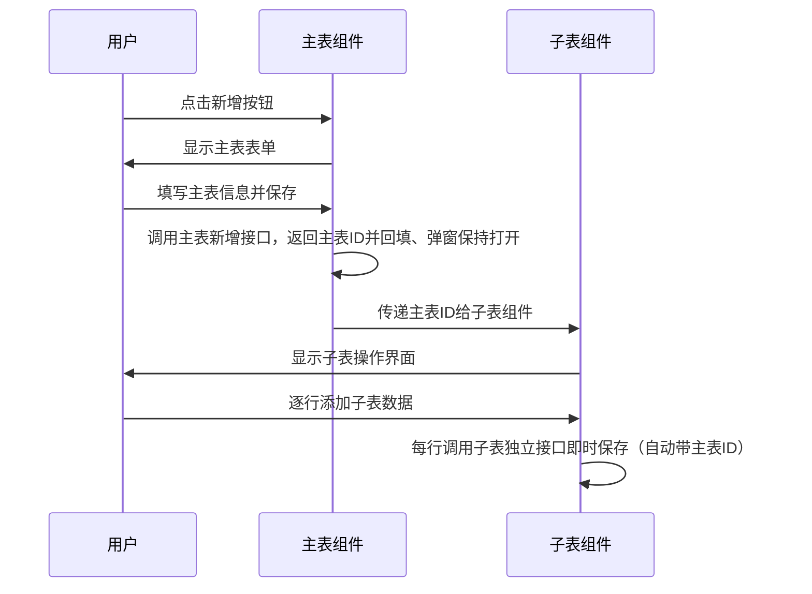
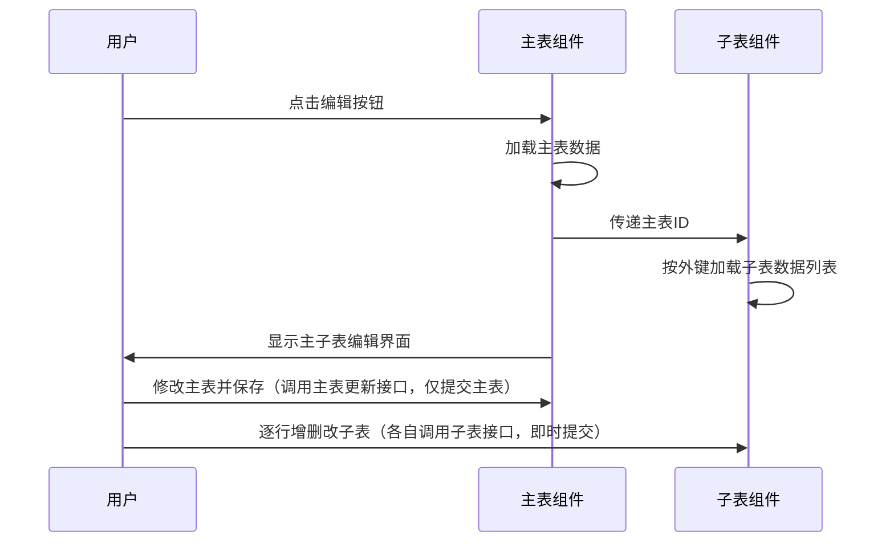

# 模板类型详解

代码生成器提供三种主要的模板类型，分别适用于不同的业务场景。本章将详细介绍每种模板类型的特点、适用场景、生成的代码结构以及配置要点。

## 模板类型概览

| 模板类型 | 标识符 | 适用场景 | 特点 |
|---------|--------|----------|------|
| 单表CRUD | `crud` | 独立表的基本增删改查 | 标准化CRUD操作，支持分页、搜索、导入导出 |
| 树形结构 | `tree` | 具有父子层级关系的数据 | 树形展示，支持层级操作和节点管理 |
| 主子表 | `sub` | 一对多关系的业务数据 | 主子表联动，在同一页面管理关联数据 |

## 单表CRUD模板（crud）

### 概述
单表CRUD模板是最常用的模板类型，适用于大部分标准的业务表。它生成完整的增删改查功能，包括列表展示、条件查询、数据维护等核心功能。

### 适用场景
- 用户管理、角色管理等基础数据维护
- 字典数据、配置参数等系统设置
- 日志记录、通知公告等信息展示
- 独立的业务实体管理

### 生成的代码结构

#### 后端代码
```java
// 1. 实体类 (Entity)
@TableName("sys_user")
public class SysUser extends BaseEntity {
    @TableId(value = "user_id")
    private Long userId;
    private String userName;
    private String nickName;
    // ... 其他字段
}

// 2. 业务对象 (Bo)
@Data
@AutoMapper(target = SysUser.class)
public class SysUserBo extends BaseEntity {
    @NotBlank(message = "用户名不能为空", groups = {AddGroup.class, EditGroup.class})
    private String userName;
    // ... 其他字段和验证注解
}

// 3. 视图对象 (Vo)
@Data
@ExcelIgnoreUnannotated
@AutoMapper(target = SysUser.class)
public class SysUserVo implements Serializable {
    @ExcelProperty(value = "用户ID")
    private Long userId;
    // ... 其他字段和Excel注解
}

// 4. 控制器 (Controller)
@RestController
@RequestMapping("/system/user")
public class SysUserController {
    
    @GetMapping("/pageSysUsers")
    public R<PageResult<SysUserVo>> pageSysUsers(SysUserBo bo, PageQuery pageQuery) {
        return R.ok(sysUserService.page(bo, pageQuery));
    }
    
    @PostMapping("/addSysUser")
    public R<Long> addSysUser(@Validated(AddGroup.class) @RequestBody SysUserBo bo) {
        return R.ok(sysUserService.add(bo));
    }
    // ... 其他CRUD方法
}

// 5. 服务接口 (Service) —— 不继承任何基类，直接声明业务方法
public interface ISysUserService {
    PageResult<SysUserVo> page(SysUserBo bo, PageQuery pageQuery);
    Long add(SysUserBo bo);
    int update(SysUserBo bo);
    int batchDelete(Collection<Long> ids);
    // ... 其他业务方法
}

// 6. 服务实现 (ServiceImpl) —— 注入 DAO 层，负责业务与 Entity↔Bo/Vo 转换
@Service
@RequiredArgsConstructor
public class SysUserServiceImpl implements ISysUserService {

    private final ISysUserDao sysUserDao;

    @Override
    public PageResult<SysUserVo> page(SysUserBo bo, PageQuery pageQuery) {
        PlusLambdaQuery<SysUser> wrapper = sysUserDao.buildQueryWrapper(bo);
        PageResult<SysUser> page = sysUserDao.page(wrapper, pageQuery);
        return PageResult.convert(page, SysUserVo.class);
    }

    @Override
    @Transactional(rollbackFor = Exception.class)
    public Long add(SysUserBo bo) {
        SysUser entity = MapstructUtils.convert(bo, SysUser.class);
        sysUserDao.insert(entity);
        return entity.getUserId();
    }
    // ... 其他方法均委托给 DAO 层
}

// 7. 数据访问接口 (DAO) —— 查询条件在 DAO 层统一构建
public interface ISysUserDao extends IBaseDao<SysUser> {
    PlusLambdaQuery<SysUser> buildQueryWrapper(SysUserBo bo);
}

// 8. 数据访问实现 (DAOImpl)
@Repository
public class SysUserDaoImpl extends BaseDaoImpl<SysUserMapper, SysUser> implements ISysUserDao {

    @Override
    public PlusLambdaQuery<SysUser> buildQueryWrapper(SysUserBo bo) {
        PlusLambdaQuery<SysUser> lqw = PlusLambdaQuery.of();
        lqw.eq(bo.getUserName() != null, SysUser::getUserName, bo.getUserName());
        // ... 其他查询条件（自动处理 null 判断）
        return lqw;
    }
}

// 9. Mapper —— 仅继承 BaseMapper，专注 SQL 执行
public interface SysUserMapper extends BaseMapper<SysUser> {
}
```

#### 前端代码
```vue
<!-- 主页面组件 -->
<template>
  <div class="p-2">
    <!-- 搜索栏 -->
    <ASearchForm ref="queryFormRef" v-model="queryParams" :visible="showSearch">
      <AFormInput label="用户名" v-model="queryParams.userName" @input="handleQuery"></AFormInput>
      <AFormSelect label="状态" v-model="queryParams.status" :options="sys_normal_disable" @change="handleQuery"></AFormSelect>
    </ASearchForm>

    <el-card shadow="hover">
      <!-- 工具栏 -->
      <template #header>
        <el-row :gutter="10" class="mb-2">
          <el-col :span="1.5">
            <el-button type="primary" plain icon="Plus" @click="handleAdd">
              {{ t('新增') }}
            </el-button>
          </el-col>
          <!-- 其他按钮... -->
        </el-row>
      </template>

      <!-- 数据表格 -->
      <el-table ref="userTableRef" v-loading="isLoading" :data="userList">
        <el-table-column type="selection" width="50" align="center" />
        <el-table-column label="用户ID" prop="userId" align="center" />
        <el-table-column label="用户名" prop="userName" align="center" />
        <el-table-column label="状态" prop="status" align="center">
          <template #default="{ row }">
            <DictTag :options="sys_normal_disable" :value="row.status" />
          </template>
        </el-table-column>
        <!-- 操作列 -->
      </el-table>

      <!-- 分页组件 -->
      <Pagination v-model:page="queryParams.pageNum" v-model:limit="queryParams.pageSize" 
                  :total="total" @pagination="getList" />
    </el-card>

    <!-- 新增/编辑对话框 -->
    <el-dialog v-model="dialog.visible" :title="dialog.title">
      <el-form ref="userFormRef" :model="form" :rules="rules">
        <AFormInput label="用户名" v-model="form.userName" prop="userName"></AFormInput>
        <AFormInput label="昵称" v-model="form.nickName" prop="nickName"></AFormInput>
        <!-- 其他表单项... -->
      </el-form>
    </el-dialog>
  </div>
</template>
```

### 核心特性

#### 1. 标准CRUD操作
- **查询功能**：支持分页查询、条件筛选、模糊搜索
- **新增功能**：表单验证、数据提交、成功提示
- **编辑功能**：数据回显、表单更新、乐观锁控制
- **删除功能**：单条/批量删除、确认提示、软删除支持

#### 2. 数据导入导出
```javascript
// 导出功能
const handleExport = () => {
  useDownload().exportExcel('用户数据', '/system/user/exportSysUsers', queryParams.value)
}

// 导入功能
<AImportExcel
  title="用户数据"
  templateUrl="/system/user/templateSysUsers"
  importUrl="/system/user/importSysUsers"
  @import-success="getList"
>
  <el-button type="info" plain icon="Top">
    {{ t('导入') }}
  </el-button>
</AImportExcel>
```

#### 3. 字段权限控制
根据配置自动生成字段的增删改查权限：
- `isInsert`：是否允许新增时填写
- `isEdit`：是否允许编辑时修改
- `isList`：是否在列表中显示
- `isQuery`：是否作为查询条件

### 配置要点

#### 表配置
```json
{
  "tplCategory": "crud",
  "packageName": "plus.ruoyi.system",
  "moduleName": "system",
  "businessName": "user",
  "functionName": "用户管理",
  "className": "SysUser"
}
```

#### 字段配置示例
```json
{
  "columnName": "user_name",
  "javaField": "userName",
  "javaType": "String",
  "columnComment": "用户名",
  "htmlType": "input",
  "isInsert": "1",
  "isEdit": "1",
  "isList": "1",
  "isQuery": "1",
  "queryType": "LIKE",
  "isRequired": "1"
}
```

## 树形结构模板（tree）

### 概述
树形结构模板专门用于处理具有父子层级关系的数据，如组织机构、菜单管理、分类管理等。它提供树形展示和层级操作功能。

### 适用场景
- 组织架构管理
- 系统菜单管理
- 商品分类管理
- 地区行政区划
- 部门层级管理

### 必要字段要求
树形结构模板需要数据表包含以下字段：
- **树编码字段**：用于标识节点ID（如：`dept_id`）
- **树父编码字段**：用于标识父节点ID（如：`parent_id`）
- **树名称字段**：用于显示节点名称（如：`dept_name`）

### 生成的代码结构

#### 后端特殊处理
```java
// DAO 层：树形查询条件在 DAO 的 buildQueryWrapper 中构建
@Override
public PlusLambdaQuery<SysDept> buildQueryWrapper(SysDeptBo bo) {
    PlusLambdaQuery<SysDept> lqw = PlusLambdaQuery.of();
    lqw.like(bo.getDeptName() != null, SysDept::getDeptName, bo.getDeptName());
    lqw.eq(bo.getParentId() != null, SysDept::getParentId, bo.getParentId());
    return lqw;
}

// Service 层：树形不分页，查询全部用于构建树
@Override
public List<SysDeptVo> list(SysDeptBo bo) {
    PlusLambdaQuery<SysDept> wrapper = sysDeptDao.buildQueryWrapper(bo);
    return MapstructUtils.convert(sysDeptDao.list(wrapper), SysDeptVo.class);
}

// 控制器中返回树形数据
@GetMapping("/listSysDepts")
public R<List<SysDeptVo>> listSysDepts(SysDeptBo bo) {
    // 查询所有数据后构建树形结构
    List<SysDeptVo> list = sysDeptService.list(bo);
    return R.ok(buildTree(list));
}
```

#### 前端树形展示
```vue
<template>
  <div class="p-2">
    <!-- 树形表格 -->
    <el-table
      ref="deptTableRef"
      v-loading="isLoading"
      :data="deptList"
      row-key="deptId"
      :tree-props="{ children: 'children', hasChildren: 'hasChildren' }"
      :default-expand-all="isAllExpanded"
    >
      <!-- 部门名称列（树形显示） -->
      <el-table-column label="部门名称" prop="deptName" align="center" />
      <el-table-column label="排序" prop="orderNum" align="center" />
      <el-table-column label="状态" prop="status" align="center">
        <template #default="{ row }">
          <AFormSwitch v-model="row.status" @change="handleStatusChange(row)" />
        </template>
      </el-table-column>
      
      <!-- 操作列 -->
      <el-table-column label="操作" align="center">
        <template #default="{ row }">
          <el-button link type="success" icon="Edit" @click="handleUpdate(row)">修改</el-button>
          <el-button link type="primary" icon="Plus" @click="handleAdd(row)">新增</el-button>
          <el-button link type="danger" icon="Delete" @click="handleDelete(row)">删除</el-button>
        </template>
      </el-table-column>
    </el-table>

    <!-- 新增/编辑对话框 -->
    <el-dialog v-model="dialog.visible" :title="dialog.title">
      <el-form ref="deptFormRef" :model="form" :rules="rules">
        <!-- 上级部门选择（树形选择器） -->
        <AFormTreeSelect 
          label="上级部门" 
          v-model="form.parentId" 
          :data="deptOptions"
          :props="{ value: 'deptId', label: 'deptName', children: 'children' }"
        />
        <AFormInput label="部门名称" v-model="form.deptName" prop="deptName" />
        <AFormInput label="显示排序" v-model="form.orderNum" prop="orderNum" />
      </el-form>
    </el-dialog>
  </div>
</template>

<script setup>
// 树形数据构建
const buildTree = (data) => {
  return buildTree(data, {
    id: 'deptId',
    parentId: 'parentId'
  })
}

// 展开/折叠控制
const toggleAllExpansion = () => {
  isAllExpanded.value = !isAllExpanded.value
  setAllRowsExpansion(deptList.value, isAllExpanded.value)
}

// 新增子节点
const handleAdd = (row) => {
  reset()
  form.value.parentId = row?.deptId || 0
  dialog.value.visible = true
  dialog.value.title = '新增部门'
}
</script>
```

### 核心特性

#### 1. 树形展示
- **层级结构**：自动构建父子关系的树形结构
- **展开折叠**：支持节点的展开和折叠操作
- **层级标识**：通过缩进和图标显示层级关系

#### 2. 树形操作
- **添加子节点**：在任意节点下添加子级数据
- **移动节点**：修改节点的父级关系
- **删除节点**：删除节点及其所有子节点（需要确认）

#### 3. 树形选择器
```vue
<!-- 父级节点选择 -->
<AFormTreeSelect 
  label="上级部门" 
  v-model="form.parentId" 
  :data="deptOptions"
  :props="{ 
    value: 'deptId', 
    label: 'deptName', 
    children: 'children' 
  }"
  placeholder="选择上级部门"
/>
```

### 配置要点

#### 树形字段配置
在表配置的 `options` 中需要指定树形字段：
```json
{
  "tplCategory": "tree",
  "options": "{
    \"treeCode\": \"dept_id\",
    \"treeParentCode\": \"parent_id\", 
    \"treeName\": \"dept_name\",
    \"parentMenuId\": \"1\"
  }"
}
```

#### 树形字段说明
- `treeCode`：树节点ID字段，必须唯一
- `treeParentCode`：父节点ID字段，根节点通常为0
- `treeName`：节点显示名称字段

### 注意事项
1. **数据完整性**：确保父子关系的数据完整性
2. **循环引用**：避免节点的循环引用问题
3. **根节点**：通常根节点的 `parent_id` 为 0
4. **排序字段**：建议添加 `order_num` 字段控制同级节点排序

## 主子表模板（sub）

### 概述
主子表模板用于处理一对多的业务关系，如订单与订单明细、文章与评论等。它在同一个页面中管理主表和子表数据，提供关联操作功能。

### 适用场景
- 订单管理（订单 + 订单明细）
- 文章管理（文章 + 评论列表）
- 项目管理（项目 + 任务列表）
- 合同管理（合同 + 合同条款）
- 考试管理（试卷 + 题目列表）

### 表关系要求
主子表模板需要两个相关联的数据表：
- **主表**：存储主要业务数据
- **子表**：存储明细数据，包含指向主表的外键

### 生成的代码结构

#### 主表代码结构
主表的代码结构与单表CRUD类似，但在页面中会包含子表组件：

```vue
<!-- 主表页面 -->
<template>
  <div class="p-2">
    <!-- 主表的搜索和列表... -->
    
    <!-- 新增/编辑对话框 -->
    <el-dialog v-model="dialog.visible" :title="dialog.title" width="1200px">
      <!-- 主表表单 -->
      <el-form ref="orderFormRef" :model="form" :rules="rules">
        <el-row>
          <AFormInput label="订单号" v-model="form.orderNo" prop="orderNo" :span="12" />
          <AFormDate label="订单日期" v-model="form.orderDate" prop="orderDate" :span="12" />
        </el-row>
      </el-form>

      <!-- 子表组件 -->
      <OrderDetailChild :parent-id="form.orderId" />

      <template #footer>
        <el-button :loading="buttonLoading" type="primary" @click="submitForm">确定</el-button>
        <el-button @click="cancel">取消</el-button>
      </template>
    </el-dialog>
  </div>
</template>

<script setup>
import OrderDetailChild from './OrderDetailChild.vue'

// 提交主表表单
const submitForm = async () => {
  // 如果是新增且有子表，保存成功后更新表单ID，保持弹窗打开以便编辑子表
  if (!form.value.orderId && data) {
    form.value.orderId = data
    buttonLoading.value = false
    return
  }
  dialog.value.visible = false
  await getList()
}
</script>
```

#### 子表组件代码
子表组件专门处理子表的CRUD操作：

```vue
<!-- 子表组件 OrderDetailChild.vue -->
<template>
  <div>
    <!-- 提示信息 -->
    <div v-if="!parentId">
      <el-alert title="请先保存主表" type="info" :closable="false" show-icon />
    </div>
    
    <div v-else>
      <el-divider content-position="left">
        <span class="text-16px font-bold">子表: 订单明细</span>
      </el-divider>
      
      <!-- 子表工具栏 -->
      <el-row :gutter="10" class="mb-2">
        <el-col :span="1.5">
          <el-button type="primary" plain icon="Plus" @click="handleAdd">新增</el-button>
        </el-col>
        <el-col :span="1.5">
          <el-button type="success" plain icon="Edit" :disabled="selectionItems.length !== 1" 
                     @click="handleUpdate()">修改</el-button>
        </el-col>
        <!-- 其他按钮... -->
      </el-row>

      <!-- 子表数据表格 -->
      <el-table ref="detailTableRef" v-loading="isLoading" :data="detailList" height="420" 
                @selection-change="handleSelectionChange">
        <el-table-column type="selection" width="50" align="center" />
        <el-table-column label="商品名称" prop="productName" align="center" />
        <el-table-column label="数量" prop="quantity" align="center" />
        <el-table-column label="单价" prop="price" align="center" />
        <el-table-column label="小计" prop="amount" align="center" />
        <!-- 操作列 -->
      </el-table>

      <!-- 子表新增/编辑对话框 -->
      <el-dialog v-model="dialog.visible" :title="dialog.title" width="600px">
        <el-form ref="detailFormRef" :model="form" :rules="rules">
          <AFormSelect label="商品" v-model="form.productId" :options="productOptions" />
          <AFormInput label="数量" v-model="form.quantity" type="number" />
          <AFormInput label="单价" v-model="form.price" type="number" />
        </el-form>
      </el-dialog>
    </div>
  </div>
</template>

<script setup>
// Props定义
interface OrderDetailChildProps {
  parentId?: string | number  // 主表ID
}

const props = defineProps<OrderDetailChildProps>()

// 查询子表数据
const getList = async () => {
  if (!props.parentId) return
  
  queryParams.value.orderId = props.parentId  // 设置主表ID作为查询条件
  const [err, data] = await pageOrderDetails(queryParams.value)
  if (!err) {
    detailList.value = data.records
    total.value = data.total
  }
}

// 监听父ID变化
watch(
  () => props.parentId,
  (newId) => {
    if (newId) {
      queryParams.value.orderId = newId
      getList()
    } else {
      detailList.value = []
      total.value = 0
    }
  },
  { immediate: true }
)

// 新增子表记录
const handleAdd = () => {
  reset()
  form.value.orderId = props.parentId  // 设置主表关联ID
  dialog.value.visible = true
  dialog.value.title = '新增订单明细'
}
</script>
```

### 实现机制（重要）

代码生成器为主子表生成的是**两套相互独立的完整 CRUD**：主表一套（Controller/Service/DAO/Bo/Vo/前端页面），每个子表各一套。二者通过**外键 + parentId** 关联，但在生成的代码里**并不共享事务、也不做级联删除**——理解这一点是正确使用主子表的关键。

- **独立 API、即时保存**：子表由独立子组件（`XxxChild.vue`）承载，调用**自己的**增删改查接口（`addXxx` / `updateXxx` / `deleteXxx`），每次对子表行的操作都会**立即单独提交**，不会和主表打包成一次请求。
- **先主后子**：子表组件依赖主表主键 `parentId`；主表未保存（无 ID）时子表显示"请先保存主表"。新增主表时，主表保存成功后会回填主键并**保持弹窗打开**，随后才能新增子表行。
- **外键自动回填**：子表新增记录时，外键字段自动设置为当前主表 ID（`parentId`）。
- **事务边界（易误解）**：主表的增删改在主表 `Service` 的 `@Transactional` 内，子表的增删改在子表 `Service` 的 `@Transactional` 内，**彼此独立**。生成的代码**不提供**"主表 + 子表一次性提交的统一事务"。
- **级联删除需手动实现**：生成的主表删除接口**只删主表记录**，不会自动删除关联子表数据。若需级联删除或"主表 + 子表原子提交"，需在主表 `ServiceImpl` 中自行编写（如删除主表前按外键批量删子表、或新增聚合接口在同一事务内保存主子数据）。
- **子表导入导出**：子表组件内置独立的 Excel 导入 / 导出（`AImportExcel` + 导出接口），导入时自动带上当前 `parentId`。
- **弹窗组件**：主表编辑弹窗与子表编辑弹窗均使用项目封装的 `AModal` 组件（下方示例中的 `el-dialog` 仅为结构示意）。

### 配置要点

#### 主表配置
```json
{
  "tplCategory": "sub",
  "subTableName": "order_detail",      // 子表名
  "subTableFkName": "order_id"         // 子表外键字段名
}
```

#### 子表字段配置
子表需要包含指向主表的外键字段：
```json
{
  "columnName": "order_id",
  "javaField": "orderId", 
  "columnComment": "订单ID",
  "javaType": "Long",
  "isInsert": "1",    // 新增时必填
  "isEdit": "0",      // 编辑时不可修改
  "isList": "0",      // 列表中不显示（隐藏字段）
  "isQuery": "1"      // 可作为查询条件
}
```

### 业务流程

#### 新增流程


#### 编辑流程


### 注意事项

1. **数据依赖关系**
    - 必须先保存主表才能操作子表
    - 子表记录必须关联有效的主表ID

2. **删除策略（需手动实现级联）**
    - 生成的主表删除接口只删除主表记录，**不会**自动删除子表数据
    - 如需级联删除，请在主表 `ServiceImpl.deleteByIds` 中先按外键删除关联子表记录，再删主表
    - 或在删除前校验是否存在子表数据，存在则阻止删除

3. **事务控制（默认不跨表）**
    - 生成代码中主表、子表各自在**独立事务**内提交，**并非同一事务**
    - 子表每行操作即时保存，若中途失败，已保存的行不会回滚
    - 如需"主表 + 子表"原子提交，需自行新增聚合保存接口，在同一 `@Transactional` 方法内处理主子数据

4. **性能考虑**
    - 子表数据量大时考虑分页加载
    - 避免一次性加载过多子表数据

## 模板选择指南

### 选择依据

| 业务特征 | 推荐模板 | 原因 |
|----------|----------|------|
| 独立的业务实体，无复杂关联 | 单表CRUD | 标准化程度高，功能完善 |
| 数据具有明确的层级关系 | 树形结构 | 天然支持层级展示和操作 |
| 存在一对多的业务关系 | 主子表 | 在同一界面管理关联数据 |
| 需要批量数据处理 | 单表CRUD | 内置导入导出功能 |
| 需要复杂的权限控制 | 树形结构 | 支持按层级控制权限 |

### 实际案例

#### 1. 用户管理 → 单表CRUD
```sql
CREATE TABLE sys_user (
    user_id BIGINT PRIMARY KEY,
    user_name VARCHAR(30) NOT NULL,
    nick_name VARCHAR(30),
    email VARCHAR(50),
    phone VARCHAR(11),
    sex CHAR(1),
    status CHAR(1) DEFAULT '0',
    create_time DATETIME,
    update_time DATETIME
);
```

#### 2. 部门管理 → 树形结构
```sql  
CREATE TABLE sys_dept (
    dept_id BIGINT PRIMARY KEY,
    parent_id BIGINT DEFAULT 0,
    dept_name VARCHAR(30) NOT NULL,
    order_num INT DEFAULT 0,
    leader VARCHAR(20),
    phone VARCHAR(11),
    status CHAR(1) DEFAULT '0',
    create_time DATETIME,
    update_time DATETIME
);
```

#### 3. 订单管理 → 主子表
```sql
-- 主表
CREATE TABLE sales_order (
    order_id BIGINT PRIMARY KEY,
    order_no VARCHAR(50) NOT NULL,
    customer_name VARCHAR(100),
    order_date DATE,
    total_amount DECIMAL(10,2),
    status CHAR(1),
    create_time DATETIME,
    update_time DATETIME
);

-- 子表
CREATE TABLE order_detail (
    detail_id BIGINT PRIMARY KEY,
    order_id BIGINT NOT NULL,  -- 外键
    product_name VARCHAR(100),
    quantity INT,
    price DECIMAL(8,2),
    amount DECIMAL(10,2),
    create_time DATETIME,
    FOREIGN KEY (order_id) REFERENCES sales_order(order_id)
);
```

## 总结

选择合适的模板类型是代码生成成功的关键因素：

- **单表CRUD**：适用于大部分标准业务场景，生成完整的数据管理功能
- **树形结构**：专门处理层级数据，提供直观的树形操作界面
- **主子表**：处理复杂的关联关系，在同一界面管理主从数据

在实际使用中，需要根据业务需求、数据结构和用户体验需求来选择合适的模板类型，确保生成的代码既满足功能需求，又符合用户操作习惯。
