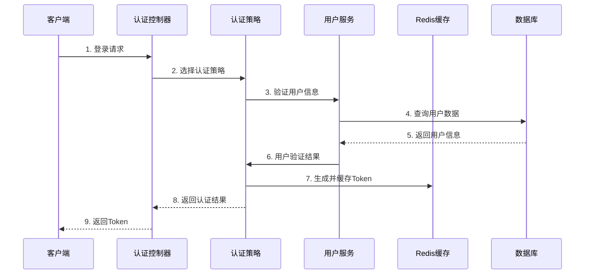
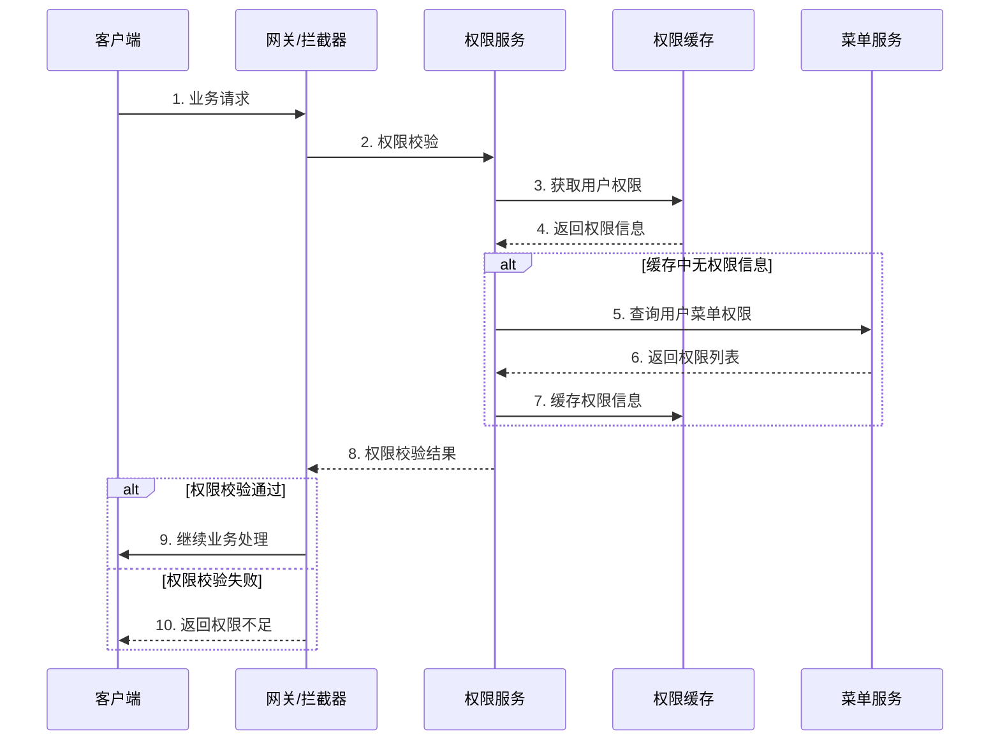
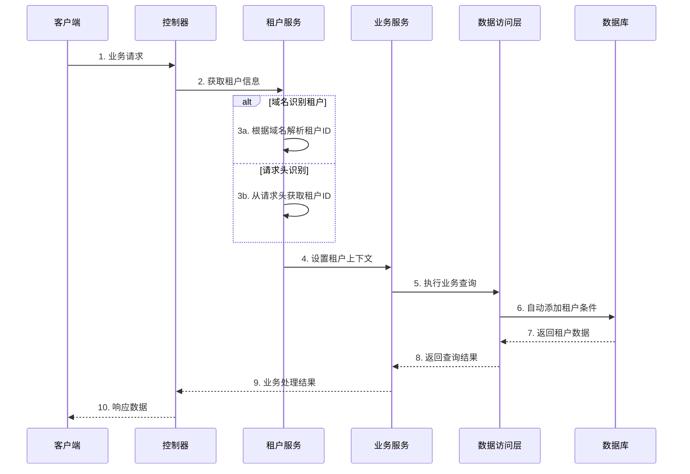

# 系统模块概览 (system)

## 1. 模块简介

系统模块 (system) 是整个后端应用的核心基础模块，基于Spring Boot + MyBatis-Plus构建，采用现代化的企业级应用架构设计。该模块实现了完整的用户权限管理体系、多租户SaaS架构、系统监控、对象存储等核心功能，为上层业务模块提供稳固的技术基础和通用服务支撑。

## 2. 技术架构

### 2.1 整体架构设计

```
┌─────────────────────────────────────────────────────────────┐
│                        系统模块 (system)                     │
├─────────────────────────────────────────────────────────────┤
│  ┌─────────────┐  ┌─────────────┐  ┌─────────────┐         │
│  │ 认证授权     │  │ 系统配置    │  │ 核心功能     │         │
│  │   (auth)    │  │  (config)   │  │   (core)    │         │
│  └─────────────┘  └─────────────┘  └─────────────┘         │
│  ┌─────────────┐  ┌─────────────┐  ┌─────────────┐         │
│  │ 字典管理     │  │ 系统监控    │  │ OSS存储     │         │
│  │   (dict)    │  │ (monitor)   │  │   (oss)     │         │
│  └─────────────┘  └─────────────┘  └─────────────┘         │
│  ┌─────────────┐                                            │
│  │ 多租户      │                                            │
│  │  (tenant)   │                                            │
│  └─────────────┘                                            │
└─────────────────────────────────────────────────────────────┘
```

### 2.2 技术栈

| 技术分类 | 技术选型 | 用途说明              |
|---------|---------|-------------------|
| **核心框架** | Spring Boot | 应用基础框架            |
| **持久层** | MyBatis-Plus | ORM框架，简化CRUD操作    |
| **安全框架** | Sa-Token | 轻量级权限认证框架         |
| **缓存中间件** | Redis | 分布式缓存，会话存储        |
| **数据库** | MySQL | 关系型数据库            |
| **对象存储** | 多云OSS | 本地上传、阿里云、腾讯云、七牛云等 |
| **消息推送** | WebSocket/SSE | 实时消息推送            |
| **Excel处理** | EasyExcel | 数据导入导出            |
| **JSON处理** | Jackson | JSON序列化           |
| **工具库** | Hutool | Java工具类库          |

### 2.3 分层架构

#### Controller层 (控制器层)
- **职责**: 处理HTTP请求，参数校验，响应封装
- **注解**: `@RestController`, `@RequestMapping`, `@SaCheckPermission`
- **功能**: RESTful API接口，权限校验，操作日志记录

#### Service层 (业务逻辑层)
- **职责**: 核心业务逻辑，事务管理，数据处理
- **设计**: 继承`IBaseService`统一CRUD操作
- **特性**: 支持缓存、事务、多租户自动处理

#### Mapper层 (数据访问层)
- **职责**: 数据库操作，复杂查询，结果映射
- **基类**: 继承`BaseMapperPlus`增强MyBatis-Plus功能
- **特性**: 自动填充，逻辑删除，多租户隔离

#### Domain层 (数据对象层)
- **Entity**: 数据库实体对象，映射数据表结构
- **BO**: 业务对象，用于接收前端参数
- **VO**: 视图对象，用于返回给前端的数据

## 3. 包结构设计

### 3.1 模块包结构

```
plus.ruoyi.system/
├── auth/                           # 认证授权模块
│   ├── controller/                 # 认证相关控制器
│   │   ├── AuthController.java     # 登录认证控制器
│   │   └── CaptchaController.java  # 验证码控制器
│   ├── service/                    # 认证业务服务
│   │   ├── IAuthStrategy.java      # 认证策略接口
│   │   ├── SysLoginService.java    # 登录服务
│   │   └── SysRegisterService.java # 注册服务
│   ├── service/impl/               # 认证策略实现
│   │   ├── PasswordAuthStrategy.java # 密码认证策略
│   │   └── SocialAuthStrategy.java   # 社交登录策略
│   ├── bo/                         # 认证业务对象
│   └── vo/                         # 认证视图对象
│       └── AuthTokenVo.java        # 认证令牌返回对象
├── config/                         # 系统配置模块
│   ├── controller/                 # 配置管理控制器
│   ├── service/                    # 配置业务服务
│   │   └── ISysConfigService.java  # 配置服务接口
│   ├── domain/                     # 配置领域对象
│   │   ├── entity/
│   │   │   └── SysConfig.java      # 配置实体
│   │   ├── bo/
│   │   │   └── SysConfigBo.java    # 配置业务对象
│   │   └── vo/                     # 配置视图对象
│   └── mapper/                     # 配置数据访问层
├── core/                           # 核心功能模块
│   ├── controller/                 # 核心控制器
│   │   ├── SysUserController.java  # 用户管理控制器
│   │   ├── SysRoleController.java  # 角色管理控制器
│   │   ├── SysMenuController.java  # 菜单管理控制器
│   │   ├── SysDeptController.java  # 部门管理控制器
│   │   └── SysPostController.java  # 岗位管理控制器
│   ├── service/                    # 核心业务服务
│   │   ├── ISysUserService.java    # 用户服务接口
│   │   ├── ISysRoleService.java    # 角色服务接口
│   │   ├── ISysMenuService.java    # 菜单服务接口
│   │   ├── ISysDeptService.java    # 部门服务接口
│   │   └── ISysPostService.java    # 岗位服务接口
│   ├── domain/                     # 核心领域对象
│   │   ├── entity/                 # 实体对象
│   │   │   ├── SysUser.java        # 用户实体
│   │   │   ├── SysRole.java        # 角色实体
│   │   │   ├── SysMenu.java        # 菜单实体
│   │   │   ├── SysDept.java        # 部门实体
│   │   │   └── SysPost.java        # 岗位实体
│   │   ├── bo/                     # 业务对象
│   │   └── vo/                     # 视图对象
│   │       ├── SysUserVo.java      # 用户视图对象
│   │       ├── SysUserExportVo.java # 用户导出对象
│   │       └── RouterVo.java       # 路由视图对象
│   └── mapper/                     # 数据访问层
├── dict/                           # 字典管理模块
│   ├── controller/                 # 字典控制器
│   ├── service/                    # 字典业务服务
│   │   ├── ISysDictTypeService.java # 字典类型服务
│   │   └── ISysDictDataService.java # 字典数据服务
│   ├── domain/                     # 字典领域对象
│   │   ├── entity/
│   │   │   ├── SysDictType.java    # 字典类型实体
│   │   │   └── SysDictData.java    # 字典数据实体
│   │   ├── bo/                     # 字典业务对象
│   │   └── vo/                     # 字典视图对象
│   └── mapper/                     # 字典数据访问层
├── monitor/                        # 系统监控模块
│   ├── controller/                 # 监控控制器
│   │   ├── SysLoginLogController.java    # 登录日志控制器
│   │   ├── SysOperLogController.java     # 操作日志控制器
│   │   ├── SysUserOnlineController.java  # 在线用户控制器
│   │   └── ServerMonitorController.java  # 服务器监控控制器
│   ├── service/                    # 监控业务服务
│   │   ├── ISysLoginLogService.java      # 登录日志服务
│   │   ├── ISysOperLogService.java       # 操作日志服务
│   │   └── ServerMonitorService.java     # 服务器监控服务
│   ├── domain/                     # 监控领域对象
│   │   ├── entity/
│   │   │   ├── SysLoginLog.java    # 登录日志实体
│   │   │   └── SysOperLog.java     # 操作日志实体
│   │   ├── bo/                     # 监控业务对象
│   │   └── vo/                     # 监控视图对象
│   │       ├── SysLoginLogVo.java  # 登录日志视图
│   │       └── ServerStatusVo.java # 服务器状态视图
│   └── mapper/                     # 监控数据访问层
├── oss/                            # 对象存储模块
│   ├── controller/                 # OSS控制器
│   │   └── SysOssController.java   # 文件管理控制器
│   ├── service/                    # OSS业务服务
│   │   ├── ISysOssService.java     # 文件服务接口
│   │   └── ISysOssConfigService.java # OSS配置服务
│   ├── domain/                     # OSS领域对象
│   │   ├── entity/
│   │   │   ├── SysOss.java         # 文件实体
│   │   │   └── SysOssConfig.java   # OSS配置实体
│   │   ├── bo/                     # OSS业务对象
│   │   └── vo/                     # OSS视图对象
│   │       ├── SysOssVo.java       # 文件视图对象
│   │       └── PresignedUrlVo.java # 预签名URL对象
│   └── mapper/                     # OSS数据访问层
└── tenant/                         # 多租户模块
    ├── controller/                 # 租户控制器
    ├── service/                    # 租户业务服务
    │   └── ISysTenantService.java  # 租户服务接口
    ├── domain/                     # 租户领域对象
    │   ├── entity/
    │   │   ├── SysTenant.java      # 租户实体
    │   │   └── SysTenantPackage.java # 租户套餐实体
    │   ├── bo/
    │   │   └── SysTenantBo.java    # 租户业务对象
    │   └── vo/                     # 租户视图对象
    └── mapper/                     # 租户数据访问层
```

## 4. 核心设计原则

### 4.1 领域驱动设计 (DDD)

**分层架构**:
- **展现层**: Controller负责API接口和参数校验
- **应用层**: Service负责业务逻辑编排和事务管理
- **领域层**: Entity、BO、VO负责数据建模和业务规则
- **基础设施层**: Mapper负责数据持久化和外部集成

**实体设计**:
```java
// 基础实体类 - 提供通用字段
public class BaseEntity {
    private Long createBy;     // 创建者
    private Date createTime;   // 创建时间
    private Long updateBy;     // 更新者
    private Date updateTime;   // 更新时间
}

// 租户实体类 - 支持多租户隔离
public class TenantEntity extends BaseEntity {
    private String tenantId;   // 租户ID
    private Long createDept;   // 创建部门
}
```

### 4.2 统一服务架构

**IBaseService 通用服务接口**:
```java
public interface IBaseService<T, B, V> {
    // 标准CRUD操作
    PageResult<V> pageAll(PageQuery pageQuery);
    List<V> listAll();
    V get(Long id);
    Boolean save(B bo);
    Boolean update(B bo);
    Boolean deleteByIds(Collection<Long> ids);
}
```

**实现特点**:
- **统一分页**: 所有列表查询统一使用`PageQuery`和`PageResult`
- **自动映射**: 基于MapStruct的对象转换
- **缓存集成**: 关键数据自动缓存管理
- **多租户**: 自动处理租户数据隔离

### 4.3 数据传输对象设计

**三层对象模型**:

```java
// Entity - 数据库实体对象
@TableName("sys_user")
public class SysUser extends TenantEntity {
    @TableId
    private Long userId;
    private String userName;
    // ... 其他字段
}

// BO - 业务对象，用于接收前端参数
@AutoMapper(target = SysUser.class)
public class SysUserBo extends BaseEntity {
    @NotBlank(message = "用户名不能为空")
    private String userName;
    // ... 业务校验和转换逻辑
}

// VO - 视图对象，用于返回前端数据
@AutoMapper(target = SysUser.class)
public class SysUserVo implements Serializable {
    private Long userId;
    private String userName;
    private String deptName;  // 关联查询字段
    // ... 前端展示所需字段
}
```

## 5. 子模块详细介绍

### 5.1 认证授权模块 (auth)

**模块职责**:
- 用户身份认证和授权管理
- 多种登录方式的策略化实现
- 验证码生成和校验
- 社交账号登录集成
- 用户注册和账号管理

**核心特性**:
- **策略模式**: 支持密码登录、短信登录、社交登录等多种认证方式
- **安全防护**: 验证码防护、登录失败锁定、密码加密存储
- **令牌管理**: 基于Sa-Token的JWT令牌机制
- **多设备支持**: 不同设备类型的差异化会话管理

### 5.2 系统配置模块 (config)

**模块职责**:
- 系统运行参数的集中配置管理
- 公告通知的发布和推送
- 配置参数的缓存和动态更新
- 系统开关和特性控制

**核心特性**:
- **动态配置**: 支持运行时修改系统参数
- **缓存机制**: Redis缓存提升配置读取性能
- **通知推送**: WebSocket和SSE实时消息推送
- **分类管理**: 配置参数的分组和层级管理

### 5.3 核心功能模块 (core)

**模块职责**:
- 用户、角色、部门、岗位的基础数据管理
- 菜单权限的树形结构管理
- RBAC权限模型的完整实现
- 组织架构的层级管理

**核心实体关系**:
```
用户 (SysUser) ←→ 角色 (SysRole) ←→ 菜单 (SysMenu)
    ↓                                    ↑
部门 (SysDept) ←→ 岗位 (SysPost)          权限字符串
```

**权限模型**:
- **菜单权限**: 基于URL路径的访问控制
- **按钮权限**: 页面操作按钮的细粒度控制
- **数据权限**: 基于部门层级的数据范围控制
- **角色继承**: 支持角色权限的继承关系

### 5.4 字典管理模块 (dict)

**模块职责**:
- 系统枚举值和选项数据的统一管理
- 字典数据的分类和层级组织
- Excel导入导出时的字典转换
- 多租户环境下的字典隔离

**应用场景**:
- **状态枚举**: 启用/禁用、男/女、审核状态等
- **分类选项**: 用户类型、业务分类等下拉选项
- **系统配置**: 可配置的业务参数值
- **国际化**: 多语言环境下的标签管理

### 5.5 系统监控模块 (monitor)

**模块职责**:
- 系统运行状态的实时监控
- 用户行为和系统操作的日志记录
- 服务器性能指标的采集和展示
- 异常情况的告警和通知

**监控维度**:
- **服务器监控**: CPU、内存、磁盘、网络等硬件指标
- **应用监控**: JVM状态、Redis连接、数据库连接池
- **业务监控**: 登录日志、操作日志、在线用户统计
- **性能监控**: 接口响应时间、系统吞吐量

### 5.6 OSS存储模块 (oss)

**模块职责**:
- 统一的对象存储服务管理
- 多云存储平台的适配和切换
- 文件上传、下载、管理的完整流程
- 存储配置和容量监控

**存储特性**:
- **多云支持**: 阿里云OSS、腾讯云COS、七牛云、MinIO等
- **安全访问**: 私有存储的临时URL和访问控制
- **目录管理**: 文件的分类和目录化管理
- **批量操作**: 支持文件的批量上传和删除

### 5.7 多租户模块 (tenant)

**模块职责**:
- SaaS架构下的租户隔离实现
- 租户数据、配置、功能的完全隔离
- 租户套餐和功能权限管理
- 域名和子域名的租户识别

**隔离策略**:
- **数据隔离**: 所有业务数据按租户ID自动隔离
- **配置隔离**: 每个租户独立的系统配置
- **功能隔离**: 基于套餐的功能模块控制
- **资源隔离**: 存储空间、用户数量等资源限制

## 6. 核心技术特性

### 6.1 数据权限控制

**多维度权限模型**:
```java
// 权限注解示例
@SaCheckPermission("system:user:list")    // 菜单权限
@SaCheckRole("admin")                     // 角色权限
@DataScope(deptAlias = "d")               // 数据权限
public PageResult<SysUserVo> list(SysUserBo bo) {
    // 业务逻辑
}
```

**数据权限类型**:
- **全部权限**: 查看所有数据
- **部门权限**: 仅查看本部门数据
- **部门及下级**: 查看本部门及下级部门数据
- **仅本人**: 仅查看个人相关数据
- **自定义权限**: 基于自定义规则的数据过滤

### 6.2 缓存架构设计

**多层缓存策略**:
```java
// 缓存名称常量
public class CacheNames {
    public static final String SYS_CONFIG = "sys_config:";
    public static final String SYS_DICT = "sys_dict:";
    public static final String SYS_USER = "sys_user:";
    public static final String SYS_TENANT = "sys_tenant:";
    public static final String SYS_OSS = "sys_oss:";
}

// 缓存使用示例
@Cacheable(cacheNames = CacheNames.SYS_CONFIG, key = "#configKey")
public String getConfigByKey(String configKey) {
    // 从数据库查询逻辑
}
```

**缓存特点**:
- **自动管理**: 基于Spring Cache的自动缓存
- **多级缓存**: Redis + 本地缓存的多级策略
- **智能失效**: 数据更新时自动清理相关缓存
- **租户隔离**: 缓存Key包含租户信息实现隔离

### 6.3 Excel集成

**导入导出增强**:
```java
// Excel导出注解
@ExcelProperty(value = "用户性别", converter = ExcelDictConvert.class)
@ExcelDictFormat(dictType = DictUserGender.DICT_TYPE)
private String gender;

// 字典转换器
public class ExcelDictConvert implements Converter<String> {
    @Override
    public WriteCellData<String> convertToWriteCellData(String value, ExcelContentProperty contentProperty, GlobalConfiguration globalConfiguration) {
        // 字典值转换为字典标签
    }
}
```

**Excel特性**:
- **字典转换**: 自动将字典值转换为可读标签
- **数据校验**: 导入时的数据格式和业务规则校验
- **批量处理**: 支持大数据量的导入导出
- **模板下载**: 提供标准的Excel模板

### 6.4 国际化支持

**多语言架构**:
```java
// 国际化消息键
public class I18nKeys {
    public static final String USER_USERNAME_NOT_BLANK = "user.username.not.blank";
    public static final String USER_PASSWORD_NOT_BLANK = "user.password.not.blank";
}

// 消息工具类
String message = MessageUtils.message(I18nKeys.USER_USERNAME_NOT_BLANK);
```

**国际化特性**:
- **多语言支持**: 中文、英文等多语言环境
- **动态切换**: 基于请求头的语言自动识别
- **完整覆盖**: API响应、异常信息、日志记录全面国际化

## 7. 系统集成能力

### 7.1 第三方集成

**社交登录集成**:
- 微信、QQ、微博、钉钉等主流平台
- 统一的OAuth2.0授权流程
- 账号绑定和解绑管理

**消息推送集成**:
- 短信平台集成 (SMS4J)
- 邮件服务集成
- WebSocket实时推送
- SSE (Server-Sent Events) 支持

**存储服务集成**:
- 阿里云OSS、腾讯云COS
- 七牛云、又拍云
- MinIO私有云存储
- 本地文件系统

### 7.2 中间件集成

**Redis集成**:
- 分布式缓存
- 分布式锁
- 限流控制
- 会话存储

**消息队列**:
- 异步任务处理
- 事件驱动架构
- 系统解耦

## 8. 安全架构

### 8.1 认证安全

**身份认证**:
- 多因子认证支持
- 密码强度策略
- 账号锁定机制
- 异地登录检测

**会话管理**:
- JWT令牌机制
- 令牌自动刷新
- 单点登录支持
- 强制下线功能

### 8.2 授权安全

**权限控制**:
- 基于RBAC的权限模型
- 细粒度权限控制
- 数据权限隔离
- 动态权限加载

**安全防护**:
- SQL注入防护
- XSS攻击防护
- CSRF攻击防护
- 接口限流保护

### 8.3 数据安全

**敏感数据保护**:
```java
// 敏感数据注解
@Sensitive(strategy = SensitiveStrategy.EMAIL)
private String email;

@Sensitive(strategy = SensitiveStrategy.PHONE)
private String phone;
```

**数据加密**:
- 接口数据加密传输
- 敏感字段数据脱敏
- 密码BCrypt加密
- 数据库连接加密

## 9. 性能优化

### 9.1 查询优化

**分页查询优化**:
- 基于MyBatis-Plus的高效分页
- 索引优化建议
- 慢查询监控
- SQL性能分析

**缓存优化**:
- 热点数据缓存
- 查询结果缓存
- 分布式缓存一致性
- 缓存穿透防护

### 9.2 并发优化

**并发控制**:
- 数据库连接池优化
- Redis连接池管理
- 线程池配置优化
- 分布式锁应用

**性能监控**:
- JVM性能监控
- 数据库性能监控
- Redis性能监控
- 接口响应时间监控

## 10. 扩展性设计

### 10.1 模块化架构

**松耦合设计**:
- 清晰的模块边界
- 标准的接口定义
- 事件驱动的模块通信
- 依赖注入的组件管理

**插件化支持**:
- 认证策略插件化
- 存储服务插件化
- 监控指标插件化
- 字典类型扩展

### 10.2 配置化管理

**外部化配置**:
```yaml
# 应用配置示例
ruoyi:
  tenant:
    enable: true              # 租户功能开关
    ignoreUrls: ['/login']    # 租户忽略URL
  security:
    captcha:
      enable: true            # 验证码开关
      type: MATH              # 验证码类型
  oss:
    enable: true              # OSS存储开关
    defaultPlatform: minio    # 默认存储平台
```

**环境差异化**:
- 开发环境、测试环境、生产环境的配置分离
- 敏感配置的加密管理
- 配置热更新和版本控制

## 11. 数据库设计

### 11.1 核心表结构

**用户相关表**:
```sql
-- 用户基础信息表
sys_user (用户表)
├── user_id          # 用户ID (主键)
├── tenant_id        # 租户ID
├── dept_id          # 部门ID
├── user_name        # 用户名
├── nick_name        # 昵称
├── email            # 邮箱
├── phone            # 手机号
├── gender           # 性别
├── avatar           # 头像
├── password         # 密码
├── status           # 状态
├── login_ip         # 最后登录IP
├── login_date       # 最后登录时间
└── ...              # 审计字段

-- 角色信息表
sys_role (角色表)
├── role_id          # 角色ID (主键)
├── tenant_id        # 租户ID
├── role_name        # 角色名称
├── role_key         # 角色权限字符串
├── role_sort        # 显示顺序
├── data_scope       # 数据范围
├── status           # 状态
└── ...              # 审计字段

-- 用户角色关联表
sys_user_role (用户角色关联表)
├── user_id          # 用户ID
└── role_id          # 角色ID
```

**权限相关表**:
```sql
-- 菜单权限表
sys_menu (菜单表)
├── menu_id          # 菜单ID (主键)
├── menu_name        # 菜单名称
├── parent_id        # 父菜单ID
├── order_num        # 显示顺序
├── path             # 路由地址
├── component        # 组件路径
├── menu_type        # 菜单类型 (M目录 C菜单 F按钮)
├── visible          # 菜单状态
├── status           # 显示状态
├── perms            # 权限标识
├── icon             # 菜单图标
├── is_external_link # 是否外链
└── ...              # 审计字段

-- 角色菜单关联表
sys_role_menu (角色菜单关联表)
├── role_id          # 角色ID
└── menu_id          # 菜单ID
```

### 11.2 组织架构表

**部门岗位表**:
```sql
-- 部门信息表
sys_dept (部门表)
├── dept_id          # 部门ID (主键)
├── tenant_id        # 租户ID
├── parent_id        # 父部门ID
├── dept_name        # 部门名称
├── order_num        # 显示顺序
├── leader           # 负责人
├── phone            # 联系电话
├── email            # 邮箱
├── status           # 部门状态
└── ...              # 审计字段

-- 岗位信息表
sys_post (岗位表)
├── post_id          # 岗位ID (主键)
├── tenant_id        # 租户ID
├── post_code        # 岗位编码
├── post_name        # 岗位名称
├── post_sort        # 显示顺序
├── status           # 状态
└── ...              # 审计字段

-- 用户岗位关联表
sys_user_post (用户岗位关联表)
├── user_id          # 用户ID
└── post_id          # 岗位ID
```

### 11.3 系统配置表

**配置管理表**:
```sql
-- 参数配置表
sys_config (配置表)
├── config_id        # 配置ID (主键)
├── tenant_id        # 租户ID
├── config_name      # 参数名称
├── config_key       # 参数键名
├── config_value     # 参数键值
├── config_type      # 系统内置 (Y是 N否)
├── remark           # 备注
└── ...              # 审计字段

-- 字典类型表
sys_dict_type (字典类型表)
├── dict_id          # 字典ID (主键)
├── tenant_id        # 租户ID
├── dict_name        # 字典名称
├── dict_type        # 字典类型
├── status           # 状态
├── remark           # 备注
└── ...              # 审计字段

-- 字典数据表
sys_dict_data (字典数据表)
├── dict_data_id     # 字典编码 (主键)
├── tenant_id        # 租户ID
├── dict_sort        # 字典排序
├── dict_label       # 字典标签
├── dict_value       # 字典键值
├── dict_type        # 字典类型
├── css_class        # 样式属性
├── list_class       # 表格样式
├── is_default       # 是否默认
├── status           # 状态
└── ...              # 审计字段
```

### 11.4 监控日志表

**日志监控表**:
```sql
-- 操作日志表
sys_oper_log (操作日志表)
├── oper_id          # 日志主键
├── tenant_id        # 租户ID
├── title            # 模块标题
├── business_type    # 业务类型
├── method           # 方法名称
├── request_method   # 请求方式
├── operator_type    # 操作类别
├── oper_name        # 操作人员
├── dept_name        # 部门名称
├── oper_url         # 请求URL
├── oper_ip          # 主机地址
├── oper_location    # 操作地点
├── oper_param       # 请求参数
├── json_result      # 返回参数
├── status           # 操作状态
├── error_msg        # 错误消息
├── oper_time        # 操作时间
└── cost_time        # 消耗时间

-- 登录日志表
sys_login_log (登录日志表)
├── info_id          # 访问ID (主键)
├── tenant_id        # 租户ID
├── user_id          # 用户ID
├── user_name        # 用户账号
├── device_type      # 设备类型
├── status           # 登录状态
├── ipaddr           # 登录IP地址
├── login_location   # 登录地点
├── browser          # 浏览器类型
├── os               # 操作系统
├── msg              # 提示消息
└── login_time       # 访问时间
```

### 11.5 租户相关表

**多租户表**:
```sql
-- 租户信息表
sys_tenant (租户表)
├── id               # 主键ID
├── tenant_id        # 租户ID (业务主键)
├── contact_user_name # 联系人
├── contact_phone    # 联系电话
├── company_name     # 企业名称
├── license_number   # 统一社会信用代码
├── address          # 地址
├── domain           # 域名
├── intro            # 企业简介
├── package_id       # 租户套餐ID
├── expire_time      # 过期时间
├── account_count    # 用户数量限制
├── status           # 租户状态
└── ...              # 审计字段

-- 租户套餐表
sys_tenant_package (租户套餐表)
├── package_id       # 套餐ID (主键)
├── package_name     # 套餐名称
├── menu_ids         # 关联菜单ID
├── remark           # 备注
├── menu_check_strictly # 菜单树选择关联显示
├── status           # 状态
└── ...              # 审计字段
```

### 11.6 存储相关表

**OSS存储表**:
```sql
-- 对象存储表
sys_oss (文件存储表)
├── oss_id           # 对象存储主键
├── tenant_id        # 租户ID
├── file_name        # 文件名
├── original_name    # 原始文件名
├── file_suffix      # 文件后缀名
├── url              # URL地址
├── file_size        # 文件大小
├── service          # 服务商
├── directory_id     # 目录ID
└── ...              # 审计字段

-- OSS配置表
sys_oss_config (OSS配置表)
├── oss_config_id    # 主键
├── config_key       # 配置key
├── access_key       # accessKey
├── secret_key       # 秘钥
├── bucket_name      # 桶名称
├── prefix           # 前缀
├── endpoint         # 访问站点
├── domain           # 自定义域名
├── is_https         # 是否https
├── region           # 域
├── access_policy    # 桶权限类型
├── status           # 是否默认
└── ...              # 审计字段
```

## 12. 业务流程

### 12.1 用户登录流程



### 12.2 权限校验流程



### 12.3 多租户数据隔离流程



## 13. 监控体系

### 13.1 系统监控指标

**服务器监控**:
```java
public class ServerStatusVo {
    private String cpuUsage;        // CPU使用率
    private String memoryUsage;     // 内存使用率
    private String diskUsage;       // 磁盘使用率
    private String jvmHealth;       // JVM健康状态
    private String redisStatus;     // Redis连接状态
    private List<ServerMetric> dataList; // 详细监控数据
}
```

**业务监控指标**:
- **登录统计**: 登录成功率、失败次数、地理分布
- **操作统计**: 操作频次、操作类型分布、异常操作
- **用户活跃度**: 在线用户数、活跃用户统计
- **系统性能**: 接口响应时间、数据库查询性能

### 13.2 日志体系

**日志分类**:
1. **系统日志**: 应用启动、配置加载、异常错误
2. **业务日志**: 用户操作、业务流程、状态变更
3. **安全日志**: 登录尝试、权限操作、敏感操作
4. **性能日志**: 慢查询、长时间操作、资源消耗

**日志格式标准**:
```java
// 操作日志注解
@Log(title = "用户管理", businessType = DictOperType.INSERT)
public R<Void> add(@Validated(AddGroup.class) @RequestBody SysUserBo user) {
    // 业务逻辑
}
```

## 14. 安全机制

### 14.1 认证安全机制

**多重认证保护**:
- **图片验证码**: 防止自动化登录攻击
- **短信验证码**: 手机号登录和敏感操作确认
- **邮箱验证码**: 邮箱登录和找回密码
- **登录限制**: 连续失败后临时锁定账号

**密码安全策略**:
```java
// 密码加密验证
public class PasswordAuthStrategy {
    // 使用BCrypt加密存储密码
    private void validatePassword(String inputPassword, String storedPassword) {
        if (!BCrypt.checkpw(inputPassword, storedPassword)) {
            throw new UserException("密码错误");
        }
    }
}
```

### 14.2 数据安全保护

**敏感数据脱敏**:
```java
// 敏感数据注解示例
public class SysUserProfileBo {
    @Sensitive(strategy = SensitiveStrategy.EMAIL)
    @Email(message = "邮箱格式不正确")
    private String email;
    
    @Sensitive(strategy = SensitiveStrategy.PHONE)
    @Pattern(regexp = RegexPatterns.MOBILE)
    private String phone;
}
```

**XSS防护**:
```java
// XSS过滤注解
@Xss(message = "用户昵称不能包含脚本字符")
@Size(min = 0, max = 30, message = "用户昵称长度不能超过{max}个字符")
private String nickName;
```

### 14.3 接口安全

**限流保护**:
```java
// 接口限流注解
@RateLimiter(key = "#email", time = 60, count = 1)
public void emailCodeImpl(String email) {
    // 限制每60秒只能发送1次邮箱验证码
}
```

**接口加密**:
```java
// 接口加密注解
@ApiEncrypt
@PostMapping("/login")
public R<AuthTokenVo> login(@RequestBody LoginBody loginBody) {
    // 登录接口数据加密传输
}
```

## 15. 异常处理机制

### 15.1 统一异常处理

**异常分类**:
```java
// 业务异常
public class ServiceException extends RuntimeException {
    // 业务逻辑异常处理
}

// 用户相关异常
public class UserException extends RuntimeException {
    // 用户操作相关异常
}

// 验证码异常
public class CaptchaException extends UserException {
    // 验证码相关异常
}
```

**全局异常处理器**:
- 统一异常响应格式
- 异常信息国际化
- 异常日志记录
- 敏感信息过滤

### 15.2 参数校验

**Bean Validation集成**:
```java
// 分组校验示例
public class SysUserBo {
    @NotBlank(message = "用户名不能为空", groups = {AddGroup.class, EditGroup.class})
    @Size(min = 0, max = 30, message = "用户名长度不能超过{max}个字符")
    private String userName;
    
    @NotBlank(message = "密码不能为空", groups = {AddGroup.class})
    @Size(min = 6, max = 20, message = "密码长度必须在{min}-{max}个字符之间")
    private String password;
}
```

## 16. 部署架构

### 16.1 单体部署

**标准部署结构**:
```
Application Server
├── Spring Boot Application (Main)
├── System Module
│   ├── Auth Module
│   ├── Core Module  
│   ├── Config Module
│   ├── Dict Module
│   ├── Monitor Module
│   ├── OSS Module
│   └── Tenant Module
├── Database Connection Pool
├── Redis Connection Pool
└── OSS Client Pool
```

### 16.2 微服务部署

**微服务拆分建议**:
- **用户服务**: 用户、角色、部门管理
- **权限服务**: 菜单权限、认证授权
- **系统服务**: 配置、字典、监控
- **文件服务**: OSS存储、文件管理
- **租户服务**: 多租户管理

### 16.3 容器化部署

**Docker容器化**:
```dockerfile
# 应用容器
FROM openjdk:17-jre-slim
COPY system-application.jar app.jar
EXPOSE 8080
ENTRYPOINT ["java", "-jar", "/app.jar"]
```

**Kubernetes部署**:
- 支持水平扩容
- 服务发现和负载均衡
- 配置和密钥管理
- 健康检查和自动重启

## 17. 运维支持

### 17.1 健康检查

**应用健康监控**:
- Spring Boot Actuator集成
- 数据库连接健康检查
- Redis连接健康检查
- 外部服务依赖检查

### 17.2 配置管理

**外部化配置**:
- 环境变量配置
- 配置文件分离
- 敏感配置加密
- 配置热更新

### 17.3 日志管理

**日志输出规范**:
- 结构化日志格式
- 分级日志输出
- 日志轮转和归档
- 集中化日志收集

## 18. 性能指标

### 18.1 关键性能指标 (KPI)

**响应性能**:
- API接口响应时间 < 200ms (95%)
- 数据库查询时间 < 100ms (95%)
- 缓存命中率 > 90%
- 系统吞吐量 > 1000 TPS

**资源使用**:
- CPU使用率 < 70%
- 内存使用率 < 80%
- 磁盘使用率 < 85%
- 数据库连接池使用率 < 80%

### 18.2 容量规划

**用户规模支持**:
- 单租户用户数: 10,000+
- 并发在线用户: 1,000+
- 租户数量: 1,000+
- 日志数据保留: 6个月

**存储容量**:
- 用户数据存储: 100GB+
- 日志数据存储: 500GB+
- OSS文件存储: 10TB+
- Redis缓存: 16GB+

## 19. 未来演进规划

### 19.1 技术演进

**架构演进方向**:
- 微服务架构拆分
- 事件驱动架构
- CQRS模式应用
- 领域事件机制

**技术栈升级**:
- Spring Boot版本持续升级
- JDK版本升级支持
- 数据库版本兼容性
- 中间件版本更新

### 19.2 功能扩展

**新增功能规划**:
- AI智能推荐
- 工作流引擎集成
- 报表分析功能
- 移动端适配

**性能优化**:
- 查询性能优化
- 缓存策略优化
- 存储成本优化
- 监控告警完善

## 20. 开发指南

### 20.1 开发环境搭建

**环境要求**:
- JDK 17+
- Maven 3.6+
- MySQL 8.0+
- Redis 7.0+
- IDE: IntelliJ IDEA / Eclipse

**依赖管理**:
```xml
<dependencies>
    <!-- Spring Boot Starter -->
    <dependency>
        <groupId>org.springframework.boot</groupId>
        <artifactId>spring-boot-starter-web</artifactId>
    </dependency>
    
    <!-- MyBatis-Plus -->
    <dependency>
        <groupId>com.baomidou</groupId>
        <artifactId>mybatis-plus-boot-starter</artifactId>
    </dependency>
    
    <!-- Sa-Token -->
    <dependency>
        <groupId>cn.dev33</groupId>
        <artifactId>sa-token-spring-boot3-starter</artifactId>
    </dependency>
    
    <!-- Redis -->
    <dependency>
        <groupId>org.springframework.boot</groupId>
        <artifactId>spring-boot-starter-data-redis</artifactId>
    </dependency>
</dependencies>
```

### 20.2 编码规范

**命名规范**:
- **包名**: 小写字母，点分隔，如`plus.ruoyi.system.core`
- **类名**: 大驼峰命名，如`SysUserService`
- **方法名**: 小驼峰命名，如`getUserByUserName`
- **常量名**: 全大写，下划线分隔，如`DEFAULT_CONFIG_KEY`

**注释规范**:
```java
/**
 * 用户管理服务接口
 * 
 * 提供用户的增删改查、权限管理、状态控制等核心功能。
 * 支持分页查询、批量操作、数据导入导出等扩展功能。
 * 
 * @author Lion Li
 * @since 2023-01-01
 */
public interface ISysUserService extends IBaseService<SysUser, SysUserBo, SysUserVo> {
    
    /**
     * 根据用户名查询用户信息
     * 
     * @param userName 用户名，不能为空
     * @return 用户信息，用户不存在时返回null
     * @throws ServiceException 当查询过程中发生错误时
     */
    SysUserVo getUserByUserName(String userName);
}
```

### 20.3 测试规范

**单元测试**:
- Service层业务逻辑测试
- 工具类方法测试
- 异常情况测试

**集成测试**:
- Controller接口测试
- 数据库操作测试
- 缓存功能测试

**性能测试**:
- 接口性能测试
- 并发压力测试
- 数据库性能测试

## 21. 总结

系统模块作为整个应用的核心基础，具有以下显著特点：

**技术先进性**: 采用最新的Spring Boot 3.x和JDK 17，结合Sa-Token轻量级安全框架，技术栈新颖且稳定。

**架构完整性**: 从认证授权到监控告警，从数据管理到文件存储，提供了企业级应用所需的完整功能模块。

**扩展灵活性**: 基于接口的设计和策略模式的应用，使得系统具有良好的扩展性和可维护性。

**性能优越性**: 多级缓存、连接池优化、异步处理等技术手段确保了系统的高性能表现。

**安全可靠性**: 完善的权限体系、数据加密、防护机制保障了系统和数据的安全。

**运维友好性**: 完整的监控体系、日志记录、健康检查为系统运维提供了强有力的支持。

该系统模块为上层业务应用提供了坚实的技术基础，支撑企业级应用的稳定运行和持续发展。
