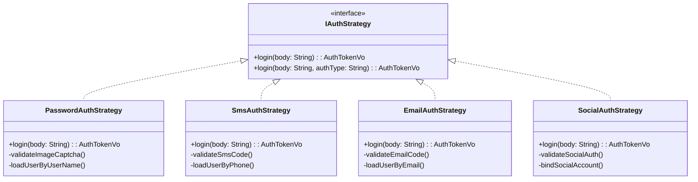
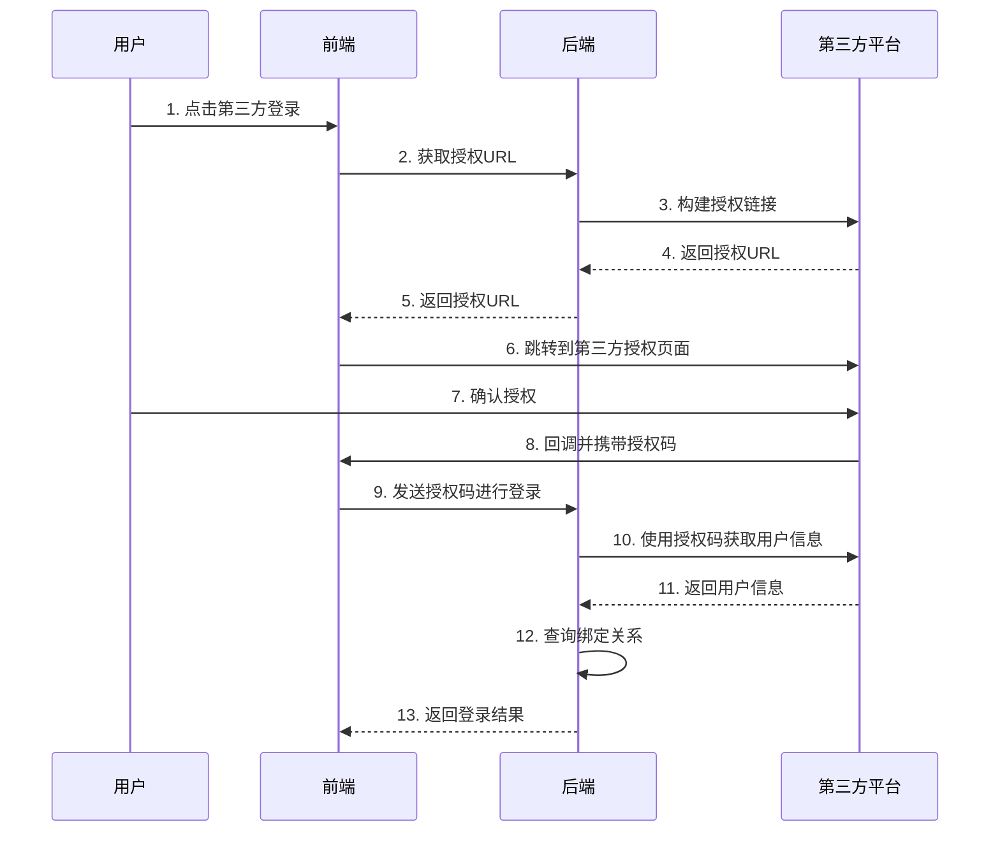

# 认证授权模块 (auth)

## 1. 模块概述

认证授权模块是系统安全的核心组件，负责用户身份验证、权限管理和会话控制。该模块采用策略模式设计，支持多种认证方式，并集成了完善的安全防护机制，确保系统的安全性和用户体验。

### 1.1 核心功能
- **多策略认证**: 支持密码、短信、邮箱、社交登录等多种认证方式
- **验证码保护**: 图片验证码、短信验证码、邮箱验证码防护
- **会话管理**: 基于Sa-Token的JWT令牌机制
- **社交登录**: 集成主流第三方平台OAuth认证
- **用户注册**: 支持用户自助注册和管理员创建
- **安全防护**: 登录限制、密码加密、防暴力破解

### 1.2 技术特性
- **策略模式**: 认证方式的插件化扩展
- **无状态设计**: JWT令牌的无状态会话管理
- **多租户支持**: 租户级别的用户隔离
- **国际化**: 完整的多语言支持
- **监控审计**: 完整的登录行为记录

## 2. 架构设计

### 2.1 模块结构

```text
auth/
├── controller/              # 控制器层
│   ├── AuthController.java  # 认证主控制器
│   └── CaptchaController.java # 验证码控制器
├── service/                 # 服务层
│   ├── IAuthStrategy.java   # 认证策略接口
│   ├── SysLoginService.java # 登录服务
│   └── SysRegisterService.java # 注册服务
├── service/impl/            # 策略实现层
│   ├── PasswordAuthStrategy.java # 密码认证策略
│   ├── SmsAuthStrategy.java      # 短信认证策略
│   ├── EmailAuthStrategy.java    # 邮箱认证策略
│   └── SocialAuthStrategy.java   # 社交登录策略
├── listener/                # 事件监听器
│   └── UserActionListener.java # 用户行为监听器
├── bo/                      # 业务对象
├── vo/                      # 视图对象
│   ├── AuthTokenVo.java     # 认证令牌对象
│   └── CaptchaVo.java       # 验证码对象
└── domain/                  # 领域对象
```

### 2.2 认证策略架构



## 3. 认证策略详解

### 3.1 策略接口设计

认证策略接口采用工厂方法模式，根据认证类型动态选择对应的策略实现：

```java
public interface IAuthStrategy {
    String BASE_NAME = "AuthStrategy";

    // 静态工厂方法，根据认证类型选择策略
    static AuthTokenVo login(String body, String authType) {
        String beanName = authType + BASE_NAME;
        IAuthStrategy instance = SpringUtils.getBean(beanName);
        return instance.login(body);
    }

    // 具体认证实现方法
    AuthTokenVo login(String body);
}
```

**设计优势**:
- **扩展性强**: 新增认证方式只需实现接口并注册Bean
- **解耦合**: 不同认证逻辑完全独立，便于维护
- **统一调用**: 通过统一接口调用，简化客户端逻辑

### 3.2 密码认证策略

**核心流程**:
1. **请求解析**: 解析用户名、密码、验证码等登录信息
2. **验证码校验**: 图片验证码的生成、存储和校验
3. **用户验证**: 根据用户名查询用户并校验状态
4. **密码校验**: BCrypt密码哈希验证，支持失败次数限制
5. **令牌生成**: 创建LoginUser对象并生成JWT令牌

**安全特性**:
- **图片验证码**: 防止自动化登录攻击
- **密码加密**: 使用BCrypt进行密码哈希存储
- **失败限制**: 连续密码错误后临时锁定账号
- **IP记录**: 记录登录IP和地理位置信息

**关键代码逻辑**:
```java
@Service("password" + IAuthStrategy.BASE_NAME)
public class PasswordAuthStrategy implements IAuthStrategy {
    
    @Override
    public AuthTokenVo login(String body) {
        // 1. 解析登录请求体
        PasswordLoginBody loginBody = JsonUtils.parseObject(body, PasswordLoginBody.class);
        
        // 2. 验证码校验
        if (captchaEnabled) {
            validateImageCaptcha(tenantId, userName, loginBody.getCode(), loginBody.getUuid());
        }
        
        // 3. 用户认证和密码校验
        LoginUser loginUser = TenantHelper.dynamic(tenantId, () -> {
            SysUserVo user = loadUserByUserName(userName);
            loginService.checkLogin(AuthType.PASSWORD, tenantId, user.getUserId(), userName, 
                () -> !BCrypt.checkpw(password, user.getPassword()));
            return loginService.createLoginUser(user);
        });
        
        // 4. 生成令牌
        LoginHelper.login(loginUser, loginParameter);
        return buildAuthTokenVo();
    }
}
```

### 3.3 短信认证策略

**适用场景**:
- 手机号快速登录
- 敏感操作验证
- 找回密码验证

**核心流程**:
1. **手机号验证**: 校验手机号格式和存在性
2. **短信验证码校验**: 验证短信验证码的有效性
3. **用户加载**: 根据手机号查询对应用户
4. **登录处理**: 创建用户会话和生成令牌

**特点**:
- **无需密码**: 仅通过手机号和验证码登录
- **限流保护**: 短信发送频率限制
- **有效期控制**: 验证码时效性管理

### 3.4 邮箱认证策略

**适用场景**:
- 邮箱登录
- 邮箱验证
- 找回密码

**核心特性**:
- **邮箱验证码**: 4位数字验证码邮件发送
- **邮箱校验**: 邮箱格式和有效性验证
- **防重复发送**: 60秒内限制重复发送

### 3.5 社交登录策略

**支持平台**:
- 微信、QQ、微博
- GitHub、Gitee
- 钉钉、企业微信

**核心流程**:
1. **OAuth授权**: 跳转第三方平台进行授权
2. **授权回调**: 接收第三方平台的授权回调
3. **用户信息获取**: 获取第三方平台的用户信息
4. **账号绑定**: 将第三方账号与系统用户绑定
5. **登录处理**: 基于绑定关系完成登录

**绑定管理**:
- **账号绑定**: 已有用户绑定第三方账号
- **自动注册**: 新用户通过第三方账号自动创建
- **解绑操作**: 用户可自主解绑第三方账号
- **多账号支持**: 同一用户可绑定多个第三方平台

## 4. 验证码系统

### 4.1 图片验证码

**验证码类型**:
- **数学运算**: 简单的加减乘除运算
- **字符验证**: 字母数字组合
- **中文验证**: 中文汉字验证码

**生成机制**:
```java
@GetMapping("/imgCode")
public R<CaptchaVo> imgCode() {
    // 检查验证码功能是否启用
    boolean captchaEnabled = configService.getBooleanValue(CaptchaProperties.CAPTCHA_ENABLED_KEY, true);
    
    // 生成验证码
    AbstractCaptcha captcha = CaptchaUtil.createCaptcha(captchaProperties);
    String uuid = IdUtil.simpleUUID();
    String verifyKey = GlobalConstants.CAPTCHA_CODE_KEY + uuid;
    
    // 存储到Redis
    RedisUtils.setCacheObject(verifyKey, captcha.getCode(), Duration.ofMinutes(Constants.CAPTCHA_EXPIRATION));
    
    // 返回验证码图片
    return R.ok(new CaptchaVo(uuid, captcha.getImageBase64()));
}
```

### 4.2 短信验证码

**发送逻辑**:
- **手机号校验**: 验证手机号格式和有效性
- **频率限制**: 每60秒只能发送一次
- **模板管理**: 支持不同场景的短信模板
- **多平台支持**: 集成多个短信服务商

**验证流程**:
- 生成6位随机数字验证码
- 调用SMS4J发送短信
- Redis存储验证码，设置5分钟有效期
- 登录时校验验证码的正确性和时效性

### 4.3 邮箱验证码

**邮件发送**:
```java
@RateLimiter(key = "#email", time = 60, count = 1)
public void emailCodeImpl(String email) {
    String code = RandomUtil.randomNumbers(4);
    String key = GlobalConstants.CAPTCHA_CODE_KEY + email;
    
    // 存储验证码
    RedisUtils.setCacheObject(key, code, Duration.ofMinutes(Constants.CAPTCHA_EXPIRATION));
    
    // 发送邮件
    MailUtils.sendText(email, "登录验证码", 
        "您本次验证码为：" + code + "，有效性为" + Constants.CAPTCHA_EXPIRATION + "分钟");
}
```

## 5. 会话管理

### 5.1 令牌机制

**Sa-Token集成**:
- **JWT令牌**: 无状态的令牌机制
- **多设备支持**: PC、移动端不同的令牌策略
- **自动刷新**: 令牌接近过期时自动刷新
- **强制下线**: 管理员可强制用户下线

**令牌配置**:
```java
// 不同用户类型的令牌超时时间
loginParameter.setTimeout(userType.getTimeout());           // 令牌有效期
loginParameter.setActiveTimeout(userType.getActiveTimeout()); // 活跃超时时间
loginParameter.setDeviceType(userType.getDeviceType());     // 设备类型
```

### 5.2 登录用户对象

**LoginUser结构**:
```java
public class LoginUser {
    private String tenantId;        // 租户ID
    private Long userId;            // 用户ID
    private String userName;        // 用户名
    private String userType;        // 用户类型
    private String deviceType;      // 设备类型
    private List<RoleDTO> roles;    // 角色信息
    private Set<String> permissions; // 权限集合
    private List<PostDTO> posts;    // 岗位信息
    private Long deptId;            // 部门ID
    private String deptName;        // 部门名称
}
```

**创建流程**:
1. **基础信息**: 设置用户基本信息和租户信息
2. **权限加载**: 查询用户的角色和权限信息
3. **部门信息**: 加载用户所属部门和岗位信息
4. **会话存储**: 将用户信息存储到会话中

### 5.3 会话监控

**在线用户管理**:
- **会话列表**: 查看当前在线用户列表
- **设备信息**: 记录用户登录设备和浏览器信息
- **地理位置**: 基于IP地址的地理位置识别
- **强制下线**: 管理员可强制指定用户下线

**用户行为监听**:
```java
@Component
public class UserActionListener implements SaTokenListener {
    
    @Override
    public void doLogin(String authType, Object loginId, String tokenValue, SaLoginParameter loginParameter) {
        // 记录登录日志
        // 更新用户登录信息
        // 缓存在线用户信息
    }
    
    @Override
    public void doLogout(String authType, Object loginId, String tokenValue) {
        // 记录登出日志
        // 清理用户缓存
    }
}
```

## 6. API接口设计

### 6.1 认证接口

#### 用户登录
```http
POST /auth/login
Content-Type: application/json

{
    "authType": "password",
    "userName": "admin",
    "password": "123456",
    "code": "1234",
    "uuid": "验证码UUID"
}
```

**响应示例**:
```json
{
    "code": 200,
    "msg": "操作成功",
    "data": {
        "accessToken": "eyJhbGciOiJIUzI1NiIs...",
        "expireIn": 7200
    }
}
```

#### 用户登出
```http
POST /auth/userLogout
Authorization: Bearer {token}
```

#### 用户注册
```http
POST /auth/userRegister
Content-Type: application/json

{
    "userName": "testuser",
    "password": "123456",
    "confirmPassword": "123456",
    "phone": "13888888888",
    "email": "test@example.com",
    "code": "1234",
    "uuid": "验证码UUID"
}
```

### 6.2 验证码接口

#### 获取图片验证码
```http
GET /auth/imgCode
```

**响应示例**:
```json
{
    "code": 200,
    "data": {
        "uuid": "4f2c5c6d-8a9b-4e3f-9c2d-1a2b3c4d5e6f",
        "img": "data:image/png;base64,iVBORw0KGgoAAAANSUhEUgAA..."
    }
}
```

#### 发送短信验证码
```http
GET /auth/smsCode?phone=13888888888
```

#### 发送邮箱验证码
```http
GET /auth/emailCode?email=test@example.com
```

### 6.3 社交登录接口

#### 获取授权URL
```http
GET /auth/socialAuthUrl/{source}
```

#### 社交登录
```http
POST /auth/socialLogin
Content-Type: application/json

{
    "source": "github",
    "socialCode": "authorization_code",
    "socialState": "state_value"
}
```

#### 绑定社交账号
```http
POST /auth/socialBind
Authorization: Bearer {token}
Content-Type: application/json

{
    "source": "github",
    "socialCode": "authorization_code",
    "socialState": "state_value"
}
```

#### 解绑社交账号
```http
DELETE /auth/socialUnbind/{socialId}
Authorization: Bearer {token}
```

## 7. 安全机制

### 7.1 密码安全

**密码策略**:
- **加密存储**: 使用BCrypt进行密码哈希
- **强度校验**: 密码复杂度要求
- **定期更换**: 支持密码定期更换策略
- **历史记录**: 避免使用近期使用过的密码

**密码验证**:
```java
// 密码错误次数限制
loginService.checkLogin(AuthType.PASSWORD, tenantId, user.getUserId(), userName, 
    userType.getDeviceType(), () -> !BCrypt.checkpw(password, user.getPassword()));
```

### 7.2 防暴力破解

**限制机制**:
- **错误次数统计**: Redis记录密码错误次数
- **渐进式锁定**: 错误次数越多，锁定时间越长
- **IP限制**: 基于IP的登录频率限制
- **设备识别**: 异常设备登录提醒

**实现逻辑**:
```java
public void checkLogin(AuthType authType, String tenantId, Long userId, 
                      String userName, String deviceType, Supplier<Boolean> checkFunction) {
    // 构建缓存键
    String lockKey = CacheConstants.PWD_ERR_CNT_KEY + userName;
    
    // 获取错误次数
    String errorCount = RedisUtils.getCacheObject(lockKey);
    
    // 检查是否超过最大重试次数
    if (StringUtils.isNotBlank(errorCount) && Convert.toInt(errorCount) >= maxRetryCount) {
        // 记录登录日志并抛出异常
        throw UserException.of(I18nKeys.User.PASSWORD_RETRY_LIMIT_EXCEED, maxRetryCount, lockTime);
    }
    
    // 执行具体的校验逻辑
    if (checkFunction.get()) {
        // 校验失败，增加错误次数
        RedisUtils.setCacheObject(lockKey, Convert.toInt(errorCount) + 1, Duration.ofMinutes(lockTime));
        throw UserException.of(I18nKeys.User.PASSWORD_NOT_MATCH);
    } else {
        // 校验成功，清除错误次数
        RedisUtils.deleteObject(lockKey);
    }
}
```

### 7.3 数据脱敏

**敏感信息保护**:
```java
public class SysUserProfileBo {
    @Sensitive(strategy = SensitiveStrategy.EMAIL)
    @Email(message = "邮箱格式不正确")
    private String email;
    
    @Sensitive(strategy = SensitiveStrategy.PHONE)
    @Pattern(regexp = RegexPatterns.MOBILE, message = "手机号格式不正确")
    private String phone;
}
```

**脱敏策略**:
- **邮箱脱敏**: test***@example.com
- **手机号脱敏**: 138****8888
- **身份证脱敏**: 320***********1234
- **银行卡脱敏**: 6222***********1234

## 8. 社交登录集成

### 8.1 OAuth流程



### 8.2 第三方用户信息管理

**SysSocial实体**:
```java
@TableName("sys_social")
public class SysSocial extends TenantEntity {
    private Long id;                // 主键ID
    private Long userId;            // 系统用户ID
    private String authId;          // 第三方唯一ID
    private String source;          // 平台来源
    private String accessToken;     // 访问令牌
    private String refreshToken;    // 刷新令牌
    private String openId;          // 开放ID
    private String unionId;         // 联合ID
    private String userName;        // 第三方用户名
    private String nickName;        // 第三方昵称
    private String email;           // 第三方邮箱
    private String avatar;          // 第三方头像
}
```

**绑定规则**:
- **一对多**: 一个系统用户可绑定多个第三方账号
- **唯一性**: 同一个第三方账号只能绑定一个系统用户
- **租户隔离**: 不同租户的绑定关系完全隔离

## 9. 用户注册系统

### 9.1 注册流程

**PC端注册**:
1. **信息验证**: 用户名、邮箱、手机号唯一性校验
2. **验证码校验**: 图片验证码或短信验证码验证
3. **密码加密**: BCrypt加密存储用户密码
4. **角色分配**: 自动分配默认用户角色
5. **登录日志**: 记录注册成功日志

**移动端注册**:
```java
@Transactional(rollbackFor = Exception.class)
public SysUserVo registerAppUser(String userName, String password, String phone, 
                                 String nickName, String avatar) {
    SysUser sysUser = new SysUser();
    sysUser.setTenantId(TenantHelper.getTenantId());
    sysUser.setUserType(UserType.APP_USER.getUserType());
    
    // 用户名唯一性校验
    if (StringUtils.isNotBlank(userName)) {
        if (!userService.isUserNameUnique(userName, null)) {
            throw UserException.of(I18nKeys.User.REGISTER_ACCOUNT_EXISTS, userName);
        }
        sysUser.setUserName(userName);
    }
    
    // 密码加密存储
    if (StringUtils.isNotBlank(password)) {
        sysUser.setPassword(BCrypt.hashpw(password));
    }
    
    // 设置其他信息
    sysUser.setPhone(phone);
    sysUser.setNickName(nickName);
    sysUser.setAvatar(avatar);
    
    // 保存用户
    userMapper.insert(sysUser);
    
    // 分配默认角色
    assignDefaultRole(sysUser);
    
    return MapstructUtils.convert(sysUser, SysUserVo.class);
}
```

### 9.2 注册配置

**注册开关控制**:
- **全局开关**: 系统级别的注册功能开关
- **租户开关**: 租户级别的注册控制
- **邀请注册**: 基于邀请码的注册机制

**数据校验**:
- **必填字段**: 用户名、密码、确认密码
- **格式校验**: 邮箱格式、手机号格式
- **业务规则**: 用户名唯一性、邮箱唯一性

## 10. 权限集成

### 10.1 权限注解

**控制器权限**:
```java
@SaCheckPermission("system:user:list")    // 菜单权限校验
@SaCheckRole("admin")                     // 角色权限校验
@GetMapping("/list")
public PageResult<SysUserVo> list(SysUserBo user, PageQuery pageQuery) {
    return userService.pageUsers(user, pageQuery);
}
```

**方法级权限**:
- **细粒度控制**: 方法级别的权限校验
- **动态权限**: 基于参数的动态权限判断
- **权限继承**: 角色权限的继承关系

### 10.2 数据权限

**数据范围控制**:
```java
@DataScope(deptAlias = "d", userAlias = "u")
public List<SysUserVo> listUsers(SysUserBo user) {
    // 根据用户的数据权限自动过滤查询结果
}
```

**权限范围类型**:
- **全部数据权限**: 不受限制，查看所有数据
- **自定数据权限**: 根据自定义规则过滤数据
- **部门数据权限**: 仅查看本部门数据
- **部门及以下数据权限**: 查看本部门及下级部门数据
- **仅本人数据权限**: 仅查看与自己相关的数据

## 11. 多租户认证

### 11.1 租户识别

**识别方式**:
1. **域名识别**: 根据访问域名自动识别租户
2. **请求头识别**: 通过HTTP头部传递租户信息
3. **参数识别**: URL参数中包含租户标识

**识别逻辑**:
```java
@Override
public String getTenantIdByRequest() {
    HttpServletRequest request = ServletUtils.getRequest();
    
    // 1. 优先通过域名识别租户
    String host = extractHostFromRequest(request);
    String tenantId = getTenantIdByDomain(host);
    
    if (StringUtils.isNotBlank(tenantId)) {
        return tenantId;
    }
    
    // 2. 通过请求头获取租户ID
    return request.getHeader(TenantConstants.TENANT_ID_HEADER);
}
```

### 11.2 租户隔离

**数据隔离**:
- **自动过滤**: 所有查询自动添加租户条件
- **写入控制**: 数据写入时自动设置租户ID
- **缓存隔离**: 缓存Key包含租户信息

**会话隔离**:
- **令牌隔离**: 不同租户的令牌完全独立
- **权限隔离**: 租户间的权限数据完全隔离
- **配置隔离**: 每个租户独立的系统配置

## 12. 监控与审计

### 12.1 登录日志

**日志记录内容**:
```java
public class SysLoginLog {
    private Long infoId;         // 访问ID
    private String tenantId;     // 租户ID
    private Long userId;         // 用户ID
    private String userName;     // 用户账号
    private String deviceType;   // 设备类型
    private String status;       // 登录状态
    private String ipaddr;       // 登录IP地址
    private String loginLocation; // 登录地点
    private String browser;      // 浏览器类型
    private String os;           // 操作系统
    private String msg;          // 提示消息
    private Date loginTime;      // 访问时间
}
```

**日志分析**:
- **成功率统计**: 登录成功率分析
- **地理分布**: 用户登录地理位置分析
- **设备统计**: 登录设备类型统计
- **异常检测**: 异常登录行为识别和告警

### 12.2 操作审计

**审计范围**:
- **登录登出**: 用户登录登出行为记录
- **权限变更**: 角色权限的分配和回收
- **敏感操作**: 密码修改、账号锁定解锁
- **数据操作**: 重要数据的增删改操作

**审计信息**:
```java
// 登录日志发布
loginLogPublisher.publishLoginLog(userName, DictOperResult.SUCCESS.getValue(),
    MessageUtils.message(I18nKeys.User.LOGIN_SUCCESS), tenantId, userId, deviceType);
```

## 13. 错误处理机制

### 13.1 异常分类

**认证相关异常**:
```java
// 用户相关异常
public class UserException extends RuntimeException {
    public static UserException of(String messageKey, Object... args) {
        return new UserException(MessageUtils.message(messageKey, args));
    }
}

// 验证码异常
public class CaptchaException extends UserException {
    // 验证码错误异常
}

public class CaptchaExpireException extends UserException {
    // 验证码过期异常
}
```

**异常处理策略**:
- **友好提示**: 向用户显示友好的错误信息
- **日志记录**: 记录详细的错误日志供排查
- **国际化**: 错误信息支持多语言
- **安全考虑**: 避免泄露敏感的系统信息

### 13.2 国际化错误信息

**错误信息键值**:
```java
public class I18nKeys {
    public static class User {
        public static final String ACCOUNT_NOT_EXISTS = "user.account.not.exists";
        public static final String ACCOUNT_DISABLED = "user.account.disabled";
        public static final String PASSWORD_NOT_MATCH = "user.password.not.match";
        public static final String PASSWORD_RETRY_LIMIT_EXCEED = "user.password.retry.limit.exceed";
    }
    
    public static class VerifyCode {
        public static final String CAPTCHA_INVALID = "verify.code.captcha.invalid";
        public static final String CAPTCHA_EXPIRED = "verify.code.captcha.expired";
        public static final String SMS_INVALID = "verify.code.sms.invalid";
        public static final String EMAIL_INVALID = "verify.code.email.invalid";
    }
}
```

## 14. 配置管理

### 14.1 认证配置

**Sa-Token配置**:
```yaml
sa-token:
  # token 名称
  token-name: Authorization
  # 是否允许同一账号多地同时登录 (为true时允许一起登录, 为false时新登录挤掉旧登录)
  is-concurrent: true
  # 在多人登录同一账号时，是否共用一个token (为true时所有登录共用一个token, 为false时每次登录新建一个token)
  is-share: true
  # jwt秘钥
  jwt-secret-key: ruoyi
```

**验证码配置**:
```yaml
captcha:
  # 验证码类型 math 数组计算 char 字符验证
  type: MATH
  # line 线段干扰 circle 圆圈干扰 shear 扭曲干扰
  category: CIRCLE
  # 数字验证码位数
  numberLength: 1
  # 字符验证码长度
  charLength: 4
```

### 14.2 社交登录配置

**第三方平台配置**:
```yaml
justauth:
  enabled: true
  type:
    github:
      client-id: your_github_client_id
      client-secret: your_github_client_secret
      redirect-uri: http://localhost:8080/auth/social/callback/github
    wechat_enterprise:
      client-id: your_wechat_corp_id
      client-secret: your_wechat_corp_secret
      agent-id: your_agent_id
```

## 15. 性能优化

### 15.1 缓存策略

**多级缓存**:
- **一级缓存**: 本地缓存，存储热点权限数据
- **二级缓存**: Redis缓存，存储用户会话和权限信息
- **缓存预热**: 系统启动时预加载常用数据

**缓存设计**:
```java
// 用户权限缓存
@Cacheable(cacheNames = CacheNames.SYS_USER_PERMISSIONS, key = "#userId")
public Set<String> getUserPermissions(Long userId) {
    return menuService.listMenuPermissionsByUserId(userId);
}

// 缓存失效策略
@CacheEvict(cacheNames = CacheNames.SYS_USER_PERMISSIONS, key = "#userId")
public void clearUserPermissionsCache(Long userId) {
    // 权限变更时清理用户权限缓存
}
```

### 15.2 性能监控

**关键指标**:
- **登录响应时间**: 平均 < 500ms
- **权限校验时间**: 平均 < 50ms
- **缓存命中率**: > 95%
- **并发登录支持**: > 1000用户同时在线

**性能优化措施**:
- **连接池优化**: 数据库和Redis连接池配置
- **查询优化**: 权限查询的SQL优化
- **异步处理**: 日志记录等非核心操作异步处理
- **批量操作**: 权限加载的批量查询优化

## 16. 安全配置

### 16.1 限流配置

**接口限流**:
```java
// 验证码发送限流
@RateLimiter(key = "#phone", time = 60, count = 1, limitType = LimitType.IP)
public void sendSmsCode(String phone) {
    // 每个IP每60秒只能发送1次短信验证码
}

// 登录接口限流
@RateLimiter(key = "login", time = 60, count = 10, limitType = LimitType.IP)
public AuthTokenVo login(LoginBody loginBody) {
    // 每个IP每60秒最多尝试10次登录
}
```

**限流策略**:
- **基于IP**: 防止单个IP的恶意请求
- **基于用户**: 防止单个用户的频繁操作
- **基于接口**: 保护敏感接口不被过度调用
- **基于全局**: 系统整体的流量控制

### 16.2 数据加密

**传输加密**:
```java
@ApiEncrypt  // 接口加密注解
@PostMapping("/login")
public R<AuthTokenVo> login(@RequestBody LoginBody loginBody) {
    // 登录接口数据加密传输
}
```

**存储加密**:
- **密码加密**: BCrypt哈希算法
- **敏感字段**: AES对称加密
- **配置加密**: 敏感配置项的加密存储

## 17. 扩展指南

### 17.1 新增认证策略

**实现步骤**:
1. **创建策略类**: 实现`IAuthStrategy`接口
2. **注册Spring Bean**: 使用命名规范注册Bean
3. **添加请求体**: 定义对应的登录请求VO
4. **前端适配**: 前端调用时指定认证类型

**示例实现**:
```java
@Service("fingerprint" + IAuthStrategy.BASE_NAME)
public class FingerprintAuthStrategy implements IAuthStrategy {
    
    @Override
    public AuthTokenVo login(String body) {
        // 解析指纹登录请求
        FingerprintLoginBody loginBody = JsonUtils.parseObject(body, FingerprintLoginBody.class);
        
        // 指纹验证逻辑
        validateFingerprint(loginBody.getFingerprintData());
        
        // 查询用户并生成令牌
        SysUserVo user = loadUserByFingerprint(loginBody.getFingerprintId());
        LoginUser loginUser = loginService.createLoginUser(user);
        
        // 生成令牌
        LoginHelper.login(loginUser);
        return buildAuthTokenVo();
    }
}
```

### 17.2 自定义验证码

**验证码扩展**:
```java
// 自定义验证码生成器
public class CustomCaptchaGenerator implements CodeGenerator {
    @Override
    public String generate() {
        // 自定义验证码生成逻辑
        return generateCustomCode();
    }
}

// 验证码类型枚举扩展
public enum CaptchaType {
    MATH("math", "数学运算"),
    CHAR("char", "字符验证"),
    CHINESE("chinese", "中文验证"),
    CUSTOM("custom", "自定义验证");
}
```

### 17.3 集成新的社交平台

**集成步骤**:
1. **配置OAuth信息**: 在配置文件中添加平台配置
2. **更新JustAuth**: 确保JustAuth支持该平台
3. **前端适配**: 添加对应的登录按钮和回调处理
4. **测试验证**: 完整的登录绑定流程测试

## 18. 安全最佳实践

### 18.1 密码安全

**密码策略建议**:
- **复杂度要求**: 包含大小写字母、数字、特殊字符
- **长度限制**: 最少8位，最多20位
- **定期更换**: 建议90天更换一次密码
- **历史记录**: 避免使用最近5次使用过的密码

### 18.2 会话安全

**会话管理建议**:
- **超时控制**: 合理设置会话超时时间
- **并发限制**: 限制同一用户的并发登录数
- **设备绑定**: 重要操作需要设备验证
- **异常检测**: 检测异常的登录行为

### 18.3 接口安全

**接口保护措施**:
- **HTTPS传输**: 强制使用HTTPS协议
- **请求签名**: 重要接口的请求签名验证
- **时间戳验证**: 防止重放攻击
- **IP白名单**: 管理接口的IP访问限制

## 19. 故障排查

### 19.1 常见问题

**登录失败问题**:
1. **验证码错误**: 检查验证码生成和校验逻辑
2. **密码错误**: 确认密码加密方式一致性
3. **账号锁定**: 检查错误次数限制配置
4. **租户问题**: 确认租户识别和数据隔离

**令牌问题**:
1. **令牌过期**: 检查令牌有效期配置
2. **令牌无效**: 确认JWT签名密钥一致性
3. **权限错误**: 检查用户权限加载逻辑
4. **缓存问题**: 确认Redis连接和缓存策略

### 19.2 调试技巧

**日志调试**:
```java
// 开启调试日志
logging:
  level:
    plus.ruoyi.system.auth: DEBUG
    cn.dev33.satoken: DEBUG
```

**监控检查**:
- **登录日志**: 查看登录失败的具体原因
- **系统监控**: 检查系统资源使用情况
- **缓存状态**: 确认Redis缓存的健康状态
- **数据库连接**: 检查数据库连接池状态

## 20. 注意事项

### 20.1 安全注意事项

**开发阶段**:
- **敏感信息**: 避免在代码中硬编码敏感信息
- **日志安全**: 避免在日志中输出敏感数据
- **异常处理**: 异常信息不应泄露系统内部结构
- **测试数据**: 测试环境不使用生产环境的真实数据

**部署阶段**:
- **HTTPS配置**: 生产环境强制使用HTTPS
- **密钥管理**: JWT签名密钥的安全管理
- **防火墙配置**: 限制不必要的网络访问
- **定期更新**: 及时更新安全补丁

认证授权模块作为系统安全的第一道防线，需要持续关注安全趋势和技术发展，不断完善和加强安全防护能力。
