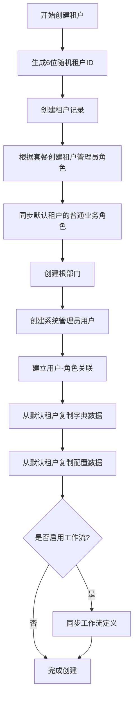

# 多租户 (Tenant)

## 1. 模块概述

多租户模块是 RuoYi-Plus 框架的核心组件之一，提供完整的 SaaS 多租户架构支持。该模块实现了租户的全生命周期管理和多层次数据隔离能力，支持企业级多租户应用的快速构建。

### 1.1 核心功能

- **租户管理**：租户创建、修改、删除、状态控制、过期时间管理
- **套餐管理**：租户套餐配置，通过菜单权限控制功能范围
- **数据隔离**：基于 `tenant_id` 的数据库级别数据隔离
- **缓存隔离**：Redis 缓存键自动添加租户前缀，实现缓存数据隔离
- **会话隔离**：SaToken 认证会话的租户隔离
- **租户识别**：支持域名绑定和请求头 `X-Tenant-Id` 识别
- **动态租户**：超管可动态切换租户进行数据查看和管理
- **数据同步**：角色、字典、配置等基础数据的租户间同步

### 1.2 技术架构

多租户模块采用分层架构设计：

```text
┌─────────────────────────────────────────────────────────────┐
│                    Controller Layer                          │
│     SysTenantController / SysTenantPackageController        │
├─────────────────────────────────────────────────────────────┤
│                    Service Layer                             │
│            SysTenantServiceImpl (业务逻辑)                   │
├─────────────────────────────────────────────────────────────┤
│                    Helper Layer                              │
│        TenantHelper (租户上下文操作工具类)                   │
├─────────────────────────────────────────────────────────────┤
│                  Interceptor Layer                           │
│    PlusTenantLineHandler (MyBatis-Plus 租户拦截器)          │
│    TenantKeyPrefixHandler (Redis 键前缀处理器)              │
│    TenantSpringCacheManager (缓存管理器)                    │
│    TenantSaTokenDao (SaToken 认证数据隔离)                  │
├─────────────────────────────────────────────────────────────┤
│                    DAO Layer                                 │
│              ISysTenantDao / ISysTenantPackageDao           │
├─────────────────────────────────────────────────────────────┤
│                    Database                                  │
│              sys_tenant / sys_tenant_package                │
└─────────────────────────────────────────────────────────────┘
```

### 1.3 模块结构

```text
ruoyi-common-tenant/                    # 多租户通用模块
├── config/
│   └── TenantAutoConfiguration.java   # 自动配置类
├── core/
│   ├── TenantEntity.java              # 租户实体基类
│   └── TenantSaTokenDao.java          # SaToken 多租户支持
├── exception/
│   └── TenantException.java           # 租户异常类
├── handle/
│   ├── PlusTenantLineHandler.java     # MyBatis 租户处理器
│   └── TenantKeyPrefixHandler.java    # Redis 键前缀处理器
├── helper/
│   └── TenantHelper.java              # 租户操作工具类
├── manager/
│   └── TenantSpringCacheManager.java  # 多租户缓存管理器
└── properties/
    └── TenantProperties.java          # 租户配置属性

ruoyi-system/tenant/                    # 租户业务模块
├── controller/
│   ├── SysTenantController.java       # 租户管理接口
│   └── SysTenantPackageController.java # 套餐管理接口
├── dao/
│   ├── ISysTenantDao.java             # 租户数据访问接口
│   └── ISysTenantPackageDao.java      # 套餐数据访问接口
├── domain/
│   ├── SysTenant.java                 # 租户实体
│   ├── SysTenantPackage.java          # 套餐实体
│   ├── bo/                            # 业务对象
│   └── vo/                            # 视图对象
└── service/
    ├── ISysTenantService.java         # 租户服务接口
    └── impl/
        └── SysTenantServiceImpl.java  # 租户服务实现
```

## 2. 核心实体设计

### 2.1 租户实体 (SysTenant)

租户实体对应数据库表 `sys_tenant`，继承自 `BaseEntity`：

```java
@Data
@EqualsAndHashCode(callSuper = true)
@TableName("sys_tenant")
public class SysTenant extends BaseEntity {

    /** 主键ID */
    @TableId(value = "id")
    private Long id;

    /** 租户ID（6位随机数字） */
    private String tenantId;

    /** 联系人 */
    private String contactUserName;

    /** 联系电话 */
    private String contactPhone;

    /** 企业名称 */
    private String companyName;

    /** 统一社会信用代码 */
    private String licenseNumber;

    /** 地址 */
    private String address;

    /** 绑定域名 */
    private String domain;

    /** 企业简介 */
    private String intro;

    /** 备注 */
    private String remark;

    /** 租户套餐ID */
    private Long packageId;

    /** 过期时间 */
    private Date expireTime;

    /** 用户数量限制（-1表示不限制） */
    private Long accountCount;

    /** 租户状态 */
    private String status;

    /** 逻辑删除标志 */
    @TableLogic
    private String isDeleted;
}
```

**字段说明：**

| 字段名 | 类型 | 说明 |
|--------|------|------|
| id | `Long` | 主键ID，自动生成 |
| tenantId | `String` | 租户ID，系统自动生成的6位随机数字 |
| contactUserName | `String` | 联系人姓名 |
| contactPhone | `String` | 联系电话 |
| companyName | `String` | 企业名称，系统内唯一 |
| licenseNumber | `String` | 统一社会信用代码 |
| address | `String` | 企业地址 |
| domain | `String` | 绑定的域名，用于域名识别租户 |
| intro | `String` | 企业简介 |
| remark | `String` | 备注信息 |
| packageId | `Long` | 关联的租户套餐ID |
| expireTime | `Date` | 租户过期时间，null表示永不过期 |
| accountCount | `Long` | 用户数量限制，-1表示不限制 |
| status | `String` | 租户状态（0正常 1停用） |
| isDeleted | `String` | 逻辑删除标志（0正常 1已删除） |

### 2.2 租户套餐实体 (SysTenantPackage)

租户套餐实体对应数据库表 `sys_tenant_package`：

```java
@Data
@EqualsAndHashCode(callSuper = true)
@TableName("sys_tenant_package")
public class SysTenantPackage extends BaseEntity {

    /** 套餐ID */
    @TableId(value = "package_id")
    private Long packageId;

    /** 套餐名称 */
    private String packageName;

    /** 关联菜单ID（逗号分隔） */
    private String menuIds;

    /** 备注 */
    private String remark;

    /** 菜单树选择项是否关联显示 */
    private Boolean menuCheckStrictly;

    /** 状态 */
    private String status;

    /** 逻辑删除标志 */
    @TableLogic
    private String isDeleted;
}
```

**字段说明：**

| 字段名 | 类型 | 说明 |
|--------|------|------|
| packageId | `Long` | 套餐ID，主键 |
| packageName | `String` | 套餐名称 |
| menuIds | `String` | 关联的菜单ID列表，逗号分隔 |
| remark | `String` | 备注信息 |
| menuCheckStrictly | `Boolean` | 菜单树选择项是否父子关联（0不关联 1关联） |
| status | `String` | 套餐状态（0正常 1停用） |
| isDeleted | `String` | 逻辑删除标志 |

### 2.3 租户实体基类 (TenantEntity)

所有需要租户隔离的实体都应继承 `TenantEntity`：

```java
@Data
@EqualsAndHashCode(callSuper = true)
public class TenantEntity extends BaseEntity {

    /** 租户ID，用于数据隔离 */
    private String tenantId;
}
```

**使用示例：**

```java
// 用户实体继承 TenantEntity 实现租户隔离
@TableName("sys_user")
public class SysUser extends TenantEntity {
    private Long userId;
    private String userName;
    // ... 其他字段
}

// 部门实体继承 TenantEntity
@TableName("sys_dept")
public class SysDept extends TenantEntity {
    private Long deptId;
    private String deptName;
    // ... 其他字段
}
```

## 3. 核心业务流程

### 3.1 租户创建流程

租户创建是一个复杂的初始化过程，涉及多个关联表的数据创建：



**关键实现代码：**

```java
@Override
@Transactional(rollbackFor = Exception.class)
public boolean insertTenant(SysTenantBo bo) {
    SysTenant add = MapstructUtils.convert(bo, SysTenant.class);

    // 1. 生成唯一的租户ID（6位随机数字）
    List<String> tenantIds = tenantDao.listAllTenantIds();
    String tenantId = generateTenantId(tenantIds);
    add.setTenantId(tenantId);

    // 处理域名格式（去掉协议前缀）
    add.setDomain(StringUtils.contains(add.getDomain(), "//") ?
        StringUtils.splitToList(add.getDomain(), "//").get(1) : add.getDomain());

    tenantDao.insert(add);

    // 2. 根据套餐创建租户管理员角色
    Long roleId = createTenantRole(tenantId, bo.getPackageId());

    // 3. 同步默认租户的普通业务角色到新租户
    syncDefaultRolesToNewTenant(tenantId, bo.getPackageId());

    // 4. 创建根部门（企业名称作为部门名称）
    SysDept dept = new SysDept();
    dept.setTenantId(tenantId);
    dept.setDeptName(bo.getCompanyName());
    dept.setParentId(Constants.TOP_PARENT_ID);
    dept.setAncestors(Constants.TOP_PARENT_ID.toString());
    deptDao.insert(dept);

    // 5. 创建系统管理员用户
    SysUser user = new SysUser();
    user.setTenantId(tenantId);
    user.setUserName(bo.getUserName());
    user.setNickName(bo.getUserName());
    user.setPassword(BCrypt.hashpw(bo.getPassword()));
    user.setDeptId(dept.getDeptId());
    user.setUserType(UserType.PC_USER.getUserType());
    userDao.insert(user);

    // 6. 建立用户-角色关联
    SysUserRole userRole = new SysUserRole();
    userRole.setUserId(user.getUserId());
    userRole.setRoleId(roleId);
    userRoleDao.insert(userRole);

    // 7. 从默认租户复制字典和配置数据
    String defaultTenantId = TenantConstants.DEFAULT_TENANT_ID;
    List<SysDictType> dictTypeList = dictTypeDao.listByTenantId(defaultTenantId);
    List<SysDictData> dictDataList = dictDataDao.listByTenantId(defaultTenantId);
    List<SysConfig> sysConfigList = configDao.listByTenantId(defaultTenantId);

    // 批量插入到新租户
    dictTypeDao.batchInsert(dictTypeList);
    dictDataDao.batchInsert(dictDataList);
    configDao.batchInsert(sysConfigList);

    // 8. 如果启用工作流，同步流程定义
    if (SpringUtils.getProperty("warm-flow.enabled", Boolean.class, false)) {
        WorkflowService workflowService = SpringUtils.getBean(WorkflowService.class);
        workflowService.syncDef(tenantId);
    }

    return true;
}

/**
 * 生成唯一的租户ID
 */
private String generateTenantId(List<String> tenantIds) {
    String numbers = RandomUtil.randomNumbers(6);
    if (tenantIds.contains(numbers)) {
        return generateTenantId(tenantIds);
    }
    return numbers;
}
```

### 3.2 租户识别机制

系统支持多种租户识别方式，按优先级从高到低：

```text
┌─────────────────────────────────────────────────────────────┐
│                    租户识别优先级                            │
├─────────────────────────────────────────────────────────────┤
│  1. 动态租户 (TenantHelper.getDynamic())                    │
│     ↓                                                       │
│  2. 登录用户租户 (LoginHelper.getTenantId())               │
│     ↓                                                       │
│  3. 域名识别 (通过 domain 字段匹配)                         │
│     ↓                                                       │
│  4. 请求头 X-Tenant-Id                                      │
│     ↓                                                       │
│  5. 默认租户 (TenantConstants.DEFAULT_TENANT_ID = 000000)  │
└─────────────────────────────────────────────────────────────┘
```

**域名识别示例：**

```text
tenant1.example.com → 租户ID: 123456
tenant2.example.com → 租户ID: 789012
api.example.com    → 请求头 X-Tenant-Id: 654321
```

**核心实现：**

```java
/**
 * 获取当前有效的租户ID
 */
public static String getTenantId() {
    // 如果租户功能未开启，返回默认租户
    if (!isEnable()) {
        return TenantConstants.DEFAULT_TENANT_ID;
    }

    // 1. 优先获取动态租户
    String tenantId = getDynamic();

    if (StringUtils.isBlank(tenantId)) {
        // 2. 从登录用户信息获取
        tenantId = LoginHelper.getTenantId();
    }

    if (StringUtils.isBlank(tenantId)) {
        // 3. 从请求中获取（包含域名识别和请求头获取）
        try {
            tenantId = SpringUtils.getBean(TenantService.class).getTenantIdByRequest();
        } catch (Exception ignored) {
            // 忽略非Web环境的异常
        }
    }

    return StringUtils.isNotBlank(tenantId) ? tenantId : TenantConstants.DEFAULT_TENANT_ID;
}

/**
 * 根据请求获取租户ID
 */
@Override
public String getTenantIdByRequest() {
    HttpServletRequest request = ServletUtils.getRequest();
    if (!TenantHelper.isEnable() || request == null) {
        return null;
    }

    // 1. 优先通过域名识别租户
    String host = extractHostFromRequest(request);
    String tenantId = getTenantIdByDomain(host);

    if (StringUtils.isNotBlank(tenantId)) {
        return tenantId;
    }

    // 2. 从请求头 X-Tenant-Id 获取
    try {
        tenantId = request.getHeader("X-Tenant-Id");
        if (StringUtils.isNotBlank(tenantId)) {
            return tenantId;
        }
    } catch (Exception ignored) {
    }

    return null;
}
```

### 3.3 动态租户切换

超级管理员可以动态切换到其他租户进行数据查看和管理：

```java
/**
 * 设置动态租户
 *
 * @param tenantId 租户ID
 * @param global   是否全局生效（存储到Redis）
 */
public static void setDynamic(String tenantId, boolean global) {
    if (!isEnable()) {
        return;
    }

    // 未登录或非全局模式，只在线程内生效
    if (!LoginHelper.isLogin() || !global) {
        TEMP_DYNAMIC_TENANT.set(tenantId);
        return;
    }

    // 存储到Redis，跨请求生效
    String cacheKey = DYNAMIC_TENANT_KEY + ":" + LoginHelper.getUserId();
    RedisUtils.setCacheObject(cacheKey, tenantId, Duration.ofDays(10));
    SaHolder.getStorage().set(cacheKey, tenantId);
}

/**
 * 清除动态租户设置
 */
public static void clearDynamic() {
    if (!isEnable()) {
        return;
    }

    if (!LoginHelper.isLogin()) {
        TEMP_DYNAMIC_TENANT.remove();
        return;
    }

    // 清除线程本地和Redis存储
    TEMP_DYNAMIC_TENANT.remove();
    String cacheKey = DYNAMIC_TENANT_KEY + ":" + LoginHelper.getUserId();
    RedisUtils.deleteObject(cacheKey);
    SaHolder.getStorage().delete(cacheKey);
}
```

**在指定租户下执行代码块：**

```java
// 方式1：使用 Runnable
TenantHelper.dynamic("123456", () -> {
    // 在租户 123456 下执行的代码
    userService.list();
});

// 方式2：使用 Supplier 获取返回值
List<SysUser> users = TenantHelper.dynamic("123456", () -> {
    return userService.list();
});
```

### 3.4 租户忽略模式

某些场景需要临时忽略租户过滤（如跨租户查询）：

```java
/**
 * 在忽略租户模式下执行代码块
 */
public static void ignore(Runnable handle) {
    enableIgnore();
    try {
        handle.run();
    } finally {
        disableIgnore();
    }
}

/**
 * 在忽略租户模式下执行代码块并返回结果
 */
public static <T> T ignore(Supplier<T> handle) {
    enableIgnore();
    try {
        return handle.get();
    } finally {
        disableIgnore();
    }
}
```

**使用示例：**

```java
// 忽略租户查询所有数据
List<SysTenant> allTenants = TenantHelper.ignore(() -> {
    return tenantDao.listAll();
});

// 新增租户时忽略租户过滤
TenantHelper.ignore(() -> tenantService.insertTenant(bo));
```

**重入支持：**

租户忽略模式支持重入，使用栈计数器确保嵌套调用的正确性：

```java
private static final ThreadLocal<Stack<Integer>> REENTRANT_IGNORE =
    ThreadLocal.withInitial(Stack::new);

private static void enableIgnore() {
    IgnoreStrategy ignoreStrategy = getIgnoreStrategy();
    if (ObjectUtil.isNull(ignoreStrategy)) {
        InterceptorIgnoreHelper.handle(
            IgnoreStrategy.builder().tenantLine(true).build()
        );
    } else {
        ignoreStrategy.setTenantLine(true);
    }

    // 重入计数
    Stack<Integer> reentrantStack = REENTRANT_IGNORE.get();
    reentrantStack.push(reentrantStack.size() + 1);
}

private static void disableIgnore() {
    // ...
    Stack<Integer> reentrantStack = REENTRANT_IGNORE.get();
    boolean empty = reentrantStack.isEmpty() || reentrantStack.pop() == 1;

    if (noOtherIgnoreStrategy && empty) {
        InterceptorIgnoreHelper.clearIgnoreStrategy();
    } else if (empty) {
        ignoreStrategy.setTenantLine(false);
    }
}
```

## 4. 数据隔离机制

### 4.1 数据库级别隔离

系统使用 MyBatis-Plus 的 `TenantLineInnerInterceptor` 实现数据库级别的租户隔离：

```java
@Slf4j
public class PlusTenantLineHandler implements TenantLineHandler {

    /**
     * 系统固定排除表（硬编码，防止用户误配置）
     */
    private static final Set<String> SYSTEM_EXCLUDE_TABLES = Set.of(
        "sys_tenant",
        "sys_tenant_package",
        "sys_gen_table",
        "sys_gen_table_column",
        "sys_menu",
        "sys_role_menu",
        "sys_role_dept",
        "sys_user_role",
        "sys_user_post",
        "sys_oss_config",
        "flow_spel"
    );

    private final Set<String> excludeTables;

    public PlusTenantLineHandler(TenantProperties tenantProperties) {
        // 合并系统排除表和配置排除表
        this.excludeTables = Stream.concat(
                SYSTEM_EXCLUDE_TABLES.stream(),
                tenantProperties.getExcludes() != null ?
                    tenantProperties.getExcludes().stream() : Stream.empty()
            )
            .map(String::toLowerCase)
            .collect(Collectors.toSet());
    }

    /**
     * 获取租户ID表达式（始终返回有效值）
     */
    @Override
    public Expression getTenantId() {
        return new StringValue(TenantHelper.getTenantId());
    }

    /**
     * 判断是否忽略指定表的租户过滤
     */
    @Override
    public boolean ignoreTable(String tableName) {
        if (StringUtils.isBlank(tableName)) {
            return true;
        }
        return excludeTables.contains(tableName.toLowerCase());
    }
}
```

**SQL 自动改写示例：**

```sql
-- 原始 SQL
SELECT * FROM sys_user WHERE status = '0'

-- 改写后 SQL（自动添加租户条件）
SELECT * FROM sys_user WHERE tenant_id = '123456' AND status = '0'
```

### 4.2 缓存级别隔离

Redis 缓存键自动添加租户前缀：

```java
public class TenantKeyPrefixHandler implements NameMapper {

    private final String keyPrefix;

    public TenantKeyPrefixHandler(String keyPrefix) {
        this.keyPrefix = StringUtils.isNotBlank(keyPrefix) ? keyPrefix + ":" : "";
    }

    @Override
    public String map(String name) {
        // 格式：keyPrefix:tenantId:cacheName
        return keyPrefix + TenantHelper.getTenantId() + ":" + name;
    }

    @Override
    public String unmap(String name) {
        String prefix = keyPrefix + TenantHelper.getTenantId() + ":";
        return name.replace(prefix, "");
    }
}
```

**缓存键示例：**

```text
# 租户 123456 的用户缓存
ruoyi:123456:sys_user:1

# 租户 789012 的用户缓存
ruoyi:789012:sys_user:1
```

### 4.3 会话级别隔离

SaToken 认证会话数据的租户隔离：

```java
public class TenantSaTokenDao implements SaTokenDao {

    @Override
    public String get(String key) {
        // 自动添加租户前缀
        return RedisUtils.getCacheObject(buildKey(key));
    }

    @Override
    public void set(String key, String value, long timeout) {
        RedisUtils.setCacheObject(buildKey(key), value, Duration.ofSeconds(timeout));
    }

    private String buildKey(String key) {
        return TenantHelper.getTenantId() + ":" + key;
    }
}
```

### 4.4 排除表配置

某些表不需要租户隔离，可通过配置排除：

```yaml
tenant:
  enable: true
  excludes:
    - sys_tenant
    - sys_tenant_package
    - custom_global_table
```

**系统默认排除表：**

| 表名 | 说明 |
|------|------|
| sys_tenant | 租户表本身 |
| sys_tenant_package | 套餐表 |
| sys_gen_table | 代码生成表 |
| sys_gen_table_column | 代码生成字段表 |
| sys_menu | 菜单表 |
| sys_role_menu | 角色菜单关联表 |
| sys_role_dept | 角色部门关联表 |
| sys_user_role | 用户角色关联表 |
| sys_user_post | 用户岗位关联表 |
| sys_oss_config | OSS 配置表 |
| flow_spel | 工作流 SPEL 表 |

## 5. 数据同步机制

### 5.1 套餐权限同步

当修改租户套餐时，需要同步更新租户内角色的权限：

```java
@Override
@Transactional(rollbackFor = Exception.class)
public boolean syncTenantPackage(String tenantId, Long packageId) {
    SysTenantPackage tenantPackage = tenantPackageDao.getById(packageId);
    List<SysRole> roles = roleDao.listByTenantId(tenantId);
    List<Long> menuIds = StringUtils.splitToList(tenantPackage.getMenuIds(), Convert::toLong);

    List<Long> roleIds = new ArrayList<>(roles.size() - 1);

    roles.forEach(item -> {
        if (TenantConstants.TENANT_ADMIN_ROLE_KEY.equals(item.getRoleKey())) {
            // 租户管理员角色：重建全部菜单权限
            List<SysRoleMenu> roleMenus = new ArrayList<>();
            menuIds.forEach(menuId -> {
                SysRoleMenu roleMenu = new SysRoleMenu();
                roleMenu.setRoleId(item.getRoleId());
                roleMenu.setMenuId(menuId);
                roleMenus.add(roleMenu);
            });
            roleMenuDao.deleteByRoleId(item.getRoleId());
            roleMenuDao.batchInsert(roleMenus);
        } else {
            roleIds.add(item.getRoleId());
        }
    });

    // 其他角色：删除超出套餐范围的权限
    if (!roleIds.isEmpty() && !menuIds.isEmpty()) {
        roleMenuDao.deleteByRoleIdsExcludeMenuIds(roleIds, menuIds);
    }

    return true;
}
```

### 5.2 角色数据同步

将默认租户的普通业务角色同步到其他租户：

```java
@Transactional(rollbackFor = Exception.class)
@Override
public void syncTenantRoles() {
    // 1. 获取默认租户的角色数据（排除租户管理员角色和超管角色）
    List<SysRole> defaultRoles = new ArrayList<>();
    List<SysRoleMenu> defaultRoleMenus = new ArrayList<>();

    TenantHelper.ignore(() -> {
        defaultRoles.addAll(roleDao.listDefaultTenantNormalRoles());
        if (CollUtil.isNotEmpty(defaultRoles)) {
            List<Long> defaultRoleIds = StreamUtils.toList(defaultRoles, SysRole::getRoleId);
            defaultRoleMenus.addAll(roleMenuDao.listByRoleIds(defaultRoleIds));
        }
    });

    // 2. 获取所有启用的租户
    List<String> tenantIds = getEnabledTenantIds();

    // 3. 遍历每个租户进行同步
    for (String tenantId : tenantIds) {
        TenantHelper.setDynamic(tenantId);

        // 查询该租户现有的角色
        List<SysRole> existingRoles = roleDao.listTenantNormalRoles();
        Map<String, SysRole> existingRoleMap = StreamUtils.toIdentityMap(
            existingRoles, SysRole::getRoleKey
        );

        // 同步不存在的角色
        for (SysRole defaultRole : defaultRoles) {
            if (!existingRoleMap.containsKey(defaultRole.getRoleKey())) {
                SysRole newRole = BeanUtil.toBean(defaultRole, SysRole.class);
                newRole.setRoleId(null);
                newRole.setTenantId(tenantId);
                // ... 保存角色
            }
        }

        // 同步角色菜单关联（仅限租户套餐内的菜单）
        Set<Long> tenantMenuIds = getTenantAllowedMenuIds(tenantId);
        // ...

        TenantHelper.clearDynamic();
    }
}
```

### 5.3 字典数据同步

将默认租户的字典数据同步到其他租户：

```java
@Transactional(rollbackFor = Exception.class)
@Override
public void syncTenantDicts() {
    // 查询所有租户的字典数据
    List<SysDictType> dictTypeList = new ArrayList<>();
    List<SysDictData> dictDataList = new ArrayList<>();

    TenantHelper.ignore(() -> {
        dictTypeList.addAll(dictTypeDao.listAll());
        dictDataList.addAll(dictDataDao.listAll());
    });

    // 按租户分组
    Map<String, List<SysDictType>> typeMap = StreamUtils.groupByKey(
        dictTypeList, TenantEntity::getTenantId
    );

    // 获取默认租户的字典
    List<SysDictType> defaultTypeMap = typeMap.get(TenantConstants.DEFAULT_TENANT_ID);

    // 遍历所有租户进行同步
    for (String tenantId : getEnabledTenantIds()) {
        for (SysDictType dictType : defaultTypeMap) {
            // 检查租户中是否已存在该字典类型
            // 如果不存在则创建，如果存在则更新 isSystem 属性
            // ...
        }
    }

    // 清除字典缓存
    for (String tenantId : updatedTenantIds) {
        TenantHelper.dynamic(tenantId, () -> CacheUtils.clear(CacheNames.SYS_DICT));
    }
}
```

### 5.4 配置数据同步

将默认租户的系统配置同步到其他租户：

```java
@Transactional(rollbackFor = Exception.class)
@Override
public void syncTenantConfigs() {
    // 查询所有参数配置
    List<SysConfig> configList = TenantHelper.ignore(configDao::listAll);

    // 按租户分组
    Map<String, List<SysConfig>> configMap = StreamUtils.groupByKey(
        configList, TenantEntity::getTenantId
    );

    // 获取默认租户的配置
    List<SysConfig> defaultConfigList = configMap.get(TenantConstants.DEFAULT_TENANT_ID);

    // 遍历所有租户进行同步
    List<SysConfig> saveConfigList = new ArrayList<>();

    for (String tenantId : getEnabledTenantIds()) {
        for (SysConfig config : defaultConfigList) {
            List<String> typeList = StreamUtils.toList(
                configMap.get(tenantId), SysConfig::getConfigKey
            );
            if (!typeList.contains(config.getConfigKey())) {
                SysConfig newConfig = BeanUtil.toBean(config, SysConfig.class);
                newConfig.setConfigId(null);
                newConfig.setTenantId(tenantId);
                saveConfigList.add(newConfig);
            }
        }
    }

    // 批量插入
    TenantHelper.ignore(() -> {
        if (CollUtil.isNotEmpty(saveConfigList)) {
            configDao.batchInsert(saveConfigList);
        }
    });

    // 清除配置缓存
    for (String tenantId : syncTenantIds) {
        TenantHelper.dynamic(tenantId, () -> CacheUtils.clear(CacheNames.SYS_CONFIG));
    }
}
```

## 6. 权限控制设计

### 6.1 权限层级

```text
超级管理员 (superadmin)
├── 租户管理权限（创建、修改、删除租户）
├── 套餐管理权限（创建、修改、删除套餐）
├── 动态租户切换权限
├── 数据同步权限
└── 系统全局配置权限

租户管理员 (tenant_admin)
├── 租户内用户管理
├── 租户内角色管理
├── 租户内部门管理
└── 受套餐限制的功能权限

普通用户
└── 基于角色的功能权限
```

### 6.2 接口权限控制

所有租户管理接口都需要超级管理员角色：

```java
@Validated
@RequiredArgsConstructor
@RestController
@RequestMapping("/system/tenant")
@ConditionalOnProperty(value = "tenant.enable", havingValue = "true")
public class SysTenantController {

    @SaCheckRole(TenantConstants.SUPER_ADMIN_ROLE_KEY)
    @SaCheckPermission("system:tenant:query")
    @GetMapping("/pageTenants")
    public R<PageResult<SysTenantVo>> pageTenants(SysTenantBo bo, PageQuery pageQuery) {
        return R.ok(tenantService.page(bo, pageQuery));
    }

    @ApiEncrypt
    @SaCheckRole(TenantConstants.SUPER_ADMIN_ROLE_KEY)
    @SaCheckPermission("system:tenant:add")
    @Log(title = "租户管理", operType = DictOperType.INSERT)
    @Lock4j(keys = {"#bo.companyName"}, expire = 10000)
    @RepeatSubmit()
    @PostMapping("/addTenant")
    public R<Void> addTenant(@Validated(AddGroup.class) @RequestBody SysTenantBo bo) {
        if (!tenantService.checkCompanyNameUnique(bo)) {
            return R.fail("新增租户'" + bo.getCompanyName() + "'失败，企业名称已存在");
        }
        TenantHelper.ignore(() -> tenantService.insertTenant(bo));
        return R.ok();
    }
}
```

### 6.3 数据权限约束

- **水平隔离**：通过 `tenant_id` 字段实现数据的租户间隔离
- **垂直隔离**：通过角色权限控制功能模块的访问范围
- **套餐约束**：租户能使用的功能受套餐菜单权限限制

## 7. API 接口设计

### 7.1 租户管理接口

| 接口 | 方法 | 说明 | 权限要求 |
|------|------|------|----------|
| `/system/tenant/pageTenants` | GET | 分页查询租户列表 | 超管 + system:tenant:query |
| `/system/tenant/getTenant/{id}` | GET | 获取租户详情 | 超管 + system:tenant:query |
| `/system/tenant/addTenant` | POST | 新增租户 | 超管 + system:tenant:add |
| `/system/tenant/updateTenant` | PUT | 修改租户 | 超管 + system:tenant:update |
| `/system/tenant/changeTenantStatus` | PUT | 修改租户状态 | 超管 + system:tenant:update |
| `/system/tenant/deleteTenants/{ids}` | DELETE | 删除租户 | 超管 + system:tenant:delete |
| `/system/tenant/exportTenants` | POST | 导出租户数据 | 超管 + system:tenant:export |

### 7.2 动态租户接口

| 接口 | 方法 | 说明 | 权限要求 |
|------|------|------|----------|
| `/system/tenant/setDynamicTenant/{tenantId}` | GET | 设置动态租户 | 超管 |
| `/system/tenant/clearDynamicTenant` | GET | 清除动态租户 | 超管 |

### 7.3 数据同步接口

| 接口 | 方法 | 说明 | 权限要求 |
|------|------|------|----------|
| `/system/tenant/syncTenantPackage` | GET | 同步租户套餐权限 | 超管 + system:tenant:update |
| `/system/tenant/syncTenantRoles` | GET | 同步租户角色数据 | 超管 |
| `/system/tenant/syncTenantDicts` | GET | 同步租户字典数据 | 超管 |
| `/system/tenant/syncTenantConfigs` | GET | 同步租户配置数据 | 超管 |

### 7.4 请求/响应示例

**新增租户请求：**

```json
{
  "companyName": "示例企业",
  "contactUserName": "张三",
  "contactPhone": "13800138000",
  "userName": "admin",
  "password": "admin123",
  "packageId": 1,
  "expireTime": "2025-12-31",
  "accountCount": 100,
  "domain": "demo.example.com",
  "address": "北京市朝阳区",
  "licenseNumber": "91110000000000000X",
  "intro": "示例企业简介"
}
```

**租户详情响应：**

```json
{
  "code": 200,
  "msg": "操作成功",
  "data": {
    "id": 1,
    "tenantId": "123456",
    "companyName": "示例企业",
    "contactUserName": "张三",
    "contactPhone": "13800138000",
    "domain": "demo.example.com",
    "packageId": 1,
    "packageName": "企业版",
    "expireTime": "2025-12-31 00:00:00",
    "accountCount": 100,
    "status": "0",
    "createTime": "2024-01-01 00:00:00"
  }
}
```

## 8. 配置说明

### 8.1 基础配置

```yaml
# 多租户配置
tenant:
  # 是否启用多租户功能
  enable: true
  # 排除不需要租户隔离的表
  excludes:
    - custom_global_config
```

### 8.2 配置属性类

```java
@Data
@ConfigurationProperties(prefix = "tenant")
public class TenantProperties {

    /**
     * 是否启用多租户功能
     */
    private Boolean enable;

    /**
     * 多租户排除表列表
     */
    private List<String> excludes;
}
```

### 8.3 自动配置

多租户模块通过 `TenantAutoConfiguration` 自动配置以下组件：

```java
@EnableConfigurationProperties(TenantProperties.class)
@AutoConfiguration(after = {RedisAutoConfiguration.class})
public class TenantAutoConfiguration {

    /**
     * MyBatis-Plus 多租户拦截器
     */
    @Bean
    public TenantLineInnerInterceptor tenantLineInnerInterceptor(
            TenantProperties tenantProperties) {
        return new TenantLineInnerInterceptor(
            new PlusTenantLineHandler(tenantProperties)
        );
    }

    /**
     * Redisson 多租户键前缀处理器
     */
    @Bean
    public RedissonAutoConfigurationCustomizer tenantRedissonCustomizer(
            RedissonProperties redissonProperties) {
        // ...
    }

    /**
     * 多租户缓存管理器
     */
    @Primary
    @Bean
    public CacheManager tenantCacheManager() {
        return new TenantSpringCacheManager();
    }

    /**
     * 多租户 SaToken DAO
     */
    @Primary
    @Bean
    public SaTokenDao tenantSaTokenDao() {
        return new TenantSaTokenDao();
    }
}
```

## 9. 缓存策略

### 9.1 缓存设计

| 缓存名称 | 缓存 Key | 说明 | 过期策略 |
|----------|----------|------|----------|
| sys_tenant | `{tenantId}` | 租户基本信息 | 手动清除 |
| sys_tenant | `domain:{domain}` | 域名到租户ID映射 | 手动清除 |

### 9.2 缓存注解使用

```java
/**
 * 根据租户ID查询租户（带缓存）
 */
@Cacheable(cacheNames = CacheNames.SYS_TENANT, key = "#tenantId")
@Override
public SysTenantVo getTenantByTenantId(String tenantId) {
    SysTenant entity = tenantDao.getByTenantId(tenantId);
    return MapstructUtils.convert(entity, SysTenantVo.class);
}

/**
 * 修改租户（清除缓存）
 */
@Caching(evict = {
    @CacheEvict(cacheNames = CacheNames.SYS_TENANT, key = "#bo.tenantId"),
    @CacheEvict(cacheNames = CacheNames.SYS_TENANT, key = "'domain:' + #bo.domain",
        condition = "#bo.domain != null and #bo.domain != ''")
})
@Override
public boolean updateTenant(SysTenantBo bo) {
    // ...
}

/**
 * 根据域名获取租户ID（带缓存）
 */
@Cacheable(cacheNames = CacheNames.SYS_TENANT, key = "'domain:' + #domain")
public String getTenantIdByDomain(String domain) {
    // ...
}
```

### 9.3 缓存更新时机

- 租户信息创建时：自动缓存
- 租户信息修改时：清除对应缓存
- 租户状态变更时：清除缓存
- 域名绑定变更时：清除域名缓存

## 10. 业务规则与约束

### 10.1 业务规则

1. **租户ID生成**：系统自动生成6位随机数字，确保唯一性
2. **企业名称唯一**：企业名称在系统内必须唯一
3. **默认租户保护**：默认租户（000000）不允许修改和删除
4. **套餐关联检查**：删除套餐前需检查是否有租户在使用
5. **自动初始化**：租户创建时自动初始化完整的组织架构

### 10.2 数据约束

```java
/**
 * 校验租户是否允许操作
 */
@Override
public void checkTenantAllowed(String tenantId) {
    if (ObjectUtil.isNotNull(tenantId) &&
        TenantConstants.DEFAULT_TENANT_ID.equals(tenantId)) {
        throw ServiceException.of("不允许操作管理租户");
    }
}

/**
 * 校验账号余额
 */
@Override
public boolean checkAccountBalance(String tenantId) {
    SysTenantVo tenant = getTenantByTenantId(tenantId);
    // 如果余额为-1代表不限制
    if (tenant.getAccountCount() == -1) {
        return true;
    }
    Long userNumber = userDao.count(null);
    return tenant.getAccountCount() - userNumber > 0;
}

/**
 * 校验有效期
 */
@Override
public boolean checkExpireTime(String tenantId) {
    SysTenantVo tenant = getTenantByTenantId(tenantId);
    // 如果未设置过期时间代表不限制
    if (ObjectUtil.isNull(tenant.getExpireTime())) {
        return true;
    }
    return new Date().before(tenant.getExpireTime());
}
```

### 10.3 删除前检查

```java
/**
 * 删除前的业务规则校验
 */
protected void beforeDelete(Collection<Long> ids) {
    // 超管租户不能删除
    if (ids.contains(TenantConstants.SUPER_ADMIN_ID)) {
        throw ServiceException.of("超管租户不能删除");
    }
    // 清除租户缓存
    CacheUtils.clear(CacheNames.SYS_TENANT);
}
```

## 11. 异常处理

### 11.1 常见异常场景

| 异常场景 | 异常消息 | 处理策略 |
|----------|----------|----------|
| 租户ID冲突 | - | 递归重新生成租户ID |
| 企业名称重复 | 企业名称已存在 | 返回友好错误提示 |
| 套餐不存在 | 套餐不存在 | 阻止租户创建 |
| 租户不存在 | 租户不存在 | 返回错误提示 |
| 操作管理租户 | 不允许操作管理租户 | 阻止操作 |
| 超管租户删除 | 超管租户不能删除 | 阻止删除 |

### 11.2 事务控制

```java
@Override
@Transactional(rollbackFor = Exception.class)
public boolean insertTenant(SysTenantBo bo) {
    // 租户创建使用事务保证数据一致性
    // 包含：租户记录、角色、部门、用户、字典、配置等多表操作
}

@Transactional(rollbackFor = Exception.class)
@Override
public void syncTenantRoles() {
    // 数据同步操作使用事务避免部分同步
}
```

### 11.3 并发控制

```java
@ApiEncrypt
@SaCheckRole(TenantConstants.SUPER_ADMIN_ROLE_KEY)
@SaCheckPermission("system:tenant:add")
@Log(title = "租户管理", operType = DictOperType.INSERT)
@Lock4j(keys = {"#bo.companyName"}, expire = 10000)  // 分布式锁
@RepeatSubmit()  // 防重复提交
@PostMapping("/addTenant")
public R<Void> addTenant(@Validated(AddGroup.class) @RequestBody SysTenantBo bo) {
    // ...
}
```

## 12. 最佳实践

### 12.1 新建租户感知实体

所有需要租户隔离的实体都应继承 `TenantEntity`：

```java
@Data
@EqualsAndHashCode(callSuper = true)
@TableName("biz_order")
public class BizOrder extends TenantEntity {

    @TableId(value = "order_id")
    private Long orderId;

    private String orderNo;

    private BigDecimal amount;

    // ... 其他业务字段
}
```

### 12.2 跨租户查询

需要跨租户查询时，使用 `TenantHelper.ignore()`：

```java
// 统计所有租户的订单总数
Long totalCount = TenantHelper.ignore(() -> {
    return orderDao.count(null);
});

// 查询所有租户的管理员
List<SysUser> allAdmins = TenantHelper.ignore(() -> {
    return userDao.listByRoleKey(TenantConstants.TENANT_ADMIN_ROLE_KEY);
});
```

### 12.3 在指定租户下执行操作

```java
// 在租户 123456 下创建订单
TenantHelper.dynamic("123456", () -> {
    BizOrder order = new BizOrder();
    order.setOrderNo("ORD20240101001");
    order.setAmount(new BigDecimal("100.00"));
    orderDao.insert(order);
});

// 查询指定租户的数据
List<BizOrder> orders = TenantHelper.dynamic("789012", () -> {
    return orderDao.list(null);
});
```

### 12.4 避免租户数据泄露

```java
// 错误示例：直接使用用户传入的租户ID查询
public SysUser getUser(String tenantId, Long userId) {
    return userDao.getById(userId);  // 危险！可能查到其他租户数据
}

// 正确示例：验证租户权限后再查询
public SysUser getUser(Long userId) {
    // 自动使用当前登录用户的租户ID
    return userDao.getById(userId);
}

// 或者使用动态租户（需要超管权限）
@SaCheckRole(TenantConstants.SUPER_ADMIN_ROLE_KEY)
public SysUser getUserByTenant(String tenantId, Long userId) {
    return TenantHelper.dynamic(tenantId, () -> userDao.getById(userId));
}
```

## 13. 常见问题

### 13.1 租户功能未生效

**问题原因：**
- 未启用多租户配置
- 实体未继承 `TenantEntity`
- 表被添加到排除列表

**解决方案：**

1. 检查配置是否启用：
```yaml
tenant:
  enable: true
```

2. 确保实体继承 `TenantEntity`：
```java
public class BizOrder extends TenantEntity {
    // ...
}
```

3. 检查表是否被排除：
```yaml
tenant:
  excludes:
    - check_this_table  # 确保目标表不在排除列表中
```

### 13.2 跨租户数据访问

**问题原因：**
- 未正确使用 `TenantHelper.ignore()` 或 `TenantHelper.dynamic()`

**解决方案：**

```java
// 忽略租户查询所有数据
List<SysUser> allUsers = TenantHelper.ignore(() -> userDao.listAll());

// 切换到指定租户
TenantHelper.dynamic("123456", () -> {
    // 在租户 123456 下执行操作
});
```

### 13.3 缓存数据混乱

**问题原因：**
- 缓存键未包含租户前缀
- 手动操作 Redis 时未考虑租户隔离

**解决方案：**

使用框架提供的缓存工具类，会自动处理租户前缀：

```java
// 正确：使用 CacheUtils
CacheUtils.put(CacheNames.SYS_USER, userId, user);

// 错误：直接操作 Redis（需要手动处理租户前缀）
RedisUtils.setCacheObject("sys_user:" + userId, user);  // 缺少租户前缀
```

### 13.4 域名识别不生效

**问题原因：**
- 域名未正确配置
- 域名包含协议前缀

**解决方案：**

1. 配置域名时不要包含协议：
```json
{
  "domain": "demo.example.com"  // 正确
  // "domain": "https://demo.example.com"  // 错误
}
```

2. 系统会自动处理域名格式：
```java
add.setDomain(StringUtils.contains(add.getDomain(), "//") ?
    StringUtils.splitToList(add.getDomain(), "//").get(1) : add.getDomain());
```

### 13.5 租户过期后的处理

**问题原因：**
- 需要在业务层面处理租户过期逻辑

**解决方案：**

在登录或业务操作前检查租户状态：

```java
// 登录时检查
String tenantId = TenantHelper.getTenantId();
if (!tenantService.checkExpireTime(tenantId)) {
    throw ServiceException.of("租户已过期，请联系管理员");
}

// 用户注册时检查配额
if (!tenantService.checkAccountBalance(tenantId)) {
    throw ServiceException.of("用户数量已达上限");
}
```
