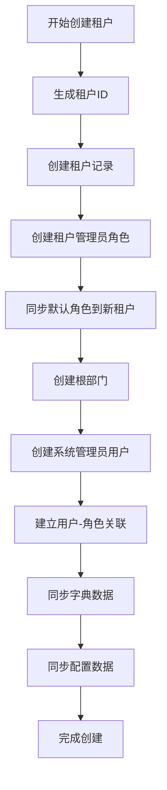

# 多租户 (tenant)

## 1. 模块概述

租户模块是多租户SaaS系统的核心组件，提供完整的租户生命周期管理和数据隔离能力。

### 1.1 核心功能
- **租户管理**：租户创建、修改、删除、状态控制
- **套餐管理**：租户套餐配置，控制菜单权限范围
- **数据隔离**：基于租户ID的数据隔离和权限控制
- **租户识别**：支持域名绑定和请求头识别
- **数据同步**：角色、字典、配置等基础数据同步

### 1.2 技术架构
```
Controller Layer (控制器层)
    ↓
Service Layer (服务层)
    ↓
Mapper Layer (数据访问层)
    ↓
Database (数据库)
```

## 2. 核心实体设计

### 2.1 租户实体 (sys_tenant)
| 字段名 | 类型 | 说明 |
|--------|------|------|
| id | Long | 主键ID |
| tenant_id | String | 租户ID（6位随机数字） |
| company_name | String | 企业名称 |
| contact_user_name | String | 联系人 |
| contact_phone | String | 联系电话 |
| domain | String | 绑定域名 |
| package_id | Long | 租户套餐ID |
| expire_time | Date | 过期时间 |
| account_count | Long | 用户数量限制 |
| status | String | 租户状态 |

### 2.2 租户套餐实体 (sys_tenant_package)
| 字段名 | 类型 | 说明 |
|--------|------|------|
| package_id | Long | 套餐ID |
| package_name | String | 套餐名称 |
| menu_ids | String | 关联菜单ID（逗号分隔） |
| menu_check_strictly | Boolean | 菜单树关联显示 |
| status | String | 套餐状态 |

## 3. 核心业务流程

### 3.1 租户创建流程

租户创建是一个复杂的初始化过程，涉及以下步骤：



**关键实现要点：**
- 租户ID采用6位随机数字，确保唯一性
- 自动创建租户管理员角色，权限范围受套餐限制
- 同步默认租户的通用业务角色，但权限受套餐约束
- 初始化完整的组织架构（部门-用户-角色体系）

### 3.2 租户识别机制

系统支持多种租户识别方式，优先级如下：

1. **域名识别**（优先级最高）
   ```
   tenant1.example.com → 租户ID: 123456
   tenant2.example.com → 租户ID: 789012
   ```

2. **请求头识别**
   ```
   X-Tenant-Id: 123456
   ```

3. **手动切换**（超管功能）
   ```
   TenantHelper.setDynamic("123456", true)
   ```

### 3.3 数据同步机制

#### 套餐权限同步
当修改租户套餐时，系统会：
- 更新租户管理员角色的菜单权限
- 删除其他角色超出套餐范围的权限
- 保持数据权限的一致性

#### 角色数据同步
将默认租户的标准业务角色同步到其他租户：
- 排除租户管理员角色和超管角色
- 只分配租户套餐允许的菜单权限
- 保持角色层级关系

## 4. 权限控制设计

### 4.1 权限层级
```
超级管理员
    ├── 租户管理权限
    └── 系统配置权限

租户管理员
    ├── 租户内用户管理
    ├── 租户内角色管理
    └── 受套餐限制的功能权限

普通用户
    └── 基于角色的功能权限
```

### 4.2 数据隔离策略
- **水平隔离**：通过 tenant_id 字段实现数据隔离
- **垂直隔离**：通过角色权限控制功能模块访问
- **API隔离**：Controller层进行租户身份验证

## 5. API接口设计

### 5.1 租户管理接口
| 接口 | 方法 | 说明 | 权限要求 |
|------|------|------|----------|
| `/system/tenant/pageTenants` | GET | 分页查询租户 | 超管 |
| `/system/tenant/addTenant` | POST | 新增租户 | 超管 |
| `/system/tenant/updateTenant` | PUT | 修改租户 | 超管 |
| `/system/tenant/changeTenantStatus` | PUT | 修改状态 | 超管 |
| `/system/tenant/deleteTenants/{ids}` | DELETE | 删除租户 | 超管 |

### 5.2 租户套餐接口
| 接口 | 方法 | 说明 | 权限要求 |
|------|------|------|----------|
| `/system/tenant/pageTenantPackages` | GET | 分页查询套餐 | 超管 |
| `/system/tenant/addTenantPackage` | POST | 新增套餐 | 超管 |
| `/system/tenant/updateTenantPackage` | PUT | 修改套餐 | 超管 |
| `/system/tenant/deleteTenantPackages/{ids}` | DELETE | 删除套餐 | 超管 |

### 5.3 数据同步接口
| 接口 | 方法 | 说明 | 权限要求 |
|------|------|------|----------|
| `/system/tenant/syncTenantPackage` | GET | 同步租户套餐 | 超管 |
| `/system/tenant/syncTenantRoles` | GET | 同步租户角色 | 超管 |
| `/system/tenant/syncTenantDicts` | GET | 同步租户字典 | 超管 |

## 6. 缓存策略

### 6.1 缓存设计
| 缓存Key | 说明 | 过期策略 |
|---------|------|----------|
| `sys_tenant:{tenantId}` | 租户基本信息 | 手动清除 |
| `sys_tenant:domain:{domain}` | 域名->租户映射 | 手动清除 |

### 6.2 缓存更新时机
- 租户信息修改时清除对应缓存
- 租户状态变更时清除缓存
- 域名绑定变更时清除域名缓存

## 7. 业务规则与约束

### 7.1 业务规则
- 租户ID为6位随机数字，系统自动生成
- 企业名称在系统内必须唯一
- 默认租户（000000）不允许修改和删除
- 套餐删除前需检查是否有租户在使用
- 租户创建时自动初始化完整的组织架构

### 7.2 数据约束
- 租户过期后系统自动禁用相关功能
- 用户数量达到上限后禁止新增用户
- 套餐菜单权限变更会影响租户内所有角色权限

## 8. 异常处理

### 8.1 常见异常
| 异常场景 | 处理策略 |
|----------|----------|
| 租户ID冲突 | 重新生成租户ID |
| 企业名称重复 | 返回友好错误提示 |
| 套餐不存在 | 阻止租户创建 |
| 租户已过期 | 限制功能访问 |
| 用户数量超限 | 禁止用户注册 |

### 8.2 事务控制
- 租户创建使用事务保证数据一致性
- 数据同步操作使用事务避免部分同步
- 关键操作添加分布式锁防止并发问题

## 9. 性能优化

### 9.1 查询优化
- 租户信息查询使用Redis缓存
- 域名查询建立索引提升性能
- 分页查询使用合理的索引策略

### 9.2 批量操作
- 数据同步使用批量插入提升效率
- 角色权限同步采用批处理模式
- 字典数据同步优化SQL执行计划

## 10. 监控与运维

### 10.1 关键指标
- 租户创建成功率
- 数据同步执行时间
- 租户识别准确率
- 缓存命中率

### 10.2 日志记录
- 租户创建、修改、删除操作日志
- 数据同步操作执行日志
- 租户切换操作审计日志
- 异常情况详细错误日志

## 11. 扩展说明

### 11.1 未来扩展方向
- 支持租户自定义域名
- 租户资源使用情况统计
- 租户数据备份与恢复
- 租户间数据迁移功能

### 11.2 配置参数
```properties
# 是否启用多租户模式
tenant.enable=true

# 默认租户ID
tenant.default=000000

# 租户ID生成位数
tenant.id.length=6
```
