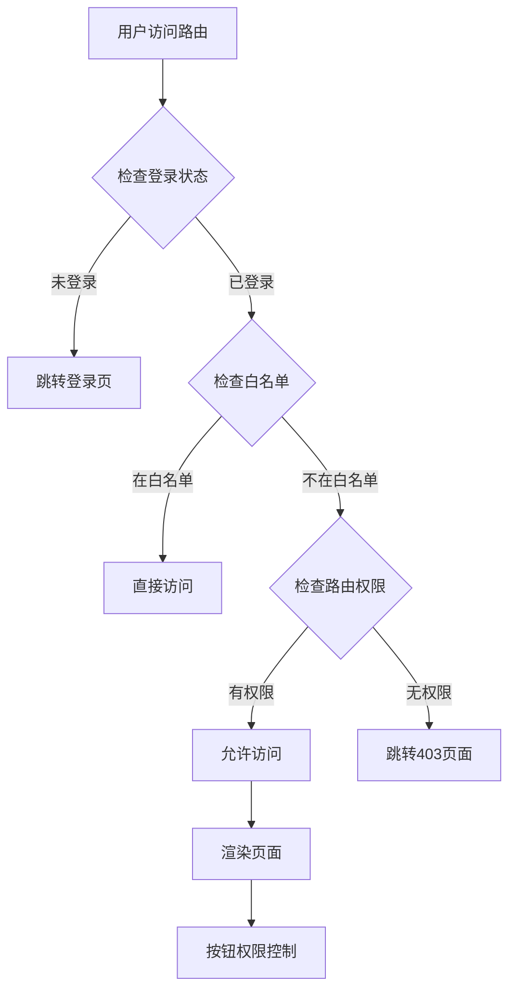

# 权限与动态路由

## 权限系统设计

权限系统基于 RBAC（基于角色的访问控制）模型，通过用户-角色-权限的三层架构实现精细化的权限控制。

### 权限模型

```
用户 (User) ←→ 角色 (Role) ←→ 权限 (Permission)
    ↓              ↓              ↓
 userInfo       roles         permissions
```

### 权限数据结构

```typescript
// 用户信息
interface UserInfo {
  userId: number
  userName: string
  nickName: string
  avatar: string
  roles: string[]        // 角色编码数组
  permissions: string[]  // 权限编码数组
}

// 权限编码格式
permissions: [
  'system:user:view',    // 系统:用户:查看
  'system:user:add',     // 系统:用户:新增
  'system:user:update',  // 系统:用户:修改
  'system:user:delete',  // 系统:用户:删除
]
```

## 动态路由生成

### 生成流程

```typescript
const generateRoutes = async (): Promise<RouteRecordRaw[]> => {
  // 1. 获取后端菜单数据
  const [err, menuData] = await getMenuList()
  if (err) throw new Error('获取菜单失败')
  
  // 2. 构建路由树
  const dynamicRoutes = buildRouteTree(menuData)
  
  // 3. 合并静态路由
  const allRoutes = [...constantRoutes, ...dynamicRoutes]
  
  // 4. 权限过滤
  const authorizedRoutes = filterRoutesByPermissions(allRoutes, userPermissions)
  
  return authorizedRoutes
}
```

### 菜单数据转路由

```typescript
const buildRouteTree = (menuList: MenuVo[]): RouteRecordRaw[] => {
  return menuList.map(menu => {
    const route: RouteRecordRaw = {
      path: menu.path,
      name: menu.routeName,
      component: resolveComponent(menu.component),
      meta: {
        title: menu.menuName,
        icon: menu.icon,
        i18nKey: menu.i18nKey,
        noCache: !menu.isCache,
        permissions: menu.perms?.split(',') || []
      },
      hidden: menu.visible === '0'
    }
    
    // 递归处理子菜单
    if (menu.children && menu.children.length > 0) {
      route.children = buildRouteTree(menu.children)
    }
    
    return route
  })
}
```

### 组件解析

```typescript
const resolveComponent = (componentPath: string) => {
  if (!componentPath || componentPath === 'Layout') {
    return Layout
  }
  
  if (componentPath === 'ParentView') {
    return ParentView
  }
  
  // 动态导入组件
  return createCustomNameComponent(
    () => import(`@/views/${componentPath}.vue`),
    { name: extractComponentName(componentPath) }
  )
}

// 提取组件名称
const extractComponentName = (path: string) => {
  const segments = path.split('/')
  const fileName = segments[segments.length - 1]
  return fileName.replace(/^\w/, c => c.toUpperCase())
}
```

## 权限验证机制

### 路由级权限

```typescript
// 路由配置中的权限控制
{
  path: '/system/user',
  component: Layout,
  permissions: ['system:user:view'], // 路由访问权限
  children: [
    {
      path: 'index',
      component: () => import('@/views/system/user/index.vue'),
      meta: {
        title: '用户管理',
        permissions: ['system:user:view']
      }
    }
  ]
}
```

### 按钮级权限

```typescript
// 使用权限指令
<template>
  <el-button 
    v-auth="'system:user:add'" 
    @click="handleAdd">
    新增用户
  </el-button>
  
  <el-button 
    v-auth="['system:user:update', 'system:user:delete']" 
    @click="handleBatch">
    批量操作
  </el-button>
</template>

// 使用权限组合式API
<script setup>
const { hasPermission, hasAnyPermission } = useAuth()

// 单个权限检查
const canAdd = hasPermission('system:user:add')

// 多个权限检查（需要全部满足）
const canEdit = hasPermission(['system:user:view', 'system:user:update'])

// 多个权限检查（满足任一即可）
const canOperate = hasAnyPermission(['system:user:update', 'system:user:delete'])
</script>
```

### 权限过滤函数

```typescript
const filterRoutesByPermissions = (
  routes: RouteRecordRaw[], 
  userPermissions: string[]
): RouteRecordRaw[] => {
  return routes.filter(route => {
    // 检查当前路由权限
    if (!hasRoutePermission(route, userPermissions)) {
      return false
    }
    
    // 递归过滤子路由
    if (route.children && route.children.length > 0) {
      route.children = filterRoutesByPermissions(route.children, userPermissions)
      
      // 如果子路由全部被过滤掉且当前路由没有组件，则隐藏
      if (route.children.length === 0 && !route.component) {
        return false
      }
    }
    
    return true
  })
}

const hasRoutePermission = (route: RouteRecordRaw, userPermissions: string[]): boolean => {
  // 没有配置权限的路由，默认允许访问
  if (!route.permissions || route.permissions.length === 0) {
    return true
  }
  
  // 检查用户是否有任一所需权限
  return route.permissions.some(permission => 
    userPermissions.includes(permission)
  )
}
```

## 菜单权限映射

### 侧边栏菜单生成

```typescript
const getSidebarRoutes = (): RouteRecordRaw[] => {
  return permissionStore.routes.filter(route => {
    // 过滤隐藏的路由
    if (route.hidden) return false
    
    // 检查是否有可显示的子菜单
    if (route.children) {
      route.children = route.children.filter(child => !child.hidden)
      return route.children.length > 0 || route.alwaysShow
    }
    
    return true
  })
}
```

### 面包屑导航权限

```typescript
const getBreadcrumbRoutes = (route: RouteLocationMatched[]): RouteRecordRaw[] => {
  return route.filter(item => {
    // 只显示有权限且配置了标题的路由
    return item.meta?.title && 
           item.meta?.breadcrumb !== false &&
           hasRoutePermission(item, userStore.permissions)
  })
}
```

## 权限存储管理

### Pinia Store 结构

```typescript
export const usePermissionStore = defineStore('permission', () => {
  // 所有路由（包含权限路由）
  const routes = ref<RouteRecordRaw[]>([])
  
  // 动态生成的权限路由
  const dynamicRoutes = ref<RouteRecordRaw[]>([])
  
  // 侧边栏显示的路由
  const sidebarRoutes = computed(() => getSidebarRoutes())
  
  // 生成路由的方法
  const generateRoutes = async (): Promise<[Error | null, RouteRecordRaw[]]> => {
    try {
      const accessRoutes = await buildDynamicRoutes()
      dynamicRoutes.value = accessRoutes
      routes.value = constantRoutes.concat(accessRoutes)
      return [null, accessRoutes]
    } catch (error) {
      return [error as Error, []]
    }
  }
  
  return {
    routes: readonly(routes),
    dynamicRoutes: readonly(dynamicRoutes),
    sidebarRoutes,
    generateRoutes
  }
})
```

### 权限缓存策略

```typescript
// 本地缓存权限信息
const PERMISSION_CACHE_KEY = 'user_permissions'
const ROUTES_CACHE_KEY = 'user_routes'

const cachePermissions = (permissions: string[]) => {
  localStorage.setItem(PERMISSION_CACHE_KEY, JSON.stringify(permissions))
}

const getCachedPermissions = (): string[] | null => {
  const cached = localStorage.getItem(PERMISSION_CACHE_KEY)
  return cached ? JSON.parse(cached) : null
}
```

## 角色权限管理

### 用户角色分配

```typescript
// 用户角色分配页面路由
{
  path: '/system/user/assignRoles',
  component: Layout,
  hidden: true,
  permissions: ['system:user:update'],
  children: [
    {
      path: ':userId(\\d+)',
      component: () => import('@/views/system/core/user/assignRoles.vue'),
      name: 'AssignUserRoles',
      meta: {
        title: '分配角色',
        activeMenu: '/system/user',
        noCache: true
      }
    }
  ]
}
```

### 角色用户分配

```typescript
// 角色用户分配页面路由
{
  path: '/system/role/assignUsers',
  component: Layout,
  hidden: true,
  permissions: ['system:role:update'],
  children: [
    {
      path: ':roleId(\\d+)',
      component: () => import('@/views/system/core/role/assignUsers.vue'),
      name: 'AssignRoleUsers',
      meta: {
        title: '分配用户',
        activeMenu: '/system/role',
        noCache: true
      }
    }
  ]
}
```

## 权限验证流程

### 完整验证链路



### API 权限验证

```typescript
// 请求拦截器中的权限验证
axios.interceptors.request.use(
  config => {
    // 添加认证头
    const token = getToken()
    if (token) {
      config.headers['Authorization'] = `Bearer ${token}`
    }
    
    return config
  },
  error => Promise.reject(error)
)

// 响应拦截器中的权限处理
axios.interceptors.response.use(
  response => response,
  error => {
    if (error.response?.status === 401) {
      // 清除本地认证信息
      userStore.logoutUser()
      // 跳转登录页
      router.push('/login')
    } else if (error.response?.status === 403) {
      // 权限不足提示
      showMsgError('权限不足，无法访问')
    }
    
    return Promise.reject(error)
  }
)
```

## 实际应用示例

### 1. 多角色用户处理

```typescript
// 用户可能拥有多个角色
const userRoles = ['admin', 'manager', 'user']

// 合并所有角色的权限
const getAllPermissions = (roles: string[]) => {
  return roles.reduce((permissions, role) => {
    const rolePermissions = getRolePermissions(role)
    return [...permissions, ...rolePermissions]
  }, [] as string[])
}
```

### 2. 临时权限控制

```typescript
// 基于时间的权限控制
const hasTimeBasedPermission = (permission: string) => {
  const userPermissions = userStore.permissions
  const currentTime = Date.now()
  const workingHours = isWorkingHours(currentTime)
  
  // 某些操作只能在工作时间进行
  if (permission.includes(':sensitive:') && !workingHours) {
    return false
  }
  
  return userPermissions.includes(permission)
}
```

### 3. 条件权限

```typescript
// 基于数据状态的权限控制
const canEditRecord = (record: any) => {
  // 基础权限检查
  if (!hasPermission('system:user:update')) {
    return false
  }
  
  // 业务逻辑权限检查
  if (record.status === 'locked') {
    return hasPermission('system:user:force-update')
  }
  
  // 所有者权限检查
  if (record.creatorId !== userStore.userInfo.userId) {
    return hasPermission('system:user:update-others')
  }
  
  return true
}
```
