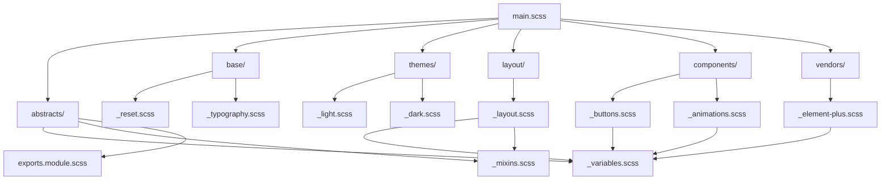

# 文件组织

本文档详细介绍项目中样式文件的组织结构、命名规范和依赖管理，确保代码的可维护性和团队协作效率。

## 📁 完整目录结构

```
src/styles/
├── main.scss                    # 🚪 主入口文件
├── abstracts/                   # 🧩 抽象层
│   ├── _variables.scss         # 全局变量定义
│   ├── _mixins.scss            # 混合器工具集
│   └── exports.module.scss     # JS 变量导出
├── base/                       # 🏗️ 基础层
│   ├── _reset.scss             # 浏览器样式重置
│   └── _typography.scss        # 排版系统
├── themes/                     # 🎨 主题层
│   ├── _light.scss             # 亮色主题变量
│   └── _dark.scss              # 暗色主题变量
├── layout/                     # 📐 布局层
│   └── _layout.scss            # 主布局样式
├── components/                 # 🧱 组件层
│   ├── _buttons.scss           # 按钮组件样式
│   └── _animations.scss        # 动画效果
└── vendors/                    # 📦 第三方库
    └── _element-plus.scss      # Element Plus 覆盖

vite/plugins/                   # 🔌 构建插件
├── iconfont-types.ts          # 图标类型生成
├── icons.ts                   # 图标插件配置
├── unocss.ts                  # UnoCSS 插件
└── index.ts                   # 插件入口

uno.config.ts                  # ⚡ UnoCSS 配置文件
```

## 📋 命名规范

### 1. 文件命名规则

#### SCSS 文件
- **Partials**: 以 `_` 开头，如 `_variables.scss`
- **主文件**: 无前缀，如 `main.scss`
- **命名格式**: 小写字母 + 连字符

```
✅ 正确命名
_variables.scss
_mixins.scss  
_element-plus.scss

❌ 错误命名
Variables.scss
mixins.scss
elementPlus.scss
```

#### TypeScript 文件
- **插件文件**: kebab-case，如 `iconfont-types.ts`
- **配置文件**: 语义化命名，如 `uno.config.ts`

### 2. 目录命名规则

```
✅ 正确目录名
abstracts/     # 抽象概念，复数形式
components/    # 组件集合，复数形式
themes/        # 主题集合，复数形式

❌ 错误目录名
abstract/      # 单数形式
component/     # 单数形式
theme/         # 单数形式
```

## 🔗 依赖关系图



## 📝 文件内容规范

### 1. 主入口文件 (main.scss)
```scss
/**
 * 主样式文件
 * 导入所有样式模块，提供全局样式基础
 */

/* 1. 外部库 */
@use 'animate.css';
@use 'element-plus/dist/index.css';

/* 2. 抽象层 */
@use './abstracts/variables' as *;
@use './abstracts/mixins' as *;

/* 3. 主题系统 */
@use './themes/light';
@use './themes/dark';

/* 4. 基础样式 */
@use './base/reset';
@use './base/typography';

/* 5. 布局层 */
@use './layout/layout';

/* 6. 组件样式 */
@use './components/buttons';
@use './components/animations';

/* 7. 第三方库样式覆盖 */
@use './vendors/element-plus';
```

### 2. 变量文件头部注释
```scss
/**
 * 全局SCSS变量模块
 * 定义应用的基础变量，主题变量从_light.scss和_dark.scss中引入
 */

/* 基础颜色变量 */
$blue: #324157;
$light-blue: #3a71a8;

/* Element UI 主题色变量 */
$el-color-primary: #409eff;

/* 布局尺寸变量 */
$base-sidebar-width: 240px;
```

### 3. 混合器文件结构
```scss
/**
 * SCSS混合器(Mixins)函数集
 * 提供常用的可复用样式混合器，方便在项目中快速应用常见样式效果
 */

@use './variables' as *;

/**
 * 清除浮动混合器
 * 使用方法:
 * .container { @include clearfix; }
 */
@mixin clearfix {
  &:after {
    content: '';
    display: table;
    clear: both;
  }
}
```

## 🗂️ 文件分组策略

### 1. 按功能分组
```
abstracts/          # 工具和辅助函数
├── _variables.scss # 变量定义
├── _mixins.scss    # 可复用样式片段
└── _functions.scss # 自定义函数（如需要）
```

### 2. 按层级分组
```
base/               # 基础样式层
├── _reset.scss     # 重置样式
├── _typography.scss # 排版规则
└── _helpers.scss   # 辅助类（如需要）
```

### 3. 按业务分组
```
components/         # 业务组件
├── _buttons.scss   # 按钮相关
├── _forms.scss     # 表单相关
├── _tables.scss    # 表格相关
└── _modals.scss    # 弹窗相关
```

## 🔄 导入顺序

### 推荐的导入顺序：
1. **外部库**: 第三方CSS库
2. **抽象层**: 变量、混合器、函数
3. **基础层**: 重置、排版
4. **主题层**: 主题变量
5. **布局层**: 页面布局
6. **组件层**: 可复用组件
7. **页面层**: 特定页面样式
8. **第三方覆盖**: 框架样式覆盖

```scss
// ✅ 正确的导入顺序
@use 'normalize.css';               // 1. 外部库
@use './abstracts/variables' as *;  // 2. 抽象层
@use './base/reset';                // 3. 基础层
@use './themes/light';              // 4. 主题层
@use './layout/layout';             // 5. 布局层
@use './components/buttons';        // 6. 组件层
@use './pages/home';                // 7. 页面层
@use './vendors/element-plus';      // 8. 第三方覆盖
```

## 📐 文件大小控制

### 1. 单文件大小建议
- **变量文件**: < 200 行
- **混合器文件**: < 300 行
- **组件文件**: < 500 行
- **布局文件**: < 800 行

### 2. 拆分策略
当文件过大时，按功能拆分：

```
// 原始文件过大
components/_buttons.scss (600+ 行)

// 拆分后
components/buttons/
├── _base.scss      # 基础按钮
├── _variants.scss  # 按钮变体
├── _sizes.scss     # 按钮尺寸
└── _index.scss     # 导出文件
```

## 🏷️ 文件标签系统

### 1. 文件状态标签
```scss
/**
 * 文件状态: [STABLE|BETA|DEPRECATED]
 * 最后修改: 2024-01-15
 * 负责人: @username
 * 依赖: _variables.scss, _mixins.scss
 */
```

### 2. 功能标签
```scss
/**
 * @category: Layout
 * @subcategory: Sidebar
 * @description: 侧边栏布局样式
 * @dependencies: variables, mixins
 * @used-by: main-layout
 */
```

## 🔍 文件搜索和导航

### 1. VSCode 工作区设置
```json
{
  "files.associations": {
    "*.scss": "scss"
  },
  "emmet.includeLanguages": {
    "scss": "css"
  },
  "scss.lint.unknownProperties": "ignore"
}
```

### 2. 文件搜索技巧
- 使用 `Ctrl+P` 快速打开文件
- 使用 `Ctrl+Shift+F` 全局搜索样式
- 使用 `@` 符号搜索混合器和变量

## 📊 文件监控

### 1. 构建时文件检查
```typescript
// vite.config.ts
export default defineConfig({
  css: {
    preprocessorOptions: {
      scss: {
        // 全局变量导入
        additionalData: `@use "@/styles/abstracts/variables" as *;`
      }
    }
  }
})
```

### 2. 样式依赖分析
```bash
# 分析样式文件依赖关系
scss-dependency-graph src/styles/main.scss
```

## 🚀 最佳实践

### 1. 文件命名一致性
- 使用描述性名称
- 保持命名风格一致
- 避免缩写和简写

### 2. 目录结构扁平化
- 避免过深的嵌套
- 最多3层目录结构
- 相关文件就近放置

### 3. 文件职责单一
```scss
// ✅ 职责清晰的文件
_variables.scss     // 只定义变量
_mixins.scss        // 只定义混合器
_button.scss        // 只定义按钮样式

// ❌ 职责混乱的文件
_utils.scss         // 包含变量、混合器、样式
```

### 4. 版本控制友好
- 每个功能独立文件，减少合并冲突
- 使用语义化的提交信息
- 重要变更添加详细注释

### 5. 团队协作规范
```scss
/**
 * 修改记录:
 * 2024-01-15 @alice: 新增暗色主题变量
 * 2024-01-10 @bob: 优化响应式断点
 * 2024-01-05 @carol: 初始化文件结构
 */
```

## 🔧 自动化工具

### 1. 样式代码检查
```json
// .stylelintrc.js
module.exports = {
  extends: [
    'stylelint-config-standard-scss',
    'stylelint-config-recess-order'
  ],
  rules: {
    'scss/at-import-partial-extension': 'never',
    'scss/at-import-no-partial-leading-underscore': true
  }
}
```

### 2. 文件格式化
```json
// .prettierrc
{
  "printWidth": 100,
  "tabWidth": 2,
  "useTabs": false,
  "singleQuote": true,
  "trailingComma": "none",
  "overrides": [
    {
      "files": "*.scss",
      "options": {
        "parser": "scss"
      }
    }
  ]
}
```

通过这样的文件组织方式，我们确保了样式代码的清晰结构、高效维护和团队协作的一致性。
